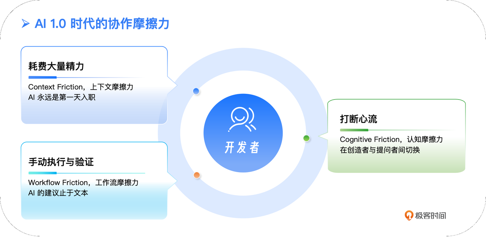
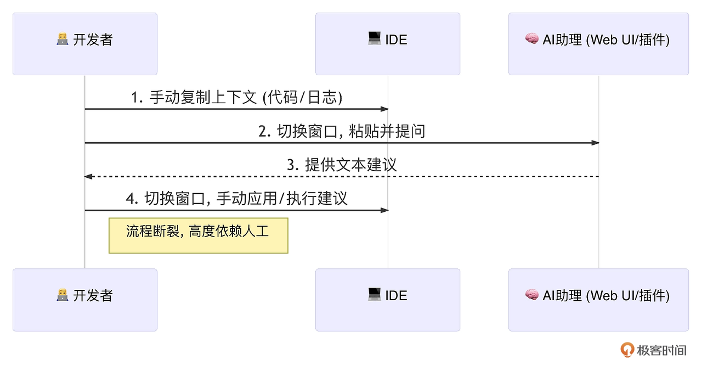
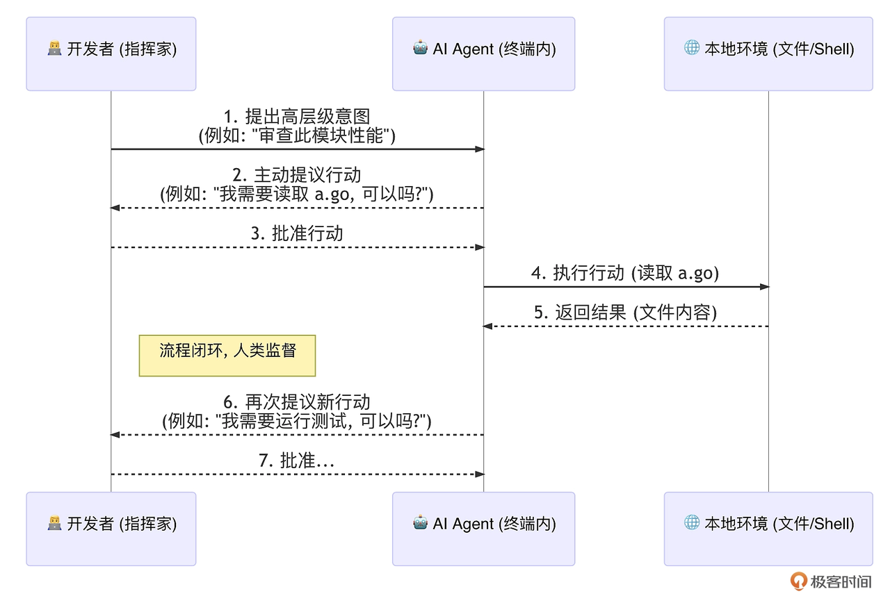
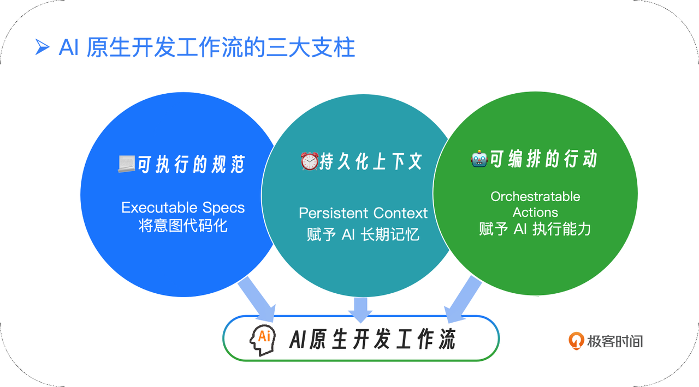
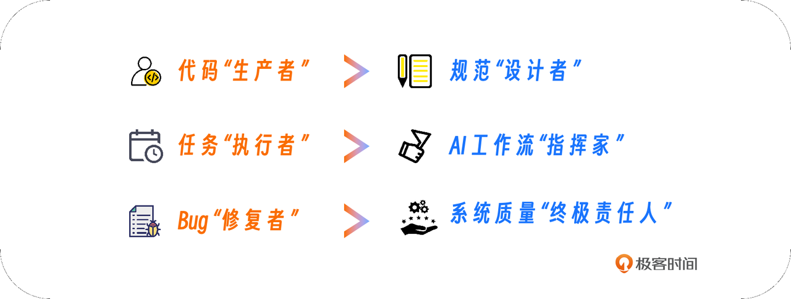
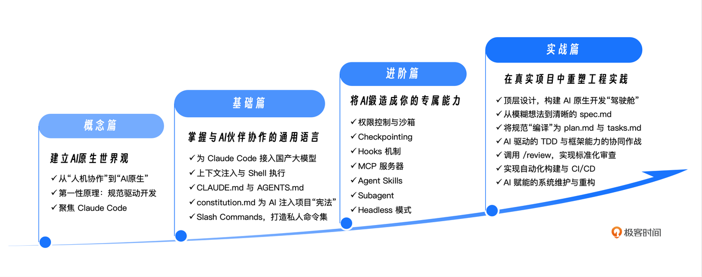

你好, 我是 Tony Bai. 欢迎来到我的极客时间课程《AI 原生开发工作流实战》. 

在正式开启我们的学习旅程之前, 我想先与你分享一个近乎每天都在我, 或许也在你身边上演的场景. 

这是一个普通的下午, 你正在开发一个新功能. IDE 的屏幕上, 是你专注构建的业务逻辑; 而在另一块屏幕上, 或者在一个分屏里, 是 AI 大模型的聊天窗口. 你的工作流, 变成了一支在两个世界间不断切换的 "双屏探戈": 

> 1. 从 IDE 中, 你小心翼翼地选中一段代码、一个报错信息, 或是几段配置文件, Command+C. 
>
> 2. 切换到 AI 聊天窗口, Command+V, 然后在输入框里用自然语言小心翼翼地 "裱糊" 上足够的上下文: "请帮我分析这段 Go 代码的潜在问题, 这是相关的配置文件… 这是报错堆栈…". 
>
> 3. 等待 AI 的回复, 然后 Command+C, 再切换回 IDE, Command+V. 
>
> 4. 紧接着, 你发现 AI 的建议只考虑了局部, 你叹了口气, 重复上述过程, 这一次, 你试图把整个项目的目录结构用 tree 命令打出来, 再贴进去……

这个场景, 你熟悉吗?


## 从 "AI 助理" 到 "AI 同事": 我们离真正的生产力还有多远?

自从近两年 AI 辅助编程工具进入我们的视野, 我们似乎都默认了上面这种协作模式. 我们乐此不疲地扮演着 "上下文的搬运工" 和 "提示词的调优师" 的双重角色, 并为 AI 偶尔迸发的 "神来之笔" 而感到欣喜. 

我们得到的, 是一个任劳任怨、博学多才的 "AI 助理". 它极大地提升了我们解决局部、原子化问题的效率. 但扪心自问, 这真的是我们想象中 AI 时代软件开发的终极形态吗? 我们离真正的生产力革命, 似乎总还隔着一层. 

这层隔阂, 我称之为 AI 协作的 " 三大摩擦力 "

1. 上下文摩擦力: 我们花费了大量精力去 "告诉" AI 它本应 "知道" 的事情. 项目的技术栈、代码的规范、模块间的依赖关系、一个函数的演进历史…… 这些对于身处项目中的我们来说是常识, 但对于那个 "身外之物" 的 AI 助理, 却是一片空白. 我们像是在与一个永远是 "第一天入职" 的新同事对话. 

2. 工作流摩擦力: 我们的工作流是连贯的: 编码、测试、审查、提交、构建…… 而与 AI 的交互却是断裂的、片段化的. AI 给出的只是一段文本, 它无法直接运行一次 go test 来验证自己的建议, 也无法自动将生成的 Commit Message 填入 git commit. 我们成了 AI 建议的 "手动执行者". 

3. 认知摩擦力: 我们的大脑在两种截然不同的模式间高频切换: 在 IDE 中, 我们是沉浸式的 "创造者"; 在 AI 聊天窗口, 我们是逻辑严谨的 "提问者". 这种切换不仅消耗精力, 更破坏了宝贵的 "心流状态". 

   

我们可以用一张图来更直观地感受这三大摩擦力是如何消耗我们的精力的:




这些摩擦力的存在, 让我们意识到, 我们真正渴望的, 或许不是一个更聪明的 "AI 助理", 而是一个能与我们并肩作战的 "AI 同事". 

这个 "同事", 应该是什么样的?

* 它应该 **内在于** 我们的工作流, 而不是游离其外. 

* 它应该 **拥有记忆**, 能理解项目的 "前世今生". 

* 它应该 **具备行动力**, 能将想法转化为可执行、可验证的单步或多步操作, 并执行它们. 

问题的根源已经清晰: 割裂的工作流与被动的 AI, 是阻碍我们迈向更高阶生产力范式的核心障碍. 

那么, 真正的革命, 应该是什么样的?


## 真正的革命: 当 AI 从 "工具" 变为 "工作流原生"

要理解这场革命的深刻性, 我们必须清晰地划分出 AI 辅助开发的两个时代. 

### 1.0 时代: 作为 "外部大脑" 的 AI

这是我们当前所处的时代. AI 是一个强大的 被动式工具, 它的核心价值是知识的快速检索与内容的生成. 整个工作流高度依赖人工串联, 充满了断点. 


其工作流如下图所示: 




### 2.0 时代: 作为 "原生要素" 的 AI

这正是本课程将要带你进入的全新时代. 在这个时代, AI 成为了开发工作流中一个 原生的、可编程的组成部分. 其核心价值不再仅仅是生成内容, 而是 理解意图并驱动流程. 这场跃迁的关键, 是 AI 获得了 主动性 —— 它不再被动等待, 而是能主动规划并提议行动. 


其工作流演变为: 



看到了吗?<span style="color: inherit; background-color: rgba(254,212,164,0.8)">开发者从一个事必躬亲的 "执行者", 转变为一个运筹帷幄的 "指挥家" 与 "审批者". AI 则从一个 "问答机器人" 进化为了一个能够自主探索的 "智能体". 这, 就是工作流的革命. </span>


## 什么是 "AI 原生开发工作流"?

如果说 "AI 原生" 是我们的目标, 那么, 实现这个目标的具体路径是什么? 通过对业界最前沿的实践 (如各个大模型厂商推出的 Coding Agent、GitHub 的 spec-kit 等) 进行提炼, 我将 "AI 原生开发工作流" 总结为三大核心支柱. 这三大支柱, 也将是我们整个课程的理论基石. 





### 第一支柱: 可执行的规范 (Specs) 

**这是工作流的 "灵魂". 它要求我们改变过去将 "需求文档" 与 "代码" 视为两个独立事物的习惯.** 

<span style="color: inherit; background-color: rgba(254,212,164,0.8)">在 AI 原生工作流中, 一份好的需求规格说明 (Specification, 简称 Spec) , 例如 `spec.md`, 其本身就应该是一份 "意图代码". 它不再是写给产品经理或开发者的散文, 而是一份结构化的、可被 AI 精确理解和执行的 "高级语言". </span>

AI Agent 会像编译器解释代码一样, 将这份 "意图代码" 逐步 "编译" 为技术方案 (plan.md)、任务列表 (tasks.md), 最终生成可运行的业务代码. 

这意味着, 维护软件的核心, 从维护易变的代码, 转向了维护更稳定的规范. 当需求变更时, 我们首先修改 spec.md, 然后驱动 AI 重新生成实现. 这正是 规范驱动开发 (Spec-Driven Development, SDD) 思想的精髓. 

```plain&#x20;text
spec -> plan/tasks -> code/tests
```


### 第二支柱: 持久化的上下文

这是工作流的 "记忆". 它旨在彻底解决我们作为 "上下文搬运工" 的窘境. 通过 `CLAUDE.md`、 `agents.md` 这类标准化的上下文文件, 我们可以为 AI 提供关于项目的 "长期记忆". 更重要的是, 这种记忆是 分层的、持久化的: 

* 企业级记忆: 整个公司的安全红线、合规要求. 

* 项目级记忆: `constitution.md` 中定义的技术选型、架构原则、编码 "宪法". 

* 模块级记忆: 特定模块的 API 设计、核心逻辑. 

* 个人级记忆: 你个人的代码风格偏好. 

<span style="color: inherit; background-color: rgba(254,212,164,0.8)">当 AI 开始工作时, 它会像加载配置文件一样, 自动将这些上下文融入自己的 "世界观" 中. 它给出的每一行代码, 都将是 "戴着镣铐跳舞", 既符合你的个人习惯, 也遵循团队的规范和公司的要求. </span>


### 第三支柱: 可编排的行动

这是工作流的 "手脚". 它赋予 AI 执行具体任务的能力. 

在 AI 原生工作流中, AI 不仅仅能调用内置的工具 (如读写文件、执行 Shell 命令) , 更重要的是, 我们可以通过 自定义指令 (Slash Commands) 、钩子 (Hooks) 和 MCP 服务器, 为它打造一个几乎无限扩展的 "工具箱". 

* 你可以定义一个 `/review-go-code` 指令, 让 AI 执行你编写的一套包含静态检查、单元测试、代码风格扫描的完整审查脚本. 

* 你可以设置一个 PostToolUse 钩子, 让 AI 在每次修改完代码后, 自动运行 gofmt 进行格式化. 

* 你可以为它连接一个 Jira MCP 服务器, 让它能够用自然语言帮你创建、查询和更新工单. 

当这三大支柱结合在一起, 一个真正意义上的 "AI 原生开发工作流" 便形成了: 我们用 可执行的规范 定义 "做什么", AI 基于 持久化的上下文 理解 "怎么做", 并通过 可编排的行动 来 "完成它". 


## "重新定义你的一天": 新范式下工程师的新角色

听到这里, 你可能会有一个疑问, 甚至是一丝焦虑: 在这样一个高度自动化的工作流里, 我们软件工程师的角色是什么?我们的价值在哪里?

这正是我认为这场革命最激动人心的地方. 它并非要取代我们, 而是将我们从日常开发的 "内卷" 中解放出来, 去扮演三个更有创造力、更具影响力的角色. 





### 从代码 "生产者" 到规范 "设计者"

在传统模式下, 我们 80% 的时间可能花在将模糊的需求翻译成具体的、甚至有些重复的实现代码上. **而在新范式下, 我们最重要的工作, 变成了与产品、设计和 AI 一起, 精心雕琢那份作为 "万物之源" 的 `spec.md`.** 

我们不再是低头生产一行行代码的 "码农", 而是抬头设计系统意图和行为的 "架构师". 我们核心的创造力, 从微观的代码实现, 转移到了宏观的业务逻辑、用户场景和边界条件的精确定义上. 


### 从任务 "执行者" 到 AI 工作流 "指挥家"

当 AI 拥有了强大的推理和行动能力, 我们的角色便从一个一个任务的 "执行者", 转变为整个自动化工作流的 "设计者" 与 "指挥家". 

你将花更多时间思考: 

* 如何将团队的最佳实践, 封装成一个 AI 可以调用的 `/review` 指令?

* 如何设计一个 PostToolUse 钩子, 来自动强制执行代码格式化?

* 如何构建一个 MCP 服务器, 让 AI 能够与我们公司的内部发布系统对话?

我们不再是演奏家, 而是成为了谱写乐曲、指挥整个 "AI 交响乐团" 的指挥家. 我们的价值, 体现在我们所构建的这套自动化体系的效率和健壮性上, 当然这也对 AI 原生时代的工程师的思维和技能提出了更高的要求. 


### 从 Bug "修复者" 到系统质量 "终极责任人"

AI 会犯错吗? 当然会. 它生成的代码可能会有 Bug, 它的重构可能会引入问题. 正因如此, 我们作为人类工程师的角色, 变得前所未有地重要. 我们成为了系统质量的 "最后一道防线" 和 "终极责任人". 我们的经验、直觉和批判性思维, 将更多地用于:

* 审查 AI 生成的核心算法是否足够健壮. 

* 评估 AI 提出的架构方案是否具备长期的扩展性. 

* 在 AI 束手无策的复杂、跨域的疑难杂症面前, 展现人类的智慧. 

我们从被动的 Bug 修复者, 转变为主动的、系统性的质量保障者. 


## 课程模块设计: 你的 AI 原生开发进阶地图

为了帮助你系统地完成这次思维升维和技能升级, 我将这个课程精心设计为四个递进的模块, 它就像一张清晰的地图, 将引导你从零开始, 一步步成为 AI 原生开发的专家. 




### 概念篇: 建立 AI 原生世界观

在这里, 我们将彻底厘清 "AI 原生开发" 的核心理念与方法论. 你将**理解什么是 "规范驱动开发"**, 并对整个命令行 AI Agent 的生态有一个全景式的认知. 这是我们后续所有学习的 "思想钢印". 


### 基础篇: 掌握与 AI 伙伴协作的通用语言

我们将聚焦核心工具 Claude Code, 从零开始, 带你掌握与 AI Agent 协作的最核心、最通用的交互模型. 学完这个模块, 你将能熟练地通过上下文和指令, 让 AI 高效地为你解决日常开发问题. 


### 进阶篇: 将 AI 锻造成你的专属能力

这个模块将带你进入 AI Agent 的 "引擎室". 你将学会如何通过安全配置、能力扩展、自动化编排等高级技巧, 将一个通用的 AI Agent, 彻底 "魔改" 成一个懂你项目、听你指挥、甚至能 7x24 小时为你工作的 "专属神器". 


### 实战篇: 在真实项目中重塑工程实践

这是我们整个课程的 "毕业大戏". 我们将把前面所有学到的理论、工具和技巧, 全部应用到一个从零到一的 Go 项目中. 你将亲历一个功能从模糊的需求开始, 如何在 AI 原生工作流的加持下, 被一步步地设计、编码、测试、交付和维护. 这将是你把知识转化为能力的最佳演练场. 


## 写在最后: 不只是学习, 更是一场思维升维

<span style="color: inherit; background-color: rgba(254,212,164,0.8)">看到这里, 我相信你已经明白, 我们这个课程要探讨的, 远不止是一个新工具的使用技巧. 它是一次关于 未来软件开发模式 的深度探索, 一次关于 工程师自我价值重塑 的严肃思考. </span>

在这场由 AI 掀起的变革巨浪中, 一部分人可能会因为固守 "手敲每一行代码" 的旧有模式而被动地推着走, 而另一部分人, 则会选择主动站上浪尖, 学会如何驾驭这股强大的新力量, 成为定义下一个十年开发范式的 "冲浪者". (手洗的衣服更干净, 手搓的代码更纯净!!!)

我希望, 通过这个课程的学习, 你能成为后者.

你将获得的, 不仅仅是一套能让你的开发效率提升数倍的实战技能, 更重要的是, 一次彻底的思维升维 —— 你将开始习惯于从 "工作流" 和 "自动化" 的更高维度去审视你的日常工作, 你将学会如何将 AI 视为一个可编程的、可信赖的系统组件, 去构建属于你自己的 "超级生产力机器". 

未来已来, 它就蕴藏在你每天都在使用的终端里. 现在, 我正式邀请你, 与我一起, 开启你的 AI 原生开发之旅. 让我们共同探索, 在 AI 的加持下, 一个软件工程师的每一天, 究竟可以变得多么与众不同. 


