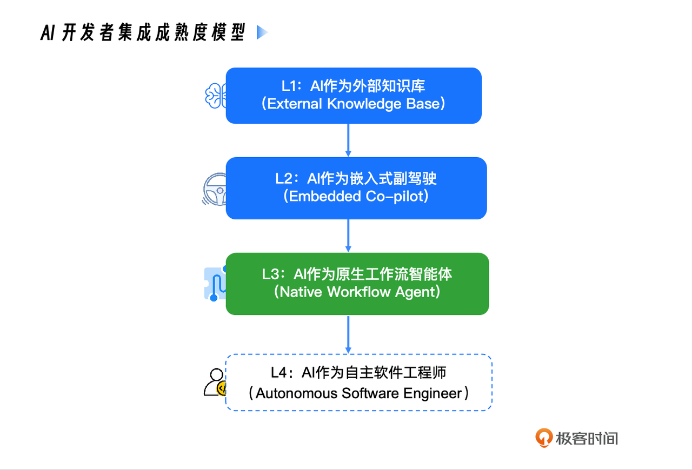
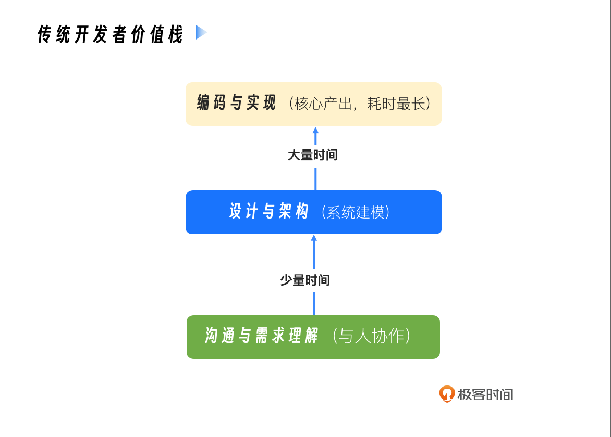
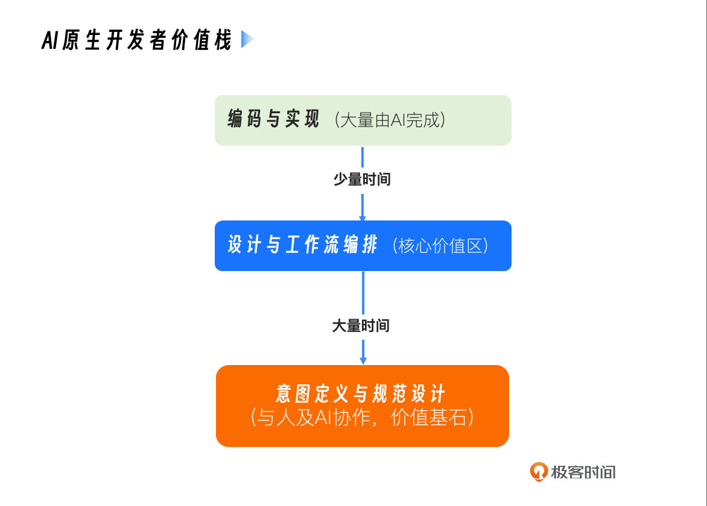

你好, 我是 Tony Bai.

在开篇词里, 我们共同描绘了一幅开发者在 AI 时代 "双屏探戈" 的生动画面, 并提出了一个核心观点:  我们正在经历一场从 "人机协作" 到 "AI 原生" 的深刻变革.

今天, 我们先进入专栏的概念篇. 作为我们专栏的第一讲, 我不想再泛泛地谈论趋势, 而是想邀请你和我一起, 建立一个分析模型, 来精确地度量这场变革的深度, 并清晰地定位我们自身所处的位置. 这个模型, 我称之为 " AI- 开发者集成成熟度模型 ".

通过这个模型, 我们将一起回答那个所有技术人都在内心深处反复追问的问题:  在这场由 AI 驱动的范式演进中, 我们 —— 软件工程师的角色, 究竟在发生怎样的变化?

这个问题, 不仅仅关乎效率, 更关乎着我们未来五到十年的职业定位和核心价值. 要回答这个关乎我们未来的核心问题, 我们必须先看清自己脚下的路. 我们首先就来看看, 当前开发者普遍身处的这个 "集成困境" 到底是什么.

## 我们身处的 "集成困境"

**几乎所有开发者都感受到了 AI 带来的效率提升, 但同时也普遍感到一种 "用得不爽" 的别扭感. 这种别扭感的根源, 在于我们当前的协作方式, 正处于一个不上不下的尴尬阶段.**

为了更清晰地解构这个问题, 我将 AI 与开发者的集成关系, 划分为四个成熟度等级 (Level) .

这个模型清晰地展示了 AI 在软件工程中角色演进的路径. 现在, 让我们来看看我们大多数人正身处何处, 以及我们的目标在哪里.

### Level 1: AI 作为外部知识库

``这是最原始的协作模式, 其典型代表就是 网页版的 ChatGPT、Gemini 或 Claude 等

在这个层级, AI 是一个与你的开发环境完全隔离的 "远程顾问". 你需要手动将所有问题和代码上下文 "搬运" 到它的世界里, 然后再将它的答案 "搬运" 回来. 它的核心价值是 信息检索 和 知识问答.

**这个层级的核心痛点是 极高的上下文摩擦力**. 每一次交互, 你都需要扮演 "人肉序列化器" 的角色, 将你大脑和 IDE 中的复杂情境, 压缩成 AI 能够理解的文本提示.

### Level 2: AI 作为嵌入式副驾驶

``这是目前最主流, 也是演进最快的协作模式. 其典型代表, 不仅包括在 VS Code、JetBrains 等传统 IDE 中大放异彩的 各类 AI 插件 (如 GitHub Copilot Chat)  , 更包括像 Cursor 这样从头开始就围绕 AI 构建的 "AI 原生 IDE" .

在这个层级, AI 被深度 "嵌入" 到了我们的驾驶舱 (IDE) 里. 它能够 "看到" 你当前打开的文件, 提供智能的代码补全, 并在侧边栏与你进行上下文感知的对话. 这相比于 Level 1 是一个质的飞跃, 极大地降低了上下文切换的摩擦力.

但是, 即便能力如此强大, 这个 "副驾驶" 的角色依然有着其固有的三大局限性:

1. ``它仍然是一个 "被动" 的伙伴:  它响应你的显式指令, 或在你编码时提供建议. **但它不会主动发起一个任务**. 比如, 它不会在你修改了一个核心 API 后, 主动提醒你: "嘿, 这个 API 的变更影响了 3 个下游模块, 并且 `docs/api.md` 文档也过时了, 需要我帮你更新吗?"
2. ``它的视野是 "文件级" 的:  它对你当前打开的几个文件理解得非常透彻, 但对于整个项目的宏观架构、模块间的复杂依赖、 Makefile 里定义的构建流程, 甚至是 `constitution.md` 里约定的团队 "宪法", 往往认知不足. 它的上下文, 更多地局限于 "当前工作区", 而非 "整个项目".
3. ``它的行动空间是 "受限" 且 "环境绑定" 的:  这是最关键的局限. 诚然, 像 Cursor 这类先进的 AI 原生 IDE, 已经可以通过其集成的终端执行本地命令, 比如运行 `go test` 或 `git commit`. 然而, 这些行动从根本上被 绑定在了运行 IDE 的本地开发环境 中. 你无法指挥它: "在远程的预生产服务器上执行这组集成测试", 或者 "在我们的 `CI/CD` 流水线所使用的那个标准 Docker 容器里, 重新构建这个应用". AI 的行动能力, 被 "囚禁" 在了 IDE 的直接上下文里, 它无法作为一个独立的、可被部署到任意目标环境 (如服务器、CI Runner) 的代理来执行任务.

Level 2 为我们提供了极其强大的 编码增强 能力, 但它本质上仍未脱离 "辅助开发者" 的范畴, 是我们许多人停留的 "舒适区" 和 "局部最优解". 要实现真正的 工作流自动化 , 我们就必须迈向下一个层级.

### Level 3: AI 作为原生工作流智能体

``这, 正是本专栏将要带你精通的核心领域. 其典型代表, 就是以 Claude Code 为首的命令行 AI 智能体.

在这个层级, AI 的角色发生了根本性的转变. 它不再仅仅是一个 "副驾驶", 而是一个获得了 "主动性" 的工作流智能体. 它能够:

1. 感知全局:  通过 @ 指令、 `CLAUDE.md` 等机制, 它可以理解整个项目的结构和规范.
2. 规划行动:  面对一个高层级的意图 (例如 "重构这个模块") , 它能够自主地将任务分解为一系列具体步骤.
3. 与环境交互:  它能够主动地提议并执行读写文件、运行 Shell 命令等操作, 与你的本地环境进行真实的交互.

在 Level 3, AI 与我们的对话, 从 "请告诉我怎么做", 变成了 "我打算这么做, 请批准". 开发者成为了 "指挥家" 与 "审批者", AI 则成为了那个能够将意图转化为一系列实际行动的 "执行官". 这是 AI 真正成为可依赖的、生产级的、在专家监督下运行的开发伙伴的阶段.

值得一提的是, 像 Cursor 和 GitHub Copilot 这样的 Level 2 工具也在快速进化, 并推出了自己的 "Agent 模式". 然而, 与 Claude Code 这类真正的命令行原生代理相比, 它们最核心的区别依然在于执行环境的受限: 它们的 "行动" 被绑定在了运行 IDE 的本地开发环境里, 而一个真正的命令行 Agent, 则是一个可以被部署到任何目标环境 (服务器、CI Runner、Docker 容器) 中独立执行的 "数字雇员".

### Level 4: AI 作为自主软件工程师

``这是我们正在迈向的未来, 是 AI 在软件工程中角色的终极形态. 在这个层级, AI 将能够独立地、端到端地完成从需求理解到部署上线的整个软件开发生命周期.

而这个未来的种子, 已经埋藏在今天最先进的工具之中.  **类似 Claude Code 的 "Headless 模式" 或全自动模式 (即无需人工授权的 "YOLO 模式") , 正是迈向 Level 4 的清晰信号.**

然而, 我们必须清醒地认识到, 一个真正成熟的 Level 4 自主工程师, 不仅要能执行, 还要能处理高度的 模糊性、进行 战略性决策、以及从 未知的失败 中进行创造性恢复 —— 这在通用软件工程领域仍是前沿的探索方向. 今天我们看到的自主模式, 在 被清晰定义好的、边界明确的任务 上表现出色, 但在开放式、充满变数的真实项目中, 仍然高度依赖人类的智慧来设定初始框架和处理异常.

这正是 Level 3 的精通, 对于迈向 Level 4 至关重要的原因.

### ``本专栏的定位: 精通 L3, 触及 L4

那么, 我们这个专栏, 在这张成熟度地图上, 究竟要带你走向何方?

我们的核心使命, 是让你成为一名 Level 3 的工程师. 你将系统性地学会如何构建、管理和优化可靠的、有人类智慧监督的 AI 原生工作流. 这是你在今天就能落地应用, 并获得巨大生产力回报的核心技能.

但我们的视野不止于此. 本专栏更深远的目标, 是 为你搭建一座通往 Level 4 的坚实桥梁. 你会发现, 当我们深入学习如何编写 可被机器精确理解的规范 (spec.md)、如何定义项目中不可逾越的 架构 "宪法" (constitution.md), 以及如何将我们的最佳实践封装为 可被 AI 调用的工具 (自定义指令/MCP 服务器)  时, 我们实际上就是在为 Level 4 的到来做最核心的准备.

我将这种关系总结为 "赛道理论":

* 精通 Level 3, 就是在为 AI 建造一条安全、清晰的 "F1 赛道".

  * 规范 (Specs) 是赛道的 "导航地图", 告诉 AI 终点在哪里, 必须经过哪些检查点.
  * 宪法 (Constitution)  和 安全配置 是赛道的 "护栏", 防止 AI 冲出危险区域.
  * 自定义工具 和 自动化测试 是赛道的 "维修站" 和 "监控系统", 确保 AI 在遇到问题时有标准化的解决方案.
* 触及 Level 4, 就是在这条精心建造的赛道上, 开启 "自动驾驶模式" (即无人值守的 YOLO 模式) , 并信任它能够安全、高效地跑完全程.

没有一条设计精良的 "赛道", 任何所谓的 "自动驾驶" 都只会导致混乱和灾难. 因此, 在本专栏的进阶和实战部分, 我们将专门讲解如何利用 Headless 模式 , 将 Claude Code 集成到 自动化脚本和 CI/CD 流水线 中. 你将学到的, 不仅仅是 "按下自动驾驶按钮", 更是如何设计一个足够健壮的系统, 让你能够放心地按下那个按钮.

所以, 我们再明确一下本专栏的定位: 立足于当下最有价值的 Level 3 人机协同范式, 同时以前瞻性的视角, 为你揭示并实践通往 Level 4 自主开发的路径.

## 价值的倒转: 开发者核心价值栈的演进

理解了集成成熟度的演进, 我们就可以更深刻地回答那个核心问题: 我们的角色和价值, 究竟在发生怎样的变化?

答案是: 一场深刻的 "价值倒转".

### 传统开发模式下的价值栈

在没有 AI 或 AI 处于 L1 / L2 的时代, 一个软件工程师的价值栈, 就像一个金字塔.

从图中我们看到:

- 基石是 "编码与实现":  在这个传统模式下, 我们花费了绝大部分时间 (可能是 70-80%) 将设计和需求转化为具体的、可运行的代码.  代码编写能力 是我们价值的核心和基础.

- 中间层是 "设计与架构":  我们花费一部分时间进行系统设计、模块划分.

- 顶层是 "沟通与需求理解":  我们花费少量时间与产品、团队成员沟通, 澄清需求.

这个价值栈的特点是,  离机器越近、越具体的工作, 占据了我们越多的时间, 也构成了我们价值的核心壁垒 .

### AI 原生开发模式下的价值栈

而当 AI Agent 深度融入工作流 (Level 3) , 这个金字塔发生了惊人的倒转.

我们看到:

* 基石变成了 "意图定义与规范设计":  **AI 极大地压缩了从清晰指令到代码实现的时间**. 因此, 我们最高价值的工作, 变成了向上游移动, 去定义那个 "清晰的指令". 这包括与产品经理一起, 将模糊的业务想法, 雕琢成一份逻辑严密、可被 AI 精确执行的 规范 (Specification).
* 中间层是 "设计与工作流编排":  我们的设计能力变得更加重要. 我们不仅要设计软件架构, 还要设计 人机协作的工作流. 如何将团队的最佳实践封装成 AI 可以调用的工具? 如何设计自动化流程来保证质量? 这成为了新的核心价值区.
* 顶层是 "编码与实现":  编码本身并没有消失, 但它更多地变成了一种 "监督与验收" 的工作. 我们编写少量的、关键的核心代码, 并花费更多时间审查、测试和优化 AI 生成的代码.

这场 "价值倒转", 正是我们开发者角色三重转变的根本原因. 它不是让我们被取代, 而是推动我们 "向上游走", 去从事那些更贴近业务、更考验系统性思维和创造力的工作 .

1. **从代码的 "生产者" 到规范的 "设计者":  你的核心产出, 将从 `.go` 文件, 变为那份能够生成无数正确 `.go` 文件的 `.spec.md`.**
2. 从任务的 "执行者" 到工作流的 "指挥家":  你的核心技能, 将从 "如何实现一个功能", 变为 "如何设计一个能让 AI 自动实现功能的流程".
3. 从被动的 "修复者" 到主动的 "治理者":  你的核心价值, 将从 "修复一个 Bug", 变为 "设计一个能让 AI 在开发阶段就避免这类 Bug 的质量体系", 并成为 AI 所有高风险操作的最终 "审批人".

## 本讲小结

好了, 今天我们一起进行了一次深入的思辨之旅. 我们并没有急于学习某个具体的命令或工具, 而是首先在开篇词的基础上, 继续深入, 并尝试建立一个清晰的认知框架.

首先, 我们引入了 "AI-开发者集成成熟度模型", 将 AI 协作划分为四个层级. 这帮助我们清晰地定位了当前主流实践 (Level 2) 的局限性, 并明确了本专栏 "精通 L3, 触及 L4" 的精准定位.

接着, 我们提出了 "开发者核心价值栈倒转" 模型. 这个模型深刻地揭示了, 在 AI 原生时代, 开发者的价值核心正从底层的 "编码实现", 向上游的 "意图定义" 和 "流程设计" 迁移.

最后, 我们基于 "价值倒转" 模型, 重新诠释了开发者的 三重角色转变: 规范设计师、工作流指挥家和质量治理者. 这为我们指明了在 AI 时代持续提升个人价值的清晰路径.

``请记住, 这场范式演进的核心, 不是用 AI 替代我们, 而是 用 AI 放大我们的工程思想和架构能力. 我们正在从 "与机器对话" 的工匠, 进化为 "设计人机协作系统" 的工程师. 理解了这一点, 你就抓住了 AI 原生时代开发者自我进化的钥匙.

下一讲, 我们将正式进入这套新方法论的技术核心:  规范驱动开发 (Spec-Driven Development). 我将带你详细了解 `spec.md`、 `plan.md`、 `tasks.md` 这 "三驾马车" 是如何协同工作, 将一个模糊的想法, 一步步精确地 "编译" 成高质量的软件系统的.

## 思考题

请你对照今天我们学习的 "AI-开发者集成成熟度模型", 回答下列问题:

* 你目前在日常工作中, 与 AI 的协作主要处于哪个层级 (Level 1, 2, 还是已经开始探索 Level 3)?
* 对照 " 开发者核心价值栈 ", 你感觉自己当前花费时间最多的, 是 "编码与实现" "设计与架构", 还是 "沟通与需求理解"?你认为这个分布合理吗?

欢迎你在评论区分享你的现状和思考, 这是我们共同迈向 AI 原生开发的第一步.
