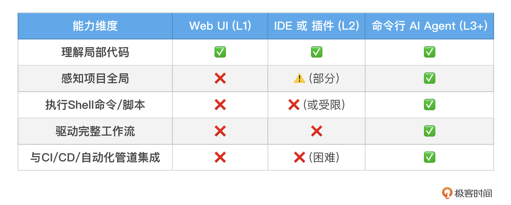
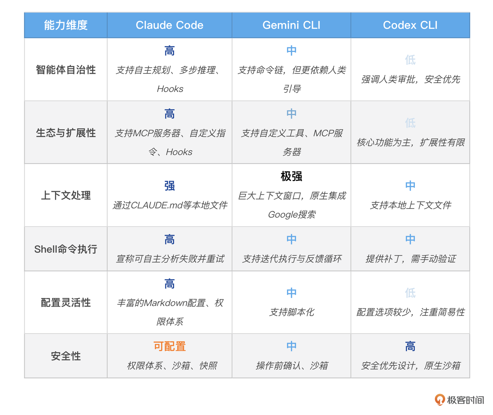
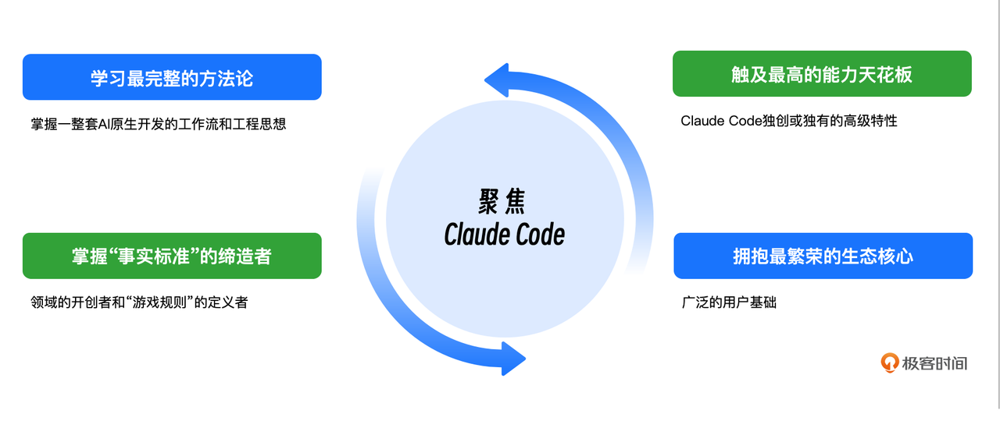

你好, 我是 Tony Bai. 

在前面两讲, 我们一起描绘了 AI 原生开发的宏伟蓝图. 我们理解了开发者角色的演进, 也深入了规范驱动开发 (SDD) 这一核心方法论. 

理论的灯塔已经树立, 但要真正开始航行, 我们还缺一艘足够坚固、足够先进的船. 这艘 "船", 就是能够承载我们所有 AI 原生工作流理念的 执行载体 . 

今天这一讲, 我们将把目光从高远的理论拉回到坚实的地面. 我们将一起回答三个环环相扣的问题: 

1. 在众多的 AI 交互形态中, 为什么说 命令行 AI 代理 (Coding Agent)  是实现 AI 原生开发的最佳载体?

2. 在当前 "群雄并起" 的 Agent 生态中, 有哪些主流玩家?它们各自的特点和哲学是什么?

3. 最终, 也是最重要的, 为什么在本专栏中, 我们选择 聚焦 Claude Code 作为我们后续所有实战的核心工具?

这既是一次技术选型, 也更是一次关乎我们未来如何与 AI 高效协作的战略决策. 

## 为何是 Coding Agent?—— 寻找 AI 原生开发的最佳载体

在我们深入具体的工具之前, 必须先回答一个根本问题: 为什么不是功能强大的内置 AI 的 IDE 或 IDE 插件, 也不是便捷的 Web UI, 偏偏是看起来有些 "复古" 的命令行工具, 成为了承载 AI 原生开发范式的最佳选择?

答案在于 " 执行深度 " 和 " 集成自由度 ". 

我们可以通过一张表格, 清晰地看到不同 AI 交互形态的能力边界: 

图例说明: ✅ 完全支持; ⚠️ 部分或受限支持; ❌ 不支持或极难实现

就像在之前的章节中提到的, 像 Cursor 和 GitHub Copilot 这样的 L2 工具也在快速进化, 并推出了自己的 "Agent 模式". 它们在 IDE 内部提供了更强的上下文感知和自动化能力, 这无疑是向前迈出的一大步. 

然而, 与 Claude Code 这类真正的命令行原生智能体相比,  它们最核心的区别依然在于 执行环境的受限 : 它们的 "行动" 被绑定在了运行 IDE 的本地开发环境里. 而一个真正的命令行 Agent, 则是一个可以被部署到任何目标环境 (服务器、CI Runner、Docker 容器) 中独立执行的 " 数字雇员 ". 

命令行 AI Agent (L3 / L4 成熟度) : 它是一个真正的 " 原生工作流智能体 ". 它与开发者共享着同一片宇宙 —— 终端 (Terminal) . 在这个宇宙里, 一切皆文件, 一切皆可由命令驱动. 这赋予了它无与伦比的 集成自由度 和 执行深度 : 

* 完全的环境感知:  它可以像你一样, 使用 ls 、 tree 、 git 等命令, 来全面地理解一个项目. 

* 无限制的行动能力:  理论上, 它被授权后, 可以执行任何 Shell 命令, 这意味着它可以参与到开发、测试、构建、部署的任何一个环节. 

* 天然的可编程性:  它本身就是一个 CLI 程序, 这使得它可以被轻松地集成到任何脚本、Makefile、Git Hooks 或 CI/CD 流水线中, 成为自动化流程的一个原子能力. 

正是这种 " 生于终端, 能力无界 " 的特性, 决定了命令行 AI 智能体是实践我们上一讲所学的规范驱动开发 (SDD) 、实现真正 AI 原生工作流的唯一正确路径. 

## 群雄并起: 三大主流 Coding Agent 的真实对决

既然方向已经明确, 我们就来看看在这条赛道上, 有哪些值得我们关注的 "赛车手". 业界的真实评测为我们描绘了一幅生动的 "三国演义" 图景: OpenAI 的 Codex CLI 、Google 的 Gemini CLI , 以及 Anthropic 的 Claude Code. 

我们不比较底座模型本身的好坏, 而是聚焦于一个更实际的问题:  作为一个开发者, 使用这三款工具的真实体验和能力边界究竟如何?

### 第一印象: 生态准入的隐形成本

从技术层面看, 这三款主流工具的安装都遵循了现代 CLI 工具的标准流程, 通常只需一行 npm install 命令即可完成. 真正的差异, 体现在它们背后所代表的 AI 生态的 准入门槛 上. 

* Claude Code:  流程相对直接,  npm install 后通过 login 命令完成 Anthropic 账户的授权即可. 其生态的门槛主要体现在商业化定位上, 需要用户拥有付费账户. 

* Gemini CLI:  虽然工具本身免费且额度慷慨, 但其账号体系与 Google Cloud 深度绑定. 对于个人开发者可能一步到位, 但对于已有 Google Workspace 的企业用户, 有时会触发一系列额外的 GCP 项目配置、API 启用等流程, 存在一定的 "配置成本". 

* Codex CLI:  同样依赖其背后的 OpenAI 账号体系. 社区中有反馈指出, 其账户的安全验证级别有时会要求提供身份证明等现实世界的信息, 这对于希望快速上手体验的开发者而言, 可能会构成一个意料之外的 "验证成本". 

一言以蔽之, 工具的安装都已是坦途, 但要获得进入其生态的 "门票", 每家公司都设置了不同的关卡. 

### 核心差异: 三大智能体的设计哲学

跨过了生态准入的门槛, 当我们真正开始与这三位 "AI 同事" 共事时, 其背后截然不同的设计哲学便会显现出来. 这决定了它们在软件工程舞台上各自最擅长的角色. 

* Claude Code: 为 "自治" 而生的工作流引擎 (Workflow Engine)  , 它的设计核心是 " Agentic Autonomy " (智能体自治) . 它并非被设计成一个简单的问答工具, 而是被构建用来 深刻理解项目上下文, 并具备前瞻性地规划和执行复杂任务 . 从其一开始就内置的 Hooks (钩子)  、 完整的仓库导航能力 、 Git 集成 等丰富功能中, 我们可以清晰地看到它的目标: 成为一个可以独立规划、执行, 甚至重试多步工作流的 "虚拟团队成员". 

* Gemini CLI: 灵活的 "对话式上下文引擎" (Conversational Context Engine) , 它的核心优势在于 流式的、富上下文的交互 . 得益于 Gemini Pro 模型宣称的巨大上下文窗口和与 Google 搜索的天然集成, 它极其擅长处理 " 大规模上下文的重构 " 和 " 需要外部知识检索 " 的任务. 它的设计哲学更像一个可以随时调动海量信息、与你进行深度对话的 "超级大脑", 而非一个完全自主的行动者. 

* Codex CLI: 安全第一的 "精准编辑助手" (Precision Editing Assistant) , 它的设计哲学是 安全和清晰 . 它专注于 patch-based (基于补丁)  和 diff-based (基于差异)  的文件编辑. 官方反复强调, 在执行任何修改前, 它都会以最清晰的方式向你展示变更, 并等待你的批准. 其内置的强大 沙箱安全机制 也印证了这一点, 但这也相应地牺牲了自主规划和扩展的能力. 它更像一个值得信赖、但需要你一步步明确指导的 "外科医生". 

### 核心能力与适用场景分析

根据对这三款智能体的公开特性的探究, 我们可以发现它们在设计上各有侧重, 从而形成了在不同软件工程场景下的差异化优势. 我们可以将这些差异归纳为以下几个核心维度: 

从这张对比表中, 我们可以清晰地看到它们各自的 "人设": 

* Claude Code 的定位是一个 高度自主且可扩展的 "工作流引擎" . 它拥有最丰富的自定义能力 (如 Hooks) 和最强的自主行为 (如自我修正) , 这使得它在执行 端到端的复杂任务 , 如 "自主调试测试失败" 或 "根据 `CLAUDE.md` 进行项目级重构" 时, 理论上具备最高的天花板. 

* Gemini CLI 则像一个 知识渊博且善于对话的 "上下文专家" . 它最大的优势在于能够一次性消化海量的本地代码或通过搜索获取外部文档, 这让它在需要 大规模上下文理解 的任务, 如 "对整个仓库进行一次跨多文件的变量名重构" 或 "基于外部 API 文档编写客户端代码" 时, 表现得尤为突出. 

* Codex CLI 的角色更像一个 精准、可靠且注重安全的 "编辑助手" . 它的设计哲学是 "每一步都清晰可控". 它在 跨文件代码补丁生成 和提供 可靠的核心编辑功能 方面表现稳定. 当你的核心需求是获得精准、安全的代码修改建议, 并且你希望对每一步变更都有完全的控制权时, 它的简洁性和沙箱机制就成为了优势. 

总而言之, 并没有一个 "最好" 的工具, 只有 "最适合" 的场景. 选择哪个智能体, 取决于你当前任务的性质: 是需要一个能独立完成复杂流程的 "自主伙伴", 一个能帮你博览群书的 "研究助理", 还是一个让你完全放心的 "手术医生". 

当然, 我们必须认识到, 命令行 AI 智能体领域正处于一个高速演进的 "军备竞赛" 阶段. 今天我们讨论的能力边界正在被迅速打破, 三款工具都在快速迭代,  未来它们的功能或许会逐渐趋同, 难分伯仲. 

## 我们的选择: 为何聚焦 Claude Code?

在扫描了整个生态, 并进行了深入的横向对比之后, 你可能会问: "Tony Bai 老师, 看起来每个工具都有自己的‘甜蜜区’, 为什么我们这个专栏要选择功能最‘重’、商业化最彻底的 Claude Code 作为核心实战工具呢?". 

这是一个非常好的问题. 我的决策, 主要基于以下四点考量, 这关乎我们这个专栏的最终学习目标和长远价值 . 

1. 为了学习最完整的方法论:  我们的目标, 不是教会你某个特定工具的 API, 而是让你掌握一整套 AI 原生开发的工作流和工程思想 . 从我们的分析中可以清晰地看到, Claude Code 是目前唯一一个将这套思想 (从上下文管理 `CLAUDE.md`、安全控制、到能力扩展 Hooks / MCP、再到自主规划) 实现得最完整、最体系化的工具.  学习它, 就像是在学习一门设计精良的 "语言" . 你掌握了这门语言的 "语法" 和 "范式", 将来即便切换到其他工具, 底层的思想也是完全通用的. 

2. 为了掌握 "事实标准" 的缔造者:  Claude Code 不仅是功能最丰富的, 它更是这个领域的开创者和 "游戏规则" 的定义者. 它是业界第一个真正意义上的命令行 AI 智能体 (CLI Coding Agent) . 我们现在已经习以为常的许多交互模式, 比如用 @ 注入文件上下文、用 ! 执行 Shell 命令、用 / 发起斜杠指令, 其最初的范式定义和推广都源于 Claude Code. 后续出现的许多同类工具, 在初期都或多或少地借鉴和效仿了它的设计. 因此, 深入学习 Claude Code, 就是在学习这套交互范式的 "源代码", 能让你理解其设计的本源和精髓. 

3. 为了触及最高的能力天花板:  Sub-agent (智能分身) 、Hooks (自动化之触) 、Checkpointing (快照回滚) …… 这些目前仍是 Claude Code 独创或独有的高级特性, 正是我们将 AI 智能体从一个 "玩具" 变为一个 "生产级引擎" 的关键. 如果我们的目标是构建复杂的、健壮的自动化系统, 那么我们必须去学习和实践这些代表了行业最高水准的功能.  学, 就学最强的. 

4. 为了拥抱最繁荣的生态核心:  正因为其先发优势、强大的能力和广泛的用户基础, Claude Code 已成为 AI 编程社区中使用最多、用途最广的 CLI Coding Agent. 这形成了一个正向的生态循环: 强大的工具吸引了海量的用户实践, 而海量的实践又催生了更丰富的第三方工具和更好的模型支持. 一个典型的例子就是, 像国内的智谱 AI 等大模型公司, 都提供了专门的技术和文档, 来支持开发者将它们的模型无缝对接到 Claude Code 的客户端上. 这意味着,  掌握 Claude Code, 你不仅是在学习一个工具, 更是在接入一个以它为核心的、不断发展的 AI 开发生态. 

尽管 Claude Code 的客户端代码并不开源, 但它引领的开发范式以及其缔造者 Anthropic 所定义的开放协议 (如 MCP) , 已经成为了整个行业共同的技术财富. 

当然, 我非常清楚 "成本" 这个最大的拦路虎. 

## 成本与可用性: 一个真实的警告与一个可行的方案

这里必须给出一个真实的警告: 一个开发者圈内广为人知的词是 " Hungry for Tokens " (对 Token 的饥渴) . 像 Claude Code 和 Gemini CLI 这类强大的工具, 因为需要加载大量上下文来做出高质量决策, 其 Token 消耗是巨大的. 

幸运的是, 我们有一个切实可行的 "平替" 方案来解决这个问题. 我们可以采用一种 " 偷天换日 " 的策略:  保留 Claude Code 强大的客户端工具, 但将其连接到国内更易访问、成本更低的 AI 模型服务上, 比如智谱 AI (ChatGLM) . 

这个方案的可行性在于: 

* 工具与大脑分离:  Claude Code 客户端 (CLI) 负责所有的交互、文件操作、上下文管理等 "工作流" 层面的事情. 而真正进行语言理解和代码生成的, 是它调用的云端大模型 —— 即 "大脑". 

* API 兼容性:  智谱 AI 等国内厂商提供了与 Anthropic Claude API 兼容的接口. 

这是一个双赢的方案: 

* 你能够 完整地学习和体验 Claude Code 所有强大的工作流功能 , 因为客户端工具是完全一样的. 

* 你的 学习和实践成本将大大降低 , 并且网络访问更稳定. 

当然, 其中的 取舍 (Trade-off)  在于 代码生成质量的差异 . 但这完全不影响我们专栏的学习目标. 请记住, 我们学习的核心是 方法论和工作流 . 当你将来需要执行最关键的任务时, 可以随时无缝地 "切换" 回官方的顶尖模型, 而你学到的所有 "驾驶技巧", 都将完美适用. 

在下一讲, 我们就会手把手带你完成这个低成本环境的配置. 

## 本讲小结

好了, 今天我们一起进行了一次对 AI Agent 生态的巡礼, 并为我们接下来的实战学习, 做出了一个关键的、有理有据的技术选型. 

首先, 我们论证了 命令行 AI 智能体 是实现 AI 原生开发的最佳载体, 因为它具备无与伦比的 执行深度 和 集成自由度 , 其能力边界远超传统的 IDE 插件以及 AI 原生 IDE. 

接着, 我们基于公开资料和社区共识, 深度剖析了三大主流玩家各自不同的设计哲学. 我们认识到, 它们并非简单的同质化竞争, 而是定位迥异的 "专家":  Claude Code 是全能的 "工作流引擎",  Gemini CLI 是灵活的 "上下文专家", 而 Codex CLI 则是精准的 "安全助手". 

然后, 也是最重要的一点, 我为你阐述了本专栏选择 聚焦 Claude Code 的四大战略考量: 为了学习最完整的方法论、掌握 "事实标准" 的缔造者、触及最高的能力天花板, 以及拥抱最繁荣的生态核心. 

最后, 我们提出了一个切实可行的 "客户端 + 国内模型" 方案, 通过 "引擎切换" 的思路, 巧妙地解决了国内开发者在学习和实践中可能遇到的成本与可用性问题. 

选定了我们的 "船", 明确了我们的航线, 从下一讲开始, 我们将正式扬帆起航. 我们将从零开始, 搭建我们的开发环境, 并学习与我们的第一个 AI 原生伙伴 ——Claude Code—— 进行有效协作的核心技巧. 

## 思考题

请你想象一下, 你现在是一个技术团队的负责人, 预算有限, 只能 "雇佣" 这三位 AI "工程师" (Claude, Gemini, Codex) 中的一位, 来解决你团队当前最棘手的一个问题. 

1. 你会选择 "雇佣" 哪一位?

2. 你希望它解决的具体问题是什么? (例如: 是重构一个庞大的遗留模块?是快速验证一个新功能的想法?还是为一套核心 API 补充缺失的测试?) 

3. 为什么你认为它的设计哲学 (工作流引擎、上下文专家或安全助手) 最适合解决你提出的这个问题?

欢迎在评论区分享你的这次 "招聘决策" 和背后的思考. 这个练习将帮助你将今天学到的对比分析, 内化为你自己的技术选型能力. 我们下节课再见！

