你好，我是 Tony Bai。欢迎来到我们专栏的基础篇。

在前面三讲，我们共同建立了一套关于 “AI 原生开发工作流” 的宏大认知框架。我们理解了开发者角色的演进，深入了 “规范驱动开发” 这一核心引擎，也扫描了整个命令行 AI Agent 的生态。

在上一讲的最后，我们做出了一个关键的技术选型：聚焦于当前功能最完备、方法论最成熟的 Claude Code 作为我们后续所有实战的核心载体。同时，我也向你承诺了一个能解决成本与可用性问题的 “双赢方案”—— 为 Claude Code 强大的客户端 “车身”，接入一颗更经济、更易访问的国产大模型 “引擎” 。

理论的航海图已经绘制完成，从今天开始，我们将正式 “下水”，亲手打造我们自己的航行工具。这一讲，我们的目标非常明确和务实： 动手实践上一讲提出的 “引擎移植” 策略，在你的本地或远程机器上，搭建一套以 Claude Code 客户端（以下有时也简称 CC）为核心、以国产 AI 大模型为动力源的、完整可用的 AI 原生开发环境。

这个过程并不复杂，但它至关重要。它将为你后续所有的学习和探索，扫清最大的障碍，让你能够在一个低成本、高可用的环境中，心无旁骛地磨练你的 “AI 工作流指挥” 技巧。

准备好了吗？让我们一起动手，为这辆 “F1 赛车” 换上我们自己的引擎。

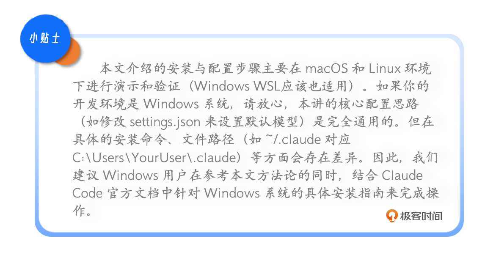

## 第一步：安装 “车身”—— 获取 Claude Code 客户端

在我们的 “引擎移植” 策略中，第一步是获取那个设计精良、功能完备的 “车身”—— 也就是 Claude Code 的命令行客户端（CLI）。这个客户端是开源的（但源码并不开源），它运行在你的机器上，负责处理所有的用户交互、文件操作、上下文管理等核心工作流功能。

### 1. 环境准备

在安装之前，请确保你的系统中已经安装了 Node.js 18.0 或更高版本 。Claude Code 是基于 Node.js 生态构建的，npm 是其首选的安装工具。你可以在终端中运行以下命令来检查你的 Node.js 版本：

```plain&#x20;text
node -v
```

如果版本低于 18.0，请先前往 Node.js 官网 进行升级。

下面是一个典型的基于 nvm 安装 / 升级 node 版本的步骤，供大家参考：

```markdown
# Download and install nvm:
curl -o- https://raw.githubusercontent.com/nvm-sh/nvm/v0.40.3/install.sh | bash

# in lieu of restarting the shell
\. "$HOME/.nvm/nvm.sh"

# Download and install Node.js:
nvm install 22

# Verify the Node.js version:
node -v # Should print "v22.20.0".

# Verify npm version:
npm -v # Should print "10.9.3".
```


### 2. 全局安装 Claude Code

接下来，打开你的终端，运行以下命令来全局安装 Claude Code：

```plain&#x20;text
npm install -g @anthropic-ai/claude-code
```

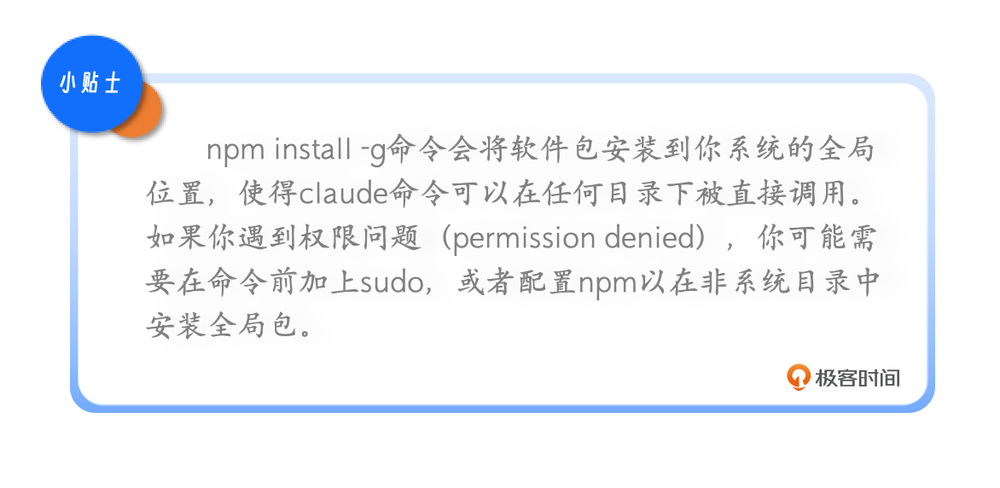

安装过程可能需要一两分钟，具体取决于你的网络速度。当安装完成后，你可以通过运行以下命令来查看 claude 的安装位置：

```plain&#x20;text
# which claude
/root/.nvm/versions/node/v22.16.0/bin/claude
```

并且，你可以通过运行以下命令来验证 Claude Code 安装和运行是否成功：

```plain&#x20;text
# claude --version
2.0.11 (Claude Code)
```

如果你能看到版本号输出（例如 2.0.11 ），那么恭喜你，我们已经成功地将这辆 “F1 赛车” 的车身请进了我们的车库。


### 3. 首次运行 Claude Code

此时，如果你直接运行 claude 命令，你将看到 Claude Code 的 “欢迎” 页面，如下图所示：

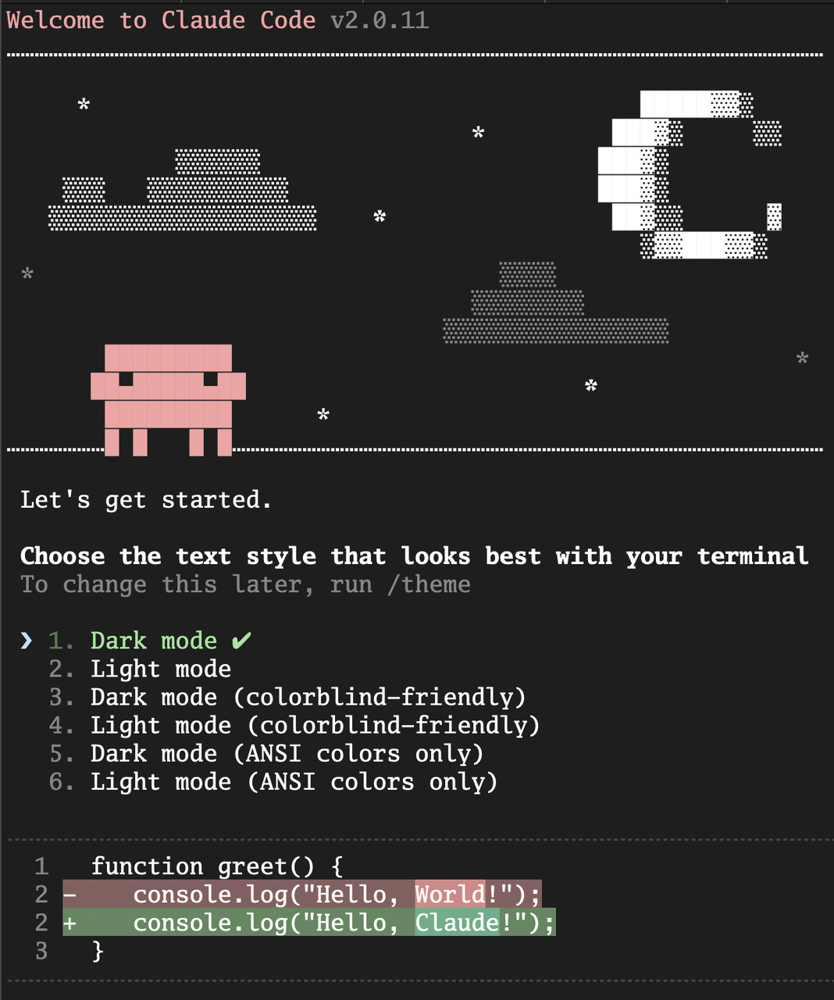

我们看到 Claude Code 让你选择终端主题（Terminal Theme），默认是第一个 Dark mode。这里我们可以直接敲击回车进入下一个页面（后续如果要重新配置主题时，可以通过 /config 斜杠命令进行）：

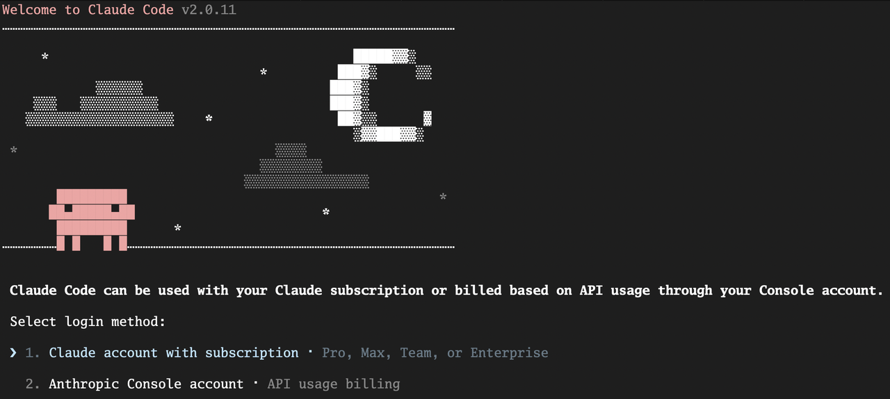

第二个页面会引导你选择登录方式，Claude Code 支持通过浏览器登录官方 Anthropic 账户，也可以通过 API 方式与 Claude 大模型进行交互 (通过方向键选择下面的选项 “Anthropic Console account”)。不过，这里 请先不要进行这一步 ，因为我们的目标是绕过官方 API，连接到我们自己的 “引擎”。

## 核心理念：“车身” 与 “引擎” 的分离

在我们进行下一步配置之前，你必须先理解一个 Claude Code（以及大多数 Agentic AI 工具）最核心的设计思想： “车身” 与 “引擎” 的分离 。

* “车身”： 指的是我们刚刚安装的 Claude Code 命令行程序。它是一个高度复杂的客户端应用，负责所有与你、与你的本地文件系统交互的逻辑。它定义了工作流，提供了 @ 、 ! 、 / 等强大的交互指令，实现了 Checkpointing 、 Hooks 、 SubAgent 等高级功能。

* “引擎”： 指的是背后真正进行语言理解、逻辑推理和代码生成的 大语言模型（LLM） 。这个 “引擎” 通常通过云端 API 的形式提供服务。

Claude Code 客户端默认会去连接 Anthropic 官方的 “引擎” – Claude 系列大模型。而我们的 “引擎移植” 策略，就是要通过修改配置，让 “车身” 不去连接官方引擎，而是去连接我们指定的、兼容 Claude 大模型 API 的国产大模型引擎，比如 智谱 AI 大模型 。

这个过程，就像是给一辆设计精良的特斯拉，换上一块我们自己生产的高性能电池。车的外观、操控系统、智能座舱（对应 Claude Code 的工作流能力）都保持不变，但动力来源变了。

我们可以用一张图来清晰地看到这个解耦的架构：

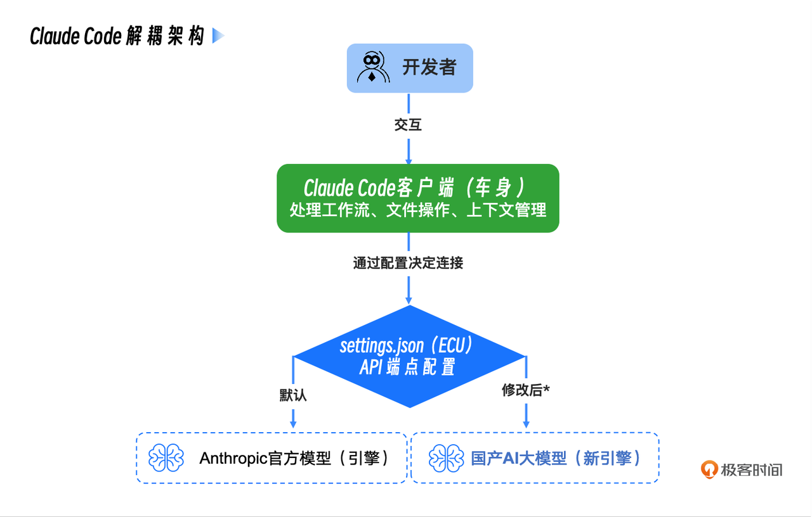

理解了这一点，你就能明白，我们接下来的所有配置操作，本质上都是在修改那个名为 settings.json 的 “ ECU（发动机控制器） ”，告诉 “车身” 去哪里寻找新的动力源。

## 第二步：配置 “引擎”—— 连接国产 AI 大模型

现在，让我们开始最关键的 “引擎移植” 手术。这个过程分为两步：获取新引擎的 “钥匙”（API Key）和修改 “ECU” 的配置（settings.json）。

这次我选择 智谱 AI 作为示例，主要是因为它全面拥抱了以 Claude Code 为代表的 CLI Coding Agent 生态，不仅提供了丰富的专门文档和技术支持，而且使用成本也极具竞争力。更重要的是，其最新的 GLM-4.6 系列模型在代码生成等任务上的质量也达到了非常高的水准，足以支撑我们专栏中绝大部分的方法论学习和实践。

### 获取你的智谱 AI API Key

首先，你需要一个智谱 AI 的账户和 API Key。

访问 智谱 AI 开放平台 。

注册并登录你的账户。

进入 “API 密钥” 管理页面 。

创建一个新的 API Key，请务必 妥善保管 好这个 Key。

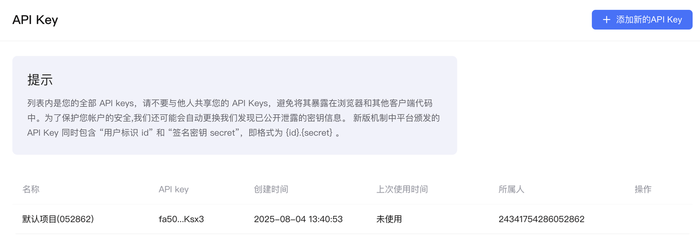

这个 API Key 就是你启动新 “引擎” 的唯一凭证，请不要泄露给任何人，也不要硬编码到你的代码仓库中。

### 配置 Claude Code 连接地址和身份凭证

申请完 API Key 后，我们就可以通过环境变量配置 Claude Code 访问智谱大模型 API 的连接地址和身份令牌了。你可以在你的 Shell 配置文件中添加下面两行：

```plain&#x20;text
export  ANTHROPIC_BASE_URL = "https://open.bigmodel.cn/api/anthropic"
export  ANTHROPIC_AUTH_TOKEN = "<your_zhipu_api_key>"
```

ANTHROPIC\_BASE\_URL ：这是最关键的一行。它告诉 Claude Code 客户端，不要去访问默认的 Anthropic API 地址，而是将所有的网络请求都发送到智谱 AI 的 API 兼容端点。我们在这里实现了 “ 请求重定向 ”。

ANTHROPIC\_AUTH\_TOKEN：尽管变量名看起来是 “Anthropic” 的，但由于我们已经重定向了 BASE\_URL\`，这个 Token 实际上会被发送给智谱 AI 的服务器进行验证。我们在这里实现了 “ 身份凭证替换 ”。

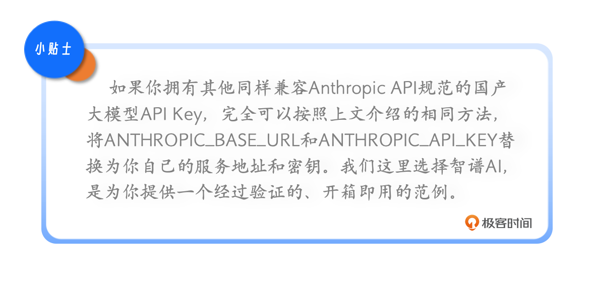

环境变量生效后，我们在本地一个项目的目录下重新执行 claude：

\~/go/src/github.com/bigwhite/issue2md # claude

我们再次进入 Claude Code 页面：

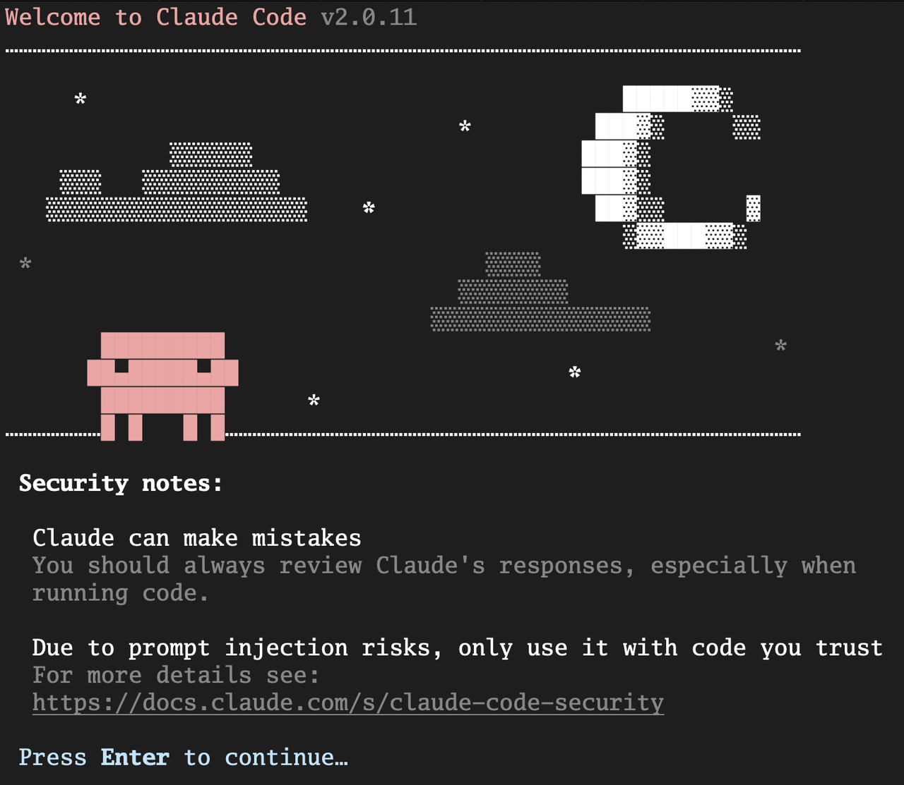

这次 Claude Code 没有让我们选择 login method，而是直接 login 成功了！

敲击回车后，我们看到下一个页面：

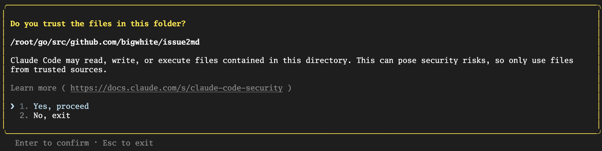

该页面询问我是否信任该本地文件夹，敲击回车选择信任后，我们便正式进入 Claude Code 的工作页面：

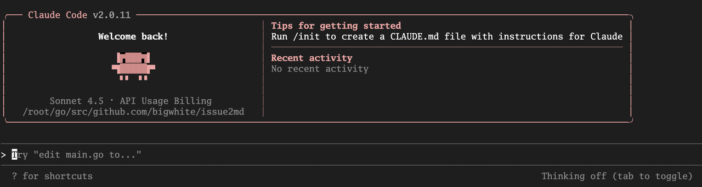

在输入提示符后面输入 /status 后回车，就可以看到当前 Claude Code 使用的模型的各种最新信息：

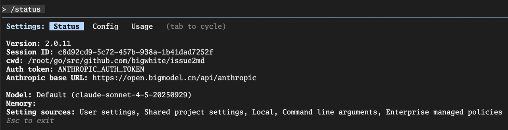

这里显示我们使用的是 claude-sonnet-4-5-20250929，不过显然这不是真的，背后智谱大模型到底使用什么模型呢？其实我们可以自行设置。

### 设置默认使用的模型

接下来，我们就来设置一下要使用的智谱 AI 的模型。我们需要找到并修改 Claude Code 的（分级）配置文件 settings.json 。这个文件是 Claude Code 的 “大脑中枢”，控制着它的核心行为，包括环境变量、权限、工具行为等。

在我们动手修改 settings.json 之前，<span style="color: inherit; background-color: rgba(254,212,164,0.8)">你必须先建立一个清晰的认知：Claude Code 的配置并非只有一个文件，而是一个设计精巧的 分层配置体系 。理解这个体系能让你在未来面对更复杂的团队协作时游刃有余</span>。

其核心思想是， 高层级的配置会覆盖低层级配置中的同名设置 。其优先级从高到低，如下图所示：

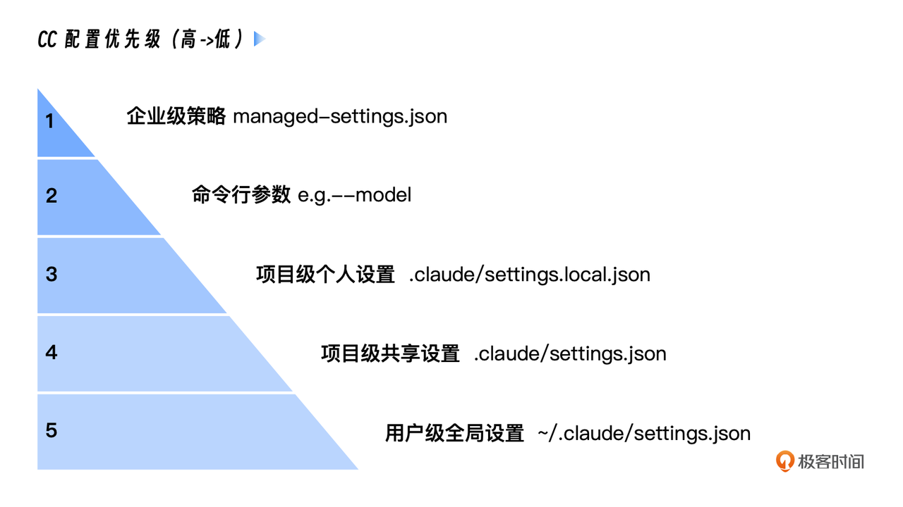

这五个层级各自的用途非常明确：

1. 企业级策略 （managed-settings.json）：由 IT / DevOps 团队统一分发，用于强制执行公司级安全策略， 拥有最高优先级，不可被覆盖 。

2. 命令行参数 （例如–model …）：为单次会话提供的 临时覆盖 ，非常适合快速测试。

3. 项目级个人设置 （.claude/settings.local.json）：你个人 在此项目 的特定偏好（如测试用模型）， 默认被 Git 忽略 ，不会与团队共享。

4. 项目级共享设置 （.claude/settings.json）：需要 团队所有成员共享 的项目级规范（如权限规则）， 应该提交到代码库 。

5. 用户级全局设置 （\~/.claude/settings.json）：存放你个人的、希望在 所有项目 中都生效的全局配置。 这正是我们本次 “引擎移植” 手术的核心操作区。

理解了这个体系后，我们就非常清楚了。接下来我们以用户级全局配置 `~/.claude/settings.json` 为例，来看看如何设置默认使用的智谱大模型。

这个文件通常位于你用户主目录下的 .claude 文件夹中。你可以通过以下命令找到并打开它：

```markdown
mkdir -p ~/.claude
# 使用你熟悉的编辑器打开，比如VS Code或Vim
# 如果文件不存在，这个命令会创建它
code ~/.claude/settings.json
# 或者
# vim ~/.claude/settings.json
```

打开这个（可能是空的） settings.json 文件，将以下内容完整地复制进去：

```json
{
  "env": {
    "ANTHROPIC_DEFAULT_HAIKU_MODEL": "glm-4.5-air",
    "ANTHROPIC_DEFAULT_SONNET_MODEL": "glm-4.6",
    "ANTHROPIC_DEFAULT_OPUS_MODEL": "glm-4.6"
  }
}
```

保存并关闭 settings.json 文件。我们重新运行 Claude Code 并通过 /status 命令查看当前模型信息：

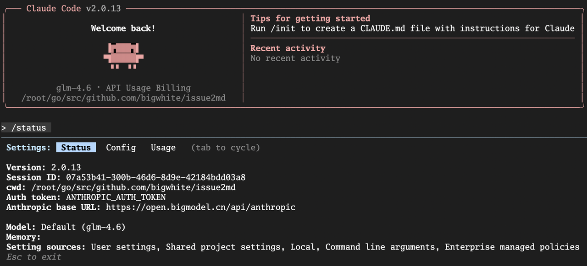

我们看到默认的模型已经变成了 glm-4.6 了！至此，我们的 “引擎移植” 手术已经宣告完成！

## 第三步：验证 “新引擎”—— 发出你的第一条指令

现在，是时候点火启动，听听我们新引擎的轰鸣声了。

打开一个新的终端窗口（以确保环境变量生效），输入以下命令：

```plain&#x20;text
claude -p "你好，请用中文介绍一下 Go 语言，不要超过 200 字"
```

* -p （或 --print ）参数是 Claude Code 的 “Headless 模式”，它会直接执行指令并打印结果，而不是进入交互式会话。这非常适合进行快速验证。

如果一切配置正确，你将看到类似下面的输出（具体内容可能因模型版本而异）：

```markdown
claude -p "你好，请用中文介绍一下 Go 语言，不要超过 200 字"
# Go 语言简介

Go 是 Google 于 2009 年开源的编译型编程语言，以简洁高效著称。

**核心特点**：
- **语法简洁**：关键字仅 25 个，学习曲线平缓
- **原生并发**：通过 goroutine 和 channel 实现轻量级并发
- **性能优异**：编译型语言，执行速度接近 C/C++
- **工具链完善**：内置格式化、测试、性能分析等工具
- **内存安全**：垃圾回收机制，自动管理内存

**主要应用场景**：微服务、云原生应用、网络编程、DevOps 工具开发。Docker、Kubernetes 等知名项目均采用 Go 编写。

Go 适合追求开发效率与运行性能平衡的项目。
```


当你成功看到回复，那么恭喜你，你已经成功地让 Claude Code 的强大 “车身”，搭载上了一颗澎湃的 “中国心”！

## 第四步：优化 “驾驶舱”—— 几个让体验翻倍的终端小技巧

我们的 AI 原生开发环境已经准备就绪。在结束本讲之前，我再与你分享几个能让你的 Claude Code “驾驶体验” 瞬间提升的小技巧。你可以在任何时候通过在 Claude Code 会话中输入 /config 来调整它们。

1. 统一视觉风格（Theme）： 你的终端是什么配色，就在 `/config -> Theme` 里选择一个最接近的主题。一个和谐的视觉环境，能让你的眼睛更舒适，注意力更集中。

2. 告别换行难题（Line Breaks）： 你是不是厌倦了在终端里输入多行文本的了？如果你本地主机使用的是 iTerm2 或 VS Code 的集成终端 ，<span style="color: inherit; background-color: rgba(254,212,164,0.8)">直接在 Claude Code 里运行 </span>`/terminal-setup`<span style="color: inherit; background-color: rgba(254,212,164,0.8)"> 命令。它会自动为你配置好 Shift+Enter 作为换行快捷键，从此你可以像在 IDE 里一样轻松输入大段代码和指令。</span>

3. 任务完成提醒（Notifications）： 如果你是一个 tmux 或 screen 的用户（我强烈推荐你成为！）， 在执行一个长耗时任务时，可以开启窗口活动监控（ monitor-activity on ）。当任务完成时， tmux 会在状态栏高亮提示，你就能第一时间知道结果，无需频繁切换回来查看。

记住这三个小技巧，它们能极大地提升你在终端中与 AI 协作的 “心流” 体验。

## 本讲小结

恭喜你！通过今天的学习和实践，你已经成功地搭建起了一套属于自己的、功能完整且经济高效的 AI 原生开发环境。这是我们通往 “AI 工作流指挥家” 之路的坚实第一步。接下来我们回顾一下今天所学。

首先，我们重申了 Claude Code “车身” 与 “引擎” 分离 的核心设计思想，这是我们能够进行 “引擎移植” 的理论基础。

接着，我们通过安装 Claude Code 客户端，获得了强大的工作流 “车身”，并通过环境变量设置，成功地将客户端的 API 请求指向了 智谱 AI 的兼容端点，为我们的 “车身” 换上了国产 “引擎”。

然后，我们深入学习了 Claude Code 精巧的 分层配置体系 ，理解了从企业级到个人级的五层配置及其优先级。这是你未来进行高级定制和团队协作的关键知识。

最终，也是最核心的实践，我们通过修改 用户级全局配置 ( `~/.claude/settings.json` )，成功更换了 Claude Code 使用的模型。此外，我们还了解了几个能快速提升协作体验的 终端小技巧 。

现在，你拥有了一件强大的、经过个性化调校的兵器。但拥有兵器，和懂得如何使用它，是两回事。从下一讲开始，我们将正式进入 “剑法” 的学习。我们将从所有 Coding Agent 最核心、最通用的交互模型 —— 上下文注入（@）与 Shell 执行（!） —— 讲起，让你学会与你的 AI 伙伴进行最高效的协作。

## 思考题

今天我们学习了 Claude Code 强大的分层配置体系，并通过修改 用户级全局配置 ，将默认 “引擎” 切换成了智谱 AI。

现在，请你设想一个真实的团队协作场景：

1. 你的团队决定为某一个特定的新项目（我们称之为 project-alpha ），统一试用另一款兼容 Anthropic API 的国产大模型（比如 Kimi 或 qwen）。

2. 你的要求是：只有在 project-alpha 这个项目目录下运行 claude 时，它才会连接到新的模型；而在其他任何地方运行 claude ，它应该仍然使用我们今天配置的智谱 AI。

3. 基于我们本讲学习的分层配置知识，你认为应该在哪一个 settings.json 文件中进行修改？这个文件中需要添加的具体配置内容又是什么样的？

欢迎在评论区分享你的解决方案和配置代码。这个问题将直接检验你是否真正掌握了配置的优先级和项目级定制的核心思想。如果你觉得有所收获，也欢迎你分享给其他朋友，我们下节课再见！


