你好, 我是 Tony Bai.

从这一讲开始, 我们将正式进入 Claude Code 的实战世界. 在前面的概念篇 (01～03 讲) , 我们建立了宏大的认知框架; 在上一讲, 我们亲手搭建好了开发环境. 现在, 是时候拿起 "武器", 学习如何驾驭我们这位强大的 AI 原生伙伴了.

要真正驾驭我们这位强大的 AI 原生伙伴, 关键在于升级我们的交互模式. 与高级 AI Agent 最有效的协作, 早已超越了简单的 "一问一答"; 它是一场 结构化的、双向的对话 , 在这场对话中, 我们不仅要清晰地表达意图, 更要高效地提供上下文, 并授权其采取行动.

这正是结构化交互 的威力所在. 一个设计精良的 Agent, 其目标是降低你的 ``认知负荷 ``, 而不是要求你成为 "``提示词``大师". 它会提供一套简洁而强大的 "交互模型", 让你能够轻松地表达复杂的工程意图.

而 Claude Code (以及大多数优秀的 Coding Agent) 的核心交互模型, 就建立在两个极其简单却异常强大的符号之上:  `@` 和 `!`.

* `@` 代表 上下文 (Context)  , 是 ``AI`` 用来 "感知" 世界 的眼睛和耳朵.
* `!` 代表 行动 (Action)  , 是 ``AI`` 用来 "改造" 世界 的双手.

这一讲, 我们的目标就是彻底精通 AI 的这两只 "手". 你将发现, 这两个简单的符号, 不仅是操作指令, 更是一种深刻的 人机协作哲学. 掌握它们, 你就掌握了与所有高级 Coding Agent 对话的 "通用语言".

## AI 的两只手: 一种新的人机交互哲学

在传统的软件开发中, 我们与计算机的交互是单向的、命令式的. 我们编写代码, 编译器执行它. 而在 AI 原生开发的范式中, 这种交互变得更像是 双向的、协作式的对话.

想象一下你正在与一位人类的资深架构师同事结对编程. 你们的协作通常是这样的:

1. 你 (指着屏幕) : "你看一下这段代码 (`@`) , 我觉得它的耦合度太高了. " (提供上下文)
2. 同事 (阅读代码后) : "确实. 我建议把数据访问逻辑抽离出来. 你先 运行一下测试  ( `!` ) , 确保我们现在的状态是稳定的. " (提议行动)
3. 你运行了测试.
4. 同事: "好的, 测试通过. 现在, 我来帮你重构. 我将要 修改这几个文件  ( `!` ) , 把数据库调用移到一个新的 repository 包里. " (提议行动)

`@` 和 `!`, 正是将这种高效的人类协作模式, 完美地复刻到了人机交互之中.


* @ 指令: 它将 "提供上下文" 这个动作, 从一个模糊的、需要靠复制粘贴完成的任务, 变成了一个 精确的、可追溯的、结构化的指令 . 当你输入 @main.go 时, 你和 AI 之间就建立了一个明确的契约: "我们接下来的对话, 是围绕 main.go 这个文件的当前状态展开的. "
* ! 指令: 它将 "执行动作" 这个环节, 从一个需要你切换窗口、手动操作的流程, 无缝地 融入到了对话流之中 . 它打通了 AI 的 "大脑" (语言模型) 和你的本地环境之间的 "隔膜", 让 AI 的思考可以直接转化为真实世界的影响.

接下来, 让我们深入每一个指令的细节, 看看它们究竟有多强大.

## 精通 @ 指令: 为 AI 装上 "全景摄像头"

@ 指令的核心使命, 是解决我们在开篇词中提到的 "上下文摩擦力" 问题. 它让 AI 不再是一个 "健忘的外部顾问", 而是成为了一个能够主动观察你整个项目的 "全局架构师".

下面我们就来看看 @ 指令的几种常见用法.

### 引用单个文件: 最精准的上下文

这是 @ 指令最基础也是最高频的用法. 你可以用它来引用项目中的任何一个文件, 无论是源代码、配置文件、文档, 还是测试数据.

```plain
语法: @/path/to/your/file
```

Claude Code 拥有强大的路径自动补全功能. 你只需输入 @ , 就会自动列出当前目录下的文件和目录列表 (如下图所示) ; 输入和文件名的前几个字母, 然后按下 Tab 键, 它也会像 IDE 一样为你补全路径.

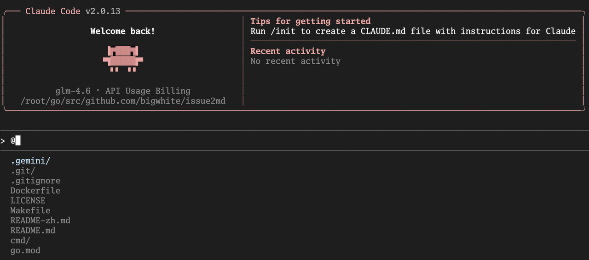

接下来, 我们将结合开发者日常工作, 看两个 @ 指令与单个文件结合的实战场景.

### 实战场景 1: 代码解释

假设你正在接手一个陌生的 Go 项目, 看到了一个复杂的 Dockerfile 文件, 你想快速理解它的作用. 你可以直接将 Dockerfile 通过 @ 指令喂给 Claude Code:

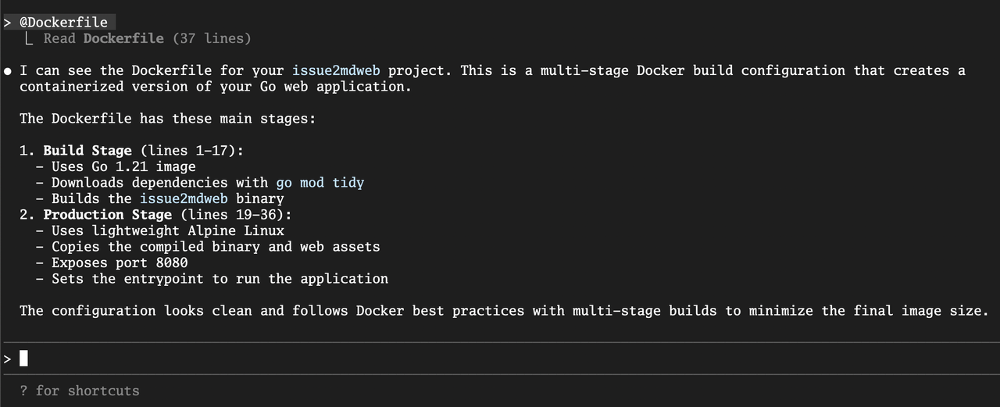

我们看到, Claude Code 在加载 Dockerfile (我使用的是 bigwhite / issue2md 项目下的 Dockerfile) 时, 会输出对该上下文数据的概要理解. 当然如果你要进一步针对该 Dockerfile 提问, 可以直接输入你的问题:

```markdown
> 帮我逐行解释一下这个Dockerfile的作用, 特别是多阶段构建的逻辑.  

● 我来为您详细解释这个Dockerfile的每一行以及多阶段构建的逻辑: 

  第一阶段: 构建阶段 (Build Stage)

  # 使用 Go 语言官方镜像作为构建阶段
  FROM golang:1.21 AS builder
  - 使用官方Go 1.21镜像作为基础镜像
  - AS builder 为这个阶段命名为"builder", 便于后续引用

  # 设置工作目录
  WORKDIR /app
  - 在容器内创建/app目录并设置为工作目录
  - 后续所有命令都会在此目录下执行

  # 复制 go.mod文件
  COPY go.mod ./
  - 只复制go.mod文件到工作目录
  - 这是Docker层缓存的优化策略

  # 下载依赖
  RUN go mod tidy
  - 下载项目所需的Go模块依赖
  - 只复制go.mod就下载依赖可以利用Docker缓存, 如果go.mod没变就不会重新下载

  # 复制源代码
  COPY . .
  - 复制项目所有源代码到工作目录
  - 在依赖下载之后执行, 确保代码变更时才重新构建

  # 构建二进制文件
  RUN CGO_ENABLED=0 GOOS=linux go build -o issue2mdweb .
  - CGO_ENABLED=0: 禁用CGO, 生成静态链接的二进制文件
  - GOOS=linux: 指定目标操作系统为Linux
  - -o issue2mdweb: 指定输出文件名
  - 编译当前目录(.)的Go代码

  第二阶段: 生产阶段 (Production Stage)

  # 使用轻量级的镜像作为生产阶段
  FROM alpine:latest
  - 使用轻量级的Alpine Linux作为生产环境基础镜像
  - Alpine镜像体积很小, 适合生产环境

  # 设置工作目录
  WORKDIR /root/
  - 设置生产容器的工作目录为/root/

  # 从构建阶段复制二进制文件
  COPY --from=builder /app/issue2mdweb .
  - --from=builder: 从名为"builder"的构建阶段复制文件
  - 将编译好的二进制文件复制到当前工作目录

  # 复制 web 目录下的 templates 和 static 子目录
  COPY --from=builder /app/web/templates /root/web/templates
  COPY --from=builder /app/web/static /root/web/static
  - 分别复制Web模板文件和静态资源文件
  - 保持原有的目录结构

  # 暴露应用端口
  EXPOSE 8080
  - 声明容器监听8080端口
  - 这是文档声明, 实际端口映射需要在运行时指定

  # 指定容器启动时的命令
  ENTRYPOINT ["./issue2mdweb"]
  - 设置容器启动时执行的命令
  - 运行编译好的Go应用程序

  多阶段构建的优势

  1. 减小镜像体积: 最终镜像只包含运行时必需的文件, 不包含Go编译器和源代码
  2. 提高安全性: 生产镜像不包含构建工具, 减少攻击面
  3. 提高构建效率: 利用Docker层缓存, 只有依赖变更时才重新下载
  4. 清晰的分离: 构建环境和运行环境分离, 便于维护

  这种模式是现代Go应用容器化的最佳实践. 
```

**注意: 你可以将 @Dockerfile 和你的问题放在同一行, 也可以像我这样分两次输入, 效果是一样的.**

我们看到 Claude Code 会读取 Dockerfile 的完整内容, 并给出一份详尽的、逐行分析的解释. 你不再需要将几十行配置手动复制到 Claude Code 中了.

### 实战场景 2: 基于代码生成测试

你刚刚写完一个 Go 函数 (utils/math.go), 现在需要为它编写单元测试.

```plain
package utils

func Add(a, b int) int {
    return a + b
}
```

你可以这样请求 AI:

```plain
> @utils/math.go
> 为这个文件里的 Add 函数编写一份完整的单元测试, 使用 Go 语言的 testing 包, 并覆盖正常、负数和零这几种情况. 
```

AI 会读取 math.go , 理解 Add 函数的签名和功能, 然后为你输出一份高质量的 utils/math\_test.go 文件内容:

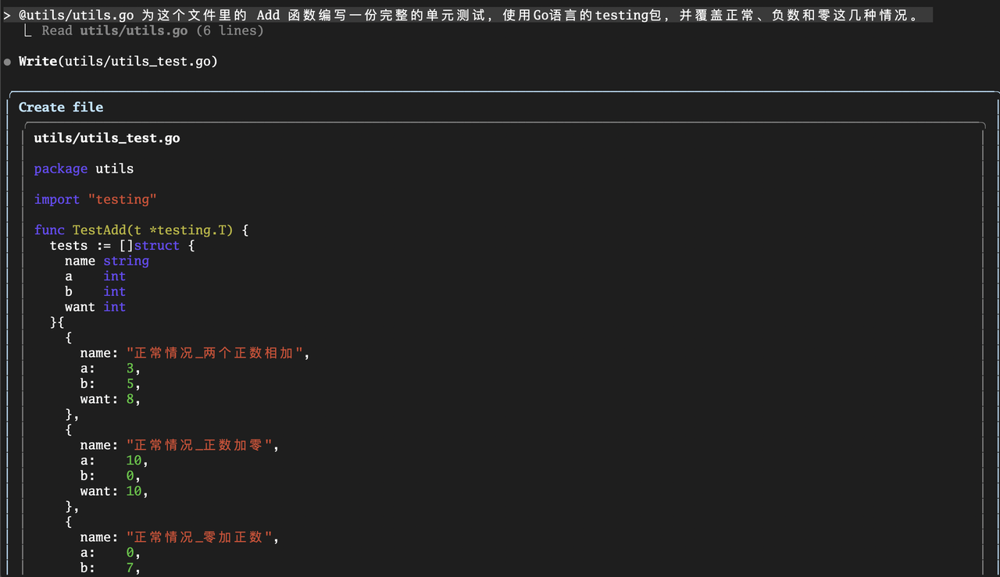

在生成的内容末尾, Claude Code 还给出了三个授权选项:

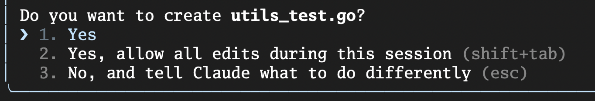

选项 1 是授权 Claude Code 在本地创建该 `utils/math_test.go` 文件, 选项 2 是授权 Claude Code 在本次会话下可以进行任何编辑操作. 考虑安全性, 这次我们选择了选项 1, 授权 Claude Code 在本地创建 `utils/math_test.go` 文件.

之后 Claude Code 将创建该文件并输出如下内容:


我们看到 Claude Code 还贴心地对测试的覆盖范围做了说明, 并给出了后续的建议操作! 你可以在本地跑测试, 也可以在 Claude Code 中使用 ! 指令, 进入 utils 并运行 go test -v, 以查看测试是否运行通过 (如下图) . 关于 ! 指令, 我们后面会详细说明.

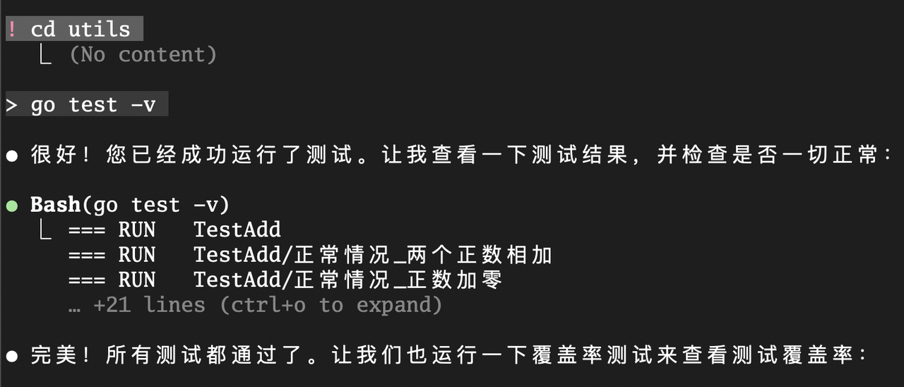

### 引用整个目录: 开启 "上帝视角"

当你的问题涉及到多个文件或需要宏观视角时, 引用单个文件就显得力不从心了. 此时,  @ 指令的真正威力才显现出来 —— 你可以引用整个目录.

```plain
语法:  @/path/to/your/directory/
```

**当 AI "看到" 一个目录时, 它并不会把所有文件的内容都无脑地塞进上下文. Claude Code 的 @ 指令在处理目录时, 表现得极其智能.**

默认情况下,  @ 指令是 Git 感知 的. 这意味着它会:

1. 自动查找并读取你项目根目录下的 `.gitignore` 文件.
2. 在遍历你指定的目录时,  自动忽略 所有匹配 `.gitignore` 规则的文件和目录.

你完全不用担心它会把 `node_modules/` 、 `vendor/` 、编译产物或 `.git/` 目录本身这些 "上下文噪音" 喂给模型. 它提供给 AI 的, 永远是干净、纯粹的源代码和重要资产.


### 实战场景 3: 项目概览与技术栈分析

你刚刚克隆了一个新的开源 Go 项目, 想快速上手. 我们可以将当前目录作为上下文喂给 Claude Code:

```plain
@ ./
```

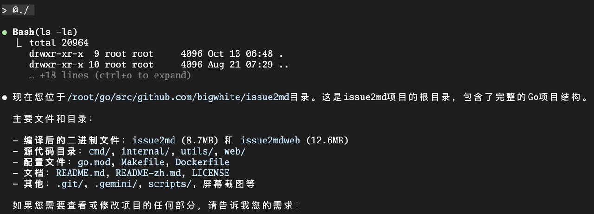

然后, 我们向 Claude Code 表述意图, Claude Code 会结合整个目录上下文给出答案:

```bash
> 这是一个Go项目, 请帮我分析它的整体结构、核心功能、主要依赖以及如何运行起来.  

● Read(README.md)
  ⎿  Read 56 lines

● Read(go.mod)
  ⎿  Read 4 lines

● Read(main.go)
  ⎿  Read 31 lines

● Read(Makefile)
  ⎿  Read 19 lines

● Search(pattern: "cmd/**/*.go")
  ⎿  Found 1 file (ctrl+o to expand)

● Search(pattern: "internal/**/*.go")
  ⎿  Found 2 files (ctrl+o to expand)

● Search(pattern: "web/**/*.go")
  ⎿  Found 1 file (ctrl+o to expand)

● Read(cmd/issue2md/main.go)
  ⎿  Read 123 lines

● Read(internal/converter/converter.go)
  ⎿  Read 116 lines

● Read(internal/github/github.go)
  ⎿  Read 406 lines

● Read(web/handlers/handlers.go)
  ⎿  Read 106 lines

● Search(pattern: "web/**/*.html")
  ⎿  Found 1 file (ctrl+o to expand)

● Bash(go list -m all)
  ⎿  github.com/bigwhite/issue2md

● issue2md 项目分析报告

  📁 项目整体结构

  这是一个GitHub Issue/Discussion/PR 转 Markdown工具, 采用标准Go项目结构: 

  issue2md/
  ├── cmd/                    # 命令行工具入口
  │   └── issue2md/          # CLI工具主程序
  ├── internal/              # 内部包
  │   ├── converter/         # Markdown转换逻辑
  │   └── github/           # GitHub API交互
  ├── web/                   # Web界面
  │   ├── handlers/         # HTTP处理器
  │   ├── templates/        # HTML模板
  │   └── static/          # 静态资源
  ├── utils/               # 工具函数
  ├── main.go             # Web服务主入口
  ├── Dockerfile          # 容器化配置
  └── Makefile           # 构建脚本

  🚀 核心功能

  1. 双模式运行

  - CLI模式 (cmd/issue2md/main.go:25-122): 命令行工具, 支持批量转换
  - Web模式 (main.go:12-30): Web服务, 提供图形化界面

  2. 支持的GitHub资源类型

  - Issues (internal/github/github.go:128-162)
  - Pull Requests (internal/github/github.go:164-198)
  - Discussions (internal/github/github.go:305-335)

  3. 转换功能

  - 结构化Markdown输出 (internal/converter/converter.go:55-115)
  - 用户链接 (internal/converter/converter.go:13-18)
  - 反应统计 (internal/converter/converter.go:30-53)
  - 评论整理 (internal/converter/converter.go:21-27)

  4. GitHub API集成

  - URL解析 (internal/github/github.go:87-117)
  - 认证支持 (GITHUB_TOKEN环境变量)
  - 分页处理 (internal/github/github.go:206-263)
  - Reaction获取 (internal/github/github.go:295-303)

  📦 主要依赖关系

  无外部依赖

  项目仅使用Go标准库: 
  - net/http - HTTP客户端和服务端
  - encoding/json - JSON数据处理
  - html/template - Web模板渲染
  - flag - 命令行参数解析
  - os, io, fmt - 系统操作

  自定义包结构

  github.com/bigwhite/issue2md
  ├── internal/converter     # 转换器包
  ├── internal/github       # GitHub API包
  └── web/handlers          # Web处理器包

  🛠️ 如何运行

  1. CLI模式

  # 安装
  go install github.com/bigwhite/issue2md/cmd/issue2md@latest

  # 使用
  issue2md [flags] <github-url> [output-file]

  # 示例
  issue2md -enable-reactions https://github.com/user/repo/issues/123 issue.md

  2. Web模式

  # 编译
  make web
  # 或
  go build -o issue2mdweb

  # 运行
  ./issue2mdweb
  # 服务器运行在 http://0.0.0.0:8080

  # 使用Docker (推荐) 
  docker run -d -p 8080:8080 bigwhite/issue2mdweb

  3. 构建选项

  # 构建所有版本
  make all

  # 仅构建CLI
  make cmdline

  # 构建Docker镜像
  make buildimage

  # 清理构建产物
  make clean

  ⚙️ 配置选项

  命令行参数

  - -enable-reactions: 包含反应统计
  - -enable-user-links: 启用用户资料链接
  - -ip, -port: Web服务绑定地址和端口

  环境变量

  - GITHUB_TOKEN: GitHub API认证令牌 (提高API限制) 

  🎯 项目特点

  1. 轻量级: 无外部依赖, 仅使用标准库
  2. 双模式: 支持CLI和Web两种使用方式
  3. 完整支持: 覆盖Issue、PR、Discussion三种类型
  4. 容器化: 提供Docker部署方案
  5. 功能丰富: 支持反应统计、用户链接等高级功能

  这是一个设计良好的Go项目, 代码结构清晰, 功能完整, 适合作为学习Go项目结构和GitHub API集成的参考项目. 
```

我们看到 Claude CodeI 会扫描整个项目 (已忽略 `.gitignore` 中的内容) , 阅读 `go.mod` 来分析依赖, 阅读 `Makefile` 或 `main.go` 来寻找启动方式, 并阅读 `README.md` 来理解项目目标. 最终, 它会给你一份堪比资深同事为你做的项目介绍.


### 实战场景 4: 大规模代码重构

假设你想对 issue2md 项目中的 internal/github/ 包进行重构, 将所有调用 Github RESTful API 的地方换为基于 GitHub GraphQL API 的调用, 我们可以基于 GitHub 这个目录的上下文提出我们的重构要求:

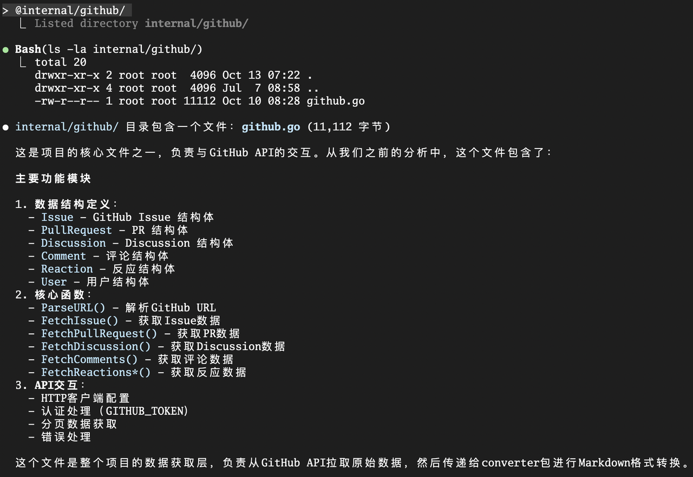

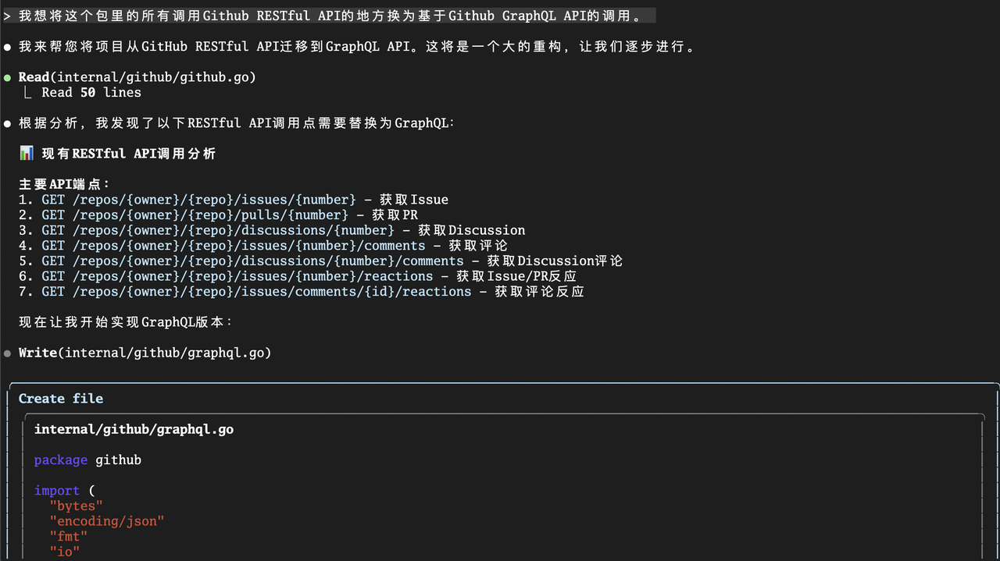

AI 会一次性读取 api 包下的所有 `.go` 文件, 理解它们之间的相互关系, 然后为你提供一个完整的、系统性的重构方案, 并可以在你的授权后, 直接生成修改后的所有文件内容. 这是单个文件上下文完全无法做到的.

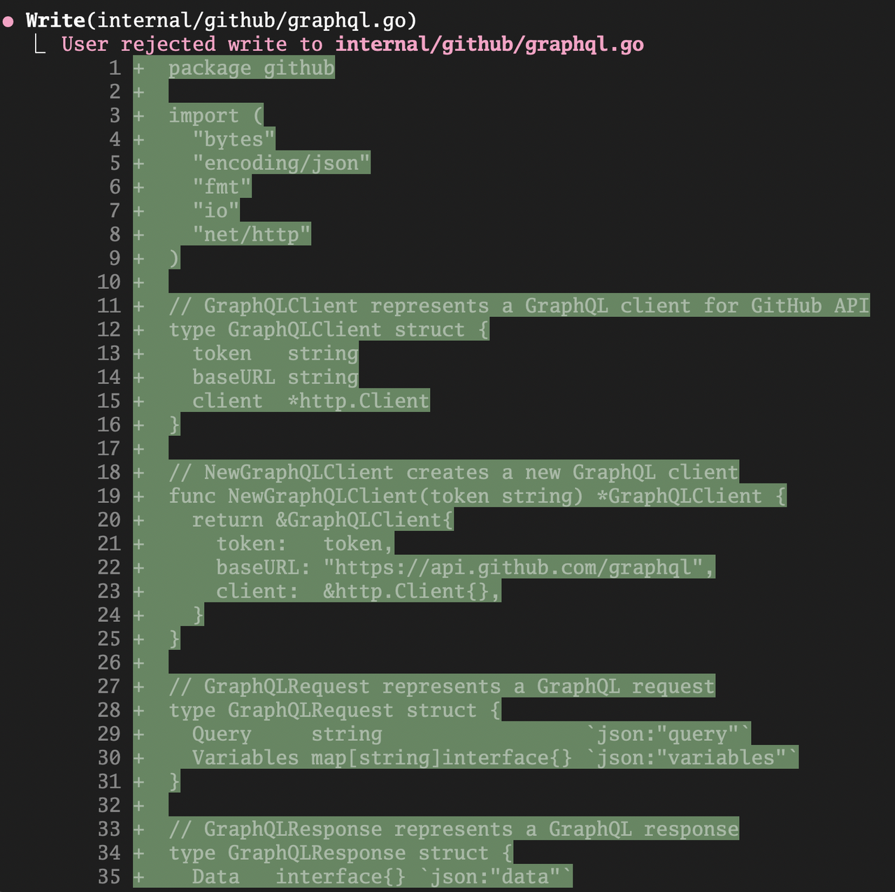

@ 指令是 AI Agent 的 输入管道. 它以一种结构化的方式, 将真实世界的、多维度的信息 (本地文件、项目结构等) 转化为 AI 可以理解的上下文. 精通 @ , 是你从 "把 AI 当玩具" 到 "把 AI 当工具" 的第一步.


## 精通 ! 指令: 赋予 AI 改造世界的力量

如果说 @ 是 AI 的 "眼睛", 那么 ! 就是 AI 的 "双手". 它打通了 AI 的 "思考" 与本地环境 "执行" 之间的壁垒, 但同时又通过精巧的设计, 保证了操作的绝对安全.

### 在对话中执行单行命令

这是 ! 最直接的用法. 你可以在与 AI 的对话流中, 随时执行任何你想执行的 Shell 命令, 而无需退出 Claude Code.

```plain
语法: ! <your_shell_command>
```

### 实战场景 1: 即时验证与查询

你正在让 AI 帮你写一段操作 Redis 的 Go 代码, AI 建议使用 go-redis 库. 你想确认一下本地是否已经安装了这个依赖.

```plain
> !go list -m github.com/redis/go-redis/v9
```

终端会直接执行这条命令, 并返回结果. 你可以立即知道依赖是否存在, 然后继续你的对话. 在我的 issue2md 下执行的结果如下:

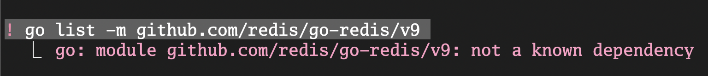

注: 输出上述结果是因为 issue2md 没有依赖 go-redis.


### 实战场景 2: 将命令输出作为上下文

! 指令的输出, 会自动成为下一轮对话的上下文, 这是一个极其强大的特性. 我们先让 Claude Code 做出一些改变, 比如:

```markdown
> @README-zh.md 基于 README-zh.md, 帮我生成一个繁体中文的 README 文件 
  ⎿  Read README-zh.md (54 lines)

● Write(README-zh-TW.md)
  ⎿  Wrote 54 lines to README-zh-TW.md                                                   
     # issue2md
     一個命令列和網頁工具, 用於將GitHub issue、discussion或pull request轉換為Markdown格式檔案. 
     >此倉庫中的大部分內容是由人工智慧生成的!
     ## 命令列模式
     ### 安裝issue2md命令列工具
     … +44 lines (ctrl+o to expand)

● 已基於 README-zh.md 成功生成繁体中文版本的 README 文件: README-zh-TW.md

  主要轉換包括: 
  - 命令行 → 命令列
  - 文件 → 檔案
  - 安装 → 安裝
  - 运行 → 運行
  - 浏览器 → 瀏覽器
  - 打开 → 開啟
  - 按钮 → 按鈕
  - 链接 → 連結
  - 讨论 → 討論

  檔案已保存在當前目錄下, 可以直接使用. 
```


假设你想让 AI 帮你写一个 Git Commit Message.

```plain
! git add README-zh-TW.md 
  ⎿  (No content)

! git diff --staged 
  ⎿  diff --git a/README-zh-TW.md b/README-zh-TW.md
     new file mode 100644
     index 0000000..33e9064
     … +58 lines (ctrl+o to expand)
```


终端会显示所有已暂存的代码变更.

```sql
> 根据上面的diff内容, 帮我写一条符合Conventional Commits规范的commit message.  

● 基于这个 diff 内容, 我建议使用以下符合 Conventional Commits 规范的 commit message: 

  docs: add Traditional Chinese README (README-zh-TW.md)

  这条 commit message 的说明: 
  - docs: 类型表示这是对文档的修改
  - add 表示新增了一个文件
  - Traditional Chinese README 简洁描述了文件内容
  - (README-zh-TW.md) 指明了具体的文件名

  如果你想更详细一些, 也可以使用: 

  docs: add Traditional Chinese translation of README

  - Convert simplified Chinese to traditional Chinese
  - Add README-zh-TW.md for traditional Chinese users
  - Maintain consistent formatting and structure
```

我们看到: Claude Code 会 "阅读" 上一条 ! 命令的输出, 并为你生成一条高质量的、与你的代码变更完全匹配的提交信息.


### 让 AI 提议并执行命令

这才是 ! 指令的 "AI 原生" 用法. 我们不再是自己执行命令, 而是 让 AI 来决定何时需要执行命令, 以及执行什么命令. 当 AI 认为需要通过执行 Shell 命令来获取信息或完成任务时, 它会使用一个特殊的 "工具调用" (Tool Call) 来向你提议.

### 实战场景 3: AI 自主进行环境检查

你向 Claude Code 提了一个高层级的任务: "帮我分析这个项目的外部模块依赖" . AI 可能会这样回应 (在 Claude Code 的界面中, 这会以一个需要你确认的交互式卡片出现) :


我们看到 AI 给出了后续的本地操作建议, 但此时需要你的授权.

这种 "提议 - 审批" 机制, 是保障 ! 指令安全的核心.

AI 永远不会在你不知情的情况下, 擅自执行任何 `rm -rf /` 这样的危险命令. 你, 永远是那个掌握最终执行权的 "司令官".

除非你在启动 claude 时, 开启了 SOLO 机制, 即使用 `claude --dangerously-skip-permissions`, 这样在新开启的 Claude Code 会话中将默认忽略掉任何需要你授权的环节.


### 一个重要的区别: 没有沉浸式 Shell 模式

一些同学可能熟悉其他 AI Agent 工具提供的 "沉浸式 Shell 模式" (即输入 ! 后进入一个可以连续输入命令的子 Shell) . 这里需要特别指出的是,  Claude Code 并未提供此功能. 如果你需要连续执行多条命令, 最佳实践就是 逐行使用 ! 前缀来执行它们 . 这样做的好处是, AI 能够清晰地看到每一个独立的命令及其对应的输出, 从而可以更精准地理解你的完整操作序列, 并对每一步的结果做出响应.

## 组合的力量: 完成你的第一个 "感知 - 行动" 工作流闭环

现在, 我们已经分别掌握了 AI 的 "眼睛"( @ ) 和 "双手"( ! ). 是时候将它们组合起来, 完成一个真正意义上的简化版的 AI 原生开发工作流闭环了.


### 任务: 为一个 Go 项目添加新依赖, 并编写一个使用该依赖的示例函数.

第一步: 感知项目现状 ( @ )

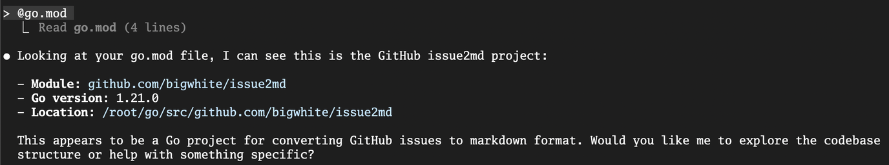

Claude Code 读取 `go.mod`, 了解项目当前的依赖情况.


第二步: 输入意图, 让 AI 提议行动


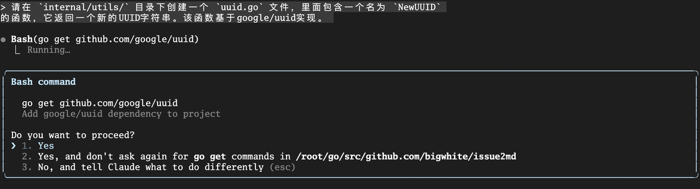

你批准执行.

AI 知道要创建一个新文件, 它会调用 Write 工具, 并生成如下内容:

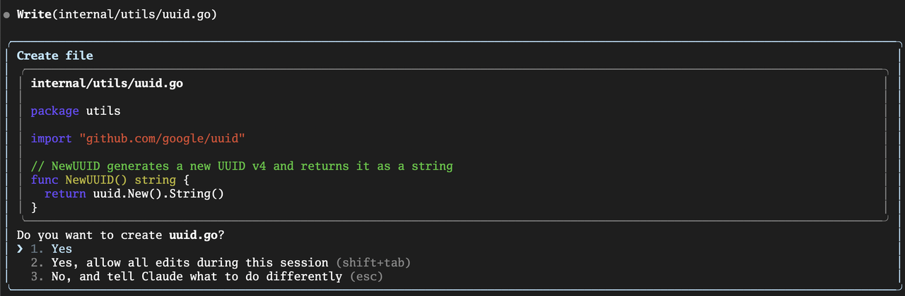


你批准后, AI 完成代码写入, 并提示你使用 go get 更新依赖:

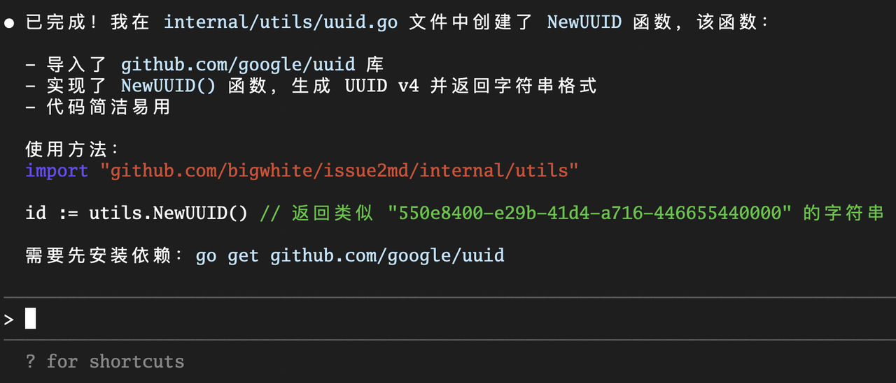


第三步: 更新依赖 ( ! )

我们使用 ! 指令, 参考 Claude Code 给出的建议执行 go get, 以更新 go.mod 中的依赖:

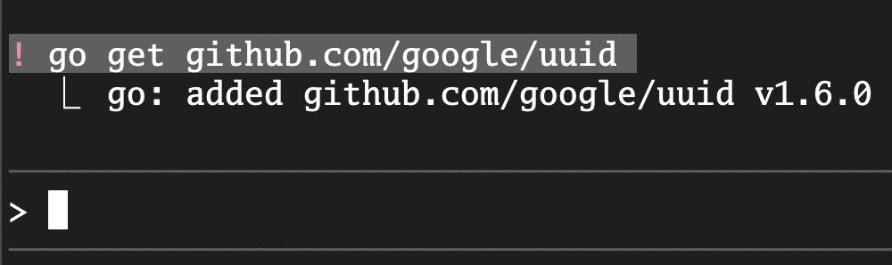


第四步: 完成并记录 ( ! )

假设测试通过了. 我们希望把所有这些变更 (go.mod, go.sum, 新增的 uuid.go) 暂存, 生成一条 commit message, 并提交:

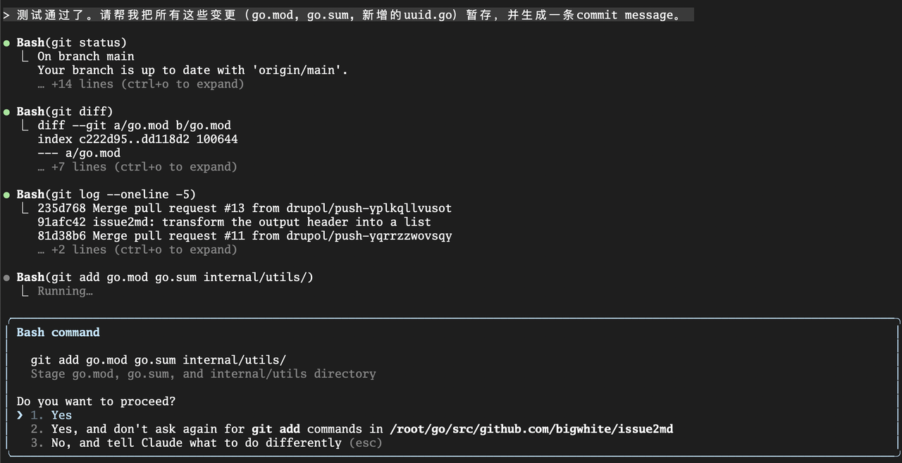

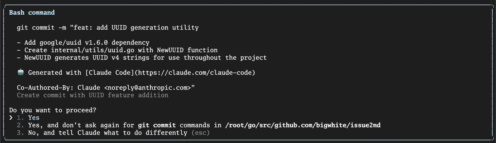

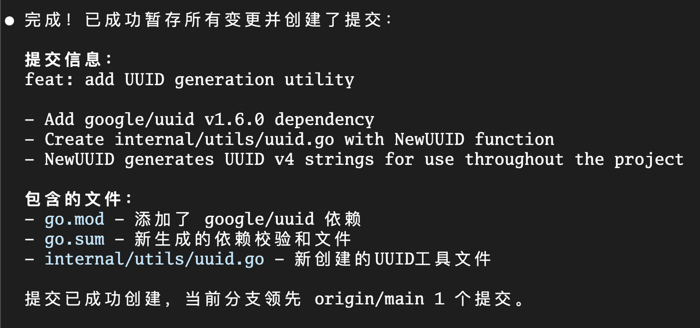

看到了吗?从分析需求, 到修改环境, 再到编写代码, 最后版本控制, 整个流程一气呵成. 你全程扮演的是一个 提出意图、审查决策 的 "架构师" 角色, 而所有具体的、繁琐的 "感知 - 行动" 循环, 都由 AI 高效地完成了.


## 本讲小结

今天, 我们深入学习了所有 Coding Agent 的 "通用语言"—— 以 @ 为代表的 上下文注入 和以 ! 为代表的 Shell 执行 . 这不仅仅是两个命令, 它们共同构成了一套全新的人机协作哲学.


首先, 我们建立了 AI"眼 + 手" 的心智模型:  @ 负责 感知世界,  ! 负责 改造世界. 接着, 我们系统性地学习了 @ 指令的两种主要用法: 引用 单个文件 和引用 整个目录  (及其智能的 Git 感知能力) , 它解决了 AI 的 "失忆症". 然后, 我们深入了 ! 指令的两种核心用法:  手动执行 以快速验证, 以及让 AI 提议并执行 以驱动工作流.

最后, 通过一个完整的实战案例, 我们将 @ 和 ! 组合起来, 体验了一个流畅的 " 感知 - 行动 " 工作流, 初步感受了作为 "AI 工作流指挥家" 是一种怎样的体验.

掌握了 @ 和 ! , 你就拥有了与 AI 进行结构化、高效协作的基础能力. 可以说, 你已经正式踏入了 AI 原生开发的大门. 然而,  @ 指令只能提供 "一次性" 的上下文. 如果有些知识, 比如项目的编码规范、架构原则, 你想让 AI 在整个会话中、甚至在所有未来的会话中都 "永远记住", 该怎么办呢?

这就是我们下一讲要探讨的主题:  上下文的艺术. 我们将深入 CLAUDE.md 和 agents.md, 为你揭示如何为 AI 打造一个持久的、分层的 "长期记忆系统".


## 思考题

今天我们学习了 ! 指令, 可以将命令的输出作为下一轮对话的上下文. 请你设想一个场景: 你如何利用这个特性,  仅通过 ! 指令和自然语言 , 让 AI 帮你找出项目中所有超过 500 行的 Go 文件, 并对其中最大的那个文件进行代码复杂度分析?请描述你的操作步骤.

欢迎在评论区分享你的 "指令链", 看看谁的方案最高效、最优雅! 如果你觉得有所收获, 也欢迎你分享给需要的朋友, 我们下节课再见!

### 感觉并不需要使用 @ 和 !, AI 会自己判断?

区别在于 "准确性" 与 "token 消耗".
自动 grep 是 AI 的一种 "探索" 行为. 当它不知道确切位置时, 会去搜. 但这会消耗额外的步骤和 token, 而且搜出来的可能只是片段, 或者搜到一堆不相关的文件, 容易造成 "上下文污染".

手动 @ 是你作为 "指挥家" 的精准指引. 你直接把确切的、完整的文件喂给它, AI 就不需要瞎猜乱找了, 理解更准, 效率更高. 当你明确知道要改哪个文件时, 一定要用 @.


此外, ! 很少用, 其实是 AI 越来越智能的表现.  当你在 Prompt 里说 "运行测试", AI 确实会自动调用 Bash (go test), 这在本质上和 ! 是一样的.
而! 的价值在于 "主动控制". 比如: 你想在对话中间插一句 "我先看看当前目录有啥", 用 !ls 最快, 不用废话让 AI 去 "决定" 调用工具.
