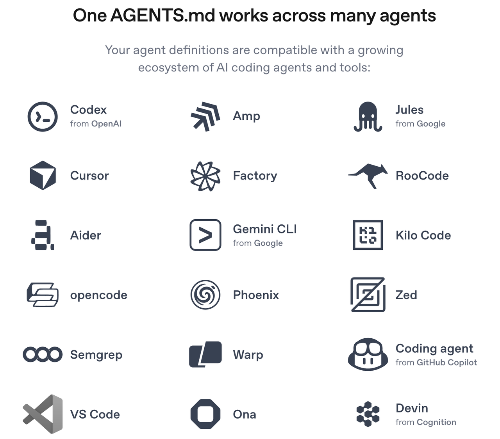
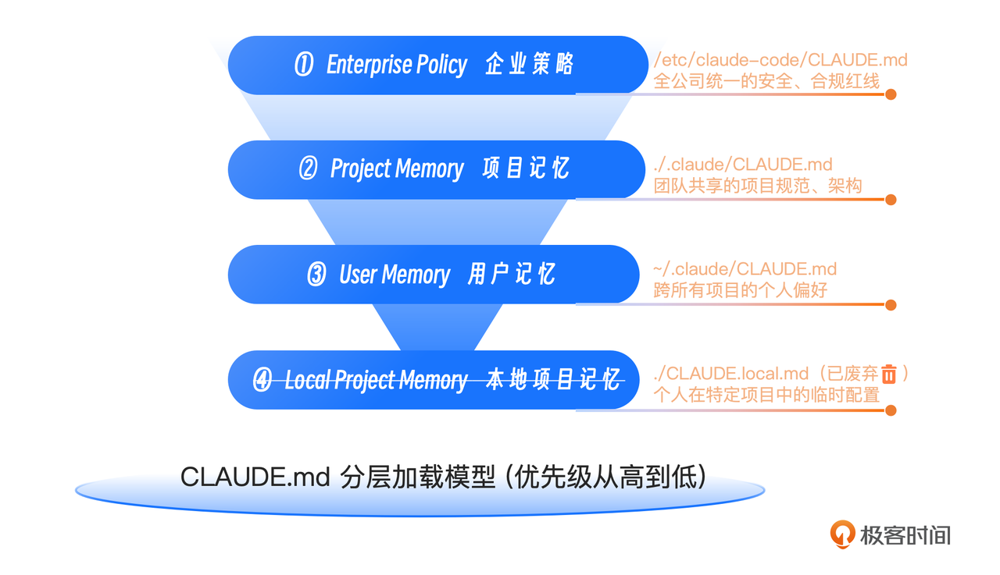
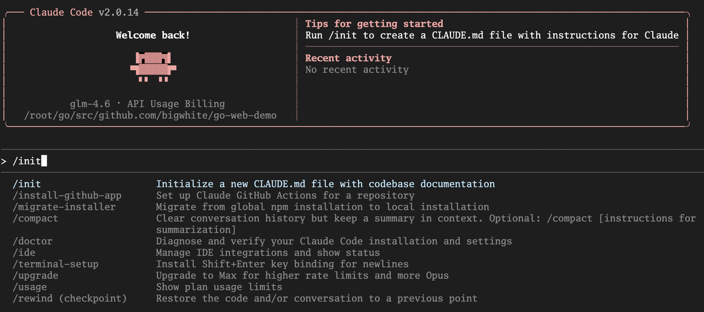
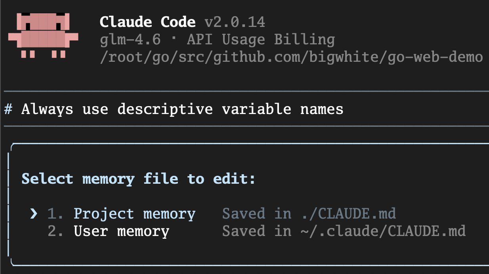
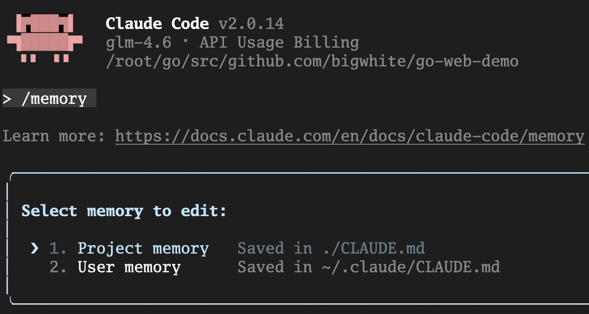
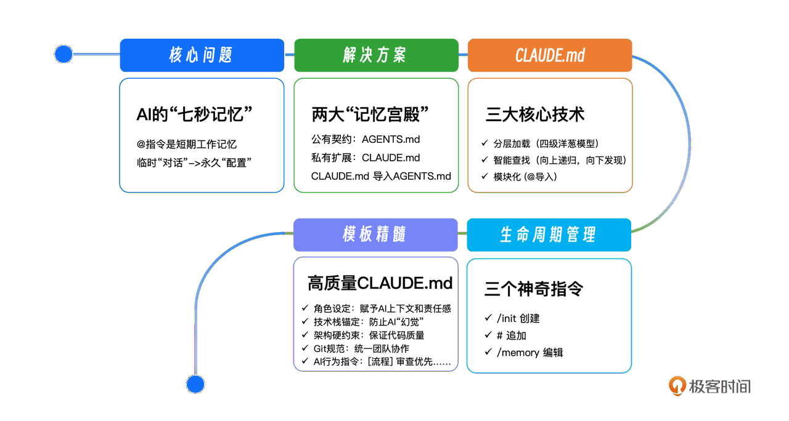

你好, 我是 Tony Bai.

上一讲, 我们精通了 @ 指令, 学会了如何 为 AI 一次性地注入文件或目录的上下文. 这极大地提升了我们解决局部问题的效率. 但很快你就会发现一个新的痛点: 有些 "知识", 你需要 反复、持续地 告诉 AI.

* "请记住, 我们的 Go 项目错误处理必须使用 `errors.Is` 和 `errors.As`. "
* "生成 Commit Message 时, 请务必遵循 Conventional Commits 规范. "
* "别忘了, 我们的 API 响应体必须是 `{ "code": 0, "data": ..., "message": "..." }` 这种格式. "

每次开启一个新的会话, 甚至在同一个会话中讨论不同问题时, 你都可能需要重复这些指令. AI 就像一个只有七秒记忆的 "金鱼", 虽然聪明, 却缺乏 长期记忆 (Long-term Memory) .

今天这一讲, 我们就要 彻底解决 AI 的 "失忆症". 我们将深入一门所有高级 AI Agent 开发者都必须掌握的核心技艺 —— 上下文的艺术. 你将学会如何通过 `CLAUDE.md` 和 `AGENTS.md`, 为你的 AI 伙伴打造一个持久的、分层的、可共享的 "记忆宫殿", 让它从一个过目就忘的通用助手, 进化成一个真正懂你项目的领域专家.

## AI Agent 的 "长期记忆": 为什么我们需要 `CLAUDE.md`?

@ 指令提供的上下文, 我称之为 "短期工作记忆" (Short-term Working Memory) . 它非常适合处理当前任务, 但一旦任务结束或对话切换, 这些记忆就会被 "清空". 而 `CLAUDE.md`  (以及同类的 `AGENTS.md`) 提供的, 则是 "长期记忆" (Long-term Memory) . 它是一种 在会话开始时自动加载、高优先级的背景知识.

我们可以用一个比喻来理解它们的区别:

* `@file.go` 就像你指着一段代码对同事说: "看一下这个". 这段代码是你们当前对话上下文的焦点.
* `CLAUDE.md` 则像是你们团队共享的《团队开发规范手册》. 你的同事入职第一天就读过, 并且已经 内化为自己的工作习惯. 你不需要每次讨论时都提醒他: "记得要写单元测试. "

`CLAUDE.md` 的价值在于, 它将那些 高频、普适、关乎项目核心规范 的指令, 从需要开发者反复输入的 "动态提示", 沉淀为了 AI Agent 会自动遵循的 "静态配置". 这不仅仅是效率的提升, 更是 人机协作模式的规范化和工程化.


## `AGENTS.md`: 从 "项目私约" 到 "行业标准" 的演进

在深入 Claude Code 强大的 `CLAUDE.md` 机制之前, 我们有必要先将视野拉高, 审视一个更宏大、更具前瞻性的行业趋势 —— `AGENTS.md`. 理解它, 能帮助我们更好地定位 `CLAUDE.md` 的角色, 并看清 AI 原生开发的未来演进方向.

### "巴别塔困境": 项目私约的局限性

像 `CLAUDE.md` 这样由特定工具定义的上下文文件, 我称之为 "项目私约" (Project-specific Contract) . 它非常强大, 能够让你与 Claude Code 这一特定的 AI Agent 进行高效协作.

然而, 随着命令行 AI Agent 生态的 "百花齐放", 一个潜在的 "巴别塔困境" 也开始显现:

* Claude Code 有自己的 CLAUDE.md.
* Gemini CLI 有 GEMINI.md.
* CRUSH 有 CRUSH.md.

未来出现的每一个新的 Agent, 都可能带来自己的一套上下文配置文件 (XX.md) .

如果每个项目都需要为不同的 Agent 维护一套不同的 "私约", 那么我们刚刚从 "复制粘贴上下文" 的泥潭中挣扎出来, 又将陷入 "维护多套 AI Agent 配置" 的新泥潭. 这种碎片化, 极大地阻碍了 AI 原生开发方法论的 沉淀和迁移. 我们迫切需要一座能让所有 Agent 都听懂 "通用语" 的 "灯塔".

### `AGENTS.md` 的诞生: 一个面向未来的 "行业标准"

正是在这样的背景下,  `AGENTS.md` 应运而生. 它不再是某一家公司的 "私有协议", 而是由 OpenAI、Google 等多家 AI 巨头和社区共同倡议的一个 开放标准  (下图是截至 2025.10 月份, 支持 `AGENTS.md` 的 Code Agent 不完全列表) .



它的核心理念极其简单而深刻:

> 为 AI Agent 创建一个专属的、标准化的 `README.md` 文件.

我们都知道 `README.md` 是写给人类开发者看的, 它通常包含项目简介、安装步骤和贡献指南. 但这些信息, 对于 AI Agent 来说, 往往过于冗长、不够结构化, 或者缺少 AI Agent 最关心的信息, 比如 "如何运行测试?" "代码风格是什么?".

`AGENTS.md` 的出现, 就是为了解决这个问题. 它建议在你的项目根目录下创建一个名为 `AGENTS.md` 的文件, 专门存放那些写给 AI Agent 看的、结构化的核心指令.

一个典型的 `AGENTS.md` 可能长这样. 让我们以一个 Go Web 服务项目为例:

```markdown
# AGENTS.md for project "go-webapp-demo"

## 1. Development Environment
- **Language**: Go (>= 1.25.0)
- **Primary Framework**: Gin (`github.com/gin-gonic/gin`)
- **Database ORM**: GORM (`gorm.io/gorm`)
- **To run locally**: Use `go run ./cmd/server/main.go`
- **To add a dependency**: Use `go get <package_path>`

## 2. Testing Instructions
- **Run all tests**: Execute `make test` or `go test -v ./...`
- **Run tests for a specific package**: `go test -v ./internal/handlers`
- **Code Coverage**: Generate coverage report with `make coverage`
- **Linting**: Before committing, run `make lint`. This will execute `golangci-lint run`.

## 3. Git & Pull Request (PR) Workflow
- **Commit Message Format**: Strictly follow Conventional Commits. Example: `feat(api): add user registration endpoint`
- **Branching**: All new features must be developed in branches named `feature/<feature-name>`.
- **PR Title**: The PR title must reference the corresponding Jira issue ID. Example: `[PROJ-123] feat(api): Add User Registration`
- **Code Review**: Before requesting a review, ensure all tests pass and the linter is clean.
```

示例解读:

这份为 Go 项目量身定制的 `AGENTS.md`, 精准地向 AI Agent 传达了最高频、最核心的几类信息:

* 环境与启动: AI 一眼就能知道这是个 Go 项目, 用了什么框架, 以及如何把它跑起来.
* 测试与质量: AI 清楚地知道如何验证自己的代码修改 (make test) 和如何保证代码质量 (make lint) .
* 协同规范:  当 AI 被要求生成 Commit Message 或 PR 时, 它会严格遵循我们定义的格式, 确保与团队的工作流保持一致.

可以看到,  `AGENTS.md` 就像一张 "项目说明书", 但它的读者不再是人类, 而是 AI Agent. 它用一种结构化的、无歧义的语言, 为我们接下来的人机协作, 设定了清晰的 "游戏规则".

`AGENTS.md` 的愿景, 正是要 打破 "巴别塔", 成为一个跨 Agent 的 "行业标准". 无论你今天用的是 Claude Code, 明天用的是 Gemini CLI, 还是后天社区推出的新工具, 它们都应该能自动地、优先地去寻找并理解 `AGENTS.md`. 这也与我们专栏的核心思想不谋而合:  学习通用的方法论, 而非特定工具的 "奇技淫巧".


### 如何看待 `CLAUDE.md` 与 `AGENTS.md` 的关系?

那么, 我们应该如何看待 `CLAUDE.md` 与 `AGENTS.md` 的关系?抛弃前者, 拥抱后者吗?

我们必须先明确一个重要的技术事实: 截至目前, Claude Code 并没有在其文档中声明对 `AGENTS.md` 的原生、自动发现支持.  它的核心上下文机制, 依然是 `CLAUDE.md`. 因此, 现阶段的最佳实践, 是 让它们协同工作.


* `AGENTS.md` 作为 "公有契约": 将那些 通用的、不依赖于特定 Agent 功能 的核心指令放在 `AGENTS.md` 中. 例如项目技术栈、构建 / 测试命令、Git 规范等. 这份文件是你希望 任何 一个 AI Agent 都能理解的基础信息.
* CLAUDE.md 作为 "私有扩展": 将那些 依赖于 Claude Code 特有高级功能 的指令放在 `CLAUDE.md` 中. 例如, 定义一个只有 Claude Code 才能理解的 Sub-agent , 或者配置一个 Hook.

然后, 你可以在你的 `CLAUDE.md` 中, 通过 @ 导入语法, 将 `AGENTS.md` 的内容包含进来:

`./.claude/CLAUDE.md`:

```markdown
# 导入通用的 AI Agent 协作标准
@../AGENTS.md

# --- 以下是 Claude Code 专属的高级指令 ---

## Sub-agent 定义
- 当需要进行安全审查时, 请调用 `security-reviewer` sub-agent. 

## Hooks 配置
- 在每次代码编辑后, 自动运行 `gofmt`. 
```

通过这种方式, 你既拥抱了面向未来的行业标准, 又充分利用了当前最强大工具的专属能力, 达到了完美的平衡.

理解了 `AGENTS.md` 所代表的 "行业标准" 演进方向, 我们再回过头来看 `CLAUDE.md`, 就不仅仅是在学习一个配置文件的语法, 而是在学习如何构建一套 健壮、可迁移、面向未来 的 AI 协作上下文体系.

现在, 让我们深入 Claude Code 强大的 `CLAUDE.md` 机制, 看看这个目前最成熟的 "项目私约" 是如何通过分层加载和导入语法, 来构建起复杂的 "记忆宫殿" 的.

## 深入 `CLAUDE.md`: 强大的分层加载机制与 @ 导入语法

现在, 让我们回到 Claude Code 的世界, 深入探索其强大的 `CLAUDE.md` 机制. 它之所以强大, 并不仅仅是因为它是一个自动加载的文件, 更在于其精巧的分层加载机制和模块化的 @ 导入语法.

### 四级分层加载: 从 "公司规定" 到 "个人习惯"

当你启动 Claude Code 时, 它会像剥洋葱一样, 从外到内, 依次加载四个不同层级的 `CLAUDE.md` 文件, 并将它们的内容拼接在一起, 形成最终的 "长期记忆".



上图以 Linux 路径为例, Windows 和 macOS 的 Enterprise Policy 路径有所不同

这个加载顺序非常重要, 它意味着:

1. 企业级的安全合规策略 拥有最高优先级, 任何项目或个人都无法覆盖.
2. 团队共享的项目规范 是第二优先级, 它为整个团队的协作设定了基线.
3. 你个人的全局偏好 是第三优先级, 它允许你在不违反团队规范的前提下, 加入自己的习惯, 并且该偏好对个人用户下的所有项目均有效.
4. CLAUDE.local.md 已经废弃, 我们就不着墨了.

### `CLAUDE.md` 的查找机制: 强大的递归与动态加载

除了我们刚才提到的从 "企业" 到 "用户" 的四级分层加载模型, Claude Code 在查找和应用项目内的 `CLAUDE.md` 时, 还有两个更为精妙和强大的机制: 递归向上查找和动态向下发现, 下面我们来逐一拆解.

#### 递归向上查找

当你启动 Claude Code 时, 它会从你当前所在的目录 ( cwd ) 开始,  一路向上递归 , 直到项目的根目录 (通常是 `.git` 所在的目录) 或者你的用户主目录. 在这个过程中, 它会 加载并拼接 沿途遇到的所有 `CLAUDE.md` 文件.

这个机制在大型 monorepo 项目中尤其强大. 它允许你构建一个 "级联上下文" 模型:

* 在项目根目录定义全局的、适用于所有子项目的规范.
* 在每个微服务或子包的目录中, 定义该模块特有的、更具体的规范.

#### 动态向下发现

更有趣的是, Claude Code 还会动态地发现你当前工作目录下方子目录中的 `CLAUDE.md` 文件. 但与向上查找不同, 这些 "子上下文" 并不会在启动时全部加载. 它们只有在 AI Agent 通过 @ 指令或 Read 工具, 实际去读取那个子目录下的文件时, 才会被动态地加载进来.

这个设计非常巧妙, 它实现了 "按需加载上下文 (Context on Demand) ", 既保证了相关性, 又避免了在启动时就加载整个庞大项目的无关上下文, 极大地节省了 Token 并提高了 AI Agent 的专注度.

#### 实战示例: 一个 monorepo 项目的上下文级联

让我们通过一个具体的 monorepo 项目结构, 来看看这个查找机制是如何工作的.

项目目录结构:

```plain
/my-monorepo
├── .git
├── .claude/
│   └── CLAUDE.md         # (A) 项目根上下文
├── services/
│   ├── user-service/
│   │   ├── .claude/
│   │   │   └── CLAUDE.md     # (B) user-service 微服务上下文
│   │   ├── main.go
│   │   └── internal/
│   │       └── db.go
│   └── order-service/
│       ├── .claude/
│       │   └── CLAUDE.md     # (C) order-service 微服务上下文
│       └── main.go
└── libs/
    └── shared-utils/
        └── string.go
```

各个 `CLAUDE.md` 文件的内容:

(A)  `/my-monorepo/.claude/CLAUDE.md`  (项目根上下文) :

```plain
* 所有Go代码必须使用Go 1.24. 
* 所有微服务必须使用uber-go/zap进行结构化日志记录.  
```

(B)  `/my-monorepo/services/user-service/.claude/CLAUDE.md`   (user-service 上下文) :

```plain
* 本服务处理用户认证与信息, 数据模型定义在 `internal/models`. 
* 密码处理必须使用 `bcrypt` 库. 
```

(C) `/my-monorepo/services/order-service/.claude/CLAUDE.md`   (order-service 上下文) :

```plain
* 本服务处理订单逻辑, 与 `user-service` 通过 RPC 通信. 
* 订单 ID 必须使用 ULID 格式. 
```

### 场景分析

#### 场景一: 在 user-service 目录下工作

1. 你 `cd /my-monorepo/services/user-service`.
2. 你启动 claude.
3. 此时, Claude Code 会向上递归查找, 自动加载并合并 (A) 和 (B) 两个上下文文件.  AI Agent 从一开始就知道全局规范和 user-service 的专属规范.

#### 场景二: 在项目根目录下, 分析 order-service 的文件

1. 你 `cd /my-monorepo`.
2. 你启动 claude.
3. 此时, Claude Code 只加载了 (A) 项目根上下文.
4. 然后, 你向 AI 发出指令:  > @services/order-service/main.go "分析这个文件的逻辑".
5. 就在 AI Agent 读取 `main.go` 的这一刻, 它会动态地发现并加载 (C) order-service 的专属上下文. 于是, AI Agent 在分析 `main.go` 时, 会同时知道全局规范和 order-service 的专属规范 (比如订单 ID 必须是 ULID) .

通过这个精巧的 "向上预加载、向下动态加载" 的组合, Claude Code 在提供全面上下文和保持高效率之间, 找到了一个完美的平衡点. 作为开发者, 我们只需要将上下文信息, 放置在离它最相关的位置即可, 剩下的交给 AI Agent 去智能发现.

### @ 导入语法: 模块化你的 "记忆宫殿"

随着项目变得复杂, 将所有指令都塞进一个巨大的 `CLAUDE.md` 文件会变得难以维护. 为此, Claude Code 提供了 @ 导入语法, 让你能够像写代码一样, 模块化地组织你的上下文.

```plain
语法: @/path/to/another/file.md
```

你可以用 @ 符号, 在 `CLAUDE.md` 中导入任何其他文件的内容. 路径可以是相对路径, 也可以是绝对路径.

### 实战场景 1: 分离团队规范与个人偏好

在团队项目中, 最佳实践是将团队共识的规范放在项目级的 `./.claude/CLAUDE.md` 中, 然后每个人在这个文件中, 导入自己的私人配置文件.

`./.claude/CLAUDE.md` (提交到 Git 仓库)

```markdown
# --- 团队共享规范 ---
- Go版本必须为 1.25+
- 所有错误处理必须使用 `github.com/pkg/errors`
...

# --- 个人偏好导入区 ---
# 每个团队成员可以将自己的个人配置文件放在这里
# 这个导入路径会被git忽略, 但会被Claude Code加载
@~/.claude/personal-preferences.md
```

`~/.claude/personal-preferences.md` (你自己的私人文件)

```plain
# --- 个人偏好 ---
- 在生成代码时, 请优先使用函数式编程风格. 
- 在解释代码时, 请多用比喻. 
```

通过这种方式, 团队既保证了协作的一致性, 又为个人保留了定制的空间. 这也是对已废弃的 `CLAUDE.local.md` 的完美替代.

### 实战场景 2: 组合多个上下文文件

你可以利用 @ 导入语法, 将多个不同维度的上下文组合起来.

`~/.claude/CLAUDE.md` (你的全局配置文件)

```python
# --- 我的通用开发指令 ---

# 导入我的 Go 语言专属开发规范
@~/.claude/contexts/golang-style.md

# 导入我的 Git 工作流规范
@~/.claude/contexts/git-workflow.md

# 导入我的通用写作风格
@~/.claude/contexts/writing-style.md
```

通过这种方式, 你可以构建一个可复用的、模块化的 "记忆库", 在不同的项目中按需组合.

## `CLAUDE.md` 的生命周期管理: 从创建到维护

理论已经清晰, 但在繁忙的日常开发中,  `CLAUDE.md` 文件的创建、追加和修改, 需要一套足够便捷的工具才能真正落地. 为此, Claude Code 提供了一套完整的生命周期管理指令:  `/init` 用于 创建 ,  `#` 用于 追加 ,  `/memory` 用于 修改.

### `/init` 指令: 从 0 到 1, 创建你的第一份上下文蓝图

当你为一个全新的项目, 或者一个还没有 `CLAUDE.md` 文件的旧项目设置上下文时, 直接创建一个空文件可能会让你不知从何下手.

此时,  /init 指令就派上了用场. 它是一个强大的脚手架 (Scaffolding) 或引导 (Bootstrap) 工具. 只需在项目根目录下运行 Claude Code, 并执行 /init 指令:



Claude Code 会立即分析你的项目情况, 并为你 生成一份包含标准结构和最佳实践建议的 `CLAUDE.md` 模板文件 , 我们以一个名为 go-web-demo 的 Go 空项目为例, 当在 Claude Code 中执行 /init 后, 它的执行过程如下:

```sql
> /init is analyzing your codebase… 

● Search(pattern: "*")
  ⎿  Found 1 file (ctrl+o to expand)

● Read(CLAUDE.md)
  ⎿  Error reading file

● Read(README.md)
  ⎿  Error reading file

● Read(go.mod)
  ⎿  Read 4 lines

● Search(pattern: "**/*.go")
  ⎿  Found 0 files 

● Search(pattern: "**/*.md")
  ⎿  Found 0 files 

● Search(pattern: "Makefile")
  ⎿  Found 0 files 

● Search(pattern: "**/*.json")
  ⎿  Found 0 files 

● Search(pattern: "**/*.yaml")
  ⎿  Found 0 files 

● Search(pattern: "**/*.yml")
  ⎿  Found 0 files 

● Bash(find /root/go/src/github.com/bigwhite/go-web-demo -type f -name "*.go" -o -name "*.md" -o -name "Makefile" -o -name
      "*.json" -o -name "*.yaml" -o -name "*.yml"…)
  ⎿  (No content)

● Bash(ls -la /root/go/src/github.com/bigwhite/go-web-demo/)
  ⎿  total 12                                      
     drwxr-xr-x  2 root root 4096 Oct 14 08:02 .
     drwxr-xr-x 11 root root 4096 Oct 14 08:02 ..
     -rw-r--r--  1 root root   30 Oct 14 08:02 go.mod

● Write(CLAUDE.md)
  ⎿  Wrote 38 lines to CLAUDE.md                                                                                           
     # CLAUDE.md
     This file provides guidance to Claude Code (claude.ai/code) when working with code in this repository.
     ## Project Overview
     This is a minimal Go web application project (`go-web-demo`) that appears to be in its initial setup phase. The project
     currently contains only a `go.mod` file with Go version 1.25.0.
     ## Development Commands
     … +28 lines (ctrl+o to expand)

● I've analyzed the codebase and created a CLAUDE.md file. This is a minimal Go web application project in its initial setup
  phase, containing only a go.mod file with Go version 1.25.0. The documentation includes standard Go development commands and
   outlines a typical project structure for a web application that would likely be developed here.
```

我们看到, Claude Code 会尝试扫描该项目下的一些文件, 由于这是一个空项目, 它没能获取更多信息, 只是从 go.mod 中获取到这是一个 Go Web 项目, 以及使用的 go version. 这种情况下, 它生成的 CLAUDE.md 可能是像下面这样的:

```markdown
! cat CLAUDE.md 
  ⎿ # CLAUDE.md

    This file provides guidance to Claude Code (claude.ai/code) when working with code in this repository.

    ## Project Overview

    This is a minimal Go web application project (`go-web-demo`) that appears to be in its initial setup phase. The project
    currently contains only a `go.mod` file with Go version 1.25.0.

    ## Development Commands

    Since this is a minimal Go project, these are the standard commands you'll likely need:

    # Initialize and build the project
    go mod tidy    # Download and manage dependencies
    go build       # Build the application
    go run .       # Run the application directly
    go test ./...  # Run all tests
    go vet ./...   # Run static analysis
    go fmt ./...   # Format all Go files

    ## Project Structure

    The project is currently minimal with only the `go.mod` file present. As development progresses, a typical Go web application
    structure would likely include:

    - `main.go` - Application entry point
    - `handler/` or `server/` - HTTP handlers
    - `middleware/` - HTTP middleware functions
    - `models/` - Data structures and models
    - `config/` - Configuration management
    - `static/` - Static files (CSS, JS, images)
    - `templates/` - HTML templates
    - `utils/` - Utility functions

    ## Dependencies

    The project currently has no external dependencies beyond the Go standard library. The `go.mod` file specifies Go version 1.25.0.
```

如果是一个存量项目, Claude Code 会扫描到更多已知信息, 也会生成更符合项目实际情况的 CLAUDE.md. 以我的 bigwhite / issue2md 为例, 通过 /init 生成的 CLAUDE.md 内容如下:

```markdown
# CLAUDE.md

This file provides guidance to Claude Code (claude.ai/code) when working with code in this repository.

## Project Overview

`issue2md` is a Go application that converts GitHub issues, discussions, or pull requests into Markdown format. It operates in two modes:
- **CLI mode**: Command-line tool for direct conversion
- **Web mode**: HTTP server providing a web interface for conversion

## Architecture

The project follows a clean architecture with clear separation of concerns:

### Core Components

- **`cmd/issue2md/`**: CLI entry point handling command-line flags and orchestration
- **`main.go`**: Web server entry point that starts HTTP server and routes requests
- **`internal/github/`**: GitHub API client for fetching issues, PRs, discussions, comments, and reactions
- **`internal/converter/`**: Converts GitHub data structures into formatted Markdown
- **`web/handlers/`**: HTTP request handlers for the web interface
- **`internal/utils/`**: Utility functions (currently UUID generation)

### Key Data Flow

1. **URL Parsing**: GitHub URLs are parsed to extract owner, repo, item number, and type
2. **Data Fetching**: GitHub API is used to fetch content and optionally reactions
3. **Conversion**: Fetched data is converted to Markdown using the converter package
4. **Output**: Result is either printed to stdout (CLI) or served as download (web)

### GitHub API Integration

- Uses GitHub REST API v3 for issues and pull requests
- Uses GitHub GraphQL API v4 for discussions (requires specific API version headers)
- Supports optional GitHub token via `GITHUB_TOKEN` environment variable
- Handles pagination for comments and discussions
- Fetches reactions when enabled (requires special API preview headers)

## Development Commands

### Building

# Build CLI tool
make cmdline

# Build web server
make web

# Build both
make all

# Clean build artifacts
make clean

### Running

# Run CLI tool
./issue2md [flags] <github-url> [output-file]

# Run web server
./issue2mdweb
# Default: http://0.0.0.0:8080
# Flags: -ip (default 0.0.0.0), -port (default 8080)

### Docker

# Build Docker image
make buildimage

# Run container
docker run -d -p 8080:8080 bigwhite/issue2mdweb

### Dependencies

# Download/update dependencies
go mod tidy

# Install CLI tool from source
go install github.com/bigwhite/issue2md/cmd/issue2md@latest

## Environment Variables

- **`GITHUB_TOKEN`**: Optional GitHub personal access token for higher API rate limits and private repositories

## Key Implementation Details

### URL Support

The application supports these GitHub URL formats:
- Issues: `https://github.com/{owner}/{repo}/issues/{number}`
- Pull Requests: `https://github.com/{owner}/{repo}/pull/{number}`
- Discussions: `https://github.com/{owner}/{repo}/discussions/{number}`

### Conversion Features

- Converts issues, PRs, and discussions to structured Markdown
- Optionally includes GitHub reactions (thumbs up, heart, etc.)
- Optionally includes user profile links in comments
- Preserves original formatting and links
- Includes metadata (number, URL, author) in output

### Error Handling

- Validates URL format before API calls
- Handles GitHub API rate limits and authentication errors
- Provides clear error messages for unsupported URL types
- Graceful handling of missing content or API failures

### Web Interface

- Simple HTML form for URL input with checkboxes for optional features
- Serves Markdown files as downloads with descriptive filenames
- Static file serving for CSS/JS assets
- Template-based HTML rendering
```

/init  的哲学, 是 "最佳实践引导".  它确保了你创建第一份上下文文件, 就拥有一个专业、合理的结构, 避免了后续的重构成本.

### # 快捷方式: 即时捕捉 "灵光一闪", 从 1 到 N

随着项目的进行, 你会不断有新的规范和知识想要沉淀下来. 例如, 在与 AI Agent 的对话中, 你突然意识到一个重要的团队规范: "所有导出函数的 GoDoc 注释必须以函数名开头". 你当然可以等到对话结束再去更新 `CLAUDE.md`, 但那时灵感可能已经消失了. 此时,  # 快捷方式提供了最佳解决方案.

你只需在 Claude Code 的输入行, 以 # 开头, 直接写下你想永久记住的这条规则. 按下回车后, Claude Code 不会将这句话作为普通的提示发送给 AI Agent, 而是会立即弹出一个交互式菜单, 让你选择 要将这条 "记忆" 存放到哪个 `CLAUDE.md` 文件中:



你只需用箭头选择 Project Memory , 按下回车, 这条规则就会被自动地、永久地 追加 到你选择的 `CLAUDE.md` 文件中了.

\#  指令的哲学, 是 "即时追加".  它让你能够在灵感迸发的瞬间, 以最低的成本, 将动态的、临时的思考, 快速沉淀为静态的、持久的团队知识.

### /memory 指令: 系统性地 "整理书架", 从 N 到 N + 1

如果说 /init 负责创建,  # 负责追加零散内容, 那么 /memory 指令则负责对 `CLAUDE.md` 进行 系统性的、复杂的编辑和重构.

当你发现需要调整结构、删除过时规则, 或者重构整个文件时, 只需在会话中输入:

/memory

Claude Code 会给出一个 CLAUDE.md 文件列表, 并让你选择要编辑的 CLAUDE.md.



一旦选择, Claude Code 会立即 在你系统默认的文本编辑器  (由 $EDITOR 环境变量决定) 中, 打开该 `CLAUDE.md` 文件, 并等待你的编辑和调整.

这个指令的强大之处在于:

1. 一步到位:  你无需手动 cd 到各个目录去寻找配置文件,  /memory 会自动帮你定位并打开所有相关的 CLAUDE.md.
2. 沉浸式编辑:  你可以在自己最熟悉的、功能最强大的编辑器中, 对上下文进行任意复杂的修改.
3. 即时生效:  当你保存并关闭编辑器后, Claude Code 会 自动重新加载 这些文件, 确保你的修改在下一次交互中立即生效.

/memory  指令的哲学, 是 "系统性维护".  它为你提供了一个定期 "打扫书房、整理书架" 的便捷入口, 确保你的 "长期记忆" 系统始终保持清晰、准确和高效.

掌握了 /init 、 # 和 /memory 这套组合拳,  `CLAUDE.md` 的整个生命周期管理就从一项需要刻意为之的 "配置工作", 变成了融入日常开发对话中的一个自然环节. 现在, 让我们带着这套强大的维护工具, 一起看看如何从零开始, 构建一份高质量的 CLAUDE.md 文件.

## 实战: 打造一份高质量的通用 Go 项目 `CLAUDE.md` 模板

现在, 我们已经学习了如何通过 /init 、 # 和 /memory 等指令, 来管理 CLAUDE.md 文件的生命周期.  /init 为我们生成了一个基础的结构, 但这仅仅是一个起点.

一份真正高质量的 CLAUDE.md , 应该是一份凝结了团队共识、项目技术栈特点和 AI Agent 协作最佳实践的 "活文档". 在这一节, 我将为你展示一份我精心设计的、适用于 绝大多数现代 Go 项目 的 CLAUDE.md 参考模板, 并逐一剖析其中每一条指令背后的 "为什么", 让你学会如何为你自己的项目量身定制.

### Go 项目 CLAUDE.md 参考模板

```markdown
# [项目名] Go项目AI Agent协作指南

你是一位精通Go语言的资深软件工程师, 熟悉云原生开发与软件工程最佳实践. 你的任务是协助我, 以高质量、可维护的方式完成本项目的开发. 

---

## 1. 技术栈与环境 (Tech Stack & Environment)

- **语言**: Go (>= 1.25)
- **Web框架/HTTP库**: [例如: Gin, Chi, net/http]
- **数据库/ORM**: [例如: GORM, sqlx, pgx]
- **构建/测试/质量**:
  - **构建**: 标准 `go build` 或 `Makefile`
  - **测试**: 标准 `go test`
  - **代码规范**: `gofmt`, `goimports`
  - **静态检查**: `golangci-lint` (配置文件为 `.golangci.yml`)

---

## 2. 架构与代码规范 (Architecture & Code Style)

- **项目结构**: 严格遵循标准的Go项目布局 (https://go.dev/doc/modules/layout). 核心业务逻辑必须放在`internal/`目录下. 
- **错误处理**: **[强制]** 所有错误返回必须使用 `fmt.Errorf("...: %w", err)` 的方式进行错误包装(wrapping), 以保留上下文和调用栈. 绝不允许直接 `return err`. 
- **日志**: **[强制]** 必须使用标准库 `log/slog` 进行结构化日志记录. 日志信息中必须包含关键的上下文信息 (如`userID`, `traceID`) . 
- **接口设计**: 遵循Go语言的接口设计哲学——"接口应该由消费者定义". 优先定义小的、单一职责的接口. 

---

## 3. Git与版本控制 (Git & Version Control)

- **Commit Message规范**: **[严格遵循]** Conventional Commits 规范 (https://www.conventionalcommits.org/). 
  - 格式: `<type>(<scope>): <subject>`
  - 当被要求生成commit message时, 必须遵循此格式. 

---

## 4. AI协作指令 (AI Collaboration Directives)

- **[原则] 优先标准库**: 在有合理的标准库解决方案时, 优先使用标准库, 而不是引入新的第三方依赖. 
- **[流程] 审查优先**: 当被要求实现一个新功能时, 你的第一步应该是先用`@`指令阅读相关代码, 理解现有逻辑, 然后以列表形式提出你的实现计划, 待我确认后再开始编码. 
- **[实践] 表格驱动测试**: 当被要求编写测试时, 你必须优先编写**表格驱动测试 (Table-Driven Tests) **, 这是本项目推崇的测试风格. 
- **[实践] 并发安全**: 当你的代码中涉及到并发 (goroutines, channels) 时, **必须**明确指出潜在的竞态条件风险, 并解释你所使用的并发安全措施 (如mutex, channel) . 
- **[产出] 解释代码**: 在生成任何复杂的代码片段后, 请用注释或在对话中, 简要解释其核心逻辑和设计思想. 

---
## 5. 个人偏好导入区 (Personal Imports)
# @~/.claude/my-personal-go-prefs.md
```

### 模板剖析: 每一条指令背后的 "为什么"

一份好的 CLAUDE.md 绝不是简单的规则罗列. 它的每一部分, 都在解决人机协作中的一个具体痛点.

#### 核心使命与角色设定

* 内容:  你是一位精通 Go 语言的资深软件工程师...
* 为什么? 这是在为 AI 进行 角色扮演 (Role-Playing) 设定. 它比一句冷冰冰的 "开始工作吧" 要有效得多. 告诉 AI 它是一个 "资深工程师", 会隐式地引导它在给出建议时, 更多地考虑代码的可维护性、扩展性和最佳实践, 而不仅仅是 "能跑就行".

#### 技术栈与环境

* 内容:  语言: Go (>= 1.25) , Web 框架: Gin …
* 为什么? 这是在 锚定 AI 的知识范围, 防止 "幻觉". 明确了技术栈, AI 就不会在你询问 Gin 框架的问题时, 给出一段 Echo 框架的代码. 明确了构建和测试命令, AI 在后续提议行动时, 就会使用 make test 而不是它自己 "猜" 的 go test ./... , 确保了与项目实践的一致性.

#### 架构与代码规范

* 内容:  项目结构: ... , 错误处理: ... , 日志: ...
* 为什么? 这是整个模板中 确保代码一致性和质量 的最核心部分. 尤其是那些用 \[强制] 标记的规则, 是在为 AI 的行为设定不可逾越的 "硬约束".

  * 错误处理规则: 它能杜绝 AI 生成 if err != nil { return err } 这种丢失上下文的坏代码.
  * 日志规则: 它能确保 AI 生成的日志代码, 都符合团队的结构化日志标准, 便于后续的日志聚合与分析.
  * 项目结构规则: 它能让 AI 在创建新文件或模块时, 自觉地将它们放置在正确的位置.

#### Git 与版本控制

* 内容:  Commit Message 规范: ...
* 为什么? 这是在 统一团队的协作语言. 当 AI Agent 为你自动生成 Commit Message 时, 这条规则能确保它的产出与你手动编写的风格完全一致, 让你的 Git 历史看起来整洁、专业, 并且可以被 CI/CD 工具 (如 semantic-release) 自动解析.

#### AI 协作指令

* 内容:  \[原则] 优先标准库 , \[流程] 审查优先 , \[实践] 表格驱动测试 …
* 为什么? 这是最高级的用法, 也是 CLAUDE.md 与普通文档的本质区别. 你不再是简单地 "告知" AI 知识, 而是在 "编程" AI 的行为模式和工作流程.

  * \[流程] 审查优先: 这条指令定义了 AI 在面对 "实现功能" 这类复杂任务时的 标准操作程序 (SOP)  , 强制它先规划、后行动, 极大地提高了最终产出的可控性.
  * \[实践] 表格驱动测试: 这条指令将团队的技术品味 (preference) 固化成了 AI 必须遵循的实践.
  * \[实践] 并发安全: 这条指令利用了 AI 强大的知识库, 强制它在处理 Go 语言最复杂、最容易出错的并发问题时, 进行额外的风险提示和解释, 相当于为你聘请了一位全天候的并发专家.

通过这份 "参考模板" 及其剖析, 我希望你不仅能知道 CLAUDE.md 该写什么, 还能更进一步地理解每一条指令背后的工程价值. 现在, 你可以将这份模板作为起点, 根据你自己项目的具体情况, 删减、修改、扩展, 打造出属于你和你的团队的, 那份独一无二的 AI Agent 协作 "宪章".

## 本讲小结



今天, 我们一起深入探索了 AI 原生开发中至关重要的 "上下文的艺术". 我们解决了 AI 的 "失忆症", 学会了如何为它构建一个持久的、智能的 "记忆宫殿".

首先, 我们探讨了 长期记忆 的重要性, 并了解了 AGENTS.md 作为未来 跨 Agent 通用标准 的行业趋势. 这为我们建立了一套面向未来的上下文管理世界观.

接着, 我们深入剖析了 Claude Code 独有的 CLAUDE.md  分层加载机制 和 @  导入语法 , 并学习了如何通过 /init 、 # 、 /memory 这套组合拳, 对 CLAUDE.md 进行完整的生命周期管理.

最后, 也是最重要的一点, 我们不再局限于一个具体项目, 而是共同打磨出了一份 高质量的、可复用的通用 Go 项目 CLAUDE.md 参考模板. 通过对其逐条剖析, 我们理解了如何将团队的 技术栈、架构规范、协作流程乃至技术品味 , 转化为 AI Agent 可以精确理解和执行的 "硬约束" 和 "行为模式".

请务必花时间为你自己的项目也创建或重构一份 CLAUDE.md. 这可能是你在整个专栏学习中, 投入产出比最高的一项实践. 一份精心编写的上下文文件, 其价值远超一个配置文件, 它本质上是你 团队工程文化的 "代码化" 沉淀 , 能让你的 AI 协作效率瞬间提升数倍.

## 思考题

今天我们打造了一份通用的 Go 项目模板. 现在, 请你扮演你所在团队的 "AI 工作流架构师" , 思考一下:

在你当前的团队或项目中,  有哪些不成文的、靠口口相传或 Code Review 时反复提醒的 "最佳实践" 或 "神秘规则"?

请你尝试 至少找出三条 , 并将它们 "翻译" 成可以写入 CLAUDE.md 的、精确的、无歧义的指令.

例如:

* (不成文的规则) "我们项目中, 处理用户 ID 时要特别小心, 不能直接暴露数据库的自增 ID. "
* (翻译后的指令)  "\[安全红线] 当处理与用户 ID 相关的逻辑时, 对外暴露的 ID 必须是经过加密或混淆的 UUID, 绝不能使用数据库的自增 ID 作为 API 的响应或 URL 参数. "

欢迎在评论区分享你 "翻译" 出的团队规则. 这个练习将帮助你迈出将团队隐性知识显性化、工程化的关键一步.

`<span style="color: rgb(143,149,158); background-color: inherit">`CLAUDE.md 不放具体业务逻辑, 业务逻辑太重、太易变. 放进去既费 Token, 又容易过时, 导致 AI 学习了错误的旧逻辑.
`<span style="color: rgb(143,149,158); background-color: inherit">`claude.md 可以放 "怎么获取业务知识" 的方法. 比如: "项目业务文档在 docs/business/, 代码核心逻辑在 internal/core/, 你需要理解业务时, 请优先阅读这些目录. "
