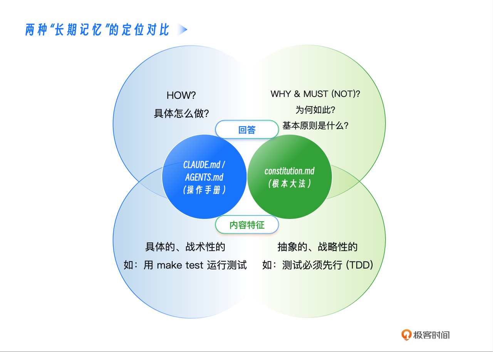
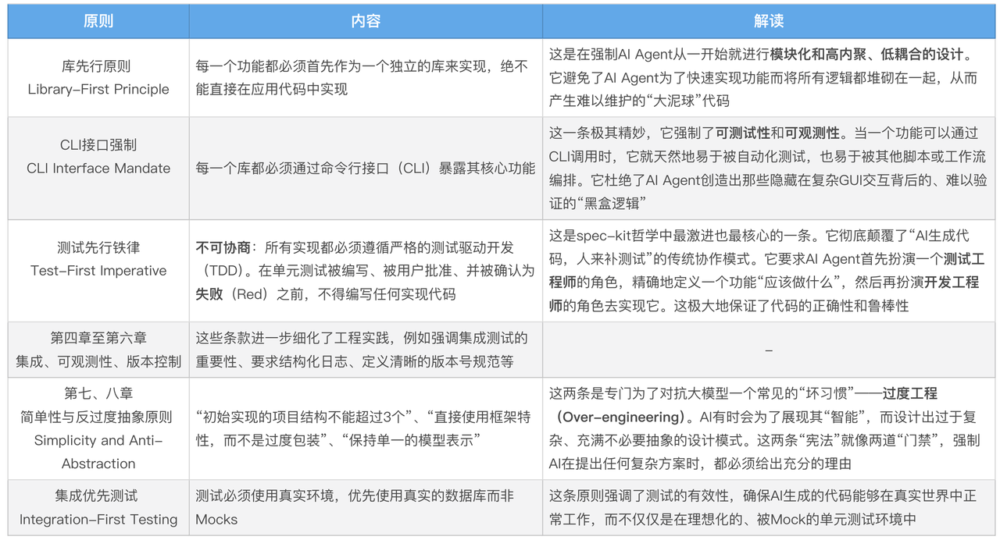

你好，我是 Tony Bai。

在上一讲，我们一起为我们的 Go 项目精心编写了一份 CLAUDE.md 参考模板文件。这份文件就像一本详尽的 “团队工作手册”，它告诉了 AI Agent 关于项目的技术栈、构建命令、代码风格、Git 工作流等所有操作性的细节。

学完之后，你可能会觉得，我们的 AI 伙伴已经足够 “懂行” 了。它知道该用什么命令去测试，知道该用什么格式去提交代码。但是，一些新的、更深层次的问题浮现了：

* 当面对一个需求，AI Agent 提出了两种技术方案 —— 一个简单直接但可能留下技术债，另一个结构优雅但实现复杂， 它应该如何抉择？

* 当为了快速实现功能，AI Agent 想要引入一个新的、我们团队从未用过的第三方库时， 它应该被允许吗？

* 当 AI Agent 生成的代码虽然通过了所有测试，但其设计模式却与我们项目长期坚持的 “保持简单、避免过度抽象” 的哲学相悖时， 我们该如何约束它？


这些问题，已经超出了 “工作手册” 能够回答的范畴。它们不关乎 “如何做”，而关乎 “应该怎样做” 和 “绝不能怎样做”。 它们触及了一个项目的核心价值观和架构哲学。

今天这一讲，我们将完成 “上下文的艺术” 的最后一块拼图。我们将从 “术” 的层面，上升到 “道” 的层面，学习如何为我们的 AI Agent 和项目，注入一个不可动摇的 “灵魂”—— 那就是源自 spec-kit 前沿思想的 `constitution.md`，即 项目 “宪法”。


## 从 “工作手册” 到 “根本大法”：两种上下文的定位差异

在深入 constitution.md 的具体内容之前，我们必须首先清晰地辨析它与我们在上一讲学习的 CLAUDE.md / AGENTS.md 之间的根本区别。

<span style="color: inherit; background-color: rgba(254,212,164,0.8)">如果说 CLAUDE.md 是交给 </span><span style="color: inherit; background-color: rgba(254,212,164,0.8)">AI Agent</span><span style="color: inherit; background-color: rgba(254,212,164,0.8)"> 的 “操作指南”，那么 constitution.md 就是我们与 AI Agent 共同签署的 “原则契约”。</span>



它们的差异体现在三个核心维度：

* 一是 抽象层级不同

  * CLAUDE.md 是 低层级的、具体的。它直接告诉 AI Agent “运行这个命令”“遵循这个格式”。&#x20;

  * constitution.md 是 高层级的、抽象的。它不关心具体的命令，而是定义了 “测试必须先于代码”“保持简单，避免不必要的抽象” 等根本性原则。

* 二是 强制力不同

  * CLAUDE.md 是 指导性的。AI Agent 会参考它来完成任务，但在某些情况下可能会有变通。&#x20;

  * constitution.md 具有 绝对的否决权。任何与 “宪法” 中 “NON - NEGOTIABLE”（不可协商）条款相冲突的计划或实现，都应被视为 “违宪” 而被驳回。AI Agent 在进行技术规划时，必须首先对照 “宪法” 进行自检。

* 三是 可变性不同

  * CLAUDE.md 是 相对易变的。随着我们引入新的工具、升级依赖，这份 “操作手册” 会经常更新。&#x20;

  * constitution.md 是 高度稳定的。它代表了项目的核心技术哲学，除非项目发生重大的战略转向，否则不应轻易修改。

理解了这种 “宪法 > 指南” 的层级关系，你就能明白，一份好的 constitution.md，是 AI Agent 在面对复杂决策时的北极星，是确保 AI Agent 所有创造性工作始终与项目长期利益保持一致的压舱石。


## 解读 “开发九章”：深入 spec-kit 的架构哲学

constitution.md 这个概念，最早由 GitHub 的 spec-kit 项目提出并系统化。它并非一份随意的文档，而<span style="color: inherit; background-color: rgba(254,212,164,0.8)">是一套经过深思熟虑的、旨在约束 AI Agent 行为、确保工程质量的 架构哲学</span>。 spec-kit 的 规范驱动开发说明 中，这份 “宪法” 被分为了九条核心 “法案” 来举例说明。虽然我们不必全盘照搬，但深入理解这 “开发九章” 示例背后的思想，对于我们编写自己的 “宪法” 至关重要。



* 第一章是库先行原则： 每一个功能都必须首先作为一个独立的库来实现，绝不能直接在应用代码中实现。” 这是在强制 AI Agent 从一开始就进行 **模块化和高内聚、低耦合的设计**。它避免了 AI Agent 为了快速实现功能而将所有逻辑都堆砌在一起，从而产生难以维护的 “大泥球” 代码。

* 第二章是 CLI 接口强制：“每一个库都必须通过命令行接口（CLI）暴露其核心功能。” 这一条极其精妙，它强制了 **可测试性 和 可观测性**。当一个功能可以通过 CLI 调用时，它就天然地易于被自动化测试，也易于被其他脚本或工作流编排。它杜绝了 AI Agent 创造出那些隐藏在复杂 GUI 交互背后的、难以验证的 “黑盒逻辑”。

* 第三章测试先行铁律：不可协商，所有实现都必须遵循严格的测试驱动开发。在单元测试被编写、被用户批准、并被确认为 失败 之前，不得编写任何实现代码。” **这是 spec-kit 哲学中 最激进也最核心的一条**。它彻底颠覆了 “AI 生成代码，人来补测试” 的传统协作模式。它要求 AI Agent 首先扮演一个 测试工程师 的角色，精确地定义一个功能 “应该做什么”，然后再扮演 开发工程师 的角色去实现它。这极大地保证了代码的正确性和鲁棒性。

* 第四章至第六章（集成、可观测性、版本控制）： 这些条款进一步细化了工程实践，例如强调集成测试的重要性、要求结构化日志、定义清晰的版本号规范等。

* 第七、八章是简单性与反过度抽象原则： “初始实现的项目结构不能超过 3 个”“直接使用框架特性，而不是过度包装”“保持单一的模型表示”。这两条是专门为了对抗大模型一个常见的 “坏习惯”—— 过度工程。AI 有时会为了展现其 “智能”，而设计出过于复杂、充满不必要抽象的设计模式。这两条 “宪法” 就像两道 “门禁”，强制 AI 在提出任何复杂方案时，都必须给出充分的理由。

* 第九章集成优先测试： “测试必须使用真实环境，优先使用真实的数据库而非 Mocks。” 这条原则强调了测试的有效性，确保 AI 生成的代码能够在真实世界中正常工作，而不仅仅是在理想化的、被 Mock 的单元测试环境中。

这 “开发九章”，共同构成了一套严谨的、旨在引导 AI 生成 高质量、可维护、可测试 代码的顶层设计哲学。


## 实战：为我们的 Go 项目量身定制一份 constitution.md

现在，让我们吸收 spec--kit 的思想精髓，为我们的 Go 项目 issue2md 量身定制一份更简洁、更符合 Go 语言社区风格的 constitution.md。

这份文件，我们将放置在项目的根目录下，或者 `./.claude/` 目录中，并通过上一讲学到的 @ 导入语法，在我们的 CLAUDE.md 中引入它，以确保 AI Agent 始终能 “看到” 它。

constitution.md for issue2md

```yaml
# issue2md 项目开发宪法
# Version: 1.0, Ratified: 2025-10-20

本文件定义了本项目不可动摇的核心开发原则。所有AI Agent在进行技术规划和代码实现时，必须无条件遵循。

---

## 第一条：简单性原则 (Simplicity First)

**核心：** 遵循Go语言的“少即是多”哲学。绝不进行不必要的抽象，绝不引入非必需的依赖。

- **1.1 (YAGNI):** 你不需要它（You Ain't Gonna Need It）。只实现`spec.md`中明确要求的功能。
- **1.2 (标准库优先):** 除非有极其充分的理由，否则必须优先使用Go标准库。例如，Web服务使用`net/http`，而不是Gin或Echo。
- **1.3 (反过度工程):** 避免复杂的设计模式。简单的函数和数据结构优于复杂的接口和继承体系。

---

## 第二条：测试先行铁律 (Test-First Imperative) - 不可协商

**核心：** 所有新功能或Bug修复，都必须从编写一个（或多个）失败的测试开始。

- **2.1 (TDD循环):** 严格遵循“Red-Green-Refactor”（编写失败测试-让测试通过-重构）的循环。
- **2.2 (表格驱动):** 单元测试必须优先采用表格驱动测试（Table-Driven Tests）的风格，以覆盖多种输入和边界情况。
- **2.3 (拒绝Mocks):** 优先编写集成测试，使用真实的依赖或fake object（如内存中的GitHub API模拟服务器），而不是过度依赖Mock。

---

## 第三条：明确性原则 (Clarity and Explicitness)

**核心：** 代码的首要目的是让人类易于理解，其次才是让机器执行。

- **3.1 (错误处理):** **不可协商**：所有错误都必须被显式处理。绝不允许使用`_`丢弃错误。错误传递时必须使用`fmt.Errorf("...: %w", err)`进行包装。
- **3.2 (无全局变量):** 绝不允许使用全局变量来传递状态。所有依赖必须通过函数参数或结构体成员显式注入。
- **3.3 (注释的意义):** 注释应该解释“为什么”，而不是“是什么”。所有公共API都必须有清晰的GoDoc注释。

---

## 第四条：单一职责原则 (Single Responsibility)

**核心：** 每个包、每个文件、每个函数都应该只做好一件事。

- **4.1 (包的内聚):** `internal`目录下的各个包应保持高度内聚和低耦合。例如，`github`包只负责与GitHub API交互，绝不能包含Markdown转换逻辑。
- **4.2 (接口隔离):** 定义小的、目标明确的接口，而不是大而全的“上帝接口”。

---
## 治理 (Governance)

本宪法具有最高优先级，其效力高于任何`CLAUDE.md`或单次会话中的指令。任何计划（`plan.md`）在生成时，都必须首先进行“合宪性审查”。
```


这份为 Go 项目量身定制的 “宪法”，既吸收了 spec-kit 的精华（如 TDD、简单性），又融入了 Go 社区的最佳实践（如标准库优先、明确的错误处理）。它将成为我们后续所有实战中，约束和引导 AI 行为的最高准则。


## AI 如何理解并遵循 “宪法”？

你可能会问，AI Agent 真的能理解并像人类一样遵循这些抽象的原则吗？答案是肯定的，但这需要一个 “机制 + 引导” 的双重保障。


<span style="color: inherit; background-color: rgba(254,212,164,0.8)">机制保障（通过 </span>`plan.md`<span style="color: inherit; background-color: rgba(254,212,164,0.8)"> 模板）： 最可靠的方式，是将 “合宪性审查” 变成一个 强制性的流程节点</span>。在 spec-kit 的实践中， plan.md 的模板里包含了一个名为 “Constitution Check” 的章节，里面有多个 “Gate（门禁）”。

例如，一个 plan.md 的模板可能是这样的：

```markdown
## Constitution Check (合宪性审查)

*GATE: 必须在进行技术方案设计前通过。*

- **[ ] 简单性门禁 (第一条):** 是否优先使用了标准库？是否避免了不必要的抽象？
- **[ ] 测试先行门禁 (第二条):** 计划中是否包含了“先写测试”的步骤？
- **[ ] 明确性门禁 (第三条):** 是否明确了依赖注入的方式，而非全局变量？

*如果任何门禁未通过，必须在下方“复杂性追踪”部分给出充分理由。*
```


当 AI Agent 被要求生成 /plan 时，它看到这个模板，就会被强制地去对照 `constitution.md` 的条款，逐一进行检查和打勾。这就将抽象的原则，转化为了一个具体、可执行的清单。


引导保障（通过 CLAUDE.md 和提示）： 我们还可以在 CLAUDE.md 中，明确地提醒 AI。就像我们上面编写的：

> 当被要求添加新功能时 : 你的第一步应该是先用 @ 指令阅读 internal/ 下的相关包， 并对照 constitution.md 的原则，然后再提出你的计划。


通过这种 “机制 + 引导” 的方式，我们就为 “宪法” 的执行，上了一道双保险。

## 本讲小结

今天，我们完成了 “上下文的艺术” 的升维一跃。我们不再满足于告诉 AI 具体 “怎么做”，而是学会了如何定义它 “应该成为什么”。

首先，我们深度辨析了 CLAUDE.md （操作手册）与 constitution.md （根本大法）在定位、抽象层级、强制力和可变性上的根本区别，明确了 “道” 与 “术” 的分工。接着，我们深入解读了 spec-kit 中极具前瞻性的 “开发九章”，理解了其背后深刻的架构哲学和工程思想。

然后，也是最重要的一步，我们亲手为我们的 Go 项目量身定制了一份简洁而强大的 constitution.md，将 Go 社区的最佳实践内化为 AI Agent 必须遵循的铁律。最后，我们探讨了如何通过 “机制 + 引导” 的双重保障，来确保 AI Agent 能够真正地理解并遵循我们制定的 “宪法”。

掌握了 constitution.md，你就掌握了在 AI 原生开发中，进行 顶层设计 和 质量治理 的终极武器。你不再仅仅是 AI 的使用者，而是成为了 AI 行为的 立法者 和 监督者。

至此，我们已经为 AI 伙伴构建起了一套完整、分层的 “长期记忆系统”。从下一讲开始，我们将进入更激动人心的领域 —— AI 能力扩展。我们将从最简单也最实用的 Slash Commands 开始，学习如何为 AI 添加全新的技能。


## 思考题

请你审视一下你当前所在团队或你参与的开源项目， 是否存在一些不成文的、但大家都在默默遵守的 “开发哲学” 或 “架构原则”？ 例如，“我们绝不使用 ORM” “所有的数据库变更都必须有回滚脚本” “前端组件必须是无状态的” 等等。

请你尝试将其中最重要的 一到两条 原则，用我们今天学习的 constitution.md 的风格，写成 “法案” 的形式。欢迎在评论区分享你的 “立法” 尝试。这个练习将帮助你思考如何将团队的隐性知识，转化为可被 AI 理解和执行的显性规则。如果你觉得有所收获也欢迎你分享给需要的朋友，我们下节课再见！


* <span style="color: rgb(143,149,158); background-color: inherit">团队不断丰富和优化项目规范是正确的。但就我的实践来看，有几点对抗 “规范膨胀” 的小 tip 吧：
  </span><span style="color: rgb(143,149,158); background-color: inherit">不要把所有规范塞进一个文件，至少保证单一的文件没那么膨胀。可以按领域划分到不同规范文件中，比如 go-style.md, db-rules.md 等，然后在 CLAUDE.md 或 AGENT.md 中 import。
  </span><span style="color: rgb(143,149,158); background-color: inherit">尽量工具优先。凡是能用 像 golangci-lint、ESLint 等自动化工具解决的规范，可考虑不必写在 Prompt 或 Markdown 里。让工具去管，而不浪费 AI 的 Token 去读规范。
  </span><span style="color: rgb(143,149,158); background-color: inherit">定期 “优化”： 团队应定期审查，把过时的、过于琐碎的规范剔除。</span>
