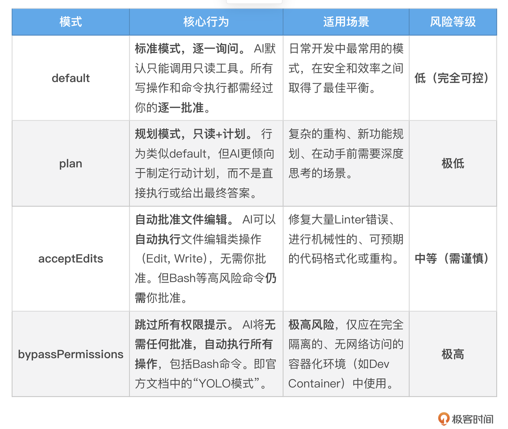
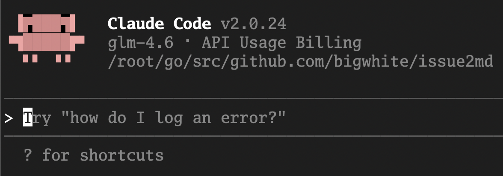
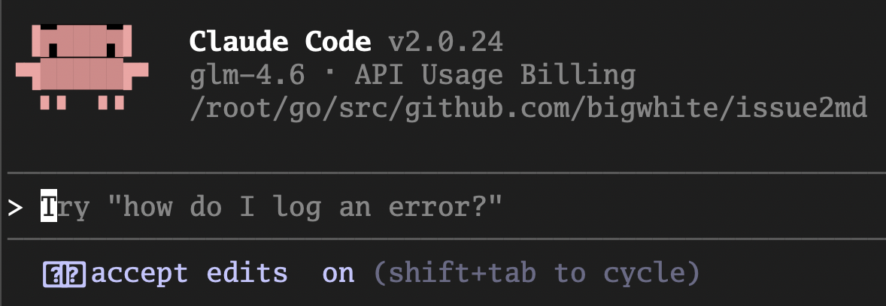
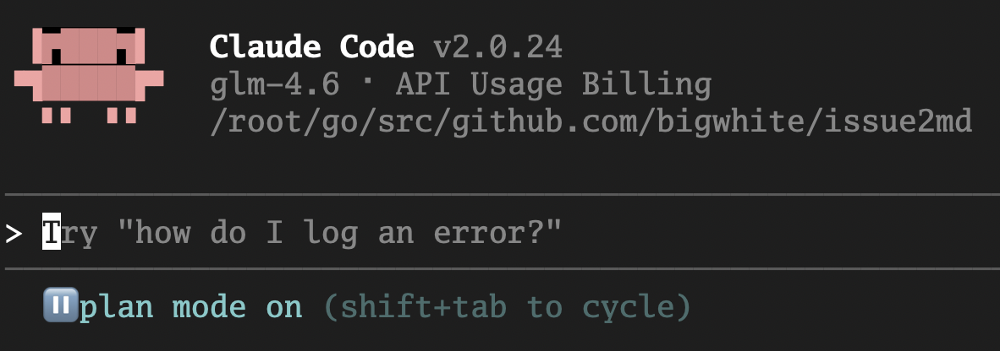
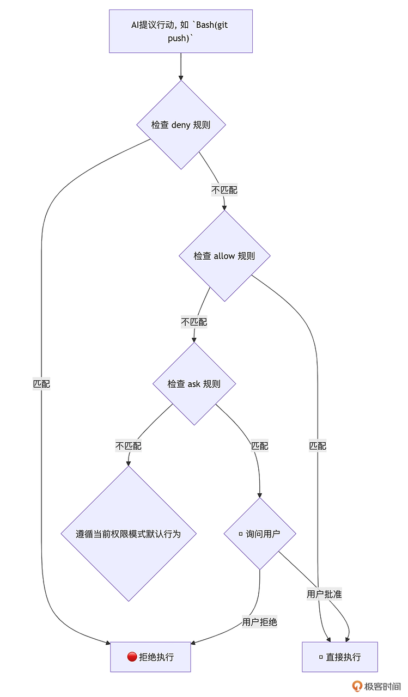
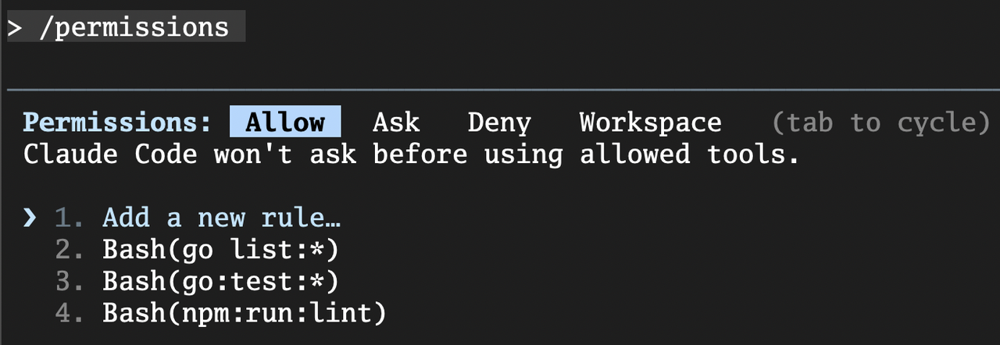
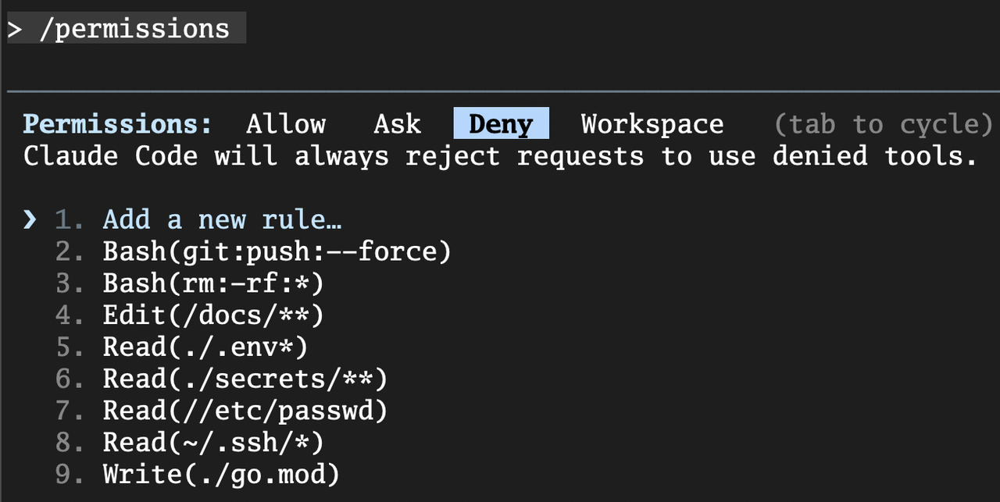
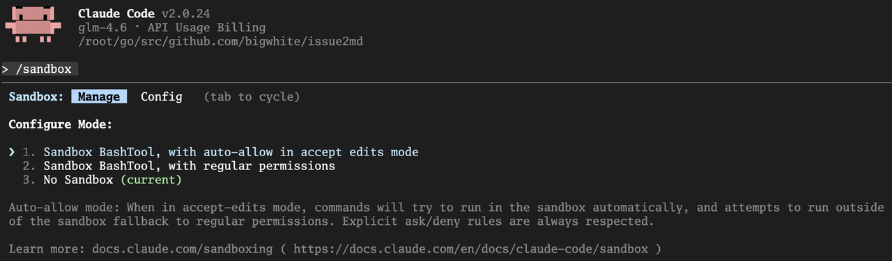
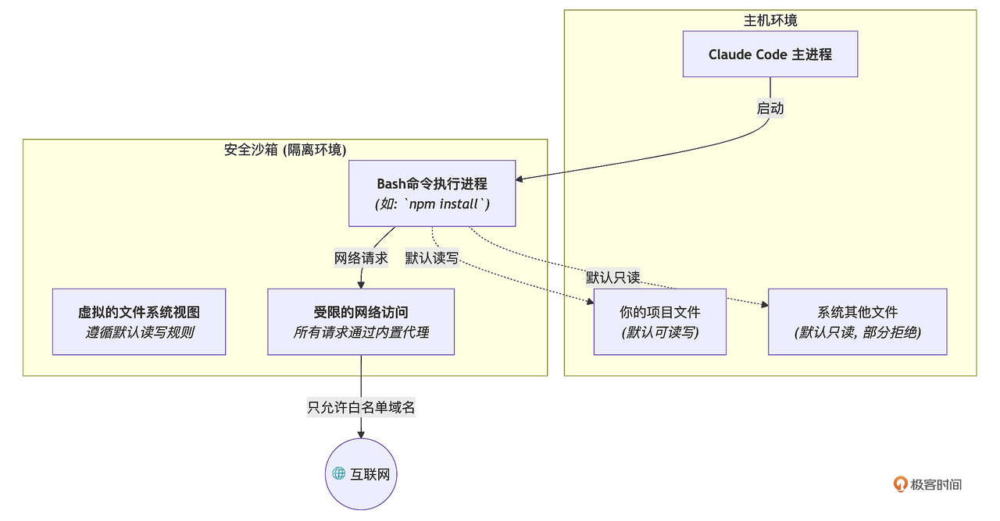

你好, 我是 Tony Bai. 

欢迎来到我们专栏的进阶篇. 从这一讲开始, 我们将从 "如何使用 AI", 迈向 "如何驾驭 AI" 的更高阶领域. 

在前面的基础篇, 我们已经为 AI 伙伴装备了 "眼睛" (上下文注入) 、"长期记忆" ( `CLAUDE.md` ) 和 "快捷指令" (Slash Commands) . 现在, 它已经非常聪明, 并且蓄势待发. 但随之而来的, 是一个所有严肃工程师都必须面对的灵魂拷问: 我真的能信任一个 AI, 让它在我的电脑上、在我的项目里, 自由地读写文件、执行命令吗?

如果它误解了我的指令 "清理一下临时文件", 而去执行了 `rm -rf /` 怎么办?如果它在分析代码时不小心读取了 `.env` 文件, 并将我的生产环境密钥泄露到它的训练数据中怎么办?这些合理的担忧, 正是阻碍许多开发者将 AI Agent 从一个 "有趣的玩具" 升级为 "核心生产力工具" 的最后一道心理防线. 

今天这一讲, 我们的核心目标, 就是彻底拆除这道防线. 我们将深入 Claude Code 设计的 "安全哲学", 系统性地学习如何为这个强大的 AI Agent, 戴上一副量身定制、坚不可摧的 "安全镣铐"—— 那就是其精密的 权限体系 (Permissions)  和强大的 沙箱机制 (Sandboxing) . 学完之后, 你将有足够的信心和能力, 去构建一个既强大又绝对可控的 AI 原生开发环境. 


## AI Agent 的核心风险: 信任, 一个必须解决的技术问题

在讨论解决方案之前, 我们必须首先对风险本身有一个清醒的认知. AI Agent 的核心风险, 并不仅仅来自于科幻电影里的 "AI 觉醒" 或恶意攻击, 更多的是来自于其工作原理带来的 不确定性 和 意图的偏差. 

* 指令的模糊性: 人类语言天然存在模糊性. 你对同事说 "把这个功能上线吧", 他知道这意味着 "运行测试、构建镜像、推送到 Staging、观察监控", 而不会真的直接操作生产环境. 但 AI Agent 可能会对 "上线" 这个词, 做出最直接、也最危险的字面解释. 

* 上下文的局限性: 尽管我们尽力提供上下文, 但 AI 的 "世界观" 永远是片面的. 它可能知道要修改 `a.go`, 但不知道这个文件正被一个关键的生产服务所依赖, 任何一点微小的改动都可能引发雪崩. 

* 统计的随机性: 大模型的本质是基于概率生成内容. 即便在相同的输入下, 它的输出也可能存在细微的差异. 这种随机性在带来创造力的同时, 也引入了不可预测的风险. 

正因为这些风险的存在,  我们对 AI Agent 的 "信任", 绝不能建立在 "它很聪明, 不会犯错" 的主观期待之上, 而必须建立在一套 "即便它犯错, 也无法造成破坏" 的客观技术保障体系之上. Claude Code 的整个安全哲学, 就建立在这样一种务实而审慎的思想之上: 默认不信任, 逐步授权, 全程监督.  它通过权限体系与沙箱机制这两大支柱来实现这一点. 


## 第一大支柱: 权限体系 —— 精细到命令级的 "立法"

Claude Code 的权限体系, 是其安全模型的 第一道、也是最重要的一道防线. 它不像传统的用户权限那样粗放 (管理员 / 普通用户) , 而是构建了一套极其精细的、针对 AI 工具 (Tool) 的授权模型. 

在深入细节之前, 我们首先要理解其核心的 权限设计哲学, 它建立在三个核心原则之上: 

* 默认最小权限: 默认情况下, AI 是 "只读" 的, 就像一个只能观察、不能动手的顾问. 

* 显式授权: 任何可能改变你系统状态的操作 (写文件、执行命令) , 都必须经过你的明确批准. 

* 用户主权: 最终的控制权永远在你手中. 你可以选择单次批准, 也可以通过配置, 将你信任的、安全的操作设置为自动批准. 

正是基于这套哲学, Claude Code 构建了一套由 "宏观模式" 和 "微观规则" 组成的、强大而灵活的权限体系. 

### 四大权限模式: 宏观上设定你的信任级别

首先, Claude Code 为你预设了四种核心权限模式 (Permission Modes) , 让你可以在不同场景下, 快速切换整体的安全级别. 



> 【重要】 default 模式是我们最常用的. 它在安全和效率之间取得了最佳平衡, 既不像 plan 模式那样完全只说不做, 也不像 acceptEdits 那样自动修改文件, 而是将每一个高风险决策都交由你来把控. 

你可以通过 Shift+Tab 快捷键在启动的 Claude Code 会话中循环, 在 default 、 plan 和 acceptEdits 模式间切换: 







也可以在 `settings.json` 中设置 defaultMode 为上面四种模式中的一种. 


### 权限规则 (Permission Rules) : 微观上为 AI 的行为 "立法"

四大模式提供了宏观的控制, 而真正的精髓, 在于你可以通过 `settings.json` 文件, 制定细致入微的 权限规则. 这些规则, 就是你为 AI 设定的在这个项目中必须遵守的 "法律条文". 

#### 规则的决策流程

规则的决策流程 非常清晰: deny 拥有最高否决权, 其次是 allow, 最后是 ask 和当前权限模式的默认行为. 



#### 配置的层次与生效

正如我们在前面基础篇 04 讲提到的,  `settings.json` 文件存在于多个层级 (企业、用户、项目) , 并遵循 高优先级覆盖低优先级 的原则. 这意味着, 你可以在项目级的 `./.claude/settings.json` 中为团队设定一套标准权限, 而团队成员也可以在自己的 `~/.claude/settings.json` 中添加个人化的、更严格的规则. 


如何查看生效的规则?

在你配置完规则后, 如何确认它们已经正确生效了呢?最直接的方法就是使用 /permissions 这个内置的 Slash Command. 

```plain&#x20;text
> /permissions
```

这个命令会打开一个交互式的界面, 清晰地列出当前所有生效的 allow 、 deny 、 ask 等规则, 这是你调试和验证权限配置的 "神器". 






现在, 让我们来看几个核心工具的规则实践: 

Read / Edit / Write: 控制文件访问, 你可以使用类似 `.gitignore` 的语法, 精确地控制 AI 能读写哪些文件. 这是保护项目敏感信息、防止 AI 意外破坏核心配置的 第一道铁索. 

```json
{
  "permissions": {
    "deny": [
      "Read(./.env*)",       // 禁止读取任何 .env 文件
      "Read(./secrets/**)",    // 禁止读取 secrets 目录下的所有文件
      "Read(~/.ssh/*)",       // 禁止读取用户 ssh 密钥
      "Read(//etc/passwd)",     // 禁止读取系统敏感文件
      "Write(./go.mod)",       // 禁止修改 go.mod 文件
      "Edit(/docs/**)"        // 禁止编辑 docs 目录下的文件 (相对于 settings.json 位置)
    ]
  }
}
```


【重要】 Read / Edit 规则的路径模式非常讲究: 

1. path 或 ./path: 相对于 当前工作目录. 例如: Read(\*.env) 会匹配当前目录下的 .env 文件. 

2. /path: 相对于 `settings.json`  文件所在目录. 例如: 在项目级的 `./.claude/settings.json` 中,  Deny(Read(/config/\*\*)) 会禁止读取项目根目录下的 config 文件夹. 

3. `~/path`: 相对于 用户主目录. 例如: Deny(Read(\~/.ssh/id\_rsa)) 会禁止 AI 读取你的 SSH 私钥. 

4. `//path`: 文件系统的绝对路径. 例如: Deny(Read(//etc/passwd)) 会禁止 AI 读取系统的密码文件 /etc/passwd. 请务必区分, 错误的路径模式可能会导致你的安全规则失效! 


Bash: 控制命令执行  Bash 工具是 AI 能力最强的 "武器", 也是风险最高的. Claude Code 为其设计了 基于前缀匹配 的规则. 

```json
{
  "permissions": {
    "allow": [
      "Bash(go:test:*)",      // 总是允许执行 `go test` 及其任何子命令
      "Bash(npm:run:lint)"    // 总是允许执行 `npm run lint`
    ],
    "ask": [
      "Bash(git:commit:*)"   // 执行 `git commit` 时总是询问
    ],
    "deny": [
      "Bash(rm:-rf:*)",       // 绝对禁止 `rm -rf`
      "Bash(git:push:--force)" // 绝对禁止强制推送
    ]
  }
}
```

> 【注意】 这里的 Bash 的规则是 前缀匹配, 而非 glob 或 regex. 这意味着 Bash(curl:\*) 可以被 curl -L ... 轻易绕过. 对于需要严格网络控制的场景,  WebFetch 工具或我们接下来要讲的沙箱机制是更可靠的选择. 


WebFetch 和 MCP: 控制外部连接, 你可以为可信的网络域和 MCP 服务器开启绿色通道. 

```json
{
  "permissions": {
    "allow": [
      "WebFetch(domain:*.golang.org)",     // 总是允许访问 Go 官方文档
      "mcp__github"                        // 总是允许使用名为 'github' 的 MCP 服务器的所有工具
    ],
    "ask": [
      "mcp__jira__create_issue"            // 调用 jira 服务器的 create_issue 工具时询问
    ]
  }
}
```

> 【注意】 MCP 权限规则不支持通配符 \*. 要允许一个服务器的所有工具, 请直接使用服务器名, 如 mcp\_\_github. 

通过这套 "宏观模式"+"微观规则" 的组合, 你就拥有了一套强大而灵活的 "立法" 工具, 能够为你的 AI 伙伴量身打造一套清晰、明确、且绝对安全的工作边界. 


## 第二大支柱: 沙箱机制 —— 从 "操作系统" 层面隔离风险

你可能会问, 既然我们在上面已经为 AI 制定了如此精细的 "法律" (权限体系) , 为什么还需要为它建造一个 "监狱" (沙箱) 呢?

答案是: 权限体系防范的是 "已知的未知", 而沙箱防范的是 "未知的未知". 权限体系依赖于我们预先定义的规则, 但如果 AI 通过一个我们允许的、看似无害的命令 (比如运行一个被恶意篡改的 npm 脚本) 找到了规则的漏洞, 或者利用了 Bash 前缀匹配规则的局限性呢?

这正是沙箱的用武之地. 它不再是应用层面的规则检查, 而是深入到 操作系统 (OS) 层面, 为 AI 的所有高风险操作, 构建了一个坚不可摧的 "数字囚笼". 


### 准备工作: 为你的沙箱安装 "地基"

在启用沙箱之前, 我们需要确保它的 "地基" 已经就位. 在你的 Ubuntu 环境上, 如果你直接在 Claude Code 中运行 /sandbox, 很可能会遇到和我一样的错误提示: 

```plain&#x20;text
> /sandbox
  ⎿  Error: Sandbox requires socat and bwrap. Please install these packages.
```

这个提示告诉我们, Claude Code 的沙箱功能依赖于两个关键的 Linux 工具: 

* bwrap  (Bubblewrap) : 这是沙箱的核心. 它是一个非特权 (unprivileged) 的容器化工具, 能够利用 Linux 内核的 命名空间 (Namespaces)  特性, 为一个进程创建一个高度隔离的运行环境. 

* socat: 一个多功能的网络中继工具. 在这里, 它被用来创建沙箱内外通信的桥梁, 尤其是在网络隔离中扮演关键角色. 

在基于 Debian / Ubuntu 的系统上, 你可以通过以下命令轻松安装它们: 

```plain&#x20;text
sudo apt-get update && sudo apt-get install -y bubblewrap socat
```

安装完成后, 你再运行 /sandbox,  并不会直接启用沙箱, 而是会进入一个交互式的配置菜单, 让你做出一个关键的选择: 



在 macOS 上, 沙箱则依赖于系统内置的 Seatbelt 框架, 无需额外安装, 但同样会面临类似的选择

这个菜单为你提供了两种不同安全级别的沙箱模式, 以及一个关闭选项. 那么, 前两个模式有什么不同, 我们应该如何选择呢?


选项 2:  Sandbox BashTool, with regular permissions  (推荐, 最安全) 

含义: 启用沙箱, 并且所有 Bash 命令的执行, 都 严格遵循 我们在上一节学习的 permissions 体系. 这意味着, 即使一个 Bash 命令在沙箱的安全边界内, 如果它没有命中 allow 规则, Claude Code 依然会弹窗向你请求批准. 

选择建议: 对于大多数项目, 尤其是涉及生产环境代码、敏感数据或团队协作的场景,  我强烈推荐你选择这个模式. 它为你提供了最坚固的 "法律 + 监狱" 双重防护. 


选项 1: Sandbox BashTool, with auto-allow in accept edits mode  (效率优先) 

含义: 启用沙箱, 但是做了一个 效率上的妥协. 当你处于 acceptEdits 这个更信任的权限模式时, 对于那些在沙箱安全边界内的 Bash 命令, Claude Code 将 不再询问你, 直接自动执行. 

**选择建议: 如果你正在一个完全可信的、非关键的个人项目中工作, 并且你对沙箱的边界配置非常有信心, 希望最大化地提升 AI 的自主工作效率, 那么可以选择这个模式. **&#x4F46;请务必记住, 这在一定程度上牺牲了单次操作的审批权, 以换取更高的自动化效率. 

在你做出选择后, 沙箱就成功启用了. 如果你想退出沙箱模式, 可以再次执行 /sandbox, 选择 No Sandbox 即可. 

现在, 让我们再来深入了解它背后的工作原理. 


### 沙箱的核心原理: 基于操作系统原语的隔离

与 Gemini CLI 等工具倾向于使用重量级的 Docker 容器来实现沙箱不同, Claude Code 选择了一条更轻、更原生的路径. 它利用操作系统级别的安全原语 (Linux 上的 bubblewrap, macOS 上的 Seatbelt ) 来强制执行文件系统和网络的隔离. 

当你启用沙箱后, 所有 Bash 命令及其子进程都会在一个被严格限制的 "数字囚笼" 中执行. 这个 "囚笼" 的规则, 由一套默认行为和你的 `settings.json` 配置共同决定. 



让我们来精确地解读沙箱的两大核心隔离特性: 

#### 一是文件系统隔离 (Filesystem Isolation) : 沙箱对文件系统的访问权限, 遵循一套 非对称的读写规则:&#x20;

* **默认写权限: 严格受限. **&#x41;I 的写操作 (通过 Bash 命令) 被严格限制在 当前工作目录 (CWD) 及其子目录 中. 任何试图修改 CWD 之外文件的行为, 都将被阻断, 除非得到你的 明确批准. 这构成了防止 AI "作恶" 的核心安全边界. 

* **默认读权限: 相对开放. **&#x6C99;箱内的进程默认拥有对 几乎整个计算机 的 只读 访问权限. 这是一种非常务实的设计, 它允许 AI 在需要时, 能够像人类开发者一样, 去读取系统库、全局配置文件或其他项目的文件来获取解决问题所需的上下文. 

* **可配置性**: 更精细和推荐的方式是通过我们已经学习的 permissions 体系中的 Read 、 Edit 、 Write 规则来 "立法". 


#### 二是网络隔离 (Network Isolation) : 沙箱的网络访问则遵循 默认拒绝, 白名单通行 的原则: 

* 代理拦截: 所有源自沙箱的网络请求, 都会被一个运行在沙箱外部的 代理服务器 所拦截. 

* 白名单机制: 只有在 permissions 中通过 `WebFetch(domain:*.example.com)` 规则明确允许的域名, 才能通过这个代理. 

* 用户确认: 任何对未知域名的访问请求, 都会被代理 暂停, 并弹窗向你请求许可. 

* 全面覆盖: 这种隔离适用于 Bash 命令及其衍生的所有子进程, 确保了网络访问的统一管控. 


### "安全 YOLO 模式": 沙箱与 bypassPermissions 的终极结合

现在, 我们可以揭晓 bypassPermissions  (YOLO 模式) 的唯一正确且极其强大的用法了 —— 将其与一个严格配置的沙箱结合. 这个流程被称为 "安全 YOLO 模式", 它特别适合执行那些高度重复、机械化的、边界清晰的自动化任务. 


我们来看一下它的实践流程: 

1. 配置严格的沙箱规则: 在 `./.claude/settings.json` 中, 确保 sandbox.enabled 为 true, 并通过 permissions 规则严格限制文件和网络访问. 

2. 在沙箱内启动 YOLO 模式: `bash # 确保在项目根目录运行 claude -p "修复这个项目中所有的 ESLint 错误, 直到 npm run lint 命令不再报错为止. 完成后, 返回 'OK'. " --dangerously-skip-permissions`

3. AI 全自动工作: Claude Code 会在这个受限的 "囚笼" 里, 全速、自主地工作. 它想修改项目外的文件?被沙箱的 "写权限边界" 阻断. 它想访问 evil.com? 被网络代理阻断. 它唯一能做的, 就是在你为它划定的安全范围内, 高效地完成任务. 

4. 审查结果: 任务完成后, 你通过 git diff 审查 AI 所做的所有修改, 确认无误后提交. 

在这个模式下, 我们既利用了 AI 的极致自动化能力, 又将其潜在的风险, 通过操作系统级的沙箱机制, 降到了理论上的最低. 


## 实战: 为我们的 Go 项目量身定制一份安全配置

基于我们对 permissions 和 sandbox 协作关系的最新理解, 现在让我们来优化 issue2md 项目的 `./.claude/settings.json` 文件或 `settings.local.json` 文件. 

`./.claude/settings.json`

```json
{
  "permissions": {
    "allow": [
      "Read(go.mod)",
      "Read(Makefile)",
      "Read(README.md)",
      "Grep",
      "Glob",
      "LS",
      "Bash(go:version)",
      "Bash(go:list:*)",
      "Bash(go:build:*)",
      "Bash(go:test:*)",
      "Bash(gofmt:*)",
      "Bash(goimports:*)",
      "Bash(golangci-lint:run:*)",
      "WebFetch(domain:pkg.go.dev)",
      "WebFetch(domain:*.golang.org)",
      "WebFetch(domain:github.com)",
      "Bash(go list:*)",
      "Bash(go version:*)"
    ],
    "deny": [
      "Read(./.env*)",
      "Read(~/.ssh/**)",
      "Read(//etc/passwd)",
      "Bash(rm:*)",
      "Bash(git:push:*)"
    ],
    "ask": [
      "Write",
      "Edit",
      "MultiEdit",
      "Bash(go:get:*)",
      "Bash(go:mod:tidy)",
      "Bash(git:add:*)",
      "Bash(git:commit:*)"
    ],
    "defaultMode": "default"
  },
  "sandbox": {
    "autoAllowBashIfSandboxed": false,
    "enabled": true
  }
}
```


让我们来解读这份优化后的配置


permissions 部分 (立法) 

* allow: 我们为无害的 Bash 命令 (如测试、格式化) 和必要的文档网站 ( WebFetch ) 开放了绿色通道. 特别注意, 我们不仅允许了 Go 的官方文档和代理网站, 还加入了 github.com. 这是因为 Go 模块的依赖解析经常需要回源到 GitHub 等代码托管平台. 

* ask: 我们在所有 "改变世界" 的操作上, 都设置了 "红绿灯", 包括修改代码、改变依赖、记录历史. 

* deny: 我们用最严厉的规则, 划定了 绝对的 "禁区", 包括读取敏感文件和执行破坏性 Bash 命令. 


sandbox 部分 (执法) 

* enabled: true: 我们强制所有 Bash 命令都在沙箱中运行. 

* autoAllowBashIfSandboxed: false: 我们选择了最安全的模式, 明确要求沙箱内的 Bash 命令 依然要接受 permissions 体系的审查, 实现了安全双保险. 

这份配置, 就是我们为 issue2md 项目量身打造的、严格遵循官方文档的 "法律 + 监狱" 双重保障体系. 


## 本讲小结

今天, 我们深入了 AI 原生开发最底层的基石 —— 安全与信任. 我们不再将 AI 视为一个需要时时警惕的 "黑盒", 而是学会了如何通过技术手段, 将其塑造为一个能力边界清晰、行为可预测、最终值得信赖的开发伙伴. 

首先, 我们分析了 AI Agent 的 核心风险, 并明确了 Claude Code 的安全哲学: **默认不信任, 逐步授权, 全程监督**. 接着, 我们深入学习了 Claude Code 安全模型的 第一大支柱: 权限体系 (Permissions) . 它如同 "应用层的法律", 通过 allow, deny, ask 规则, 为 AI 的所有工具调用 (包括 Read, Write, Bash 等) 制定了精细的行为准则. 

然后, 我们探讨了安全模型的 第二大支柱: 沙箱机制 (Sandboxing) . 它如同 "操作系统层的物理边界", 主要为高风险的 Bash 命令提供了一个默认隔离的文件系统和网络环境, 是安全的最后一道防线. 

最后, 我们掌握了 "安全 YOLO 模式" 这一终极自动化实践, 即通过将 bypassPermissions 模式与一个严格配置的沙箱结合, 实现既高效又安全的无人值守工作流. 请记住,  安全不是效率的敌人, 而是效率可持续的保障. 掌握了权限与沙箱的协同配置, 你就拥有了驾驭 AI 这匹 "千里马" 的 "缰绳" 与 "赛道", 可以放心地让它驰骋. 

然而, 我们今天的讨论, 还只是解决了安全问题的一半. 我们确保了 AI 在 "行动前" 是可控的. 但如果一个操作, 是我们自己批准的, 但执行后却发现结果并非我们所想, 我们又该如何快速、无痛地 "反悔" 呢?

这就是我们下一讲要解决的问题: Checkpointing. 我们将学习如何获得让 AI "时光倒流" 的超能力, 为 AI 的所有行动, 再上一道 "事后可追溯、可反悔" 的终极保险. 


## 思考题

假设你要为一个典型的前端项目 (使用 React 和 npm) 设计一套完整的 `./.claude/settings.json` 安全配置. 这份配置需要同时兼顾安全性和日常开发效率. 请你思考并设计这份 settings.json, 至少需要包含 permissions 和 sandbox 两个顶级字段. 

在你的设计中, 请特别回答以下几个问题: 

1. 在 permissions 的 allow, ask, deny 中, 你会分别放入哪些与 npm 、 node 、 git 相关的 Bash 工具规则? (例如,  npm install, npm test, npm run build 等应该如何配置?) 

2. 你会如何配置 sandbox 块?特别是 enabled 和 autoAllowBashIfSandboxed 这两个选项, 你会如何取舍?为什么?

3. 为了让 npm install 能够在网络隔离的沙箱中成功运行, 你需要在 permissions 的 allow 中添加哪条 WebFetch 规则? (提示: npm 的默认源地址是什么?) 

欢迎在评论区分享你的完整 settings.json 配置方案和设计思路. 这个练习将帮助你将本讲学到的两大安全支柱, 融会贯通地应用到真实的工程场景中. 如果你有所收获, 也欢迎你分享给其他朋友, 我们下节课再见! 


