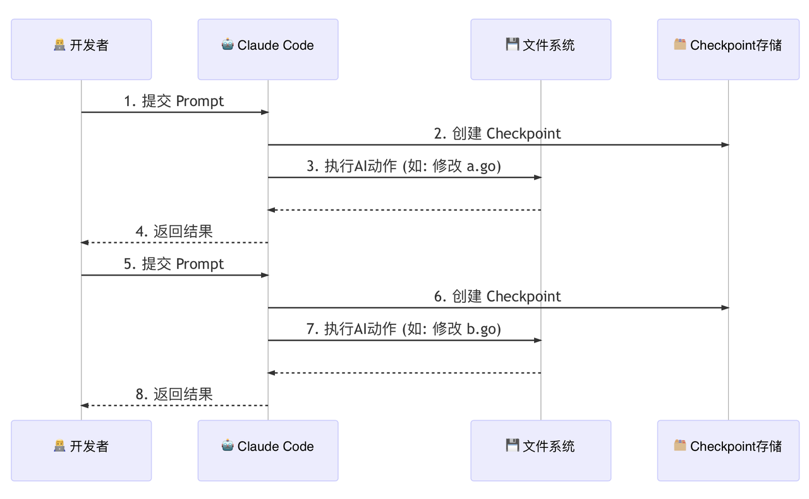
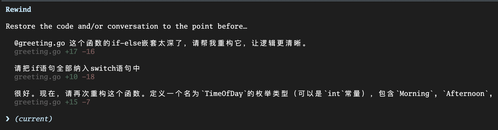
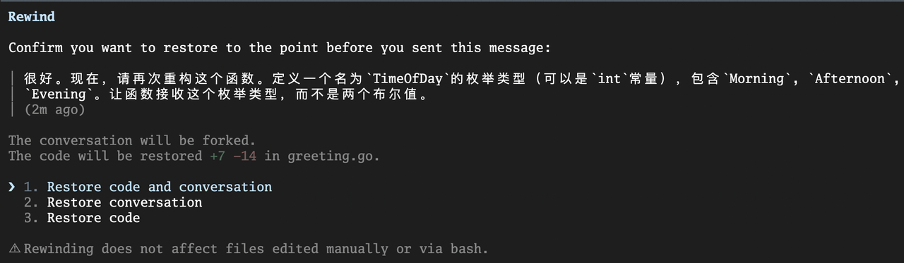

你好, 我是 Tony Bai. 

在上一讲, 我们深入了 Claude Code 的权限体系和沙箱机制, 学会了如何为 AI 戴上一副坚固的 "安全镣铐". 我们通过精细的规则, 确保了 AI 在 行动之前 是可控的、可预测的. 

这解决了一个核心的信任问题: "我如何确保 AI 不会做坏事?". 但随之而来的是一个更微妙、也更常见的困境. 想象一下这个场景: 你正在让 AI 帮你重构一个祖传的、长达 500 行的 Go 函数. 

1. 你下达了第一个指令: "先将这个函数拆分成三个更小的私有函数. " AI 完成得很漂亮, 你很满意, 批准了它的文件修改. 

2. 你信心大增, 下达了第二个指令: "很好. 现在, 将这几个函数的核心逻辑, 用 Go 的泛型进行重写, 以提高复用性. "

3. AI 再次动手, 修改了多个文件, 引入了新的类型参数. 但这次, 你看着生成的新代码, 眉头紧锁. 它虽然能跑, 但设计得过于复杂, 可读性反而下降了. 

4. 你想反悔, 回到上一步的状态. 但 AI 已经修改了 3 个文件, 共计 15 处地方. 你是要手动 Ctrl+Z 15 次, 还是用 git restore 小心翼翼地恢复部分文件?无论哪种, 都很痛苦, 而且很容易出错. 

这就是我们所说的 "重构的恐惧": 当 AI 的修改偏离了我们的轨道时, 我们缺乏一个简单、可靠、能够一键 "反悔" 的机制. 

今天这一讲, 我们就要彻底终结这种恐惧. 我们将深入 Claude Code 的另一个独门绝技 —— Checkpointing (检查点)  机制. 你将学会如何获得让 AI "时光倒流" 的超能力, 为所有大胆的 AI 实验, 备上一剂强大的 "后悔药". 


## Checkpointing 工作原理: 会话级的 "Git 快照"

Checkpointing 的理念, 对于爱玩游戏的小伙伴儿来说, 可能会非常亲切. 它就像是游戏中的 自动存档 (Auto-Save)  机制. 

在你即将进入一场艰难的 Boss 战 (一次复杂的 AI 操作) 之前, 游戏会自动为你创建一个存档点. 如果你在战斗中失败了, 你可以轻松地 "读档", 回到进入战斗前的那个完美状态, 然后换个策略再试一次. 

Claude Code 的 Checkpointing 机制, 就是你开发过程中的 "自动存档系统". 它的工作原理可以概括为以下几点:&#x20;

1. 触发时机: 每当你 (用户) 提交一个新的 Prompt 时, Checkpointing 系统就会被触发. 它会在 AI 开始思考和行动之前, 悄悄地为你的项目状态创建一个快照. 

2. 保存内容: 这个快照, 并不仅仅是代码的备份. 它完整地记录了那一刻的 "时空切片", 主要包含两部分信息:&#x20;

   1. 代码状态: 当前会话中所有被 AI "染指" 过的文件 (即被读取或修改过的文件) 的完整内容. 

   2. 对话状态: 到那一刻为止的完整对话历史. 

3. 为了更好地理解, 你可以把它想象成一个由 Claude Code 在后台为你维护的、 与你项目主仓库完全隔离的 "影子 Git 仓库". 

   1. 每当你提交 Prompt, Claude Code 就在这个 "影子仓库" 里帮你执行了一次 `git commit -a -m "Checkpoint before prompt N"`. 

   2. 这个操作极其轻量, 并且 绝对不会 污染你项目本身的 `.git` 历史. 它所有的历史记录都存放在 Claude Code 的内部目录中 (如 `~/.claude/file-history/` ) . 

这个机制的精妙之处在于, 它将你的 对话历史 和 代码变更历史, 在每一个关键节点上进行了 精确的绑定. 


我们可以用一张图来清晰地看到这个流程:&#x20;



看, 在 AI 对你的文件系统进行任何 "写" 操作之前, 一个包含了 "之前" 所有状态的完美快照, 已经被安全地存盘了. 这, 就是我们能够 "时光倒流" 的底气所在. 


## 实战: 使用 /rewind 在任意检查点间穿梭

理论已经清晰, 现在让我们进入最激动人心的实战环节. 我们将亲历一次从 "大胆重构" 到 "从容反悔" 的全过程. 

场景: 假设我们正在维护一个 Go 函数, 它根据不同的条件生成问候语. 目前的代码充满了丑陋的 if-else 嵌套, 可读性极差. 

初始代码  `greeting.go`

```go
package greeting

import "fmt"

// GetGreeting generates a greeting message.
// isFormal: whether to use a formal tone.
// isMorning: whether it is morning.
// isEvening: whether it is evening.
func GetGreeting(name string, isFormal bool, isMorning bool, isEvening bool) string {
    if isFormal {
        if isMorning {
            return fmt.Sprintf("Good morning, %s.", name)
        } else {
            if isEvening {
                return fmt.Sprintf("Good evening, %s.", name)
            } else {
                return fmt.Sprintf("Hello, %s.", name)
            }
        }
    } else {
        if isMorning {
            return fmt.Sprintf("Hey %s, good morning!", name)
        } else {
            if isEvening {
                return fmt.Sprintf("Hey %s, good evening!", name)
            } else {
                return fmt.Sprintf("Hey, %s!", name)
            }
        }
    }
}
```


### 第一步: 第一次重构 —— 走向清晰

我们向 Claude Code 下达第一个重构指令:&#x20;

```plain&#x20;text
@greeting.go 这个函数的 if-else 嵌套太深了, 请帮我重构它, 让逻辑更清晰. 
```

AI Agent 分析后, 可能会提议使用 switch 语句, 并给出了修改方案. 我们觉得很棒,  批准 了这次修改. 

代码状态 V2 (第一次重构后):&#x20;

```go
package greeting

import "fmt"

func GetGreeting(name string, isFormal bool, isMorning bool, isEvening bool) string {
    switch {
    case isFormal && isMorning:
        return fmt.Sprintf("Good morning, %s.", name)
    case isFormal && isEvening:
        return fmt.Sprintf("Good evening, %s.", name)
    case isFormal:
        return fmt.Sprintf("Hello, %s.", name)
    case !isFormal && isMorning:
        return fmt.Sprintf("Hey %s, good morning!", name)
    case !isFormal && isEvening:
        return fmt.Sprintf("Hey %s, good evening!", name)
    default:
        return fmt.Sprintf("Hey, %s!", name)
    }
}
```

这个版本比原来好多了. 我们很满意. 


### 第二步: 第二次重构 —— 一次 "失败" 的尝试

现在, 我们想更进一步. 我们觉得布尔参数太多了, 想用一个枚举类型来代替 isMorning 和 isEvening. 

我们下达了第二个指令:&#x20;

```plain&#x20;text
很好. 现在, 请再次重构这个函数. 定义一个名为 TimeOfDay 的枚举类型 (可以是 int 常量) , 包含 Morning, Afternoon, Evening. 让函数接收这个枚举类型, 而不是两个布尔值. 
```

AI 再次动手, 给出了一套新的实现方案, 包括了新的类型定义和修改后的函数. 但我们看了一下, 觉得它引入的 iota 和常量组让代码反而变得不那么直观了, 而且它把 isFormal 的逻辑和时间逻辑混在了一起, 可读性不升反降. 

但是, 我们 "手滑" 批准 了这次修改. 

代码状态 V3 (第二次重构后, 我们不满意的版本):&#x20;

```go
package greeting

import "fmt"

type TimeOfDay int

const (
    Morning TimeOfDay = iota
    Afternoon
    Evening
)

func GetGreeting(name string, isFormal bool, time TimeOfDay) string {
    // ... 一段我们不满意的、复杂的实现 ...
}
```

项目现在处于一个我们不想要的状态. 怎么办?


### 第三步: 启动 "时光机"—— /rewind

现在, 是时候召唤 "后悔药" 了. 在 Claude Code 的输入框中, 输入 /rewind  (或者直接连按两次 Esc 键) , "时光机" 界面就会出现. 

你会看到一个按时间顺序排列的 检查点列表  (旧的在上面, 新的在下面) , 每一个都对应你提交的一次 Prompt:&#x20;



更重要的是, 当你通过方向键选择你要回退到的检查点并按下回车后, 你会看到三个强大的 "倒流" 选项:&#x20;




#### Rewind code (只回退代码) :&#x20;

* 作用: 将你的文件系统恢复到选定检查点的状态, 但 保留完整的对话历史. 

* 心智模型: "AI, 我们刚才的 讨论都很有价值, 但我对你的 具体实现不满意. 让我们回到你动手之前, 然后基于我们刚才的讨论, 你再试一次. "

* 适用场景: AI 的思路正确, 但代码实现有误. 

#### Rewind conversation (只回退对话) :&#x20;

* 作用: 将你的对话历史回退到选定检查点, 但 保留文件系统的所有修改. 

* 心智模型: "AI, 你刚才做的代码修改是对的, 但我发现我给你的指令说错了. 让我们保留现在的代码, 然后从我上一个指令开始, 我换个说法. "

* 适用场景: 代码修改符合预期, 但你想从一个早期的对话节点, 探索另一个完全不同的方向. 

#### Rewind code and conversation (全部回退) :&#x20;

* 作用: 彻底的 "时光倒流". 将文件系统和对话历史, 都完美地恢复到选定检查点的状态. 

* 心智模型: "AI, 我们刚才那段探索完全是条死胡同. 让我们 假装它从未发生过, 从这个更早的时间点重新开始. "

* 适用场景: 当你对 AI 的一系列修改和你们的整个讨论方向都不满意时, <span style="color: inherit; background-color: rgba(254,212,164,0.8)">这是最彻底、最干净的 "重置" 按钮. </span>

在我们的场景中, 我们对第二次重构的整个方向 (引入枚举) 都不满意, 所以我们选择 Rewind code and conversation, 然后按下回车. 


瞬间, 奇迹发生了:&#x20;

1. 你的 `greeting.go` 文件内容, 被 完美地恢复 到了我们满意的 "代码状态 V2". 

2. 你的 Claude Code 对话界面, 也 回滚 到了你下达第二次重构指令之前的状态. 

一切都回到了那个 "美好的时刻". 现在, 你可以重新思考, 然后给 AI 一个全新的、更好的指令. 


## Checkpointing 的边界: 它不能做什么?

Checkpointing 虽然强大, 但它不是万能的. 清晰地理解它的边界, 能帮助我们避免错误的使用, 并将其与我们已有的工具 (如 Git) 进行更好的配合. 

1. 它不跟踪  Bash  命令的副作用: 这是 最重要, 也是最容易被误解 的限制. Checkpointing 系统只快照 文件内容 的状态. 对于通过 ! 或 Bash 工具执行的命令所产生的 副作用, 它无能为力. 例如, 如果 AI 执行了:&#x20;

   1. ! rm sensitive-data.log

   2. ! git push --force

   3. ! docker stop my-container

这些操作是不可逆的.  /rewind  无法帮你恢复被删除的文件、撤销强制推送, 或重启被停止的容器.  这也是为什么我们在上一讲强调, 对高风险的 Bash 命令, 必须使用最严格的 ask 或 deny 权限规则. 


* 它不跟踪外部编辑: Checkpointing 的 "眼睛" 只盯着由 Claude Code 的 内置编辑工具  (如 Write, Edit) 所修改的文件. <span style="color: inherit; background-color: rgba(254,212,164,0.8)">如果你在与 AI 对话的同时, 自己在 VS Code 或 VIM 里手动修改了 greeting.go, 这个手动的修改 不会被记录 在 Checkpointing 的历史中</span>. 

这通常不是问题, 但需要记住: /rewind 恢复的是 上一个检查点时刻、由 Claude Code 所知晓 的文件状态. 


* 它不是 Git 的替代品: 这个误解必须澄清. Checkpointing 和 Git 是解决两种不同问题的工具, 它们是 互补 而非替代关系. 


最佳实践是: 在一个功能开发的过程中, 你可以自由地使用 Checkpointing 进行各种大胆的尝试和回滚. 当你完成了一个有意义的、稳定的功能点时, 再使用 git commit, 将这个 阶段性的成果, 永久地记录到项目的 "正式历史" 中去. 


## 本讲小结

今天, 我们为我们的 AI 原生开发工作流, 装上了最后一块、也是最关键的一块安全拼图. 我们获得了在 AI 世界里 "反悔" 的权力. 

首先, 我们直面了与 AI 进行复杂协作时的 "重构的恐惧", 并明确了 Checkpointing 机制就是为了解决这个问题而生的 "后悔药". 接着, 我们深入了 Checkpointing 的工作原理, 理解了它是一个由用户 Prompt 触发的、 会话级的 "Git 快照" 系统, 能够同时保存代码和对话的状态. 

然后, 通过一个完整的 Go 代码重构实战, 我们亲手掌握了 /rewind 这一 "时光机" 指令, 并深刻理解了其 三种不同回退模式  (只回退代码、只回退对话、全部回退) 的精髓和适用场景. 最后, 我们清晰地划定了 Checkpointing 的边界, 明确了它 不能跟踪  Bash  命令的副作用, 也不能替代 Git 作为正式的版本控制工具. 

掌握了 Checkpointing, 你就拥有了驾驭 AI 进行更大规模、更具探索性任务的信心. 从 "只敢让 AI 写点小函数", 到 "敢于让 AI 重构整个模块", 这正是从 AI 使用者到 AI 驾驭者的关键一跃. 至此, 我们的 "安全基石" 已经完全筑牢. 我们学会了如何 事前约束  (权限与沙箱) 和 事后补救  (Checkpointing) . 现在, AI Agent 对我们来说, 已经是一个足够安全的伙伴了. 

那么, 我们是否可以让它变得更 "主动" 一些呢?除了我们下达指令, 它能否在某些特定时机, 自动地 为我们做一些事情?比如, 每次修改完代码后, 自动运行 gofmt?这就是我们下一讲要探讨的主题: 自动化之触 ——Hooks 机制. 我们将学习如何 AI 的生命周期中埋下 "触发器", 实现更高阶的自动化. 


## 思考题

除了今天我们演示的 "代码重构" 场景, 请你再设想 至少两个 你认为 Checkpointing 机制能发挥巨大价值的日常开发场景. 例如, 探索一个新库的不同 API 用法?或者让 AI 生成多个不同风格的 UI 组件代码以供挑选?

请描述你的场景, 并说明在这种场景下, 你可能会更倾向于使用 /rewind 的哪种模式 (只回退代码、只回退对话, 或全部回退) , 以及为什么. 欢迎在评论区分享你的创意工作流！如果你觉得今天的内容对你有帮助, 也欢迎你分享给需要的朋友, 我们下节课再见！

