你好, 我是 Tony Bai. 

在前面的课程中, 我们已经为 AI 伙伴 Claude Code, 装备了强大的 "长期记忆" 和 "私人命令集". 通过 `CLAUDE.md` 和自定义 Slash Commands, 我们的协作效率已经得到了极大的提升. 

但是, 如果你仔细观察, 会发现我们当前的协作模式, 本质上仍然是 交互式的、一问一答的. AI 的所有行动, 都源于我们的一次主动调用. 我们就像一个时刻需要盯着屏幕的 "微操大师", 在 AI 完成每一步后, 都需要手动输入下一条指令. 

* AI 帮你重构了一个 Go 文件, 你心满意足地批准了. 接下来, 你必须手动输入 `! gofmt -w .` 来格式化代码. 

* AI 帮你修复了一个 Bug, 并通过了测试. 接下来, 你必须手动输入 `! git add .` 和 `! git commit ...` 来保存工作成果. 

* 你让 AI 执行一个需要几分钟的复杂任务, 比如大规模代码分析. 你只能切换到别的窗口, 然后凭感觉时不时地切回来, 看看它是否已经完成, 或者是否正在等待你的某个权限批准. 


这些手动的、重复的、可预测的 "收尾工作" 和 "状态监视", 正在成为我们迈向更高阶自动化的新瓶颈. 

我们能否将协作模式再向前推进一步, 从 "我告诉 AI 做什么", 进化到 "当 AI 做了某事后, 系统自动为它做什么"?

答案是肯定的. 这正是我们今天要学习的 "事件驱动" 方案 —— Claude Code Hooks 机制. 


今天这一讲, 我们将深入 AI Agent 的 "神经系统", 学习如何在其生命周期的关键节点上, 埋下我们自己的 "触发器". 你将学会让 AI 在修改文件后自动格式化代码, 以及在任务完成或需要你介入时, 自动弹出系统通知. 掌握 Hooks, 意味着你将完成从 "AI 使用者" 到 "AI 行为编排者" 的终极转变. 


## 从 "用户调用" 到 "事件触发": 一种新的自动化哲学

在深入技术细节之前, 我们必须先清晰地分辨 Hooks 与我们已经学过的 Slash Commands 之间的根本区别. 这两种能力扩展方式, 代表了两种截然不同的自动化哲学. 

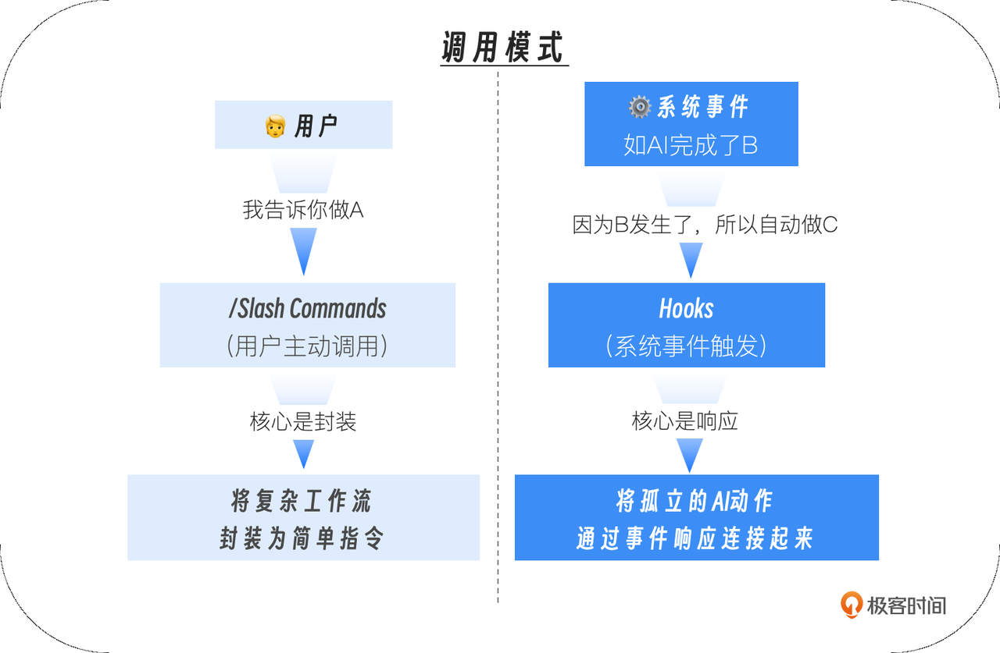


两种能力扩展方式的哲学对比

* Slash Commands 是 "人驱动" 的. 它们是你工具箱里的 "电动螺丝刀". 你需要主动地拿起它, 对准某个目标, 然后按下开关. 它极大地提升了你执行单个、特定任务的效率. 

* Hooks 是 "事件驱动" 的. 它们是你预先设置在 AI 行动路径上的 "传感器" 和 "响应器". 当 AI 生命周期中的某个事件 (比如 "AI 刚刚完成了一次文件写入") 发生时, 对应的 Hook 会自动被触发, 执行你预设好的响应动作. 它致力于将孤立的 AI 行动, 连接成更流畅的自动化序列. 

一个成熟的 AI 原生工作流, 必然是这两者的完美结合: 你使用自定义的 Slash Command 启动一个复杂的任务, 而 Hooks 则负责响应这个任务过程中所有可预测的、重复的事件, 自动完成 "胶水代码" 和 "收尾工作". 


## 深入 Claude Code 生命周期: AI 行动的 "事件流"

要成为一个优秀的 "AI 行为编排者", 你首先需要一张清晰的 "流程图", 了解 AI 在执行一个任务时, 到底会经过哪些关键的生命周期节点. 这些节点, 就是我们可以监听并绑定响应动作的 事件源. 

Claude Code 为我们开放了多个核心的 Hook 事件. 让我们通过一个典型的 AI 工作流程, 来看看它们各自的位置和作用. 

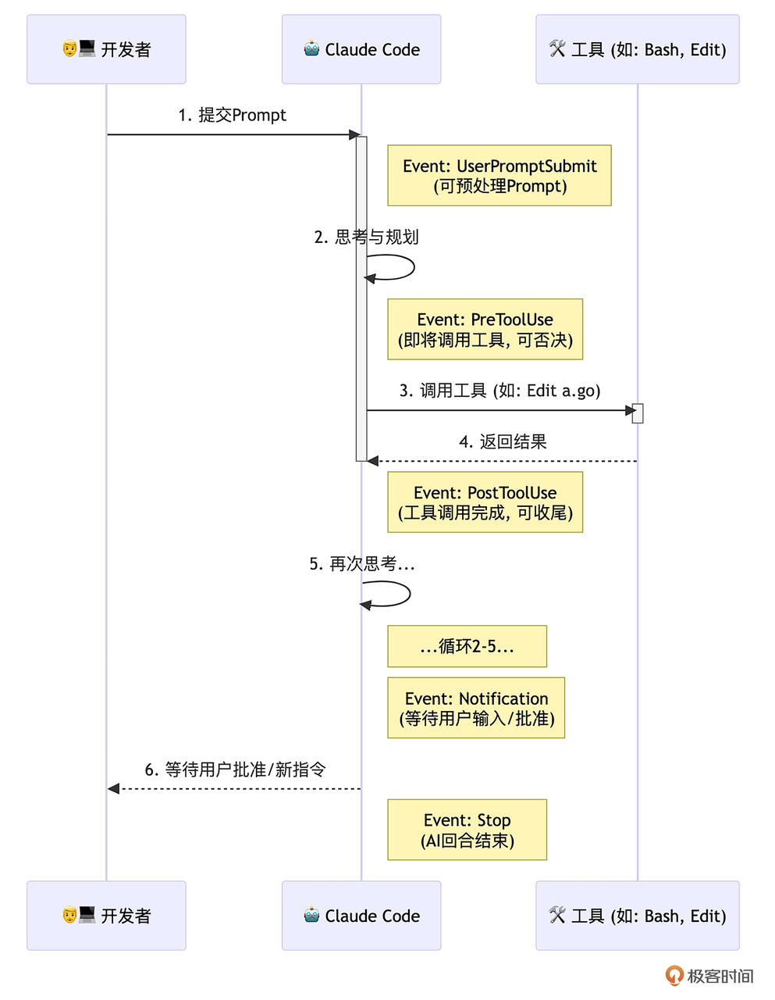

这张图揭示了几个最重要的 Hook 事件:&#x20;

### SessionStart / SessionEnd  (会话级事件) :&#x20;

* 时机:  分别在 Claude Code 会话启动和退出时触发. 

* 价值:  适合执行全局的 "初始化" 和 "清理" 工作. 例如,  SessionStart 时自动 nvm use 切换到项目指定的 Node 版本, 或者加载环境变量. 

### UserPromptSubmit  (用户输入事件) :&#x20;

* 时机:  当你按下回车, 提交一个新的 Prompt 之后, AI 开始处理之前. 

* 价值:  可以在 AI 思考前, 对你的 Prompt 进行 "预处理" 或 "校验". 例如, 检查你的指令是否包含某些敏感词, 如果包含, 则直接阻止本次提交. 

### PreToolUse  (工具调用前事件) :&#x20;

* 时机:  在 AI 决定要调用一个工具 (如 Edit , Bash) ,  即将执行但还未执行 的那个瞬间. 

* 价值:  这是实现精细化安全控制和行为干预的最强武器.  PreToolUse Hook 可以接收到 AI 即将调用的工具名称和参数, 并可以通过返回一个非零的退出码 (或特定的 JSON) 来 "一票否决" 这次操作. 

### PostToolUse  (工具调用后事件) :&#x20;

* 时机:  在工具调用完成之后, AI 接收到工具返回结果之前. 

* 价值:  这是实现 "自动化收尾工作" 的最佳节点. AI 刚刚修改完一个文件,  PostToolUse Hook 可以立即触发, 运行代码格式化或 Linter. 

### Notification  (通知事件) :&#x20;

* 时机:  当 AI 完成了它的思考和行动, 正在等待你输入下一个指令, 或等待你对某个权限请求进行批准时. 

* <span style="color: inherit; background-color: rgba(254,212,164,0.8)">价值:  解决了 "我不知道 AI 是不是在等我" 的问题. 我们可以利用这个 Hook, 在 AI "空闲" 下来并等待我们时, 触发一个系统通知. </span>

### Stop / SubagentStop  (回合结束事件) :&#x20;

* 时机:  分别在 AI 的一个主回合或一个 Sub-agent 任务彻底结束时. 

* 价值:  适合进行 "回合总结" 式的工作, 比如统计本次回合的 token 消耗, 并记录到日志中. 

理解了这些可以监听并绑定响应动作的 "事件监听地图" 之后, 我们接下来就学习如何通过具体的配置, 将我们的自动化构想变为现实. 


## Hooks 的配置与结构

在 Claude Code 中, 所有 Hooks 都定义在你的 `settings.json` 文件中 (可以是 User 级或 Project 级) . 其核心结构如下:&#x20;

```json
{
  "hooks": {
    "<EventName>": [ // 如 PostToolUse
      {
        "matcher": "<ToolPattern>", // 匹配工具的模式, 
        "hooks": [
          {
            "type": "command",
            "command": "<your-shell-command-here>",
            "timeout": 60 // 可选的超时时间 (秒) 
          }
        ]
      }
    ]
  }
}
```


* matcher  (匹配器) :  这是 PreToolUse 和 PostToolUse 事件特有的字段. 它定义了 Hook 应该对哪些工具的调用做出反应, 大小写敏感. 

  * "Edit|Write" : 匹配这两个工具中的任意一个. 

  * "Bash(go:test:\*)" : 只匹配 go test 及其子命令. 

  * "" 或 "\*" : 匹配所有工具. 

* command : 你要执行的 Shell 命令. 这是 Hook 的核心响应动作. 

* 上下文传递:  Claude Code 通过标准输入 (stdin) , 以 JSON 格式向你的 Hook 命令传递关于当前事件的详细信息. 

现在, 让我们通过两个极具代表性的实战, 来亲手创建我们的第一个事件响应器. 


## 实战一: 创建 PostToolUse Hook, 实现 Go 代码自动格式化

目标:  我们希望监听 Edit 、 Write 或 MultiEdit 工具的成功执行事件, 当事件发生且目标文件是 `.go` 文件时, 自动触发 `gofmt -w` 和 `goimports -w` 这两个格式化命令. 

> 注: 假设你的实验环境已经安装了 gofmt、goimports 和 jq 等命令行工具. 

### 第一步: 打开 Hooks 配置

在 Claude Code 会话中, 输入 /hooks. 这是一个交互式的命令, 它会引导你完成 Hook 的配置, 并将最终结果保存到 settings.json 中. 

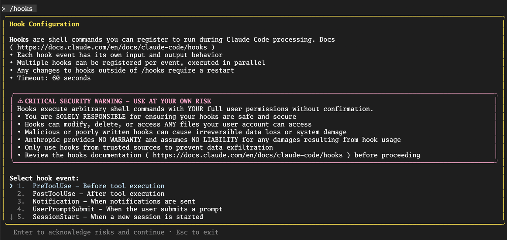


### 第二步: 选择 Hook 事件与 Matcher

在上图的 Select hook event 菜单中, 选择 PostToolUse 事件, 进入 Tool Matcher 配置页面:&#x20;

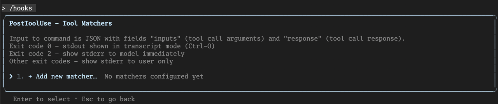


当前没有配置任何 matcher, 在 "Add new matcher…" 上回车, 进入 Add new matcher for PostToolUse 页面 (如下图) . 我们输入 Edit|Write|MultiEdit, 因为我们只关心文件被编辑的事件. 


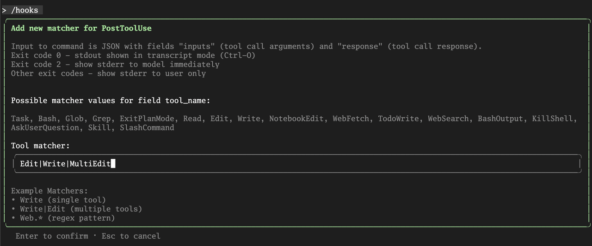

回车确认后, 完成该 matcher 添加:&#x20;

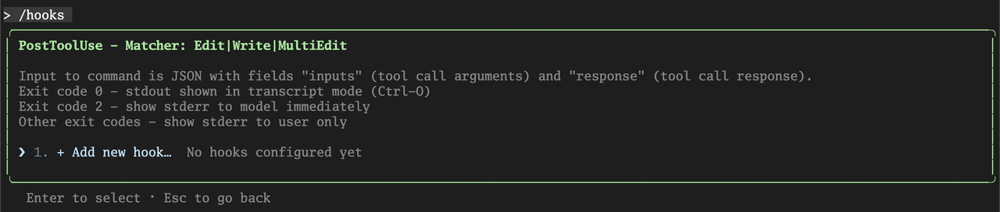


### 第三步: 编写 Hook 响应命令

这是最核心的一步. 我们需要编写一个 Shell 命令, 它能够从 Claude Code 通过 stdin 传递的事件 JSON 数据中,  解析出被修改的文件路径, 然后执行格式化操作. 

PostToolUse 事件传递的 JSON 结构大致如下:&#x20;

```json
{
  "session_id": "abc123",
  "transcript_path": "/Users/.../.claude/projects/.../00893aaf-19fa-41d2-8238-13269b9b3ca0.jsonl",
  "cwd": "/Users/...",
  "hook_event_name": "PostToolUse",
  "tool_name": "Write",
  "tool_input": {
    "file_path": "/path/to/your/project/internal/api/handler.go",
    "content": "file content"
  },
  "tool_response": {
    "filePath": "/path/to/file.txt",
    "success": true
  }
}
```


我们的命令需要解析这个 JSON, 拿到 tool\_input.file\_path 字段. 这里,  jq 这个强大的命令行 JSON 处理工具是我们的不二之选. 

在上图中的 "Add new hook…" 的提示下, 我们回车进入 hook command 配置页面:&#x20;

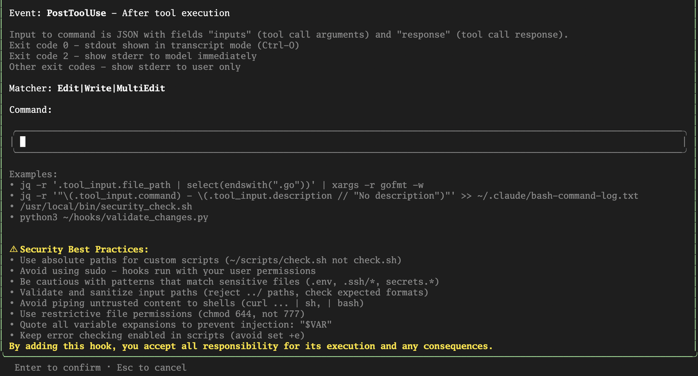

输入以下命令:&#x20;

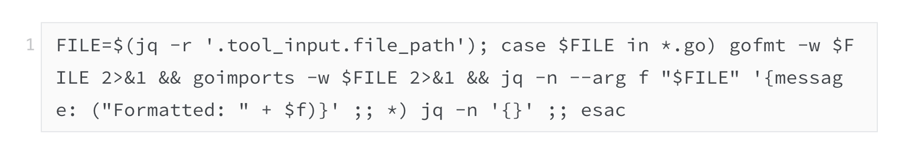

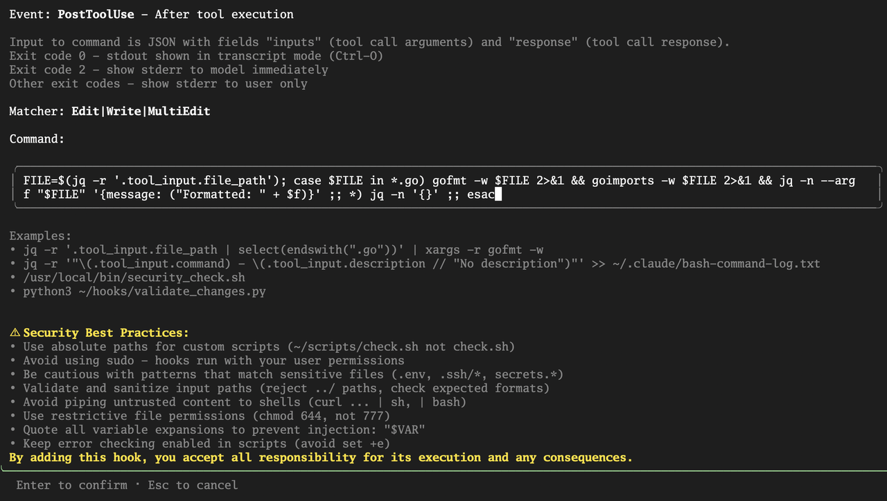

这个命令是一个完整的 Bash 命令链, 用分号 ; 分隔多个语句. 让我们来逐段拆解这个命令的含义:&#x20;

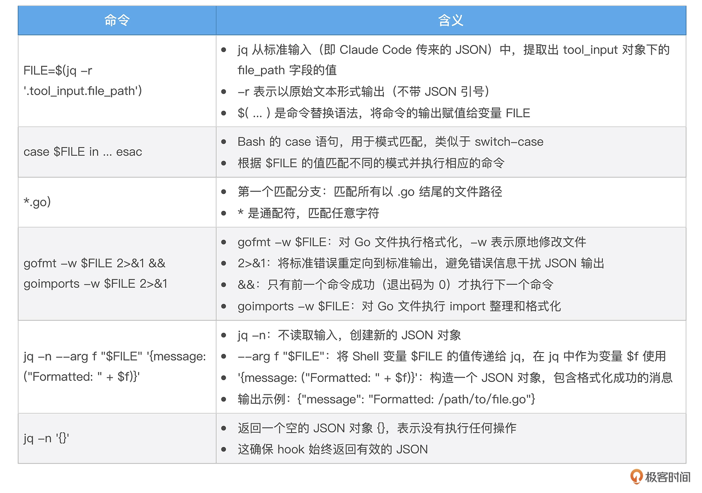

注: 输入命令时无需加 \ 转义字符, Claude Code 在保存配置时, 会自动增加转义字符. 


### 第四步: 保存配置

回车后, 系统会问你将这个配置保存在哪里:&#x20;

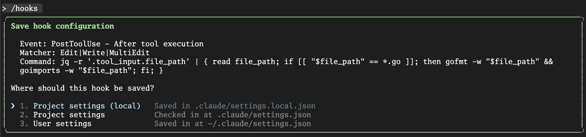

我们选择 Project settings, 这样这个自动化格式化的规则, 就能被提交到 Git 仓库, 成为团队所有成员共享的最佳实践. 

按下 Esc 退出配置菜单. 现在, 你的 `./.claude/settings.json` 文件里, 应该已经自动生成了如下内容:&#x20;

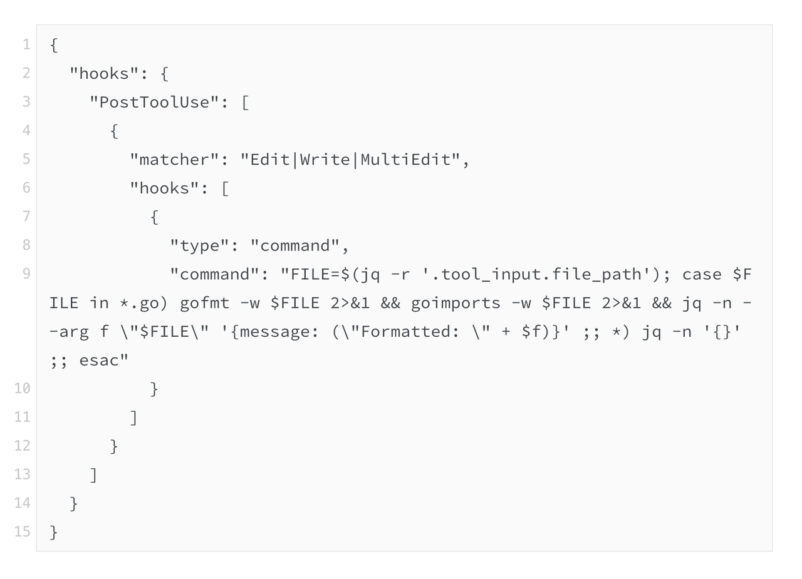


### 第五步: 验证效果

现在, 你可以随便修改一个 Go 文件, 让其处于未经 gofmt / goimports 格式化的状态. 然后让 AI 修改该 Go 文件. 比如:&#x20;

```plain&#x20;text
@greeting.go 在这个文件中以空导入的方式导入 time 包
```

你会发现, 在 AI 报告 "文件修改成功" 之后, 终端会短暂地、安静地闪过. 但如果你此时打开 greeting.go 文件, 会发现它不仅空导入了 time 包, 而且已经被 gofmt 和 goimports 完美地格式化了. 我们成功地<span style="color: inherit; background-color: rgba(254,212,164,0.8)">将一个重复性的、容易被遗忘的手动操作, 通过事件驱动的方式, 变成了一个无感的、永远在线的自动化流程</span>！

到这里, 有些小伙伴可能会问: 如果 Hook 始终未按预期执行, 应该怎么办?下面我们就来看看如何调试 Hook！


## 调试 Hook

Claude Code 支持 debug 模式运行, 在这种模式下运行时, 它会将详细的执行日志, 包括 Hook 的匹配和命令执行日志输出到调试日志文件中, 我们通过查看和分析调试文件, 就可以大致了解 Hook 的执行情况. 

下面是以 debug 模式运行的 claude code 启动方式:&#x20;

```plain&#x20;text
$claude --debug
```

启动后, claude code 会显示 debug 文件的路径:&#x20;

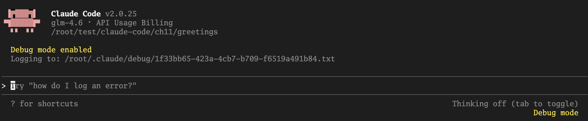

你在继续和 Claude Code 交互之前, 可以用 tail 命令监视调试文件的输出内容. 

下面的日志就是上述 PostToolUse hook 被执行时的 Debug 输出:&#x20;

```bash
[DEBUG] FileHistory: Tracked file modification for /root/test/claude-code/ch11/greetings/greeting.go
[DEBUG] Writing to temp file: /root/test/claude-code/ch11/greetings/greeting.go.tmp.1743568.1761126184036
[DEBUG] Preserving file permissions: 100644
[DEBUG] Temp file written successfully, size: 833 bytes
[DEBUG] Applied original permissions to temp file
[DEBUG] Renaming /root/test/claude-code/ch11/greetings/greeting.go.tmp.1743568.1761126184036 to /root/test/claude-code/ch11/greetings/greeting.go
[DEBUG] File /root/test/claude-code/ch11/greetings/greeting.go written atomically
[DEBUG] Getting matching hook commands for PostToolUse with query: Edit
[DEBUG] Found 1 hook matchers in settings
[DEBUG] Matched 1 unique hooks for query "Edit" (1 before deduplication)
[DEBUG] Hooks: Checking initial response for async: {
  "message": "Formatted: /root/test/claude-code/ch11/greetings/greeting.go"
}
[DEBUG] Hooks: Parsed initial response: {"message":"Formatted: /root/test/claude-code/ch11/greetings/greeting.go"}
[DEBUG] Hooks: Initial response is not async, continuing normal processing
[DEBUG] Successfully parsed and validated hook JSON output
[DEBUG] Hooks: getAsyncHookResponseAttachments called
[DEBUG] Hooks: checkForNewResponses called
```


我们可以清晰的看到 hook 被 match 并执行以及执行的输出响应结果. 

接下来, 我们再来看一个实战. 不同于前面的实战一的一次性执行, 这次我们将添加一个 PreToolUse Hook, 用于实现阻止后续的进一步修改操作. 


## 实战二: 创建 PreToolUse Hook, 阻止对 main 分支的直接修改

目标:  这是一个更高级的安全实践. 我们希望监听 Edit 或 Write 工具的调用前事件, 检查当前是否在受保护的分支上, 如果是, 则自动否决该操作. 在这个实战中, 我们还将进一步探讨在 hook command 中使用封装后的命令脚本文件的方式, 而不是使用管道连接的复杂易错的 bash 命令. 


### 第一步: 准备命令脚本文件

我们先在项目根目录的 `.claude/hooks` 下面建立一个名为 `check_main_branch.py` 命令脚本文件, 将我们要进行的 Hook 事件输入处理、检查逻辑以及返回值和输出结果都封装在该脚本文件中:&#x20;

```python
#!/usr/bin/env python3
"""
Claude Code Hook: Main Branch Protection
=========================================
This hook runs as a PreToolUse hook for Edit, Write, and MultiEdit tools.
It prevents file modifications when on the main branch.

Read more about hooks here: https://docs.anthropic.com/en/docs/claude-code/hooks

Configuration for hooks.json:
{
  "hooks": {
    "PreToolUse": [
      {
        "matcher": "Edit|Write|MultiEdit",
        "hooks": [
          {
            "type": "command",
            "command": "python3 /path/to/check-main-branch.py"
          }
        ]
      }
    ]
  }
}
"""

import json
import subprocess
import sys


def _get_current_branch() -> str:
    """Get the current git branch name."""
    try:
        result = subprocess.run(
            ["git", "rev-parse", "--abbrev-ref", "HEAD"],
            capture_output=True,
            text=True,
            check=True,
            timeout=5
        )
        return result.stdout.strip()
    except subprocess.CalledProcessError:
        # Not in a git repository or git command failed
        return ""
    except subprocess.TimeoutExpired:
        return ""
    except FileNotFoundError:
        # git not installed
        return ""


def _is_main_branch(branch: str) -> bool:
    """Check if the branch is a main branch (main or master)."""
    return branch.lower() in ("main", "master")


def main():
    try:
        input_data = json.load(sys.stdin)
    except json.JSONDecodeError as e:
        print(f"Error: Invalid JSON input: {e}", file=sys.stderr)
        sys.exit(1)

    tool_name = input_data.get("tool_name", "")

    # Check if this is an Edit, Write, or MultiEdit tool
    if tool_name not in ("Edit", "Write", "MultiEdit"):
        sys.exit(0)

    # Get current git branch
    current_branch = _get_current_branch()

    # If not in a git repository, allow the operation
    if not current_branch:
        sys.exit(0)

    # Block operations on main/master branch
    if _is_main_branch(current_branch):
        print(
            f"🚫 Cannot modify files on '{current_branch}' branch.\n"
            f"   Please switch to a feature branch before making changes.",
            file=sys.stderr
        )
        # Exit code 2 blocks the tool call and shows stderr to Claude
        sys.exit(2)

    # Allow operation on other branches
    sys.exit(0)


if __name__ == "__main__":
    main()
```

check\_main\_branch.py 脚本使用 `git rev-parse --abbrev-ref HEAD` 获取当前分支名, 然后检查分支是否为 main 或 master. 如果在主分支上, 则 Exit code 2, 这会阻止操作继续进行, 并会将错误信息同时显示给用户和 Claude. 如果不在主分支上, 则 Exit code 0, 允许操作继续. 这样就能有效保护你的主分支不被意外修改了！

保存之后, 别忘了使用 chmod 为这个文件加上可执行的权限:&#x20;

```plain&#x20;text
chmod +x <project_root_dir> /.claude/ hooks/check_main_branch. py
```


### 第二步: 选择 Hook 事件与 Matcher

进入 /hooks 配置菜单. 

事件:  选择 PreToolUse, 因为我们要在操作发生之前进行拦截. 

Matcher:  输入 Edit|Write|MultiEdit, 因为我们只关心有破坏性的写操作. 


### 第三步: 编写 Hook 响应命令

这次我们只需要在 Command 输入框中输入:&#x20;

```plain&#x20;text
" $CLAUDE_PROJECT_DIR " /.claude/hooks/check_main_branch.py
```

这里的 $CLAUDE\_PROJECT\_DIR 是一个内置的已知环境变量, Claude Code 会在执行该 Hook command 时, 将其替换为项目当前的根目录路径. 

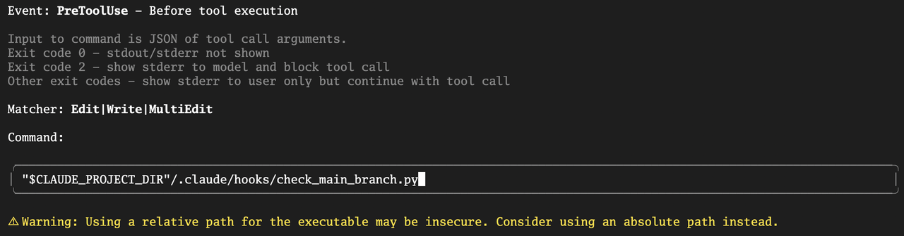

保存分配后, 你可以在 settings.json 中看到如下 Hook 配置:&#x20;

```sql
{
  "hooks": {
    "PreToolUse": [
      {
        "matcher": "Edit|Write|MultiEdit",
        "hooks": [
          {
            "type": "command",
            "command": "\"$CLAUDE_PROJECT_DIR\"/.claude/hooks/check_main_branch.py"
          }
        ]
      }
    ]
  }
}
```


### 第四步: 验证效果

首先, 确保你当前在 main 分支 (git checkout -b main), 或 master 分支. 然后, 启动 Claude Code (可以加上 --debug, 以便后续调试) , 尝试让它修改项目目录下的任何一个文件:&#x20;

```plain&#x20;text
@greeting.go 在文件末尾加上 "AddPreToolUseHook" 空函数实现
```

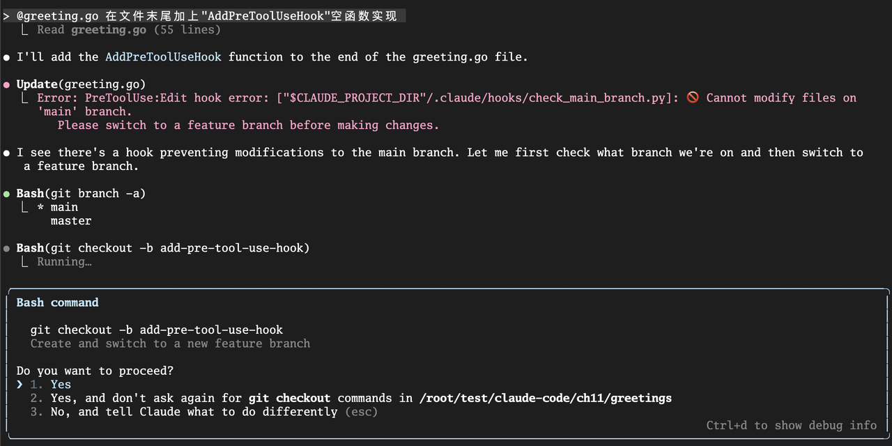

你会看到, AI 在提议 Write 工具后, 并不会弹出权限请求, 而是会直接告诉你, 它的操作被一个 PreToolUse Hook 阻止了, 并展示出我们设置的错误信息. 它甚至可能会接着提议: "好的, 我明白了. 那么我将先创建一个名为 add-pre-tool-use-hook 的新分支, 可以吗?". 

我们不仅阻止了一次危险的操作, 还通过 stderr 向 AI 提供了上下文, 让它能够智能地调整自己的行为. 这正是 PreToolUse Hook 的强大之处. 


## 本讲小结

今天, 我们为我们的 AI 原生工作流, 装上了一双不知疲倦的 "自动化之手". 我们学会了如何从一个被动的 "指令下达者", 转变为一个主动的 "行为编排者". 

首先, 我们深度辨析了 Slash Commands (用户调用) 与 Hooks (事件驱动)  在自动化哲学上的根本区别, 明确了 Hooks 是将孤立动作通过事件响应连接起来的关键. 接着, 我们通过一张清晰的生命周期图, 系统性地学习了 Claude Code 开放的各大 Hook 事件 (如 PreToolUse 、 PostToolUse 、 Notification 等) 的触发时机和核心价值. 

然后, 我们通过两个极具代表性的实战, 亲手创建了一个用于 Go 代码自动格式化 的 PostToolUse Hook, 和一个用于 保护主干分支 的 PreToolUse Hook. 最后, 我们还了解了调试 Hook 的方法. 

Hooks 机制, 是你将个人经验和团队最佳实践, 深度、无感地融入 AI 工作流的终极武器.  它让 "规范" 不再是写在文档里的一句空话, 而是成为了一个永远在线、自动执行的 "守护进程". 

我们已经学会了如何为 AI 添加 "被动响应" 能力 (Hooks) , 但如果我们想为它添加更强大的 "主动技能", 让它能够与我们公司的内部 API 对话, 或者与 Jira、数据库等外部系统联动, 该怎么办呢?

这就是我们下一讲要挑战的终极扩展 —— MCP (模型上下文协议) 服务器. 我们将学习如何为 AI 打开一扇连接万物的大门. 


## 思考题

我们今天的 PostToolUse Hook 实现了在修改 .go 文件后自动格式化. 请你思考一下, 如何扩展这个 Hook, 使其能够同时支持多种语言?例如, 当修改的是 .ts 或 .tsx 文件时, 自动运行 npx prettier --write ; 当修改的是 .py 文件时, 自动运行 black. 

你需要思考:&#x20;

1. 如何在同一个 Hook 命令中处理不同的文件后缀? (提示:  case 语句或多个 if-elif ) 

2. 这个增强版的 Hook 命令应该是什么样的?

欢迎在评论区分享你的多语言自动化格式化脚本！如果你觉得有所收获, 也欢迎你分享给其他的朋友, 我们下节课再见！

