你好，我是 Tony Bai。

在前面的几讲中，我们已经学会了如何通过自定义指令（Slash Commands）和钩子（Hooks）来扩展和自动化 AI 的行为。我们的 AI 伙伴已经变得非常 “能干” 和 “主动”。

但是，它的能力边界，仍然被局限在 Claude Code 的内置工具集（读写文件、执行 Shell 命令）之内。

* 如果我们想让 AI 直接查询我们公司的 内部知识库 来回答问题，该怎么办？

* 如果我们想让 AI 在发现 Bug 后，自动到我们的 Jira 系统 里创建一个工单，该怎么办？

* 如果我们想让 AI 在完成一个 Feature 的实现后，自动在我们的 GitHub 项目 里创建一个 PR，该怎么办？

* 如果我们想让 AI 直接操作我们的 Figma 设计稿, 将设计转化为代码，又该怎么办？


这些任务，已经远远超出了内置工具的能力范畴。它们需要 AI 具备一种全新的、与 外部世界 —— 无论是公共的云服务，还是你公司内部的私有系统 —— 进行 结构化、安全 通信的能力。

这，就是我们今天要解锁的 AI Agent 能力扩展 —— MCP（Model Context Protocol，模型上下文协议）服务器。

今天这一讲，我们将深入 AI Agent 能力扩展的 “圣杯”。你将理解 MCP 为何是连接 AI 与万物的关键协议，并手把手地学会如何 发现、连接、认证和使用 一个真实的 MCP 服务器 ——GitHub MCP Server。学完之后，你将拥有将 AI 接入任何 API 系统的能力，真正打开 “连接万物” 的大门。


## 超越内置工具: 为什么我们需要 MCP？

你可能会问，既然 Claude Code 已经有了强大的 Bash 工具，我为什么不能直接在 AI 的 Prompt 里，让它用 curl 命令去调用 Jira 的 API 呢？这是一个非常好的问题。直接使用 curl 确实可以在某些简单场景下工作，但这种方式存在着几个致命的缺陷，使得它在严肃的、生产级的应用中难当大任:&#x20;

1. 脆弱性: 你需要将复杂的 API 调用细节（URL、请求头、JSON Body 结构）全部写在自然语言的 Prompt 里。这不仅极其繁琐，而且极易出错。AI 可能会误解你的意图，生成一个错误的 curl 命令，导致调用失败。

2. 安全性: 如果 API 需要认证，你就必须将你的 API\_KEY 或 TOKEN 直接暴露在 Prompt 中。这存在着巨大的安全风险，你的密钥可能会被记录在对话历史中，甚至意外泄露。

3. 无状态: curl 是无状态的。如果一个操作需要多步（比如 OAuth 认证），AI 很难管理和维持这个状态。

4. 发现性差: AI 并不知道你的 API 到底有哪些能力（Endpoints）、需要什么参数。它完全依赖于你在 Prompt 中提供的 “文档”。

MCP 的诞生，正是为了系统性地解决以上所有问题。MCP 并非一个具体的工具，而是一套 开放的、为 AI Agent 量身设计的 RPC（远程过程调用）协议。它定义了一套标准的 “对话语言”，让 AI Agent 可以与外部服务进行高效、安全、结构化的通信。它在 AI Agent 和外部世界之间，建立了一个 安全的、标准化的、具备 “服务发现” 能力的 “抽象层”。


## MCP 工作原理: 一种为 AI 设计的 RPC 协议

要真正精通 MCP，我们必须首先理解其协议规范中定义的三个核心角色: 主机（Host）、客户端（Client）和服务器（Server）。它本质上是一个经典的客户端 - 服务器模型，但增加了一个 “主机” 角色，专为 AI Agent 的复杂协作模式进行了深度优化。


主机（Host）的角色定位是 “总指挥” 与 “协调者”。这是用户直接与之交互的应用程序. 在我们的世界里: <span style="color: inherit; background-color: rgba(254,212,164,0.8)">Claude Code 本身就是主机</span>。它有 3 个核心职责:&#x20;

1. 创建和管理与各个服务器连接的 客户端实例。

2. 执行安全策略，处理用户的 权限批准。

3. 作为 AI 大模型与所有客户端之间的桥梁, 聚合上下文，分发任务。


服务器（Server）的角色定位是 “能力提供方”。这是一个独立的程序，可以是本地脚本，也可以是远程服务。在我们的世界里，GitHub MCP Server、我们后面会实战的 Airtable 服务器等，都是服务器。

它的核心职责是向主机暴露自己的能力。根据 MCP 规范，服务器可以提供三类核心能力:&#x20;

1. 工具（Tools）: 这是最核心的能力，即 AI 可以执行的动作。例如， create\_issue 就是一个工具。

2. 资源（Resources）: 这是 AI 可以引用的数据。例如，一个服务器可以暴露 @github:issue://123 这样的资源，让 AI 可以通过 @ 指令直接获取该 Issue 的上下文数据。

3. 提示（Prompts）: 这是 用户可以调用的工作流模板。服务器可以将一个复杂的、内部优化过的 Prompt，封装成一个简单的 Slash Command 供用户使用，例如 /mcp\_\_github\_\_list\_prs。


客户端（Client）的角色定位是 “专线连接器” 与 “协议处理器”。这是一个由主机在内部创建和管理的组件，用户通常无感知。


主机（Claude Code）为每一个它连接的服务器，都创建一个专属的客户端实例。这个客户端负责与那一个服务器建立 1 对 1 的、有状态的会话, 并处理所有底层的协议协商、消息路由和安全边界。

理解了这三个角色之后，我们就能更精确地描绘其核心工作流程。我们常说的 “Claude Code 与 MCP 服务器通信”，其背后更精确的描述是:&#x20;

> 主机（Claude Code）接收到 AI 模型的 Tool Call 意图后，通过其内部为特定服务器创建的客户端实例，将这个意图封装成一个标准的 MCP 协议请求，并发送给该服务器。服务器执行内部逻辑后，通过同一条专线连接，将结果返回给客户端，最终由主机呈现给用户或再次提交给 AI 模型。


让我们用一个序列图来更直观地描绘一下这个过程:&#x20;

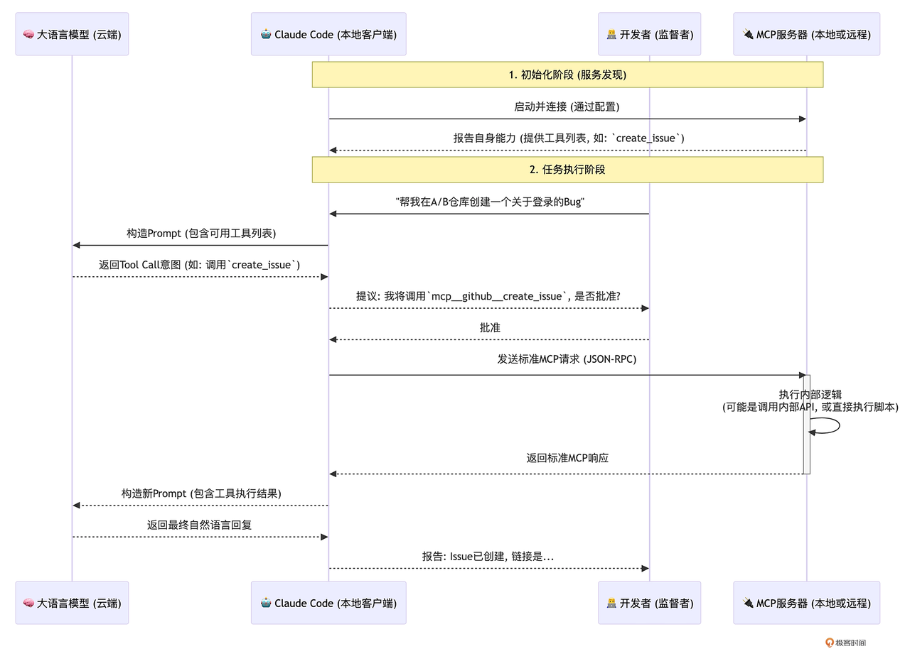

这个流程清晰地揭示了 MCP 的几个关键特性:&#x20;

1. 服务发现: 在连接之初，MCP 服务器就会向 Claude Code “自我介绍”，告诉 AI 自己拥有哪些工具（Tools）以及每个工具需要什么参数。

2. <span style="color: inherit; background-color: rgba(254,212,164,0.8)">责任分离: AI 大模型只负责根据可用工具列表，产生 “调用哪个工具” 的意图。Claude Code 客户端负责将这个意图，翻译成标准的 MCP 协议请求。而 MCP 服务器则只负责响应这个标准协议，执行自身的业务逻辑。</span>

3. 命名空间: Claude Code 会自动为来自不同 MCP 服务器的工具加上命名空间前缀，格式为 mcp\_\_\<server\_name>\_\_\<tool\_name>, 避免冲突。

4. 认证解耦: 这是 MCP 安全模型的核心。整个过程中，AI 大模型本身完全不接触任何敏感的 API Key 或 Token。认证凭证的配置发生在主机（Claude Code）侧。主机在启动时，会将这些配置好的凭证安全地注入到运行环境中（通常是通过环境变量）。


## 安装和配置 MCP 服务器: claude mcp add 与三大 Scope

要将一个 MCP 服务器 “注册” 到 Claude Code 中，我们主要使用 claude mcp add 命令。根据服务器的部署方式，它支持三种 传输协议（Transport）:&#x20;

* \--transport http: 用于连接远程的、通过 HTTP 提供服务的 MCP 服务器。

* \--transport sse: (已废弃) 用于连接老的、通过 Server-Sent Events 提供服务的服务器。

* \--transport stdio: 用于连接在你 本地 运行的、通过标准输入 / 输出（stdin/stdout）进行通信的 MCP 服务器。

更重要的是，你需要决定这个服务器配置的 作用域（Scope）, 这决定了它的可用范围和共享级别。

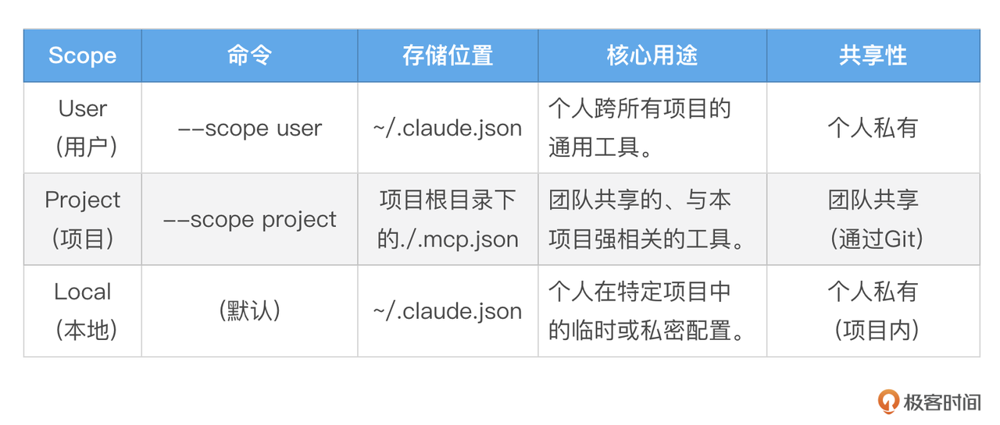

<span style="color: inherit; background-color: rgba(254,212,164,0.8)">【最佳实践】 遵循一个简单的原则: 需要团队所有成员都使用的服务，用 --scope project; 只属于你自己的、跨项目通用的工具，用 --scope user; 临时的、不想提交到 Git 的个人测试，使用默认的 local scope。</span>

> 注: 你可以通过 claude mcp add/list/get/remove 对 MCP Server 进行管理。

理论已经足够，现在让我们通过两个由简到繁的实战，来亲手将这些强大的能力集成到我们的工作流中。


## 实战一: 从 “Hello, World” 开始 —— 用 Go 构建你的第一个本地 stdio 服务器

让我们从一个最纯粹、最简单的场景开始: 创建一个没有任何外部依赖、不需要任何 API Key 的 “Hello, World” 级别的本地 MCP 服务器。这个练习的目标，是让你抛开一切干扰，只聚焦于 MCP 的 核心工作机制, 并且是在我们最熟悉的 Go 语言环境 中。

我们将创建一个名为 greet 的工具，当你调用它并传入一个名字时，它会返回一句问候。


### 第一步: 编写服务器 Go 程序（ hello-mcp-server.go ）

在你的项目根目录下，创建一个名为 hello-mcp-server.go 的文件，并将以下 Go 代码完整地粘贴进去。

```go
// hello-mcp-server.go
package main

import (
    "bufio"
    "encoding/json"
    "fmt"
    "log"
    "os"
)

// Request 定义通用的请求和响应结构体，以匹配 MCP 的 JSON-RPC 格式
type Request struct {
    JSONRPC string          `json:"jsonrpc"`
    ID      any             `json:"id"`
    Method  string          `json:"method"`
    Params  json.RawMessage `json:"params"`
}

type Response struct {
    JSONRPC string `json:"jsonrpc"`
    ID      any    `json:"id"`
    Result  any    `json:"result,omitempty"`
    Error   *Error `json:"error,omitempty"`
}

type Error struct {
    Code    int    `json:"code"`
    Message string `json:"message"`
}

func main() {
    // MCP 服务器通过标准输入 / 输出进行通信，所以我们需要一个扫描器来读取 stdin
    scanner := bufio.NewScanner(os.Stdin)
    for scanner.Scan() {
       line := scanner.Bytes()

       // 读取每一行（通常是一个 JSON-RPC 请求），并尝试解析
       var req Request
       if err := json.Unmarshal(line, &req); err != nil {
          log.Printf("Error unmarshaling request: %v", err)
          continue
       }

       // 根据请求的 Method 字段，路由到不同的处理函数
       switch req.Method {
       case "initialize":
          handleInitialize(req)
       case "tools/list":
          handleToolsList(req)
       case "tools/call":
          handleToolCall(req)
       case "notifications/initialized":
          // 客户端发送的初始化完成通知，无需响应
          continue
       default:
          sendError(req.ID, -32601, "Method not found")
       }
    }
}

// handleInitialize 负责向 Claude Code"自我介绍"
func handleInitialize(req Request) {
    // 符合 MCP 协议的 initialize 响应
    initializeResult := map[string]any{
       "protocolVersion": "2024-11-05", // MCP 协议版本
       "capabilities": map[string]any{
          "tools": map[string]any{}, // 声明支持工具能力
       },
       "serverInfo": map[string]any{
          "name":    "hello-server",
          "version": "1.0.0",
       },
    }
    sendResult(req.ID, initializeResult)
}

// handleToolsList 返回可用工具列表
func handleToolsList(req Request) {
    toolsListResult := map[string]any{
       "tools": []map[string]any{
          {
             "name":        "greet",
             "description": "A simple tool that returns a greeting.",
             "inputSchema": map[string]any{
                "type": "object",
                "properties": map[string]any{
                   "name": map[string]any{
                      "type":        "string",
                      "description": "The name of the person to greet.",
                   },
                },
                "required": []string{"name"},
             },
          },
       },
    }
    sendResult(req.ID, toolsListResult)
}

// handleToolCall 负责处理工具的实际调用
func handleToolCall(req Request) {
    var params map[string]any
    if err := json.Unmarshal(req.Params, &params); err != nil {
       sendError(req.ID, -32602, "Invalid params")
       return
    }

    toolName, _ := params["name"].(string)
    if toolName != "greet" {
       sendError(req.ID, -32601, "Tool not found")
       return
    }

    toolArguments, _ := params["arguments"].(map[string]any)
    name, _ := toolArguments["name"].(string)

    // 这是我们工具的核心逻辑
    greeting := fmt.Sprintf("Hello, %s! Welcome to the world of MCP in Go.", name)

    // MCP 期望的响应格式
    toolResult := map[string]any{
       "content": []map[string]any{
          {
             "type": "text",
             "text": greeting,
          },
       },
    }
    sendResult(req.ID, toolResult)
}

// sendResult 和 sendError 是辅助函数，用于向 stdout 发送格式化的 JSON-RPC 响应
func sendResult(id any, result any) {
    resp := Response{JSONRPC: "2.0", ID: id, Result: result}
    sendJSON(resp)
}

func sendError(id any, code int, message string) {
    resp := Response{JSONRPC: "2.0", ID: id, Error: &Error{Code: code, Message: message}}
    sendJSON(resp)
}

func sendJSON(v any) {
    encoded, err := json.Marshal(v)
    if err != nil {
       log.Printf("Error marshaling response: %v", err)
       return
    }
    // MCP 协议要求每个 JSON 对象后都有一个换行符
    fmt.Println(string(encoded))
}
```


这个 Go 程序就是一个功能完整的 MCP 服务器。它虽然简单，但 完美地实现了 MCP stdio 协议的核心:&#x20;

1. 通过 main 函数循环读取标准输入。

2. 通过 handleInitialize 函数，响应客户端的初始化请求，声明服务器的协议版本、能力和基本信息。

3. 通过 handleToolsList 函数，响应工具列表查询请求，报告自己拥有一个名为 greet 的工具。

4. 通过 handleToolCall 函数，处理对 greet 工具的调用，执行业务逻辑，并返回结果。

通过辅助函数，将所有响应以标准的 JSON - RPC 格式写回标准输出。


### 第二步: 注册 MCP 服务器

现在，打开终端，执行以下命令，将这个本地 Go 程序 “注册” 为一个 Claude Code 可以调用的 MCP 服务器。

```bash
$ claude mcp add --transport stdio hello -- go run ./hello-mcp-server.go
Added stdio MCP server hello with command: go run ./hello-mcp-server.go to local config
File modified: /Users/joeyzou/.claude.json [project: /Users/joeyzou/Code/OpenSource/hello-mcp-server]
```


让我们来深度解读这条命令:&#x20;

* claude mcp add: 我们正在添加一个新的 MCP 配置。

* \--transport stdio: 告诉 Claude Code，这是一个通过标准输入输出通信的本地服务器。

* hello: 我们给这个服务器命名为 hello, 它将成为我们工具的命名空间。

* \--: 重要的分隔符，后面是启动服务器的实际命令。

* `go run ./hello-mcp-server.go`: 这是编译并运行我们刚刚创建的 Go 程序的命令。Claude Code 在需要时，会自动在后台执行这个命令来启动我们的服务器。

执行后，Claude Code 会将这个配置保存在你项目本地（ local scope）。我们可以通过 claude mcp list 命令来验证该 mcp 服务器是否可以连接成功:&#x20;

```bash
$claude mcp list
Checking MCP server health...

hello: go run ./hello-mcp-server.go - ✓ Connected
```

如果看到类似上面的 Connected 的输出，则说明我们的 MCP Server 是正常工作的！


### 第三步: 验证与使用

启动 Claude Code:&#x20;

```bash
claude
```

在启动后，我们可以通过 /mcp 斜杠命令查看 mcp server 列表和状态:&#x20;

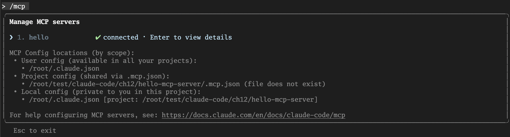

现在，让我们来调用这个全新的、由 Go 驱动的工具！请记住，工具的完整名称是 `mcp__<server_name>__<tool_name>` （这个我们在稍后的内容中还会有专门的说明）。

```bash
> 我想调用 mcp__hello__greet 工具，名字是 Tony Bai。
```

AI 会理解你的意图，并向你提议一个工具调用。你批准后，会立即看到由我们的 Go 程序返回的结果:&#x20;

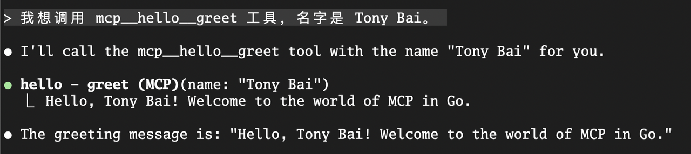


恭喜你！你已经成功地创建并连接了你的第一个、用 Go 语言编写的 MCP 服务器。这个简单的闭环，清晰地展示了从 定义能力 （ handleInitialize ），到 注册能力 （ claude mcp add ），再到 调用能力 （自然语言 -> Tool Call）的全过程。更重要的是，你现在已经亲手触摸到了 MCP 协议的底层脉搏。

掌握了如何构建和连接本地 stdio 服务器后，我们就拥有了为 AI 添加任何自定义脚本能力的基础。现在，让我们将视野从本地扩展到云端，挑战一个更强大、也更具普遍性的场景。


## 实战二: 连接远程服务 —— 集成 GitHub MCP Server

在这个实战中，我们将不再自己编写服务器，而是学习如何 连接和使用一个由第三方（在这里是 GitHub 官方）提供的、运行在云端的的远程 MCP 服务器。这是你在实际工作中更常遇到的场景，例如连接公司内部的 API 网关，或集成 SaaS 服务。

我们将要集成的 GitHub MCP Server，能赋予 AI 直接操作 GitHub 仓库的超能力，比如创建 Issue、发表评论、搜索代码等等。


### 第一步: 获取并配置认证 (Personal Access Token)

与外部服务交互，第一步永远是解决认证问题。与 GitHub API 通信，需要一个 Personal Access Token (PAT)。


1. 前往你的 GitHub 开发者设置页面下的 Personal access tokens 页面。

2. 选择 “Fine-grained tokens" 菜单项，点击 “Generate new token”。

3. 为这个 Token 命名，例如 claude-code-mcp-token。

4. 最关键的一步: 授权。你需要为这个 Token 授予相应的权限。对于我们接下来的实战，请在 Repository access 部分，选择 Only select repositories, 找到你希望 AI 操作的目标仓库（例如我们的 issue2md 项目），并至少授予以下权限（如下图）:&#x20;

   1. Issues: Read and write

   2. Pull Requests: Read and write

   3. Contents: Read-only (如果需要 AI 读取文件内容)

   4. Metadata: Read-only

5. 生成 Token，并立即 复制并妥善保管。它只会出现一次。

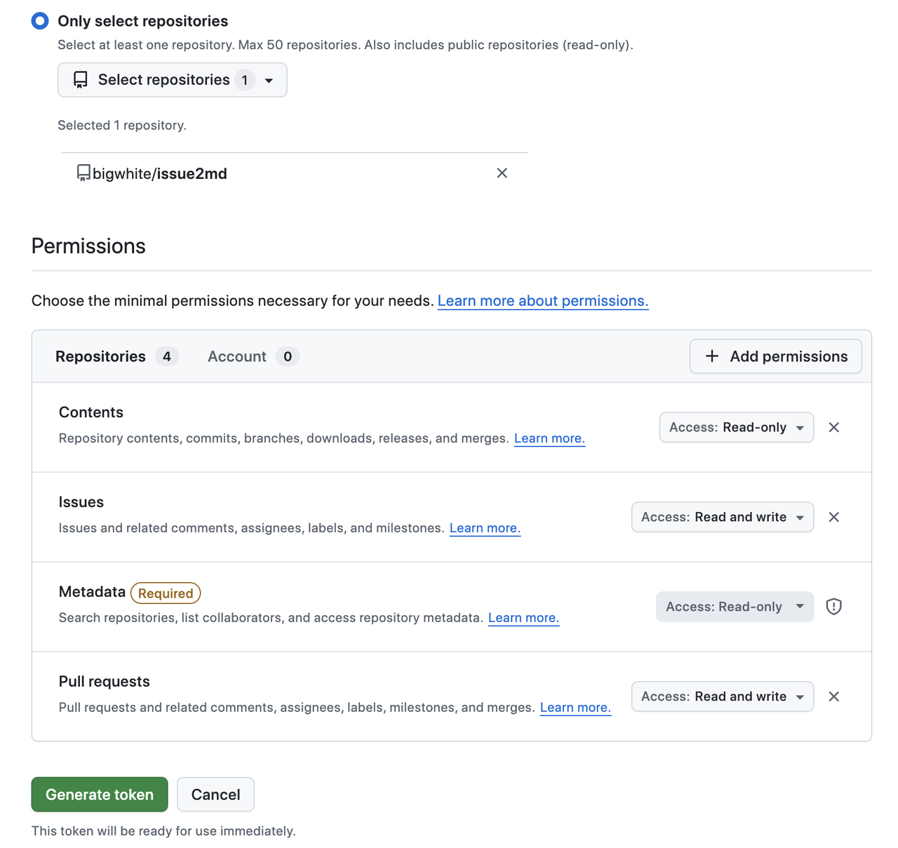


【安全最佳实践】 我们绝不能将这个 Token 硬编码到任何配置文件中。最安全、最灵活的方式，是将其设置为一个环境变量。在你的终端中执行:&#x20;

export GITHUB\_TOKEN = "ghp\_YourGitHubTokenHere"

请务必将 ghp\_... 替换为你刚刚生成的真实 Token。在每次开启新的终端会话时，你可能都需要重新设置这个环境变量。为了方便，你可以将这行命令添加到你的 Shell 配置文件中（如 \~/.zshrc 或 \~/.bash\_profile 或 \~/.bashrc ）。


### 第二步: 注册远程 MCP 服务器（HTTP Transport）

现在，我们将使用 `claude mcp add-json` 命令，将 GitHub 官方提供的远程 MCP 服务器 “注册” 到我们的 Claude Code 中。


打开终端，执行以下命令。请注意，你需要将 \<YOUR\_GITHUB\_PAT> 替换为你刚刚生成的真实 Token。

```json
claude mcp add-json github '{"type":"http","url":"https://api.githubcopilot.com/mcp/","headers":{"Authorization":"Bearer ${GITHUB_TOKEN}"}}' --scope project
```


让我们来深度解读这条命令的每一个部分:&#x20;

* `claude mcp add-json`: 我们通过直接传递 JSON 配置的方式来添加一个新的 MCP 配置。

* "type":"http": 告诉 Claude Code，这是一个通过 HTTP 协议 进行通信的远程服务器。

* github: 我们为这个服务器命名为 github, 它将成为工具的命名空间前缀。

* https://api.githubcopilot.com/mcp/: 这是 GitHub 官方提供的 MCP 服务器的 端点 URL。

* \--header "Authorization: Bearer \<YOUR\_GITHUB\_PAT>": 这是在远程、非交互式环境中进行认证的核心！ 通过 --header 参数，我们为所有发送到这个 MCP 服务器的 HTTP 请求，都预先设置了一个 Authorization 请求头。其值就是标准的 Bearer 认证方案，后面跟着你的 Personal Access Token。这完美地解决了在远程虚拟机上无法打开浏览器进行 OAuth 2.0 认证的问题。

* \--scope project: 我们将这个配置保存在 项目作用域。执行后，Claude Code 会在你的当前目录下创建一个 `.mcp.json` 文件，并将这个服务器配置写进去。将这个文件提交到 Git 仓库，你的整个团队就能共享这个配置了（当然，每个成员都需要在自己的环境中设置各自的 Token）。

执行成功后，你的 `.mcp.json` 文件内容会是这样的:&#x20;

```bash
{
  "mcpServers": {
    "github": {
      "type": "http",
      "url": "https://api.githubcopilot.com/mcp/",
      "headers": {
        "Authorization": "Bearer ${GITHUB_TOKEN}"
      }
    }
  }
}
```


### 第三步: 检查 MCP Server 连接状态以及能力列表

配置完 MCP Server 后，我们可以通过下面命令查看该 MCP Server 的连接情况:&#x20;

```bash
claude mcp list
Checking MCP server health...
github: https: //api.githubcopilot.com/mcp/ (HTTP) - ✓ Connected
```

当然，我们也可以进入 claude 交互页面，通过 /mcp 斜杠命令查看:&#x20;

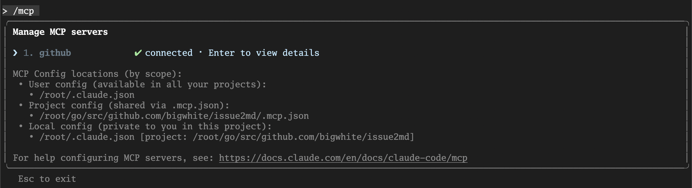

回车后，查看 github mcp 服务器的详细信息:&#x20;

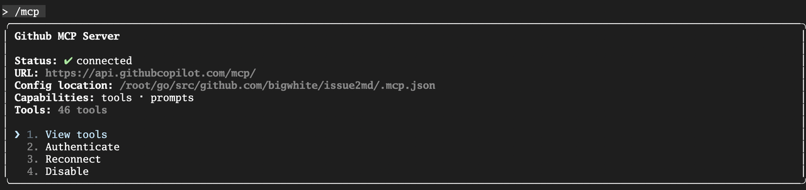

选择 View tools, 我们将看到 github MCP 服务器注册的能力列表:&#x20;

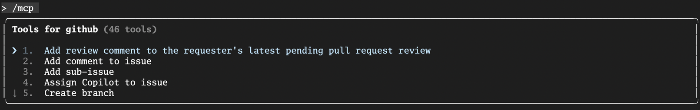


### 第四步: 实战！用自然语言操作 GitHub

万事俱备。现在，我们可以像与一位项目助理对话一样，用自然语言来操作 GitHub 了。

任务: 在 issue2md 项目中，创建一个新的 issue，标题为 test issue for claude code，然后添加一条评论，最后关闭该 issue。

我们先来创建一个新 issue:&#x20;

```bash
> 为该项目创建一个 github issue，标题是 "test for claude code" 
```

下面是 Claude Code 的执行过程:&#x20;


Claude Code 思考后，发现这个任务需要调用 github mcp server 提供的创建 issue 工具 ( mcp\_\_github\_\_create\_issue )。它会向你提议一个包含了创建 issue 的工具调用，你批准后，Claude Code 会调用工具创建该 issue:&#x20;


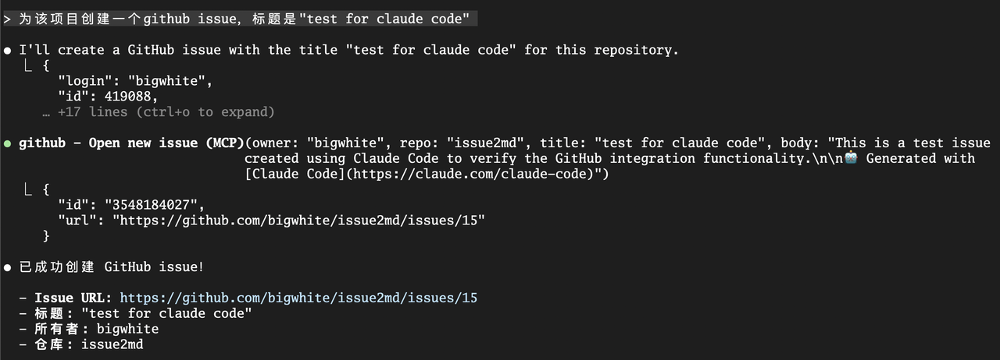


通过 github 页面，我们也能查看到新创建的 issue:&#x20;

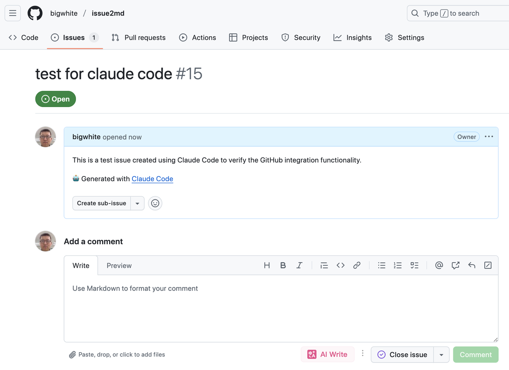


接下来，我们让 Claude Code 为该 issue 添加一条评论:&#x20;

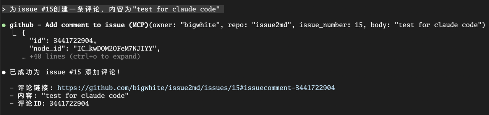

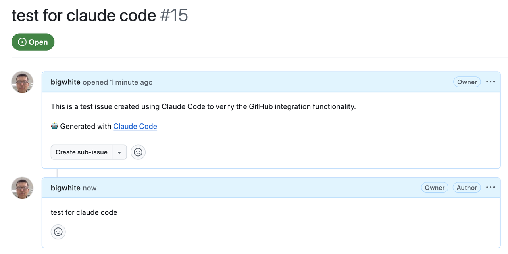


然后再关闭该 issue:&#x20;

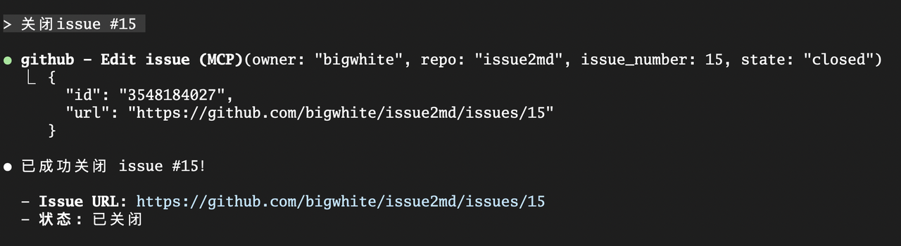


这，就是远程 MCP 的威力. 我们没有在本地运行任何复杂的服务，仅仅通过几行配置和一个环境变量，就将 AI 与一个强大的云端服务无缝地连接了起来。


## MCP 的高级用法: 将 Prompts 变为指令

MCP 的强大之处，不仅在于暴露 “工具（Tools）”，还在于可以暴露 “提示（Prompts）”。一个设计良好的 MCP 服务器，可以将其内部复杂的、经过优化的 Prompt，封装成一个简单的 Slash Command，供你在 Claude Code 中直接调用。


工作原理:&#x20;

1. MCP 服务器在向 Claude Code “自我介绍” 时，除了工具列表，还会提供一份 “Prompt 列表”。

2. Claude Code 会自动将这些 Prompt，转换为 mcp\_\_\<server\_name>\_\_\<prompt\_name> 格式的 Slash Commands。


实战场景:&#x20;

假设 GitHub MCP Server 提供了一个名为 list\_prs 的 Prompt。你不再需要自己费力地去写: “请帮我调用 mcp\_\_github\_\_list\_issues 工具，并使用 is:pr is:open author:@me 这样的查询…”，你只需要:&#x20;

```bash
> /mcp__github__list_prs
```

按下回车，Claude Code 就会自动执行那个预设好的、最优化的 Prompt，直接为你列出所有你创建的、开放的 PR。


这极大地降低了使用复杂工具的门槛，将 MCP 服务器作者的最佳实践，直接赋能给了最终用户。当你使用 / 并按 Tab 时，所有来自 MCP 服务器的指令都会出现在自动补全列表中。


## 本讲小结

今天，我们一起解锁了 Claude Code 乃至所有 AI Agent 最强大的能力 —— 连接外部世界。我们不再满足于让 AI 在本地的 “沙盒” 里工作，而是为它装上了可以触及云端服务的 “长臂”。

首先，我们深度理解了 MCP 的工作原理, 精准地辨析了主机（Host）、服务器（Server）、客户端（Client）三个核心角色，以及服务器可以向主机暴露的 工具、资源、提示 三大能力类型。

接着，我们系统性地学习了如何通过 claude mcp add 命令和三种 Scope （User, Project, Local）来安装和管理 MCP 服务器，为不同的协作场景建立了清晰的配置心智模型。

然后，也是最核心的部分，我们通过两个由简到繁的实战，获得了宝贵的动手经验: 我们亲手用 Go 语言构建并连接了一个 极简的本地 stdio 服务器, 获得了第一手的协议体感；接着，我们更进一步，学会了如何连接一个强大的 远程 HTTP 服务（GitHub）, 并掌握了在非交互式环境中通过 环境变量安全管理密钥 的关键实践。

最后，我们还了解了 MCP 的一个高级特性 —— 将 Prompts 变为 Slash Commands, 看到了将复杂工作流封装为简单指令的巨大潜力。


掌握了 MCP，你的 AI Agent 才真正从一个 “本地开发工具”，进化为了一个能够接入你的整个技术生态、具备无限潜能的 “自动化中枢”。然而，我们到目前为止所学的扩展方式 —— 无论是我们主动调用的 Slash Commands，还是 AI 根据意图选择的 MCP 工具 —— 都还是一种 “授人以鱼” 的模式。我们给了 AI 强大的 “渔具”（工具），但还没有系统性地教会它在不同水域（场景）下的 “钓鱼技巧”（成套的方法论）。

我们如何将一整套关于‘如何审查 Go 代码’的专家知识，打包成一个 AI 在看到 `.go` 文件时就能 自主发现并加载 的‘技能包’，而不是每次都依赖我们通过冗长的 Prompt 来指导？

这就是我们下一讲要探讨的主题: <span style="color: inherit; background-color: rgba(254,212,164,0.8)">智能涌现的基石 —— 精通 Agent Skills，为 AI 植入专家能力</span>。我们将学习如何将我们的知识和最佳实践，打包成 AI 可以自主发现和调用的 “知识胶囊”，让 AI 从一个 “熟练的工具使用者”，进化为一个能根据情境自主加载专家能力的 “博学思考者”。


## 思考题

今天我们学习了如何连接 GitHub MCP Server。请你打开思路， 设想一个你认为最有价值的、可以被封装成 MCP 服务器的内部工具或服务。这个服务是做什么的？它可能会向 AI 暴露哪些工具（Tools）？将它接入 Claude Code 后，可以实现哪些目前难以完成的自动化工作流？例如，一个连接公司内部 “代码片段知识库” 的 MCP Server？一个用于查询 “线上服务监控指标” 的 MCP Server？欢迎在评论区分享你的脑洞和创意！如果你觉得这节课的内容对你有帮助的话，也欢迎你分享给需要的朋友，我们下节课再见！

