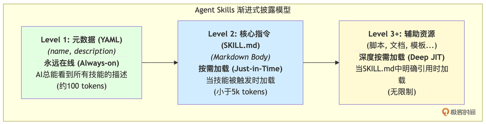
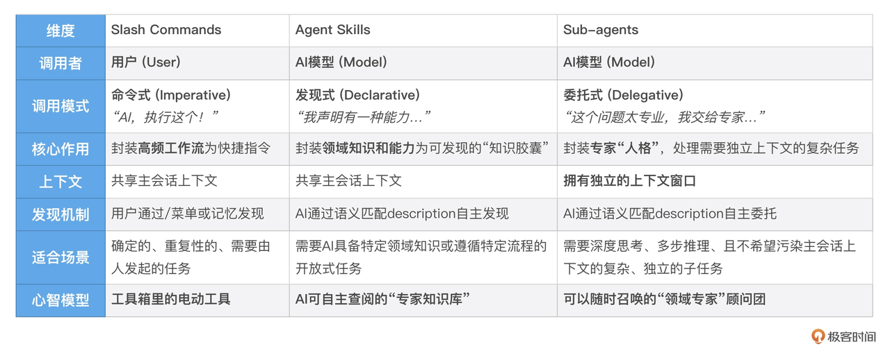
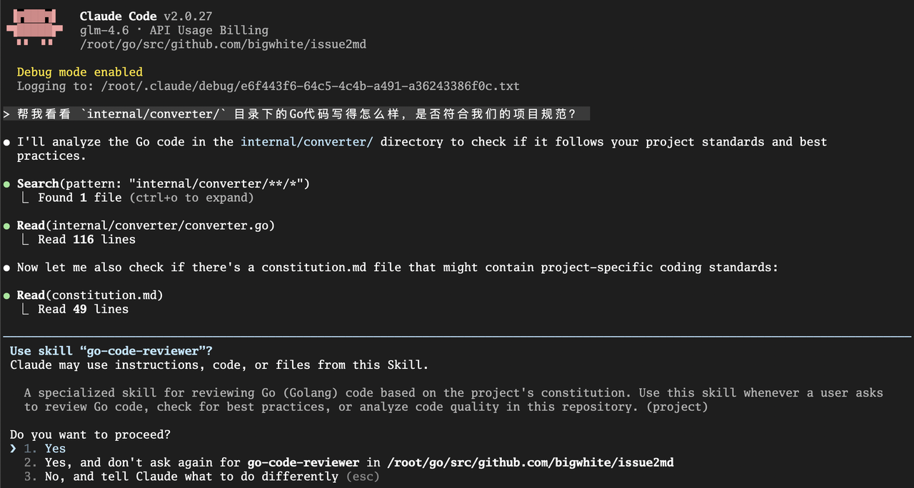
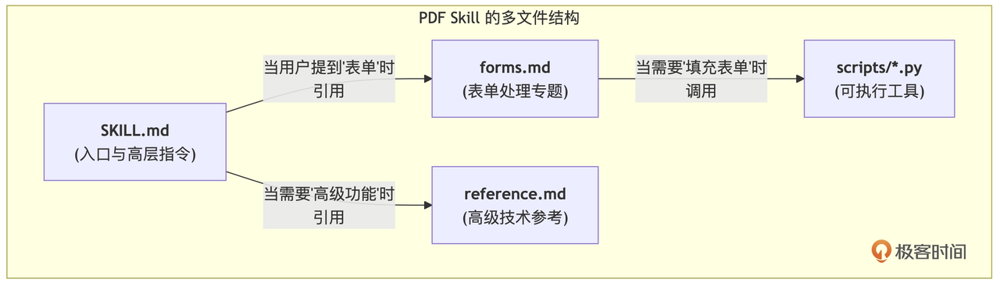

你好, 我是 Tony Bai. 

在前面的几讲中, 我们已经学会了多种为 AI "赋能" 的方法. 我们用 Slash Commands 将复杂工作流封装为用户可以 主动调用 的指令; 我们用 Hooks 在 AI 生命周期的特定节点上, 植入了 被动触发 的自动化脚本; 我们还用 MCP 服务器 为 AI 连接了广阔的 外部世界. 

我们的 AI 伙伴 Claude Code, 已经越来越像一个 通用的 (General-Purpose)  问题解决专家. 它能读文件、能跑测试、能操作 Git, 几乎无所不能. 


然而, 一个深刻的矛盾也随之浮现:&#x20;

> "随着模型能力的提升, 我们现在可以构建出能够与完整计算环境交互的 通用智能体 …… 但当这些智能体变得越来越强大时, 我们就需要一种 可组合、可扩展、可移植 的方式, 来为它们装备 领域特定的专业知识. "


这段话精辟地指出了通用 AI Agent 面临的核心挑战: **如何在保持其 "通用性" 的强大基础上, 优雅地解决 "专业性" 的问题?**

我们不可能为每一个垂直领域 (比如 "处理公司财务报表" "遵循团队 Figma 设计规范" "分析 Kubernetes 日志") 都去从零开始训练一个专门的大模型, 那样的成本是天文数字. 我们也不想把所有领域的专业知识都一股脑地塞进一个巨大的、难以维护的 `CLAUDE.md` 文件里, 那样会迅速撑爆 AI 的上下文窗口, 导致其性能下降和 "认知混乱". 


我们需要一种 **更先进的知识封装和调用机制**. 这种机制, 应该能让我们的专业知识像一个个独立的 "知识插件" 一样存在, 只有在 AI 处理相关任务时, 才被 精准地、动态地、高效地 加载进来. 

这, 正是 Anthropic 给出的革命性答案 —— Agent Skills (智能体技能) . 


今天这一讲, 我们将深入探索 AI "智能涌现" 的基石. 你将理解 Skills 为何是一种全新的能力封装范式, 学会如何将我们已有的知识和指令, 升维成可被 AI 自主发现和调用的 "技能", 并深刻辨析它与 Slash Commands、Sub-agents 之间的核心区别. 掌握 Skills, 意味着你将开始让 AI 从一个 "听话的执行者", 向一个 "博学的思考者" 进化. 


## 从 "指令" 到 "技能": 为什么说 Agent Skills 是能力涌现的关键?

要理解 Skills 的革命性, 我们必须先厘清 "指令" (Instruction) 与 "技能" (Skill) 之间的本质区别. 

* 指令 (如 Slash Command) : 是一个 "祈使句". 它由 用户 发起, 明确地告诉 AI "去做这件事". 例如,  /review-go-code. 

* 技能 (Skill) : 是一段 "陈述句". 它由 开发者 预先定义, 安静地躺在那里, 向 AI "自我介绍": "我是一种能做某件事的能力". 例如, "我是一个能够根据 Go 项目规范审查代码的技能". 


这种从 "命令" 到 "声明" 的转变, 引发了调用模式的根本性变革:&#x20;

* Slash Commands 是用户调用的.  AI 处于被动等待状态, 只有当你明确输入 /command 时, 它才会去执行. 

* Agent Skills 是模型调用的.  AI 在接收到你的自然语言任务后, 会 主动地、自主地 在它的 "技能库" 中进行扫描, 寻找与当前任务最匹配的 Skill, 然后加载并执行它. 


这, 就是 "智能涌现" 的关键.  我们不再需要为每一个任务都设计一个精确的指令. 我们只需要像建设一个图书馆一样, 不断地用标准化的格式, 为 AI 丰富它的 "技能库". AI 则会像一个聪明的学者, 根据自己要研究的课题, 自主地去图书馆里查找并使用最相关的书籍和工具. 


## 技能的解剖学: 一个 Skill 的具体形态

那么, 一个 Skill 在我们的文件系统中, 究竟长什么样?它并非一个抽象的概念, 而是一个极其简单、标准化的 文件夹结构. 这是你必须掌握的关于 Skill 的第一个核心知识点. 

### 1. 基础结构: 一个文件夹 + 一个 SKILL.md

在最简单的情况下, 一个 Skill 就是一个包含 SKILL.md 文件的目录. 

```bash
my-first-skill/
└── SKILL.md
```

这个 `SKILL.md` 文件, 就是这个技能的 "灵魂" 和 "大脑", 它由两部分构成:&#x20;

* YAML Frontmatter (元数据) : 文件最顶部由 --- 包围的区域. 它定义了这个技能的 "身份证". 其中,  name  (技能的唯一标识) 和 description  (技能的功能和触发时机的描述) 是 必须的. 

* Markdown Body (指令主体) : 文件的主体部分. 它包含了当这个技能被激活时, AI 需要遵循的具体步骤、指南和示例. 

```yaml
---
name: my-skill-name
description: A clear description of what this skill does and when to use it.
---

# My Skill Name

[这里是AI在激活此技能时需要遵循的具体指令...]
```


### 2. 进阶结构: 封装脚本与辅助文档

当一个技能变得复杂时, 我们可以将不同的知识和工具, 拆分到不同的文件中, 形成一个自包含的 "知识胶囊". 下面是官方 `document-skills-pdf` 示例所展示的高级模式. 

```bash
pdf-processing-skill/
├── SKILL.md          # 技能的入口和核心指令
├── forms.md          # 专门处理 PDF 表单的详细指南
├── reference.md      # 更深入的 PDF 处理技术参考
└── scripts/
    ├── fill_form.py  # 可被 SKILL.md 中指令调用的 Python 脚本
    └── ...           # 其他辅助脚本
```


在这个结构中,  `SKILL.md` 扮演了 "总纲" 或 "路由" 的角色, 它会在适当的时候, 引导 AI 去阅读 forms.md 或调用 scripts/ 目录下的脚本. 在稍后的 "深度剖析" 小节我们还会进一步对这个示例做探究. 


### 3. 部署位置: Project 级 vs. User 级

你创建的这些 Skill 文件夹, 可以放在两个标准位置, 这决定了它们的作用域:&#x20;

1. Project Skills (团队共享) :&#x20;

   * 位置: 项目根目录下的 `./.claude/skills/project-first-skill`. 

   * 特点: 这些技能会随着项目一起被提交到 Git 仓库. 团队中的任何成员, 只要克隆了项目, 就能立即拥有这些技能. 

   * 用途: 封装团队共享的最佳实践、项目特定的工作流. 例如,  `go-code-reviewer`、 d`eploy-to-staging`. 


* Personal Skills (个人专属) 

  * 位置: 用户主目录下的 `~/.claude/skills/my-person-skill`. 

  * 特点: 这些技能只存在于你自己的机器上, 可以在你所有的项目中随时被 AI 发现和调用. 

  * 用途: 封装你个人的高频习惯、私人脚本工具集. 例如,  `summarize-git-diff`、 `translate-to-english`. 

Claude Code 在启动时, 会自动扫描这两个目录, 构建起它可用的 "技能库". 现在, 我们已经清晰地看到了一个 Skill 的 "物理形态". 接下来, 让我们深入其内部, 探索那个让这一切高效运转的神奇机制. 


## "渐进式披露": 解决 AI 上下文瓶颈的优雅之道

Agent Skills 的设计哲学, 可以用四个词来概括: 可组合 (Composable) 、可移植 (Portable) 、高效 (Efficient) 、强大 (Powerful) . 而支撑这一切的核心机制, 是一种被称为 "渐进式披露 (Progressive Disclosure) " 的信息加载策略. 


这是一种极其优雅的架构设计, 它完美地解决了 "为 AI 提供海量专业知识" 与 "保持其上下文窗口 (Context Window) 轻量高效" 之间的根本矛盾. 


我们可以通过一个三层信息加载模型来理解其精髓:&#x20;



这个三层模型, 就像是为 AI 设计的一套高效的 "记忆检索系统", 让我们来逐层剖析:&#x20;

1. Level 1: 元数据 (发现层 / 能力索引) : 当 Claude Code 启动时, 它会扫描所有可用的 Skills. 但关键在于, 它只加载每个 `SKILL.md` 文件最头部的 `YAML Frontmatter`, 特别是 name 和 description 字段. 这些极其简短的描述会被 永久地注入 到 AI 的系统提示 (System Prompt) 中.  这相当于为 AI 构建了一个可 无限扩展的 "能力索引". AI 的知识库可以无限大, 但它的 "工作记忆" 却只存放了索引, 成本极低. 这就是 Skills 解决 可扩展性  (Scalability) 问题的答案. 

2. Level 2: 核心指令 (触发层 / 即时加载) : 当用户提出一个任务时, AI 会用这个任务的意图去和它脑中的 "能力索引" 进行语义匹配. 如果匹配成功, AI 就 "触发" 了这个 Skill. 此时, 它才会去 真正地读取 那个 `SKILL.md` 文件的 主体内容 (Markdown Body) .  这个过程, 就是一种 "即时加载 (Just-in-Time Loading) " 专业知识的体现. 当 AI 需要成为一个 "PDF 专家" 时, 它才去 "阅读" 那本名为 `pdf-skill.md` 的专业书籍, 而不是把它所有的书都背在身上. 这完美地解决了 上下文效率  (Efficiency) 的问题. 

3. Level 3+: 辅助资源 (执行层 / 深度按需加载) : 如果 `SKILL.md` 中的指令, 又引用了该 Skill 目录下的其他文件 (比如一个 Python 脚本 helper.py ) , AI 只有在执行到那一步时, 才会去加载那个具体的文件.  这是更深层次的按需加载, 它允许我们构建包含大量脚本、模板、数据和文档的、极其复杂的 Skill, 而不用担心会一次性撑爆 AI 的上下文窗口. 这赋予了 Skills 强大的  (Powerful) 能力. 


那么, Skills 又是如何实现可组合性与可移植性的呢?

* 可移植性  (Portable) : 源于其标准化的 文件夹结构. 就像之前所讲解的那样, 一个 Skill 本质上就是一个自包含的文件夹, 你可以轻松地在不同项目、不同团队成员之间通过 Git 进行复制和共享, 甚至跨 Claude Code、Claude API 等不同产品使用.  Build once, use everywhere.

* 可组合性  (Composable) : 源于 AI 模型的 自主协调能力. 如果一个复杂任务同时触及多个技能的 description, AI 能够像一个项目经理一样, 先后或交错地调用这些技能, 共同完成最终任务. 

综上所述, "渐进式披露" 架构与 "可移植、可组合" 的特性, 共同构成了 Agent Skills 的基石, 使其成为通用 AI Agent 装备领域专业知识的理想解决方案. 


## 核心辨析: Skills vs. Slash Commands vs. Sub-agents

要真正理解 Agent Skills 的独特价值, 我们还必须将它置于一个更广阔的能力版图中. 这张版图主要由三种强大的扩展方式构成: 我们已经掌握的 Slash Commands, 正在学习的 Agent Skills, 以及我们即将在下一讲深入的 Sub-agents. 它们看似相似, 但定位和适用场景却截然不同. 



简单来说, 如何选择?

* 当你希望 自己 能方便快捷地触发一个 固定流程 时, 用 Slash Command. 

* 当你希望 AI 在处理某个 特定领域 的问题时, 能 自动地、 更聪明地 工作时, 用 Agent Skill. 

* 当你希望 AI 能将一个 复杂的大问题, 分包给一个不会干扰你当前对话的 "专家分身" 去独立解决时, 用 Sub-agent. 


## 实战: 将我们的 /review-go-code 指令, 升维为可自主调用的 Skill

理论已经清晰, 现在让我们进行一次激动人心的 "升维" 实战. 我们将把在 第 8 讲 中创建的 /review-go-code 这个 Slash Command, 改造为一个更智能、可被 AI 自主发现的 Agent Skill. 

### 第一步: 创建 Skill 目录结构

根据官方规范, Project 级的 Skill 应该存放在 `./.claude/skills/` 目录下. 我们为新的 Skill 创建一个目录:&#x20;

```bash
mkdir -p ./.claude/skills/go-code-reviewer
```

目录名 go-code-reviewer 将成为这个 Skill 的 ID. 


### 第二步: 创建并编写 SKILL.md

在该目录下, 创建核心文件 `SKILL.md`, 并将我们之前 Slash Command 的核心逻辑, 用 Skill 的格式进行重新组织. 

`./.claude/skills/go-code-reviewer/SKILL.md`

```markdown
---
name: Go Code Reviewer
description: A specialized skill for reviewing Go (Golang) code based on the project's constitution. Use this skill whenever a user asks to review Go code, check for best practices, or analyze code quality in this repository.
allowed-tools: Read, Grep, Glob
---

# Go Code Reviewer Skill

## 核心能力
本技能专用于根据本项目的开发"宪法" (`constitution.md`), 对Go语言代码进行深入、专业的审查. 

## 触发条件
当用户的请求包含以下关键词时, 你应该优先考虑激活本技能: 
- "审查/review Go代码"
- "检查代码质量"
- "看看这段Go代码写得怎么样"
- "是否符合规范"

## 执行步骤
当你决定使用本技能时, 必须严格遵循以下步骤: 

1.  **加载核心准则:** 首先, 你必须读取项目根目录下的 `constitution.md` 文件. 这是你所有审查工作的最高准则. 如果找不到该文件, 应向用户报告. 

2.  **定位审查目标:** 确定用户要求审查的代码范围. 这可能是一个文件 (通过`@`指令提供) , 或是一个目录. 

3.  **逐条审查:** 根据`constitution.md`中定义的**每一条原则** (如简单性、测试先行、明确性、单一职责) , 对目标代码进行逐一比对和分析. 

4.  **生成报告:** 按照以下Markdown格式, 生成一份结构化的审查报告. 报告必须直接回应"宪法"中的条款. 

## 输出格式 (必须遵循)

### 总体评价

一句话总结代码的整体质量和合宪性. 

### 优点 (值得称赞的地方)
- 列出1-2个最符合项目开发哲学的闪光点. 

### 待改进项 (按优先级排序)
#### [高优先级] 违宪问题 (Violations of Constitution)
- **原则:** [引用违反的宪法条款, 如: "第三条: 明确性原则"]
- **位置:** `[文件名]:[行号]`
- **问题描述:** [清晰描述代码是如何违反该原则的]
- **修改建议:** [提供具体的、可执行的修改方案]

#### [中优先级] 建议性改进
- **位置:** `[文件名]:[行号]`
- **问题描述:** [描述可以进一步优化的地方]
- **修改建议:** [提供改进建议]
```


### 第三步: 升维分析

让我们对比一下这个 `SKILL.md` 和我们之前的 Slash Command, 看看发生了哪些关键的 "升维":&#x20;

1. 从 "被动执行" 到 "主动思考": Slash Command 的内容是: "请审查 @$1 …", 它是一个直接的命令. 而 Skill 的内容是: "本技能专用于审查… 当你决定使用本技能时, 请遵循以下步骤…", 它在向 AI 描述一种能力, 并 编程 AI 在使用该能力时的思考和行动流程. 

2. description 的魔力: 新增的 description 字段是关键.  Use this skill whenever a user asks to review Go code... 这部分, 就是在为 AI 的 "自主发现" 机制, 提供最关键的 "索引关键词". 

3. 更强的流程控制: Skill 中的 "执行步骤" 和 "输出格式" 部分, 比 Slash Command 中的指令更详细、更具强制性. 这是因为当 AI 自主调用一个能力时, 我们需要比用户手动调用时, 给予它更严格的流程约束, 以保证输出的稳定性和可靠性. 


通过这次升维, 我们不再是简单地创建一个快捷方式. 我们实际上是在封装并声明了一份关于 "Go 代码审查" 的领域专业知识. 我们的 description 字段, 就是这份专业知识的 "API 文档", 供 Claude Code 这个 "通用智能体平台" 来发现和调用. 这完美地解决了我们开篇提到的 "通用 vs. 专精" 的矛盾. 


### 第四步: 验证效果

现在, 删除我们之前创建的 /review-go-code Slash Command 文件 (以避免混淆) . 然后, 以 --debug 模式启动一个新的 Claude Code 会话, 在 debug 日志的启动日志中, 你可以看到 Claude Code 对我们定义的 Skill 的加载:&#x20;

```bash
[DEBUG] Skills and commands included in Skill tool: Go Code Reviewer
```

然后, 在这个会话中, 我们不再使用指令, 而是用一句非常自然的、口语化的方式提出请求:&#x20;

```bash
帮我看看 internal/converter/ 目录下的 Go 代码写得怎么样, 是否符合我们的项目规范?
```

接下来, 你可能会在 Claude Code 的思考阶段看到类似这样的内部思考过程, 包括读取 Go 代码、读取 `constitution.md` 以及匹配我们的 go-code-reviewer Skill 的操作:&#x20;



授权执行后, Claude Code 会使用该 Skill 输出一份完全符合我们在 `SKILL.md` 中定义的、结构严谨、内容专业的代码审查报告. 在我的环境下, 这份报告如下:&#x20;

```go
> The "Go Code Reviewer" skill is running 
  ⎿  Allowed 3 tools for this command

● 代码审查报告: internal/converter/converter.go

  总体评价

  代码基本遵循了项目的简单性原则, 但在错误处理和测试覆盖方面存在明显的违宪问题. 

  优点 (值得称赞的地方)

  - 简单性原则践行良好: 使用标准库strings.Builder进行字符串拼接, 避免引入不必要的依赖
  - 单一职责清晰: 专注于Markdown转换逻辑, 符合converter包的职责定位
  - 代码结构简洁: 函数逻辑直接, 易于理解和维护

  待改进项 (按优先级排序)

  [高优先级] 违宪问题 (Violations of Constitution)

  1. 错误处理缺失

  - 原则: 第三条: 明确性原则 - 3.1 (错误处理)
  - 位置: internal/converter/converter.go:55-115
  - 问题描述: 所有公共函数(IssueToMarkdown, PullRequestToMarkdown, DiscussionToMarkdown)都没有错误处理, 如果输入的issue.Body等
  字段为空或包含异常数据, 函数会产生格式错误的Markdown, 但没有任何错误提示
  - 修改建议:
  func IssueToMarkdown(issue *github.Issue, comments []github.Comment, enableUserLinks bool) (string, error) {
      if issue == nil {
          return "", fmt.Errorf("issue cannot be nil")
      }
      // ... 其他验证和处理
  }

  2. 缺少测试覆盖

  - 原则: 第二条: 测试先行铁律 - 不可协商
  - 位置: 整个internal/converter/包
  - 问题描述: 包中没有任何测试文件, 严重违反了"测试先行"的核心原则
  - 修改建议: 立即创建converter_test.go文件, 为每个公共函数编写表格驱动测试, 覆盖正常情况、边界情况和错误情况

  3. 公共API缺少GoDoc注释

  - 原则: 第三条: 明确性原则 - 3.3 (注释的意义)
  - 位置: internal/converter/converter.go:55,76,97
  - 问题描述: 三个主要公共函数都缺少GoDoc格式的注释, 违反了"所有公共API都必须有清晰的GoDoc注释"的要求
  - 修改建议:
  // IssueToMarkdown converts a GitHub issue and its comments to Markdown format.
  // It includes the issue title, metadata, description, and optionally user profile links.
  // Returns the formatted Markdown string or an error if the input is invalid.
  func IssueToMarkdown(issue *github.Issue, comments []github.Comment, enableUserLinks bool) (string, error) {

  [中优先级] 建议性改进

  1. 代码重复

  - 位置: internal/converter/converter.go:55-95
  - 问题描述: IssueToMarkdown和PullRequestToMarkdown函数逻辑几乎完全相同, 存在明显的代码重复
  - 修改建议: 提取公共函数, 减少重复: 
  func itemToMarkdown(title string, number int, url string, user github.User, body string, itemType string, comments 
  []github.Comment, enableUserLinks bool) string {
      // 公共逻辑
  }

  2. 常量定义不完整

  - 位置: internal/converter/converter.go:11
  - 问题描述: 定义了githubBaseURL常量, 但Markdown中还有其他硬编码的字符串
  - 修改建议: 将格式化字符串也提取为常量, 提高可维护性

  3. 函数参数过多

  - 位置: internal/converter/converter.go:21
  - 问题描述: writeComment函数有4个参数, 可以考虑使用结构体封装
  - 修改建议: 定义CommentConfig结构体来传递配置参数

● 总结:  internal/converter/ 目录下的Go代码在简单性方面表现良好, 但存在严重违反项目宪法的问题, 特别是缺少错误处理和测试覆盖. 
  建议优先修复错误处理和添加测试覆盖, 以确保代码的健壮性和可维护性. 
```


我们成功了! 我们不再需要记住并输入一个精确的指令, AI 已经学会了 自主地、智能地 从它的 "技能库" 中, 为我们的任务匹配并执行最合适的解决方案. 


## 深度剖析: 从官方 PDF Skill 示例看高级模式

我们的 go-code-reviewer 是一个简洁的单文件 Skill. 但 Skills 的真正威力, 在于它们能够封装包含 多个辅助文档 和 可执行脚本 的复杂能力. 

为了理解这种高级模式, 让我们来剖析一下 Anthropic 官方提供的 document-skills-pdf 这个生产级的 Skill. 它的目标是让 Claude 具备处理 PDF 文件的超能力. 

### 目录结构剖析

这个 Skill 的目录结构, 完美地诠释了 "渐进式披露" 的思想:&#x20;

```bash
pdf/
├── SKILL.md          # Level 2: 核心入口和指令
├── forms.md          # Level 3+: 专门处理 PDF 表单的详细指南
├── reference.md      # Level 3+: 更深入的 PDF 处理技术参考
└── scripts/
    ├── fill_form.py  # Level 3+: 可被 SKILL.md 中指令调用的 Python 脚本
    └── ...           # 其他辅助脚本
```



### 工作流解读

1. 当用户提出一个与 PDF 相关的任务, 如 "帮我从这份合同 `contract.pdf` 里提取表格", AI 会匹配到 pdf Skill 的 description, 并加载 `SKILL.md`. 

   SKILL.md 的主体内容, 就像一个 "路由". 它告诉 AI:&#x20;

   > If you need to fill out a PDF form, read forms.md and follow its instructions.For advanced features… see reference.md .

2. 假设用户的任务是填充表单, AI 就会接着去读取 `forms.md`. 这份文件包含了处理 PDF 表单的两种情况: "可填充字段" 和 "不可填充字段" 的详细工作流. 

3. 在 `forms.md` 的指引下, AI 可能会被要求执行一个位于 scripts/ 目录下的 Python 脚本, 比如 `extract_form_field_info.py`, 来分析 PDF. 

4. 最关键的一点: forms.md、 reference.md 和那些 Python 脚本, 只有在被明确 "提及" 时, 才会被加载到上下文中. AI 在处理一个简单的文本提取任务时, 完全不会知道 forms.md 的存在, 从而极大地节省了 Token. 

这个官方示例, 为我们揭示了设计复杂 Skill 的最佳实践: 将你的专业知识, 像写一本结构清晰的书一样组织起来.  SKILL.md 是 "目录", 辅助文档是 "章节", 而可执行脚本, 则是可以随时取用的 "工具箱". 


## Skills 的设计哲学与最佳实践

通过上面的学习和实战, 我们已经掌握了创建和使用 Agent Skills 的核心技术. 但在你开始为自己的项目构建庞大的 "技能库" 之前, 我们有必要停下来, 吸收一下来自 Anthropic 官方和社区沉淀下来的设计哲学与最佳实践. 

遵循这些原则, 能让你创造出的 Skills, 不仅功能强大, 而且真正地 "AI 友好", 能够被 Claude Code 更精准地发现和更可靠地执行. 

### 保持技能的 "单一职责"

这可能是最重要的第一原则. 一个好的 Skill, 应该像一个好的 Go 函数一样, 只做好一件事. 

反模式 (Too Broad) : 创建一个名为 document-processing 的巨大 Skill, 里面包含了处理 PDF、Word、Markdown 的所有逻辑. 

最佳实践 (Focused) : 创建三个独立的 Skill: pdf-form-filling、 word-doc-analysis、 markdown-table-generator. 


为什么?

* 提升发现精度: 当技能职责单一时, 它的 description 就能写得极其精准. AI 在匹配任务时, 就不太可能 "选错技能". 

* 优化上下文效率: 用户处理 PDF 时, AI 就只加载 PDF 相关的知识, 完全不会被 Word 的指令所干扰, 极大地节省了 Token. 

* 增强可组合性: 多个单一职责的技能, 更容易被 AI 智能地组合起来, 解决更复杂的跨领域任务. 


### 精心撰写 "技能广告语"

description 字段是 AI 发现你技能的 唯一入口. 你必须像一个顶级的广告文案写手一样, 精心打磨它. 一个好的 description 必须清晰地回答两个问题: "这个技能能做什么?" 和 "什么时候该用它?". 


反模式 (Vague) : yaml description: For files. 

最佳实践 (Clear) : yaml description: Analyze Excel spreadsheets, create pivot tables, and generate charts. Use when working with Excel files, spreadsheets, or analyzing tabular data in .xlsx format.&#x20;

这个描述不仅说明了能力 (分析、创建透视表、生成图表) , 还给出了明确的触发关键词 (Excel, spreadsheet, .xlsx) , 极大地降低了 AI 的 "选择困难症". 


### 与团队一起 "测试" 和 "演进"

Skills 并非一蹴而就. 一个真正好用的 Skill, 是在团队的实际使用中不断打磨出来的. 你应该鼓励团队成员:&#x20;

* 主动反馈: "我希望 AI 帮我做 X, 但它没有调用 Y 技能, 是不是 Y 技能的 description 不够好?"

* 共同建设: 在 `SKILL.md` 中, 像维护代码一样, 通过注释或专门的章节, 记录下使用的 "坑" 和成功的 "模式". 

* 版本化文档: 为你的 `SKILL.md` 添加版本历史. 这对于团队共享的技能至关重要, 它能让成员清晰地了解一个技能的能力边界在何时发生了变化. 

```bash
## Version History
- v2.0 (2025-10-21): Added support for processing password-protected PDFs.
- v1.0 (2025-09-10): Initial release, supports text extraction and form filling.
```


最后, 我们必须认识到,  Agent Skills 是一个非常新的、仍在快速演进的特性. 它代表了 AI Agent 能力扩展的前沿方向, 但其应用的最佳实践和最终形态, 仍在被社区和我们每一位开发者共同塑造. 


## 本讲小结

今天, 我们一起解锁了 AI 能力扩展的全新维度 ——Agent Skills. 我们让 AI 从一个只会 "听令行事" 的士兵, 开始向一个能够 "自主决策" 的班长进化. 

首先, 我们从 AI 架构演进 的高度, 理解了 Skills 是为了解决 通用 Agent 的领域专业化 这一核心挑战而生的. 接着, 我们详细解剖了一个 Skill 的具体形态, 掌握了其 文件夹 + SKILL.md 的基础结构, 以及 Project 级 和 User 级 的部署方式. 

然后, 我们深入了 Agent Skills 的工作原理, 特别是其基于 description 的发现机制和 "渐进式披露" 的高效上下文管理策略, 这是其能够兼顾强大功能与上下文效率的关键. 我们还通过一张清晰的对比表, 系统性地辨析了 Skills、Slash Commands 和 Sub-agents 这三大能力扩展方式的定位和心智模型. 

最后, 通过 两个实战 和 四大最佳实践 的学习, 我们不仅掌握了 Skills 的设计与应用, 更学会了如何创造出真正 "AI 友好"、高质量的技能. 

掌握 Agent Skills, 意味着你开始以一种全新的、更高级的方式来 "编程" AI. 你不再是为 AI 编写一次性的 "脚本" (Prompt) , 而是在为它构建一个可复用的、可发现的、不断成长的 "能力库". 然而, 无论是 Slash Commands, 还是 Agent Skills, 它们都运行在主会话中, 与我们的主要任务共享同一个上下文空间. 如果 AI 需要处理一个极其复杂、需要深度思考、可能会产生大量 "上下文噪音" 的独立子任务, 我们该怎么办?

这就是我们下一讲要探讨的主题: 智能分身 —— 精通 Sub-agent. 我们将学习如何为 AI 创建拥有独立上下文的 "专家分身", 让它们在不干扰主线任务的情况下, 并行地、深度地解决复杂难题. 


## 思考题

我们今天学习了设计 Skills 的四大最佳实践, 其中最核心的两点是 "保持技能单一职责" 和 "精心撰写 description". 现在, 请你想象一个更复杂的场景: 为一个 Go 微服务项目, 设计一套 (至少 3 个) 相互关联的 Agent Skills. 

你不必写出完整的 SKILL.md 内容, 但需要思考并回答以下问题:&#x20;

1. 你会创建哪几个 单一职责 的技能? (例如,  api-scaffolder、 db-migrator、 k8s-deployer …) 

2. 请为其中 一个 你认为最重要的技能,  精心撰写 description. 思考一下, 你应该在这个描述里放入哪些关键词, 才能让 AI 在最恰当的时机, "想起" 并激活这个 Skill?

欢迎在评论区分享你的 "技能系统" 设计! 这个练习将考验你是否真正掌握了将复杂工作流, 拆解为 AI 可发现、可组合的 "能力单元" 的思维方式. 如果你觉得这节课的内容对你有帮助的话, 也欢迎你分享给需要的朋友, 我们下节课再见! 


