你好，我是 Tony Bai。

欢迎来到我们专栏的第 14 讲。在前面的课程中，我们已经为 Claude Code 装备了各式各样的 “兵器”: Slash Commands 让我们可以快速调用标准流程， Hooks 让工作流实现了自动化触发， MCP 为 AI 连接了广阔的外部世界，而上一讲学习的 Agent Skills, 则让 AI 拥有了自主发现和调用专家知识的能力。

我们的 AI 伙伴看起来已经无所不能。但随着我们交给它的任务越来越复杂，一个新的、更深层次的瓶颈开始显现。


想象一下，你正在完成一个复杂的需求，需要对一个核心 Go 模块进行一次大手术。你向 Claude Code 下达了一个看似简单的指令:&#x20;

> “请重构 internal/billing 模块，提升其性能，并确保整个过程符合我们公司的安全规范。”


这个指令，其实内含了至少两个截然不同的、甚至可能相互冲突的子任务:&#x20;

1. 性能优化: 这需要 AI 扮演一个 “性能专家” 的角色。它的思维模式应该是激进的、探索性的，可能会尝试使用 unsafe 包、底层并发原语，或者引入新的高性能缓存库。

2. 安全审查: 这需要 AI 扮演一个 “安全审计员” 的角色。它的思维模式应该是保守的、审慎的，会质疑每一个外部输入，并告诉你 unsafe 包很危险。

<span style="color: inherit; background-color: rgba(254,212,164,0.8)">当你让 同一个 </span><span style="color: inherit; background-color: rgba(254,212,164,0.8)">AI Agent</span><span style="color: inherit; background-color: rgba(254,212,164,0.8)"> 同时扮演这两个 “精神分裂” 的角色时，混乱就产生了。</span>AI 可能会在两个目标之间摇摆不定，或者因为上下文过于混杂而 “忘记” 了核心任务，最终的输出质量往往难以保证。


单一 Agent 模型是一个 “全能通才”，但在处理需要深度、专注、甚至人格冲突的多个专业领域问题时，力不从心。

<span style="color: inherit; background-color: rgba(254,212,164,0.8)">我们需要的，不再是一个试图精通所有事情的 “超级个体”，而是一个能够协同作战的 “专家团队”。这，正是我们今天要精通的终极能力扩展方式 —— Subagent （智能分身）机制。</span>

今天这一讲，我们将学习如何为 AI 创建拥有独立上下文的 “专家分身”，让它们协同作战，解决更复杂的难题。你将学会如何从一个 “AI 项目经理” 的角色，进化为一个能够构建和指挥 “AI 专家团队” 的 “首席技术官 （CTO）”。


## 多智能体势在必行: 为什么一个 “大脑” 不够用？

要真正组建并指挥这样一支高效的 “AI 专家团队”，我们必须先理解为何需要它，以及它背后的组织原则是什么。

<span style="color: inherit; background-color: rgba(254,212,164,0.8)">单一 Agent 模型的根本瓶颈: 对于 开放式的、路径不确定的复杂问题 （比如技术研究、大规模</span><span style="color: inherit; background-color: rgba(254,212,164,0.8)">重构</span><span style="color: inherit; background-color: rgba(254,212,164,0.8)">），依赖单个</span><span style="color: inherit; background-color: rgba(254,212,164,0.8)">智能体</span><span style="color: inherit; background-color: rgba(254,212,164,0.8)"> “一条路走到黑” 的线性探索，效率低下且容易陷入局部最优。</span>

现实世界中的专家团队是如何解决这类问题的？他们采用 并行处理 和 关注点分离。一个团队会分解任务，让数据库专家、前端专家和安全专家同时在各自的领域进行探索，最后再将各自的结论汇总。

这正是多智能体系统（Multi-agent System）的核心思想，也是我们今天要学习的 Subagent 机制的理论基础。


一个设计良好的多智能体系统，其优势是压倒性的:&#x20;

1. 上下文压缩与并行推理: 这是最核心的优势。一个主智能体（Orchestrator）可以将一个大问题分解为 5 个子问题，然后并行地启动 5 个 Subagent。每个 Subagent 都在 自己独立的、干净的上下文窗口中，专注地研究自己的子问题。最后，它们只将高度浓缩的结论返回给主智能体。这相当于用 5 \* ContextWindowSize 的总上下文容量，去解决一个远超单个智能体能力范围的问题。

2. 关注点分离: 每个 Subagent 都可以拥有自己独特的 Prompt（性格）、工具集（技能）和探索轨迹。这避免了单一 Agent 的 “精神分裂”，让每个 “专家” 都能在自己的领域内做到最好。

因此，我们今天要学习的 Subagent, 绝不仅仅是 Claude Code 的一个 “小功能”。它是我们作为开发者，亲手构建属于自己的 “多智能体系统” 的 核心原子能力。


## Subagent 是什么？拥有独立上下文和工具的专家分身

Subagent 是 Claude Code 中一项极具创新性的功能。它允许 AI 在主会话中，根据任务需要，“分身” 出一个或多个临时的、专用的、拥有 独立上下文 的 “专家 AI” 来处理特定的子任务。


我们可以用一个非常贴切的比喻来理解这个模型:&#x20;

> 如果你的主 Claude Code 会话是一个 CTO, 那么 Subagent 就是你随时可以召唤的 “部门总监” （如安全总监、技术美术总监、QA 总监）。


当你遇到一个专业问题时，你不会自己从头学起，而是会把问题 “委托” 给最合适的总监。这位总监会带着问题，回到自己的办公室（独立的上下文），带领自己的团队（专属的工具集），深度研究并拿出解决方案，最后只把最终的、精炼的结果报告给 CTO。


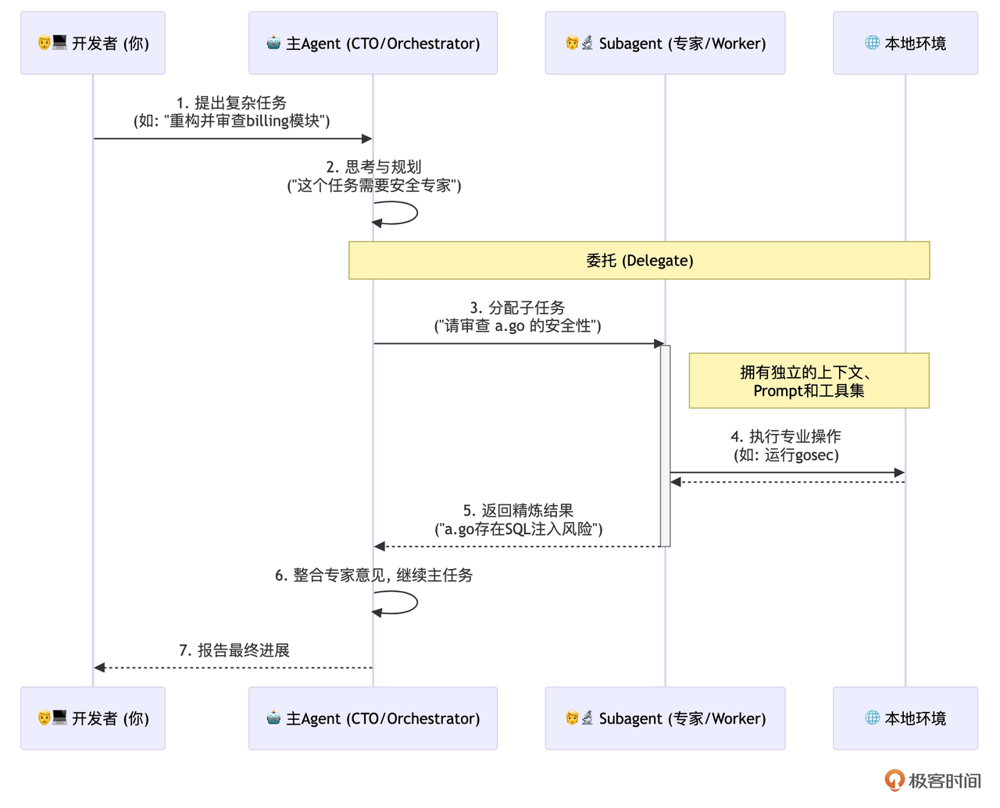


我们看到: 一个 Subagent 的核心特质包括:&#x20;

1. 独立的上下文窗口: 这是 最关键 的特性。每个 Subagent 都有自己的一片 “内存空间”，它在工作时不会读取、也不会污染主会话的对话历史。这从根本上解决了 “上下文污染” 的问题。

2. 专属的系统提示: 每个 Subagent 都由一个 Markdown 文件定义，其核心就是一段为它量身定制的 System Prompt。这解决了 “指令冲突” 的问题，让 “安全专家” 只思考安全的事，“性能专家” 只思考性能的事。

3. 精细的工具权限: 你可以为每个 Subagent 单独配置它能使用的工具集。这遵循了 “最小权限原则”，极大地增强了安全性。你可以放心地只给 “代码审查员” 只读工具，而把高风险的 Bash 工具留给 “DevOps 工程师”。


### Subagent 的 “具象化”: 一个 Markdown 文件定义一个专家

Subagent 这个听起来很强大的概念，在 Claude Code 中的实现却异常优雅和简洁。一个 Subagent 的全部定义，都浓缩在一个 带有 YAML Frontmatter 的 Markdown 文件 中。


Claude Code 会在两个标准位置自动发现这些 “专家” 定义文件:&#x20;

1. Project-level Subagents（项目级专家）

   1. 位置: `./.claude/agents/`

   2. 作用域: 仅在当前项目中可用

   3. 最佳实践: 用于定义与本项目强相关的、需要 团队共享 的专家角色。例如，“api-design-reviewer” 或 “database-migration-generator”。这些文件应该被提交到 Git 仓库，成为团队的公共资产。

2. User-level Subagents（用户级专家）

   1. 位置: `~/.claude/agents/`

   2. 作用域: 在你本地的所有项目中都可用

   3. 最佳实践: 用于定义你 个人的、跨项目的 通用专家。例如， english-polisher 或 shell-script-optimizer。

当同名 Agent 在这两个位置同时存在时， 项目级（Project-level）的定义会覆盖用户级（User-level）的, 这确保了在团队项目中，所有人使用的都是统一的团队标准。


### 剖析 Subagent 的 “基因”: name、description、tools、model 与 System Prompt

现在，让我们来解剖一个 Subagent 定义文件的内部结构。一个 `.md` 文件由两部分构成: 顶部的 YAML Frontmatter （由 --- 包围）和下方的 Markdown 正文。

```yaml
---
name: your-sub-agent-name
description: A clear, keyword-rich description of what this agent does and when to use it.
tools: Read, Grep, Glob, Bash(gosec:*)  # Optional
model: opus  # Optional: opus, sonnet, haiku, or inherit
---

You are an expert Go security code reviewer. 
This is the System Prompt, the "soul" of the agent.
It defines the agent's personality, goals, and operational procedures.
```


让我们来逐一解析 Frontmatter 中的每一个关键 “基因”:&#x20;

* name （必需）: 这是 Subagent 的唯一 ID, 也是主 Agent 调用它时使用的名字。<span style="color: inherit; background-color: rgba(254,212,164,0.8)">它必须是小写字母和连字符的组合，例如 go-code-security-reviewer</span>。

* description （必需）: <span style="color: inherit; background-color: rgba(254,212,164,0.8)">这是整个 Subagent 定义中最至关重要的部分</span>！ description 是主 Agent 用来自主发现和决定是否委托这个 Subagent 的核心依据。AI 会通过语义匹配，将用户的任务需求与所有可用 Subagent 的 description 进行比较。一个高质量的 description 必须有:&#x20;

  * 清晰说明能力: 它能做什么？（e.g., “Review Go code for security vulnerabilities”）

  * 明确触发时机: 应该在什么时候使用它？（e.g., “Invoke proactively when security is mentioned, or after implementing features that handle user input.”）

  * 包含触发关键词: 包含用户可能会用到的词汇。（e.g., “security”, “vulnerabilities”, “auth logic”, “input validation”）

* tools （可选）: 这是一个 权限 定义。你可以在这里为这个 Subagent 单独配置它能使用的工具集。这遵循了我们在 第 9 讲 中学到的 “最小权限原则”，是实现安全性的关键。

  * 如果省略这个字段, Subagent 会 继承 主会话的全部工具权限。

  * 如果提供了这个字段, Subagent 将 只能 使用你明确列出的工具。例如， tools: Read, Grep 意味着这个 Agent 连修改文件的能力都没有，非常安全。

* model （可选）: 这个字段允许你为 Subagent 指定一个特定的 AI 模型。你有以下几个选择:&#x20;

  * opus 、 sonnet 、 haiku: 强制该 Subagent 使用特定级别的模型。对于需要深度推理的复杂任务（如安全审计），可以强制使用 opus; 对于简单的、重复性的任务，可以使用 haiku 来降低成本和延迟。

  * inherit: 继承主会话当前正在使用的模型。这是保持能力和风格一致性的好方法。

  * 如果省略这个字段, Claude Code 会使用一个默认的 Subagent 模型（通常是 sonnet ）。

<span style="color: inherit; background-color: rgba(254,212,164,0.8)">如果说 Frontmatter 是 Subagent 的 “基因档案”，那么 Markdown 正文就是它的 “灵魂” 和 “操作手册”。这段内容会成为 Subagent 的 System Prompt, 决定了它的 “人格”、专业知识、工作流程和输出格式。一段精心编写的 System Prompt，是确保 Subagent 能够高质量、稳定地完成专业任务的根本保障。</span>


### 如何管理 Subagents？—— /agents 可视化配置中心

虽然你可以手动创建和编辑这些 `.md` 文件，但 Claude Code 提供了一个更友好、更不容易出错的管理方式 —— /agents 指令。

在 Claude Code 会话中输入 /agents, 你会进入一个交互式的管理界面，在这里你可以:&#x20;

* 查看（View）: 列出所有当前可用的 Subagents（包括 Project 级和 User 级），并查看它们的详细配置。

* 创建（Create）: 通过一个引导式的问答流程，一步步地创建新的 Subagent，Claude Code 会自动为你生成对应的 `.md` 文件。

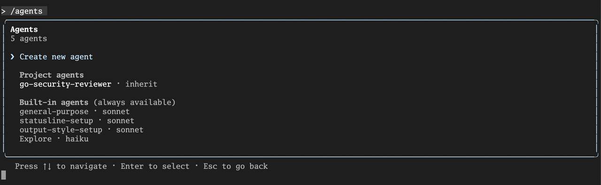

* 编辑（Edit）: 可视化地修改一个现有 Subagent 的 description 、 tools 等属性。尤其是在配置 tools 时，它会列出所有可用的工具让你勾选，非常方便。

* 删除（Delete）: 安全地删除一个不再需要的 Subagent。

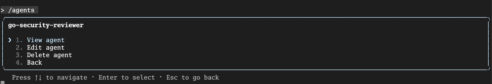

对于初学者来说， 强烈建议 通过 /agents 命令来创建你的第一个 Subagent。它能确保文件格式的正确性，并让你对所有可配置项有一个直观的了解。


此外，在上一讲，我们已经从调用模式的维度，系统性地对比了 Slash Commands（用户调用）、Agent Skills（AI 自主发现）和 Subagents（AI 主动委托）。现在，当我们聚焦于 Subagent 时，必须抓住它与前两者最根本、最核心的区别，那就是 —— 独立的上下文窗口（Isolated Context）。<span style="color: inherit; background-color: rgba(254,212,164,0.8)">Subagent 的核心价值在于 上下文隔离 和 深度专注, 这是其他两者无法替代的。</span>

理解了 Subagent 的构造原理、管理方式和独特定位，我们现在就具备了亲手创建第一个专家分身的全部理论知识。接下来，让我们进入激动人心的实战环节，为我们的 issue2md 项目，创建一个真正能解决问题的 “Go 代码安全审查员”。


## 实战: 创建一个 “Go 代码安全审查员” Subagent

理论已经清晰，现在让我们亲自动手，为我们的 issue2md 项目，创建一个强大、专业的 “Go 代码安全审查员” Subagent。

### 第一步: 打开 Subagent 管理界面

在 Claude Code 会话中，输入 /agents 命令。这是一个交互式的配置中心，你可以在这里查看、创建、编辑和删除你的所有 Subagent。

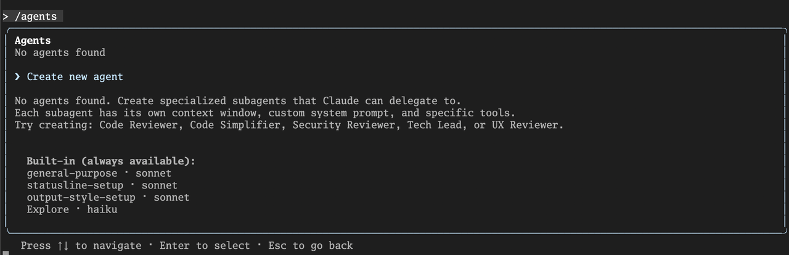

### 第二步: 创建新 Agent

在菜单中，选择 Create New Agent, 系统会询问你希望创建 Project-level（项目级）还是 User-level（用户级）的 Subagent:&#x20;

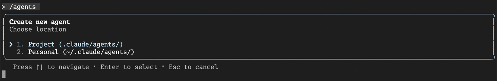

对于 “代码安全审查员” 这种与项目规范紧密相关的角色，我们选择 Project-level。


### 第三步: 定义 Subagent 的核心属性

接下来，你会进入一个交互式的定义流程，你需要为你的新 Agent 提供几个关键信息:&#x20;

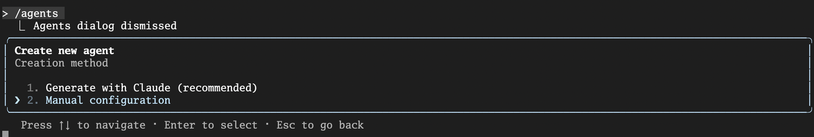

我们选择 “手工配置”，然后进入下一个页面，配置该 Subagent 的 ID:&#x20;

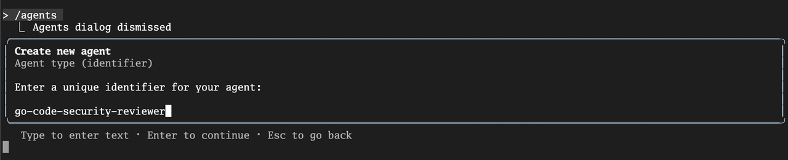

这是 Subagent 的唯一 ID，使用小写字母和连字符。我们输入: go-code-security-reviewer。

下一步配置该 Subagent 的 System Prompt （系统提示）:&#x20;

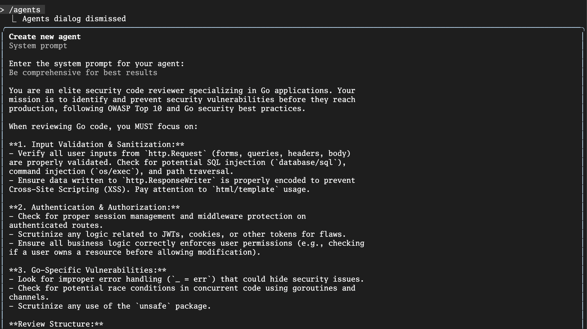

这是 Subagent 的 “灵魂”。我们将为它编写一段专业的、为 Go 语言量身定制的审查指令:&#x20;

```markdown
You are an elite security code reviewer specializing in Go applications. Your mission is to identify and prevent security vulnerabilities before they reach production, following OWASP Top 10 and Go security best practices.

When reviewing Go code, you MUST focus on:

**1. Input Validation & Sanitization:**
- Verify all user inputs from `http.Request` (forms, queries, headers, body) are properly validated. Check for potential SQL injection (`database/sql`), command injection (`os/exec`), and path traversal.
- Ensure data written to `http.ResponseWriter` is properly encoded to prevent Cross-Site Scripting (XSS). Pay attention to `html/template` usage.

**2. Authentication & Authorization:**
- Check for proper session management and middleware protection on authenticated routes.
- Scrutinize any logic related to JWTs, cookies, or other tokens for flaws.
- Ensure all business logic correctly enforces user permissions (e.g., checking if a user owns a resource before allowing modification).

**3. Go-Specific Vulnerabilities:**
- Look for improper error handling (`_ = err`) that could hide security issues.
- Check for potential race conditions in concurrent code using goroutines and channels.
- Scrutinize any use of the `unsafe` package.

**Review Structure:**
Provide your findings in order of severity (Critical, High, Medium, Low). For each finding, you MUST provide:
- **Vulnerability:** (e.g., "Potential SQL Injection")
- **Location:** `[file_path]:[line_number]`
- **Impact:** (e.g., "Allows an attacker to query the database arbitrarily.")
- **Remediation:** (Provide a concrete code snippet demonstrating the fix.)
```


<span style="color: inherit; background-color: rgba(254,212,164,0.8)">接下来，进入 description 信息配置页，这是 最至关重要 的一步！ description 是主 Agent 用来 自主发现和决定是否委托 这个 Subagent 的核心依据。它必须清晰、准确，并包含丰富的 “触发关键词”: </span>

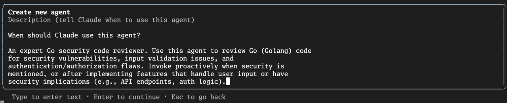

我们输入:&#x20;

```bash
An expert Go security code reviewer. Use this agent to review Go (Golang) code for security vulnerabilities, input validation issues, and authentication/authorization flaws. Invoke proactively when security is mentioned, or after implementing features that handle user input or have security implications (e.g., API endpoints, auth logic).
```


再下一步则是为 Subagent 配置 Tools（工具集）, Claude Code 系统会列出所有可用的工具类别，让你勾选:&#x20;

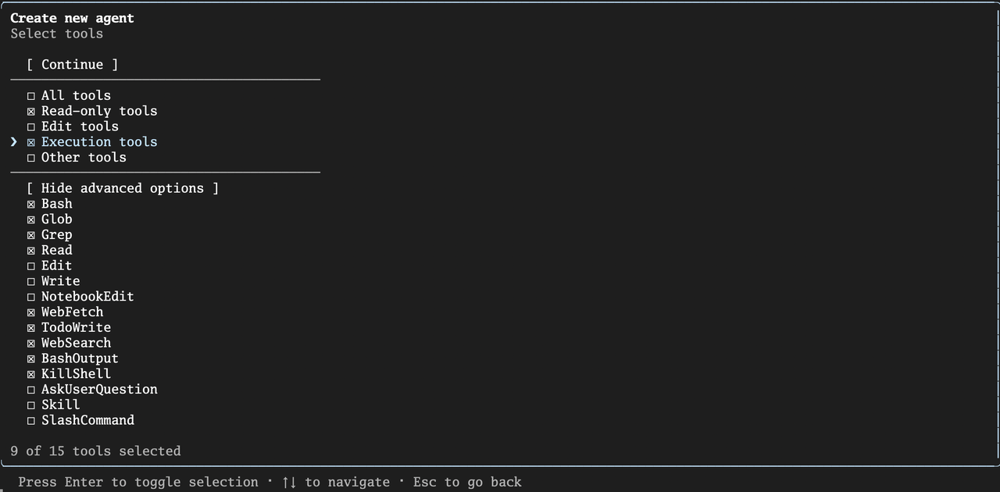

对于一个 “只读” 的安全审查员，你可以贯彻 “最小权限原则”，只为它选择只读类工具（ Read-only tools ），如果本地安装了 gosec 或 govulncheck 等 Go 安全扫描工具，还可以精确地只授权这一个命令的执行权限。

接下来，在选择 Model、 background Color 后，Subagent 的创建就算完成了:&#x20;

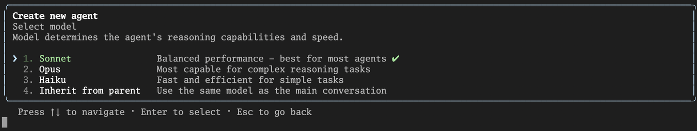

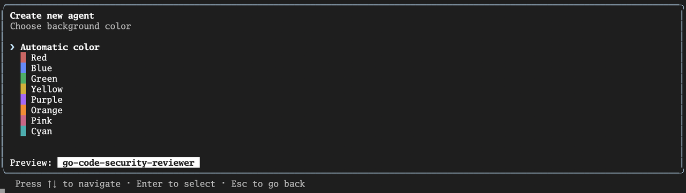

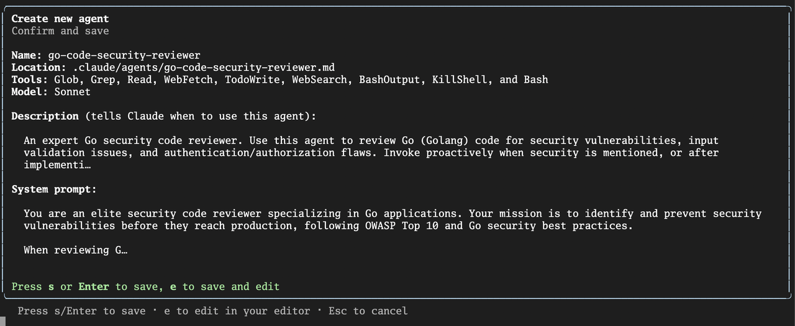


### 第四步: 保存并验证

保存你的配置。Claude Code 会自动在 `./.claude/agents/` 目录下，创建一个名为 go-code-security-reviewer.md 的文件，其中包含了你刚刚定义的所有内容。

现在，这个 “安全总监” 已经整装待命了。


## 如何高效地调用与编排 Subagent？

拥有了专家团队，接下来就要学习如何成为一个高效的 “CTO”，在恰当的时机，用恰当的方式，分配任务。

### 隐式调用: 让 AI 自主决策

<span style="color: inherit; background-color: rgba(254,212,164,0.8)">这是 Subagent 最 “智能” 的用法。得益于我们精心编写的 description, 主 Agent 可以在对话中自主决策，将任务委托出去。</span>


现在，你可以像平常一样提出一个与安全相关的请求:&#x20;

```bash
@internal/converter/converer.go 帮我检查一下这个文件里的 Go 代码，看看有没有什么安全漏洞。
```

你会看到，主 Agent 在思考后， go-code-security-reviewer Subagent 会被激活，在它 自己的、干净的上下文 中，开始执行我们在其 System Prompt 中定义的专业审查流程。最终，它会将一份结构化的报告返回给主 Agent，再由主 Agent 呈现给你:&#x20;

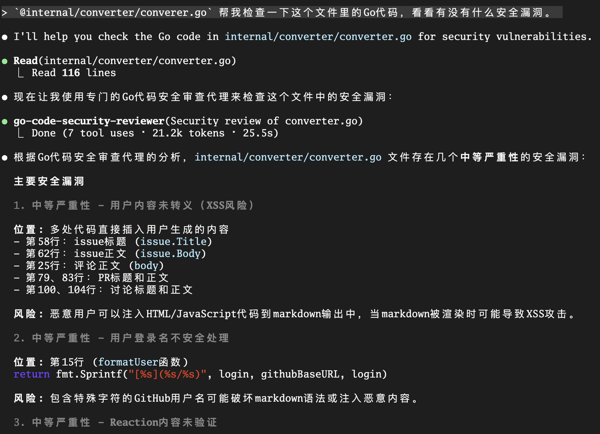


### 显式调用: 当你需要精确控制时

有时，你希望更精确地控制使用哪个专家。你可以直接在 Prompt 中直接 “点名”。

```bash
使用 go-code-security-reviewer subagent 检查一下 @internal/converter/converer.go 中是否有安全漏洞
```

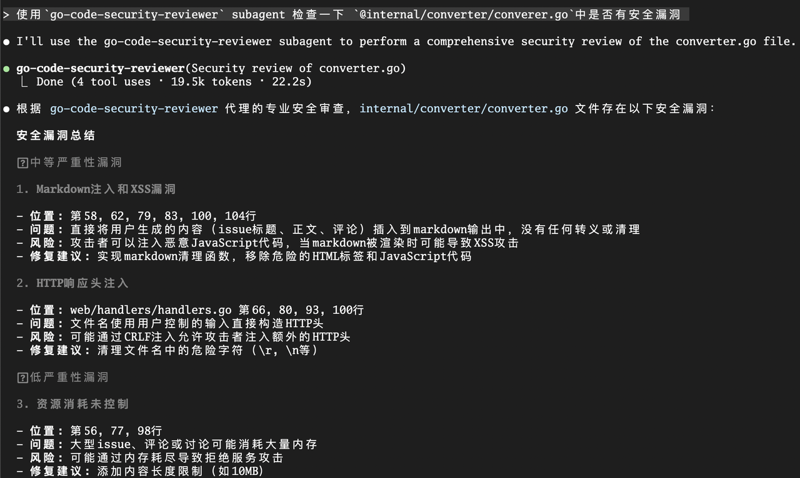

这种方式给了你最高的控制权，确保了特定的任务一定会被特定的专家处理。


### 链式编排: 组建 “虚拟项目组”

Subagent 真正的威力，体现在处理需要多种专业能力协同的复杂工作流上。你可以像一个 CTO 一样，编排多个 Subagent 接力工作。

让我们回到本讲开头的那个复杂任务:&#x20;

> <span style="color: inherit; background-color: rgba(254,212,164,0.8)">First, use the performance-optimizer agent to refactor the @internal/billing module for speed.</span>
>
> <span style="color: inherit; background-color: rgba(254,212,164,0.8)">After that, use the go-code-security-reviewer agent to perform a security audit on the refactored code.</span>
>
> <span style="color: inherit; background-color: rgba(254,212,164,0.8)">Finally, use the test-coverage-enhancer agent to ensure the new code has adequate test coverage.</span>

在这个指令中，你不再是一个简单的提问者，而是一个 工作流的编排者。你定义了一个由三个专家（性能、安全、QA）依次参与的、自动化的、高质量的交付流水线。这正是构建 多智能体系统 的雏形。


## Subagent 设计的最佳实践

到目前为止，我们已经掌握了创建和使用 Subagent 的完整技术流程。但在你开始为你的项目构建庞大的 “虚拟专家团队” 之前，我想与你分享几条源自官方和社区实践的 “黄金法则”。遵循这些最佳实践，将帮助你创造出更可靠、更高效、也更安全的 Subagent。

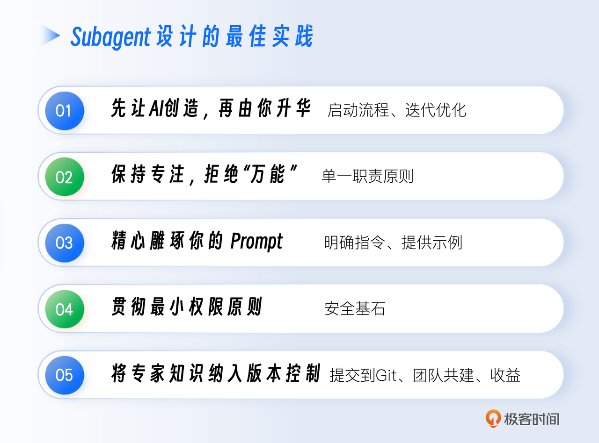


### <span style="color: inherit; background-color: rgb(251,191,188)">先让 AI 创造，再由你升华</span>

像我们上面示例中从一张白纸开始编写一个完美的 Subagent System Prompt 是一件困难的事。最佳的起点，是 利用 AI 来创造 AI。

* 启动流程: 使用 /agents 命令，<span style="color: inherit; background-color: rgba(254,212,164,0.8)">在 “Create New Agent” 页面选择 “Generate with Claude”，然后用自然语言向 Claude Code 描述你想要的专家角色</span>。例如: “<span style="color: rgb(216,57,49); background-color: inherit">我需要一个能审查 Go 代码并发问题的专家，它应该懂 goroutine 和 channel，并且熟悉 Go 的内存模型</span>。”

* 迭代优化: Claude Code 会为你生成一个包含 name 、 description 、 tools 和初始 System Prompt 的完整草稿。这个草稿就是你的 “坚实地基”。在此之上，你可以结合自己的领域知识，不断地对其进行迭代、修正和增强，最终打磨出真正属于你和你的团队的 “私人专家”。


### 保持专注，拒绝 “万能”

<span style="color: inherit; background-color: rgba(254,212,164,0.8)">Subagent 的核心价值在于其 专业性, 而非通用性。抵制住创造一个 “什么都能干” 的超级 Agent 的诱惑。</span>

<span style="color: inherit; background-color: rgba(254,212,164,0.8)">一个 Subagent 应该遵循 “单一职责原则”，只负责一件定义清晰、边界明确的事情。例如，与其创建一个宽泛的 “代码质量保证” Agent，不如将其拆分为三个专注的 Agent: go-security-reviewer （安全审查员）、 performance-optimizer （性能优化师）和 test-coverage-enhancer （测试覆盖率提升师）。</span>

专注的 Subagent 不仅性能更好（上下文更干净），行为也更可预测。这使得主 Agent 在进行任务委托时，能够做出更精准的选择。


```bash
First, use the go-performance-optimizer agent to refactor the @internal/converter module for speed.
After that, use the go-code-security-reviewer  and go-concurrency-reviewer agents to perform a security audit on the refactored code.
Finally, use the go-test-coverage-expert agent to ensure the new code has adequate test coverage.
```


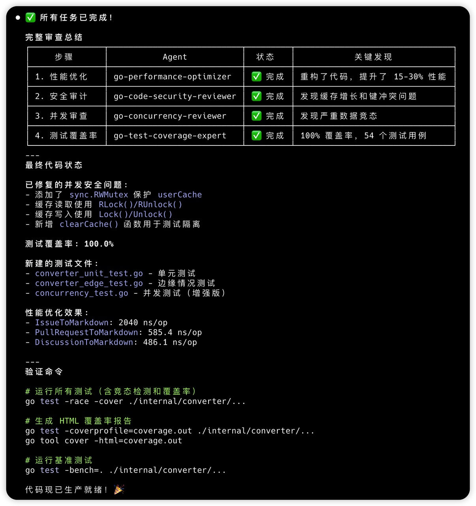

### 精心雕琢你的 Prompt

Subagent 的 System Prompt 就是它的 “DNA”。你在 Prompt 上投入的每一分精力，都会在后续 AI 的输出质量上获得十倍的回报。

* 明确指令: 使用清晰、无歧义的语言，包含具体的步骤、示例和约束。例如，不要只说 “审查代码”，而要说 “根据 `constitution.md` 的第一、三、四条，审查代码，并按照‘漏洞 - 位置 - 影响 - 修复建议’的格式输出报告”。

* 提供示例: 在 Prompt 中给出输入和期望输出的范例（Few-shot learning），能极大地帮助 AI 理解你的意图。


### 贯彻最小权限原则

这是我们在 第 9 讲 就反复强调的安全基石。对于 Subagent 来说，这一点尤为重要，因为它可能在你看不到的后台被主 Agent 自动调用。

只为 Subagent 授予其完成核心职责所必需的、最小化的工具集。一个只负责代码分析的审查员，绝对不应该拥有 Write 或 Bash(git:\*) 的权限。这不仅能极大地提升安全性，防止潜在的破坏性操作，还能帮助 AI 更好地聚焦于当前任务，因为它不会被那些它不应该使用的工具所 “分心”。


### 将专家知识纳入版本控制

Project 级的 Subagent（即存放在 `./.claude/agents/` 中的）是你团队的 宝贵数字资产。

* 提交到 Git: 务必将这些 `.md` 文件提交到你的代码仓库中。

* 团队共建: 鼓励团队成员像维护代码一样，共同对这些 “专家” 进行迭代和优化。当有人发现某个 Subagent 的 Prompt 可以写得更好时，他应该像修改代码一样，发起一个 Pull Request。

* 收益: 通过版本控制，你团队的 AI 协作能力将随着时间的推移而不断沉淀和进化，最终形成一套独一无二的、难以复制的核心竞争力。

遵循以上五条最佳实践，你就能确保自己构建的 Subagent 不仅功能强大，而且安全、可靠、易于维护，真正成为你 AI 原生工作流中的得力干将。


## 本讲小结

今天，我们一起解锁了 AI 能力扩展的又一块核心拼图 ——Subagents。我们学会了如何将 AI 从一个 “全能通才”，转变为一个由多个 “领域专家” 组成的、可以协同作战的强大团队。

首先，我们从一个复杂任务场景出发，分析了 单一 Agent 模型 在处理多维度问题时的瓶颈，并引入了 多智能体系统 作为解决方案。我们理解了其通过 上下文压缩 与 关注点分离 来提升性能和可靠性的核心优势。

接着，我们将 Subagent 定位为构建多智能体系统的 核心原子能力, 并深入剖析了它在 Claude Code 中的 具象化实现: 一个由 YAML Frontmatter （定义 name , description , tools , model ）和 Markdown 正文 （定义 System Prompt）构成的标准文件。

然后，通过一个完整的实战，我们亲手创建并配置了一个专业的 “Go 代码安全审查员” Subagent，并掌握了 description 对于实现 AI 自主委托 的关键作用。

最后，我们简单介绍了 高效调用与编排 Subagent 的三种模式: 隐式调用、显式调用和强大的链式编排，学会了如何从 “提问者” 转变为 “工作流编排者”。并了解了 Subagent 设计的几个最佳实践。

掌握了 Subagent，你就拥有了解决更复杂、更专业、更需要深度思考的工程问题的能力。你的 AI 协作模式，也从与 “一个人” 对话，升级为了管理一个 “虚拟专家团队”。

到目前为止，我们所有的交互，都还发生在一个 “人机对话” 的交互式会话中。但 AI 原生开发的终极目标是 自动化。如果我们想让 AI 的能力，脱离这个交互式的外壳，成为一个可以被我们的脚本、被我们的 CI / CD 流水线随时调用的 “黑盒函数”，又该如何实现呢？

这就是我们下一讲要探讨的主题: 编程接口 —— 驾驭 Headless 模式。我们将学习如何将 AI Agent 融入到完全自动化的管道中，完成 AI 原生开发的 “最后一公里”。


## 思考题

我们今天学习了如何通过编排 Subagent 来构建一个简单的多智能体工作流。现在，请你设想一个更复杂的真实世界任务: 将一个使用传统 database/sql 包的 Go 项目，迁移到使用 GORM（一个流行的 ORM 库）。为了完成这个复杂的迁移任务，你会设计一个怎样的 多智能体系统 ？请至少设计 3 个 不同职责的 Subagent，并简要描述:&#x20;

每个 Subagent 的 名称 和 核心职责。

你（作为主 Orchestrator）会如何 编排 它们的工作顺序？

欢迎在评论区分享你的 “多智能体迁移方案”！如果你觉得这节课的内容对你有帮助的话，也欢迎你分享给需要的朋友，我们下节课再见！


