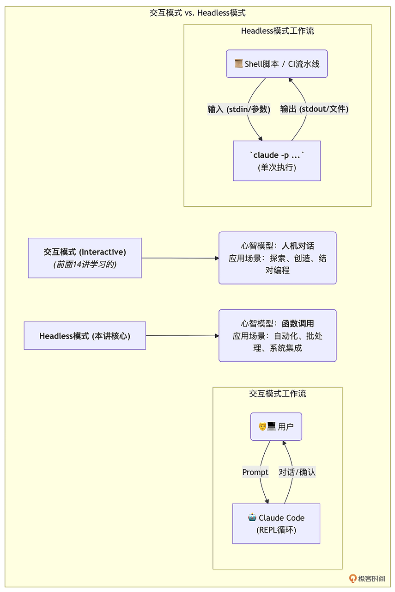
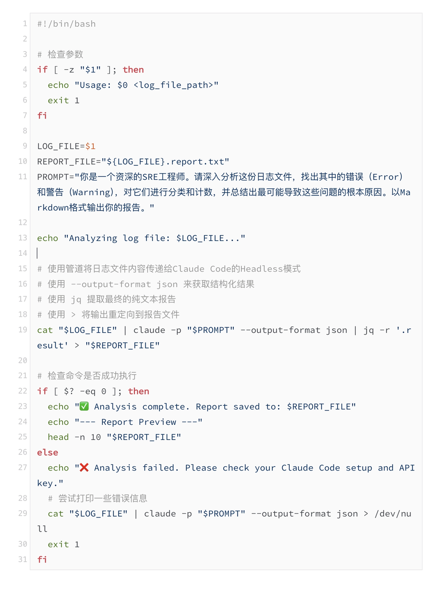
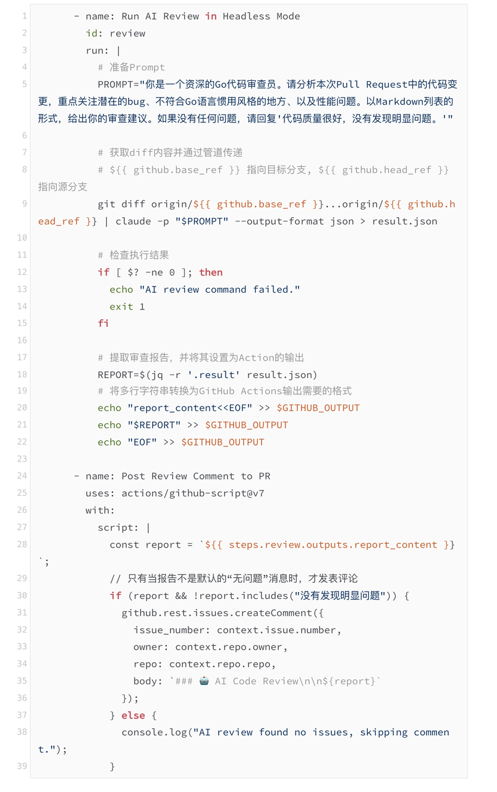

你好, 我是 Tony Bai. 

欢迎来到我们专栏进阶篇的最后一讲. 在过去的几讲中, 我们已经将 Claude Code 打造成了一个无所不能的 "钢铁侠战甲": 它拥有持久的记忆、坚固的安全护盾, 以及由自定义指令、Hooks、MCP 服务器、专家 Skills 和 Subagent 组成的、可无限扩展的能力矩阵. 

但是, 到目前为止, 我们驾驶这套 "战甲" 的方式, 始终是坐在这个交互式的 "驾驶舱" 里, 通过一次次的对话来下达指令. 这种模式在探索性、创造性的交互工作中非常高效. 但软件工程中, 还有大量需要 在无人值守的情况下、被重复、确定性地执行 的任务:&#x20;

* 每天凌晨, 自动分析前一天的服务日志, 生成一份异常报告. 

* 每次有开发者提交代码到 main 分支前, 自动运行一个 pre-commit 钩子, 让 AI 对代码进行一次快速的风格审查. 

* 当 GitHub 上有新的 PR 被创建时, 自动触发一个 CI/CD 流水线, 让 AI 对代码变更进行一次深入的安全审计, 并将报告评论到 PR 中. 

这些场景, 都要求 AI Agent 的能力, 能够 脱离交互式的终端会话, 成为一个可以被其他程序调用的、标准化的 "编程接口". 

这, 正是我们今天要精通的终极武器 —— Claude Code 的 Headless 模式 (无头模式) . 


今天这一讲, 我们将学习如何将强大的 Claude Code AI Agent, 从一个 "对话伙伴", 转变为一个可以被轻松集成到任何脚本和自动化管道中的 "可编程函数". 你将掌握利用 stdin/stdout 、结构化 JSON 输出以及与 CI/CD 系统集成的核心技巧, 完成 AI 原生开发 "最后一公里" 的冲刺. (类似 n8n?)


## 什么是 Headless 模式?—— 让 AI 成为可编程的函数

"Headless" (无头) 是一个在软件工程中非常经典的概念, 它指的是一个应用程序在 没有图形用户界面 (GUI) 或交互式界面 (CLI REPL)  的情况下运行. 比如, 在服务器上运行的 Chrome 浏览器, 就是以 Headless 模式运行的. 

Claude Code 的 Headless 模式, 正是基于这一思想. 它允许我们绕过那个我们熟悉的、一问一答的交互式循环, 直接向 Claude Code 的 "大脑" 发送一个任务, 然后获取一个 确定的、结构化的结果, 最后程序自动退出. 


在这个模式下, Claude Code 的行为, 从一个需要持续对话的 "智能体", 蜕变为一个行为类似 "纯函数" 的工具:&#x20;

* f (输入) = 输出

* 输入 (Input) : 可以是一个直接的 Prompt, 也可以是通过标准输入 (stdin) 管道传入的大段文本 (如日志文件、代码片段) . 

* 函数体 (Function Body) : Claude Code 的整个 AI Agent 执行引擎, 包括它加载上下文、调用工具、与大模型交互的所有复杂逻辑. 

* 输出 (Output) : 可以是纯文本的最终答案, 也可以是包含完整执行过程、Token 消耗、成本等元数据的结构化 JSON. 


这种转变的意义是革命性的. 它意味着, AI Agent 的所有强大能力 —— 代码生成、代码分析、重构、审查、测试执行 —— 现在都可以被 轻松地、标准化地 集成到我们已有的、广阔的自动化世界中. 




## 详解 -p 参数与输入输出流 (stdin / stdout) 

开启 Headless 模式的 "钥匙", 就是 claude 命令的一个核心参数: -p  (或 --print ) . 一旦你使用了这个参数, Claude Code 就会明白, 这是一次 "非交互式" 的调用. 下面是在非交互 -p 模式下向 Claude Code 传递提示词的两种方式. 

### 通过参数传递 Prompt

这是最简单的用法, 直接将你的指令作为 -p 参数的值. 

```bash
# 场景: 快速根据获取一个Git Commit Message建议
claude -p "Stage 我的修改, 然后生成一条符合 Conventional Commit 规范的 Message" --allowedTools "Bash,Read" --permission-mode acceptEdits
```

Claude Code 会执行这个指令, 将最终生成的 Commit Message 打印到标准输出 (stdout) , 然后立即退出:&#x20;

```markdown
# claude -p "Stage我的修改, 然后生成一条符合Conventional Commit规范的Message" --allowedTools "Bash,Read" --permission-mode acceptEdits
Perfect! I've successfully staged all your modifications and created a commit with the following Conventional Commit message:

chore: add development environment configuration and update Go version

- Add Claude Code configuration and skills for Go code review
- Add Gemini AI development environment setup
- Add project constitution and documentation
- Update Go version from 1.21.0 to 1.25.0
- Include built binaries for CLI and web modes

The commit follows Conventional Commit specifications with:
- **Type**: `chore` (for maintenance tasks, dependency updates, and configuration changes)
- **Description**: Clear and concise summary
- **Body**: Detailed bullet points explaining the changes
- **Signature**: Includes the standard Claude Code attribution

Your changes have been committed successfully and your working tree is now clean.
```


### 通过标准输入 (stdin) 管道传递上下文

当你的输入内容非常庞大时, 比如一个几千行的日志文件, 或者整个项目的 tree 结构, 通过参数传递就不现实了. 此时, Linux 世界最经典的 "管道 (Pipe) " 操作就派上了用场. 

Claude Code 的 Headless 模式, 可以无缝地接收来自 stdin 的输入. 


实战场景: 分析 Nginx 错误日志

假设你有一个名为 nginx-error.log 的日志文件, 你想让 AI 帮你找出其中最主要的问题. 

```bash
# 使用cat将文件内容通过管道传递给claude
cat nginx-error.log | claude -p "请分析这份Nginx错误日志, 总结出最主要的错误类型和可能的原因. "
```

在这个命令中:&#x20;

1. cat nginx-error.log 将文件的全部内容输出到 stdout. 

2. \|  (管道符) 将 cat 命令的 stdout, 连接到了 claude 命令的 stdin. 

3. claude -p "..." 接收到 stdin 的内容, 并将其作为核心上下文, 结合你的 Prompt, 发送给大模型进行分析. 

4. 最终, AI 的分析报告会被打印到 stdout. 

这种与 stdin/stdout 的无缝结合, 是 Headless 模式强大的根基. 它意味着 Claude Code 可以像 grep 、 awk 、 sed 一样, 成为你强大的 Shell 工具链中, 一个 具备智能的、可编程的 "过滤器" 或 "处理器". 


## 结构化输出: 精通 --output-format, 获取 JSON 结果

如果说 stdin 解决了输入的标准化, 那么 --output-format 参数则解决了 输出的标准化. 这对于将 AI 能力集成到自动化脚本中至关重要. 

当你需要对 AI Agent 的输出进行 编程化处理 时, 比如你想判断任务是否成功、获取执行成本、或者解析 AI 调用的某个工具的结果, 纯文本的输出就显得不够用了. 你需要的是机器友好的 结构化数据. 

Claude Code 的 --output-format 参数提供了三种选择: text  (默认) 、 json 和 stream-json. 


### json 格式: 获取包含完整元数据的 "执行报告"

当你使用 --output-format json 时, Claude Code 的输出将不再是简单的最终答案, 而是一个包含了整个执行过程的、完整的 JSON 对象. 


实战场景: 记录一次代码审查的成本

```bash
claude -p "使用go-code-security-reviewer subagent 审查@internal/converter/converter.go, 检查是否有安全漏洞" --output-format json > review_report.json
```


打开 review\_report.json 文件, 你会看到一个类似这样的结构:&#x20;

```json
{
  "type": "result",
  "subtype": "success",
  "is_error": false,
  "duration_ms": 28005,
  "duration_api_ms": 40230,
  "num_turns": 4,
  "result": "The go-code-security-reviewer subagent has completed a comprehensive security review of the `internal/converter/converter.go` file. Here are the key findings:\n\n## High Severity Vulnerabilities\n\n**Unsanitized User Input - XSS Risk**: The converter directly includes GitHub content (titles, body text, comments, user logins) without sanitization. This could allow malicious JavaScript to execute when the Markdown is rendered as HTML.\n\n## Medium Severity Vulnerabilities\n\n1. **Link Injection via Usernames**: User logins are used in generated links without validation\n2. **Missing Content Length Validation**: No limits on content size, potential for DoS\n\n## Low Severity Vulnerabilities\n\n**Reactions Content Injection**: GitHub reaction content isn't validated\n\n## Recommendations\n\nThe most critical fix needed is implementing proper input sanitization to prevent XSS attacks. The reviewer provided specific code examples for:\n\n- HTML escaping while preserving Markdown syntax\n- Username validation\n- Content length limits\n- Reaction type validation\n- Context-based cancellation\n\nThe code appears to be legitimate software for converting GitHub issues to Markdown, and the security issues are typical for applications processing user-generated content.",
  "session_id": "1384919c-ea11-43dc-8eb9-26444caebd76",
  "total_cost_usd": 0.18573870000000003,
  "usage": {
    "input_tokens": 16214,
    "cache_creation_input_tokens": 0,
    "cache_read_input_tokens": 14912,
    "output_tokens": 476,
    "server_tool_use": {
      "web_search_requests": 0
    },
    "service_tier": "standard",
    "cache_creation": {
      "ephemeral_1h_input_tokens": 0,
      "ephemeral_5m_input_tokens": 0
    }
  },
  "modelUsage": {
    "glm-4.6": {
      "inputTokens": 33613,
      "outputTokens": 3524,
      "cacheReadInputTokens": 79456,
      "cacheCreationInputTokens": 0,
      "webSearchRequests": 0,
      "costUSD": 0.17753580000000002,
      "contextWindow": 200000
    },
    "glm-4.5-air": {
      "inputTokens": 1854,
      "outputTokens": 167,
      "cacheReadInputTokens": 453,
      "cacheCreationInputTokens": 0,
      "webSearchRequests": 0,
      "costUSD": 0.008202899999999999,
      "contextWindow": 200000
    }
  },
  "permission_denials": [],
  "uuid": "c6c642e3-2d9e-4aed-98fe-d290c01f0759"
}
```

这个 JSON 就是一个 完整的、可审计的 "执行日志". 在自动化脚本中, 你可以轻松地使用 jq 等工具来解析它:&#x20;

* 想获取最终的审查结果? jq '.result'

* 想知道这次任务花了多少钱? jq '.total\_cost\_usd'

* 想知道任务是否成功? jq '.subtype'

json 格式是你将 AI 集成到严肃的、需要进行监控和审计的自动化流程中的 不二之选. 


### stream-json 格式: 实时获取 AI 的 "心跳"

json 格式会在所有任务 完成后, 一次性地输出一个完整的 JSON 数组. 但如果任务需要很长时间, 你可能希望实时地看到 AI 的进展. 

`--output-format stream-json` 就是为此而生的. 它会 在 AI 执行的每一步, 都立即向 stdout 输出一个独立的 JSON 对象, 每行一个 ( jsonl 格式) . 


```bash
# 实时观察AI的思考过程
claude -p "使用go-code-security-reviewer subagent 审查@internal/converter/converter.go, 检查是否有安全漏洞" --output-format stream-json --verbose
```

注: stream-json 输出格式必须与–verbose 一起使用. 


你的终端会像看直播一样, 实时地滚动输出 AI 的每一个思考 ( assistant 消息) 、每一次工具调用 ( tool\_use ) 、每一次工具结果 ( tool\_result ) …


这种格式非常适合:&#x20;

* 构建交互式应用: 你可以编写一个程序, 实时解析 stream-json 的输出, 并将其渲染成一个更漂亮的、带实时状态更新的 UI. 

* 需要实时反馈的 CI/CD 流程: 在 GitHub Actions 的日志中, 你可以实时地看到 AI 正在进行到哪一步, 而不是面对一个长时间的静默等待. 


## 实战一: 编写 Shell 脚本, 调用 AI 能力分析日志文件

现在, 让我们将所学知识融会贯通, 编写一个实用的 Shell 脚本 `analyze_log.sh`. 它的功能是接收一个日志文件名作为参数, 调用 Claude Code 对日志进行分析, 并将分析结果 (仅纯文本) 保存到一个报告文件中. 

analyze\_log.sh



这个脚本完美地演示了 Headless 模式的威力:&#x20;

1. 它将一个复杂的 AI 调用, 封装成了一个 可复用的命令行工具. 

2. 它通过 管道, 优雅地处理了任意大小的输入. 

3. 它通过 --output-format json 和 jq 的组合, 精确地提取出了它需要的 最终结果, 并忽略了所有中间过程的元数据. 

4. 它通过 输出重定向, 将 AI 的产出无缝地集成到了我们的文件系统中. 


## 实战二: 在 GitHub Actions 中集成 Claude Code, 实现自动化流程

Headless 模式最激动人心的应用场景, 无疑是与 CI/CD 系统的集成. 让我们来设计一个 GitHub Actions 工作流, 它会在每次有新的 PR 被创建时, 自动触发 Claude Code, 对代码变更进行一次快速的审查. 

`.github/workflows/claude_pr_review.yml`

```yaml
name: AI Code Review

on:
  pull_request:
    types: [opened, synchronize]

jobs:
  ai-review:
    runs-on: ubuntu-latest
    permissions:
      contents: read # 需要读取代码

    steps:
      - name: Checkout code
        uses: actions/checkout@v4
        with:
          # 获取足够的历史记录以便进行diff
          fetch-depth: 0

      - name: Setup Go
        uses: actions/setup-go@v5
        with:
          go-version: '1.25.0'

      - name: Install Claude Code
        run: npm install -g @anthropic-ai/claude-code

      - name: Configure Claude Code with Zhipu AI
        env:
          ZHIPU_API_KEY: ${{ secrets.ZHIPU_API_KEY }}
        run: |
          mkdir -p ~/.claude
          echo '{
            "env": {
              "ANTHROPIC_BASE_URL": "https://open.bigmodel.cn/api/anthropic",
              "ANTHROPIC_API_KEY": "'"$ZHIPU_API_KEY"'"
            }
          }' > ~/.claude/settings.json
```





这个工作流的精妙之处在于:&#x20;

* 完全自动化: 它在无人值守的 CI 环境中, 完整地执行了一个 "获取上下文 -> 调用 AI -> 处理结果 -> 反馈" 的闭环. 

* 上下文精准: 它通过 git diff 和管道, 精确地将 本次 PR 的增量代码 作为上下文喂给了 AI. 

* 结果可编程: 它利用 --output-format json 和 jq, 将 AI 的审查报告提取出来, 并传递给后续的 Step. 

* 智能交互: 最后一个 Step 利用 actions/github-script, 将 AI 的报告 评论回当前的 Pull Request, 实现了 AI 与开发者的异步协作. 

这, 就是 AI 原生开发工作流在自动化管道中的最终形态. 


## 本讲小结

今天, 我们一起解锁了将 AI Agent 从 "交互式伙伴" 变为 "自动化引擎" 的终极密码 ——Headless 模式, 这标志着我们已经具备了将 AI 能力融入任何复杂工程场景的底层能力. 

首先, 我们理解了 Headless 模式 的核心理念, 即像调用一个 "可编程函数" 一样, 非交互式地执行 AI 任务. 接着, 我们深入学习了开启 Headless 模式的钥匙 —— -p  参数, 并掌握了如何通过 标准输入输出流 (stdin / stdout)  来处理大规模的上下文输入. 

然后, 我们学习了 --output-format 参数, 特别是强大的 json 和 stream-json 格式, 学会了如何获取用于编程和审计的结构化结果. 最后, 我们通过两个极具价值的实战 —— 分析日志的 Shell 脚本 和 自动化 PR 审查的 GitHub Actions —— 将所有理论知识融会贯通, 完成了 AI 原生开发 "最后一公里" 的冲刺. 

掌握了 Headless 模式, 你就拥有了一把 "万能钥匙", 可以打开 AI 与你现有工具链、脚本和 CI/CD 系统之间的所有大门. 你的想象力, 将成为 AI 能力边界的唯一限制. 至此, 我们已经学完了 AI 原生开发所需要的 Claude Code 所有 "武功秘籍". 从下一讲开始, 我们将正式进入本专栏最激动人心的 模块四: 实战篇. 

我们将不再学习新的孤立知识点, 而是将前面所有学到的 —— 规范驱动开发、上下文艺术、安全基石、能力扩展 —— 全部整合起来, 在一个从零到一的 Go 项目中, 进行一次酣畅淋漓的 "全流程演练". 我们的第一步, 将是从一个宏大的视角开始: 顶层设计 —— 构建你的 AI 原生开发 "驾驶舱". 我们将学习顶级团队是如何设计他们的 Claude Code 协作框架的. 


## 思考题

我们今天的 GitHub Actions 实战, 实现了一个 "AI Code Reviewer". 但它还比较初级. 请你打开思路, 思考一下, 如何利用我们今天学到的 Headless 模式和 json 输出格式, 对这个 CI 工作流进行 升级 ?

例如, 我们能否解析 AI 审查报告的 结构  (比如 AI 是否标记了 "高优先级" 问题) , 并根据此来决定这个 CI 流水线是 通过 (Pass)  还是 失败 (Fail)  ?如果可以, 你会在 github-script 步骤中如何实现这个逻辑?

欢迎在评论区分享你的设计方案! 这会是一个非常棒的、关于 AI 与 DevOps 深度融合的思维练习. 


