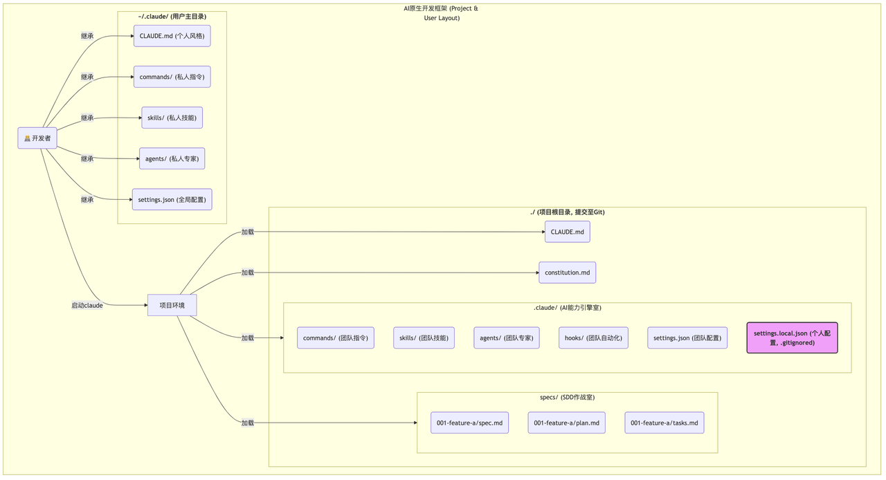

你好，我是 Tony Bai。

欢迎来到我们专栏的第四模块 —— 实战篇。从今天开始，我们将把前面所有学到的理论和技巧，全部投入到一个真实的 Go 项目中。


在基础篇和进阶篇，我们已经系统性地学习了 Claude Code 的各项 “神功”: 从 @ 和 ! 的核心交互，到 CLAUDE.md 和 constitution.md 的上下文艺术；从 Slash Commands 的指令封装，到 Hooks、Skills、Sub-agents 和 MCP 的能力扩展；再到 --checkpointing 的安全回滚和 headless 模式的自动化接口。


你现在手上已经握有了一整套强大的 “武功秘籍”。但一个新的、更严峻的挑战摆在了面前: 如何将这些零散的、强大的招式，组合成一套进退有据、威力无穷的 “武功体系”？

如果我们仅仅停留在 “遇到问题，想起一个指令” 的层面，那么我们很快就会陷入 “手忙脚乱” 的境地，AI Agent 也只不过是一个高级的 “瑞士军刀”。我们离真正的 “AI 原生工作流”，还差最关键的一步。

这一讲，作为实战篇的开篇，我们的目标，就是要完成这最关键的一步: 进行顶层设计，为我们自己和团队，构建一套标准化的、可扩展的 AI 原生开发 “驾驶舱”。


## 为什么要先设计一个 “AI 协作框架”？

在开始动手之前，我们必须先回答一个 “为什么” 的问题。为什么我们不直接开始写代码，而是要花一整讲的时间，来设计一个听起来很 “虚” 的 “框架”？


### 从 “游击战” 到 “体系作战”: 告别零散的 AI 指令

想象一下，如果没有一个统一的框架，团队中的开发者 A 可能会把他的代码审查指令放在 `~/my_commands/` 下，开发者 B 可能会写一个截然不同的审查 Hook，而 AI Agent 在不同人的机器上，由于上下文环境千差万别，表现得也像两个完全不同的 “人”。

这是一种低效的、不可靠的 “游击战” 模式。每个开发者都在与 AI 进行着个性化的、难以复用的 “二人转”。

<span style="color: inherit; background-color: rgba(254,212,164,0.8)">而一个精心设计的 “</span><span style="color: inherit; background-color: rgba(254,212,164,0.8)">AI</span><span style="color: inherit; background-color: rgba(254,212,164,0.8)"> 协作框架”，则能将团队的 AI 协作能力，从 “游击战” 提升到 “体系作战” 的高度。它提供了一个统一的 “作战平台”，确保 AI 在任何时间、任何地点、由任何团队成员指挥时，都能表现出一致的、专业的、符合团队最佳实践的行为。</span>


### 框架的核心价值: 沉淀经验、统一标准、赋能团队

这个框架，或者说 “驾驶舱”，其核心价值体现在三个方面:&#x20;

1. 沉淀经验: 它是团队集体智慧的结晶。无论是资深架构师的安全审查清单，还是 DevOps 专家的部署脚本，都可以被封装成框架中的 Skill 或 Command, 成为可被 AI 调用的、永不丢失的 “数字资产”。

2. 统一标准: 它通过共享的 settings.json 、 constitution.md 和 hooks, 为整个团队的 AI 协作设定了统一的 “交通规则” 和 “质量门禁”，确保了工程质量的一致性。

3. 赋能团队: 它极大地降低了新成员（包括人类和 AI）的上手门槛。一个新人无需再去通读几百页的开发规范，AI 会基于这个框架，自然地引导他遵循最佳实践。


### 我们的设计原则: 模块化、分层、可共享、可扩展

我们即将设计的这个框架，将严格遵循以下几个现代软件工程原则:&#x20;

* 模块化: 每一种 AI 能力（指令、技能、subagent 专家）都应该被封装在独立的、可维护的文件或目录中。

* 分层: 清晰地区分不同作用域的配置，如团队共享 vs. 个人专属，项目级 vs. 全局。

* 可共享: 框架的核心部分应该能够被轻松地提交到 Git 仓库，随项目一起分发。

* 可扩展: 框架必须是 “活” 的，能够随着团队能力的提升以及经验的积累，方便地添加新的能力和规则。


## 终极蓝图: AI 原生开发框架全景

现在，让我们揭开这个 “驾驶舱” 的终极设计蓝图。它主要由两个大的部分构成: 项目级框架 和 用户级框架。其核心理念是区分 “团队共享资产” 与 “个人专属配置”

* 项目级框架（Project Layout）: 位于你的项目根目录下（ ./ ），所有内容都应该提交到 Git 仓库。它定义了针对 这个特定项目 的、整个团队都必须遵守的规则和共享的能力。

* 用户级框架（User Layout）: 位于你的用户主目录下（ \~/ ），所有内容都属于你 个人, 不应提交到任何项目仓库。它定义了你跨所有项目的个人偏好和私人工具集。

Claude Code 在启动时，会智能地将这两个框架的配置进行 合并与覆盖, 最终形成一个独一无二的、既符合团队规范又尊重个人习惯的运行环境。


### 框架全景图



这张图也清晰地揭示了我们的 Git 管理策略。在一个标准的团队项目中，你的根 `.gitignore` 文件应该至少包含:&#x20;

```plain&#x20;text
# 忽略所有用户本地的 Claude Code 配置
.claude/settings.local.json

# 忽略 IDE 和系统文件
.vscode/
.idea/
*.DS_Store
```

`.claude/settings.local.json`<span style="color: inherit; background-color: rgba(254,212,164,0.8)"> 这个文件非常关键，它允许团队成员在不修改共享的 </span>`settings.json`<span style="color: inherit; background-color: rgba(254,212,164,0.8)"> 的情况下，覆盖或添加自己私有的配置（比如换一个自己喜欢的主题）。</span>


## 详解项目级框架 ( ./ ): 团队协作的 “中央枢纽”

现在，让我们深入这个框架的 “心脏”—— 项目级框架，看看它的每一个部件是如何工作的。


### `./.claude/`: AI 能力的 “引擎室”

这个隐藏目录，是所有 AI 原生能力被定义和配置的地方。它是我们 “驾驶舱” 的 “仪表盘” 和 “控制台”。

### commands/ （团队指令）

* 作用: 封装团队的标准操作流程（SOP）。我们在 第 8 讲 创建的 /review-go-code 就应该放在这里。

* 价值: 将 “最佳实践” 从口头相传或 Wiki 文档，转变为可一键执行的、永不过时的 “活” 指令。新人入职，只需告诉他: “审查代码？用 /review-go-code。”

### skills/ （团队技能）

* 作用: 沉淀团队的领域知识和专家能力。我们在 第 13 讲 将 /review-go-code 升维成的 go-code-reviewer Skill 就存放在这里。

* 价值: 让 AI 变得 “更懂行”。它不再是通用的 AI，而是 “懂我们公司支付业务” 的 AI，“懂我们游戏渲染管线” 的 AI。

### agents/ （团队专家）

* 作用: 定义团队需要的 “虚拟专家” 角色（Sub-agents）。我们在第 14 讲创建的 “Go 代码安全审查员” 就属于这里。

* 价值: 将复杂问题，拆解给拥有独立上下文和专业技能的 “专家分身” 处理，实现 “虚拟团队” 作战。

### hooks/ （团队自动化）

* 作用: 自动化团队的 “质量门禁” 和 “规范动作”。我们在 第 11 讲 创建的 “自动运行 gofmt” 的 Hook，如果希望团队共享，其配置就应在项目级的 `settings.json` 中定义，相关的脚本也可以放在 `./.claude/hooks/` 目录下方便管理。

* 价值: 将代码规范和质量保证，从依赖于人的自觉，转变为系统性的、强制性的自动化流程。

### settings.json vs settings.local.json （共享配置与个人覆盖）

* settings.json （团队共享）: 这是团队的 “基线配置”。里面应该定义所有成员必须统一遵守的规则，比如 权限配置（ permissions ） 、共享的 Hooks、默认的模型选择等。

* settings.local.json （个人专属， .gitignore ）: 这是个人 “定制化” 的入口。你可以在这里覆盖 settings.json 中的某些设置，比如换一个自己喜欢的主题（ theme ），或者为自己开启更激进的 Auto-Accept 模式，而不会影响到团队其他成员。


### `./specs/`: 规范驱动开发（SDD）的 “作战指挥室”

这个目录是我们实践 第 2 讲 所学的 SDD 方法论的核心区域。

* 标准化目录结构: spec-kit 的最佳实践是为每一个新特性（Feature）或用户故事（User Story），都在 specs/ 下创建一个独立的目录，如 001-user-authentication/。这使得与单个特性相关的所有规范产物（ spec.md , plan.md , tasks.md ）都能被内聚地管理。

* 三大核心产物: 这个目录清晰地存放着我们从 “意图” 到 “行动” 的完整编译链，是项目需求和技术方案的 “活文档” 和 “真理之源”。

### CLAUDE.md 与 constitution.md: 项目的 “操作手册” 与 “根本大法”

这两个位于项目根目录的文件，是 AI “长期记忆” 的最高层体现。

* CLAUDE.md （操作手册）: 我们在 第 6 讲 已经深入学习。它应该包含所有具体的、操作性的指令，是 ./.claude/ 中各种能力的 “高级 API 文档”。

* constitution.md （根本大法）: 我们在 第 7 讲 已经深入学习。它定义了项目不可动摇的架构原则和开发哲学，是 AI 进行所有决策的 “北极星”。


## 详解用户级框架 ( \~/ ): 你的跨项目 “私人武器库”

项目级框架保证了团队协作的一致性，而用户级框架，则赋予了你作为个体，跨越所有项目边界的 “超能力”。

### \~/.claude/: 你的全局 AI 配置中心

这个位于你用户主目录下的文件夹，是只属于你一个人的 “秘密基地”。

* CLAUDE.md （个人风格）: 你可以在这里定义一些你个人的、与具体项目无关的协作偏好。比如: “我喜欢你在解释复杂概念时多用比喻” “请在所有代码示例后都加上注释”。

* commands/ , skills/ , agents/ （私人命令集）: 这里是你存放 “私人武器” 的地方。比如，一个 /translate-to-english 的翻译指令，一个分析 git log 的 Skill，或者一个帮你写周报的 Sub-agent。这些能力将跟随你，无论你是在公司项目 A，还是在个人开源项目 B 中工作。

* settings.json （全局配置）: 这里定义了你个人的 “默认驾驶模式”。比如，你可以将 opus 模型设置为你的全局默认模型，或者为你自己配置一套全局的、更开放的 permissions。当然这里要注意各级 settings.json 的优先级顺序（可以回顾一下 第 4 讲 的内容），避免配置后无法生效。


## 框架是如何支撑 AI 原生工作流的？

看到这里，你可能会觉得这个框架有些复杂。别担心，在实际工作中，你并不会时刻感知到它的存在。它就像汽车的底盘和引擎系统，默默地在后台为你提供着强大的、标准化的支持。


让我们来推演一个场景: 一次 PR 的代码审查。

1. 你作为审查者，在 PR 的评论区输入: `@claude review this PR`。

2. 框架开始工作:&#x20;

   1. Claude Code 启动，它首先加载了 `~/.claude/settings.json` （你的全局配置），然后加载了 `./.claude/settings.json` （项目团队配置），后者覆盖了前者中的同名设置。

   2. 它接着加载了 `~/.claude/CLAUDE.md` （你的个人风格），然后加载了 `./constitution.md` （项目宪法），最后加载了 `./CLAUDE.md` （项目操作手册）。

   3. AI 的 “世界观” 被瞬间塑造完成。

3. 能力调用:&#x20;

   1. AI 分析你的指令 “review this PR”。它可能会发现，在 `./.claude/skills/` 中，有一个 description 为 “进行代码审查” 的 `go-code-reviewer` Skill。

   2. AI 决定 自主激活 这个 Skill。

   3. go-code-reviewer 这个 Skill 的 `SKILL.md` 中指示 AI: “审查的第一步，是必须阅读 constitution.md”。

   4. AI 遵循 Skill 的指令，开始严格地按照 “宪法”，对 PR 的代码进行逐条审查。

4. 自动化触发:&#x20;

   1. 在审查过程中，AI 发现了一处可以优化的代码，它决定调用 Edit 工具进行修改。

   2. 这个修改动作，触发了我们在 `./.claude/settings.json` 中定义的 PostToolUse Hook。

   3. Hook 被执行，自动调用 gofmt 对 AI 刚刚修改的文件进行了格式化。

5. 输出结果:&#x20;

   1. AI 完成了审查和修改，将一份符合 “宪法” 原则、并且已经被自动格式化过的代码审查报告和修改建议，呈现给了你。

看到了吗？你只是下达了一个简单的意图，而我们精心设计的这个 “驾驶舱” 框架，就像一套精密的自动化系统，自动地为 AI 加载了正确的 世界观 （上下文），匹配了最佳的 能力 （Skill），并执行了标准的 自动化流程 （Hook）。


## 动手实践: 初始化我们的 Go 项目 AI 协作框架

理论的最终目的是为了实践。现在，让我们一起动手，为我们即将开始的 issue2md Go 项目，创建这套功能完备、开箱即用的 AI 协作框架。

### 第一步: 创建并进入我们的项目目录

在开始之前，我们需要先明确我们的工作环境。虽然 github.com/bigwhite/issue2md 这个项目已经存在，但在本专栏的实战中，我们将创建一个属于我们自己的、全新的项目来进行演练。

请在你本地习惯存放代码的目录下，创建一个新的项目文件夹。为了避免混淆，我们可以叫它 my-issue2md-project。

```markdown
# 在你的工作区创建一个新目录
mkdir my-issue2md-project

# 进入这个新目录，这将是我们后续所有实战的根目录
cd my-issue2md-project

# 初始化 Go Module
# 即使我们创建了新目录，我们的 Go 模块路径依然可以保持与原始项目一致
# 这在实际工作中，当你 fork 一个项目或进行本地重构时非常常见
go mod init github.com/bigwhite/issue2md 
```

好了，我们现在拥有了一个干净的项目环境。接下来，我们将在这个 “空地” 上，一砖一瓦地搭建起我们的 AI 原生开发 “驾驶舱”。


### 第二步: 创建框架的 “骨架”—— 目录结构

执行以下命令，创建我们在蓝图中设计好的所有核心目录:&#x20;

```bash
# 1. 创建 AI 能力引擎室
mkdir -p ./.claude/{commands,skills,agents,hooks}

# 2. 创建 SDD 作战室
mkdir -p ./specs

# 3. 创建 .gitignore 文件，并写入核心忽略规则
echo ".claude/settings.local.json" > .gitignore
echo ".vscode/" >> .gitignore
echo ".idea/" >> .gitignore
echo "*.DS_Store" >> .gitignore
echo "/my-issue2md-project" >> .gitignore # 忽略构建产物（假设与目录同名）
```


### 第三步: 注入 “灵魂” 与 “大脑”—— 填充核心记忆文件

一个空的框架是没有生命的。现在，我们将把在前面几讲中学到的精华，凝练成 `constitution.md` 和 `CLAUDE.md` 的初始内容，为我们的 AI 伙伴注入初始的 “灵魂” 和 “操作知识”。

#### 1. 创建并填充 `constitution.md` (项目宪法)

这份文件是我们为 AI 设定的不可动摇的架构铁律。

```yaml
# issue2md 项目开发宪法

# Version: 1.0, Ratified: $(date +%Y-%m-%d)

本文件定义了本项目不可动摇的核心开发原则。所有 AI Agent 在进行技术规划和代码实现时，必须无条件遵循。

---

## 第一条：简单性原则 (Simplicity First)

**核心：** 遵循 Go 语言的“少即是多”哲学。绝不进行不必要的抽象，绝不引入非必需的依赖。

- **1.1 (YAGNI):** 只实现 `spec.md` 中明确要求的功能。
- **1.2 (标准库优先):** 必须优先使用 Go 标准库，例如 Web 服务使用 `net/http`。
- **1.3 (反过度工程):** 简单的函数和数据结构优于复杂的接口和继承体系。

---

## 第二条：测试先行铁律 (Test-First Imperative) - 不可协商

**核心：** 所有新功能或 Bug 修复，都必须从编写一个（或多个）失败的测试开始。

- **2.1 (TDD 循环):** 严格遵循“Red-Green-Refactor”循环。
- **2.2 (表格驱动):** 单元测试必须优先采用表格驱动测试（Table-Driven Tests）的风格。
- **2.3 (拒绝 Mocks):** 优先编写集成测试，使用真实的依赖。

---

## 第三条：明确性原则 (Clarity and Explicitness)

**核心：** 代码的首要目的是让人类易于理解。

- **3.1 (错误处理):** ** 不可协商 **：所有错误都必须被显式处理。错误传递时必须使用
  `fmt.Errorf("...: %w", err)` 进行包装。
- **3.2 (无全局变量):** 绝不允许使用全局变量来传递状态，所有依赖必须通过函数参数或结构体成员显式注入。

---

## 治理 (Governance)

本宪法具有最高优先级，其效力高于任何 `CLAUDE.md` 或单次会话中的指令。
```


#### 2. 创建并填充 CLAUDE.md (项目操作手册)

这份文件是 AI 执行具体任务时的 “SOP（标准操作流程）”。

```yaml
# ==================================

# issue2md 项目上下文总入口

# ==================================

# --- 核心原则导入 (最高优先级) ---

# 明确导入项目宪法，确保 AI 在思考任何问题前，都已加载核心原则。

@./constitution.md

# --- 核心使命与角色设定 ---

你是一个资深的 Go 语言工程师，正在协助我开发一个名为 "issue2md" 的工具。
你的所有行动都必须严格遵守上面导入的项目宪法。

---

## 1. 技术栈与环境

- **语言**: Go (版本 >= 1.24)
- **构建与测试**:
    - 使用 `Makefile` 进行标准化操作。
    - 运行所有测试：`make test`
    - 构建 Web 服务：`make web`

---

## 2. Git 与版本控制

- **Commit Message 规范 **: 严格遵循 Conventional Commits 规范。
    - 格式：`<type>(<scope>): <subject>`
    - 当被要求生成 commit message 时，必须遵循此格式。

---

## 3. AI 协作指令

- **当被要求添加新功能时**: 你的第一步应该是先用 `@` 指令阅读 `internal/` 下的相关包，并对照项目宪法，然后再提出你的计划。
- **当被要求编写测试时 **: 你应该优先编写** 表格驱动测试（Table-Driven Tests）**。
- **当被要求构建项目时**: 你应该优先提议使用 `Makefile` 中定义好的命令。
```


### 第四步: 建立 “安全护栏”—— 填充 `settings.json`

现在，我们为框架注入安全性和标准化配置。我们将把在第 09 讲设计的 permissions 配置作为团队的共享基线。

```bash
cat <<'EOF' > ./.claude/settings.json
{
  "permissions": {
    "defaultMode": "plan",
    "allow": [
      "Read(*.go)",
      "Read(go.mod)",
      "Read(Makefile)",
      "Read(README.md)",
      "Read(constitution.md)",
      "Read(specs/**)",
      "Grep",
      "Glob",
      "LS",
      "Bash(go:version)",
      "Bash(go:list:*)",
      "Bash(go:build:*)",
      "Bash(go:test:*)",
      "Bash(gofmt:*)",
      "Bash(goimports:*)",
      "Bash(golangci-lint:run:*)"
    ],
    "ask": [
      "Write",
      "Edit",
      "MultiEdit",
      "Bash(go:get:*)",
      "Bash(go:mod:tidy)",
      "Bash(git:add:*)",
      "Bash(git:commit:*)"
    ],
    "deny": [
      "Read(./.env*)",
      "Read(*.pem)",
      "Read(*.key)",
      "Bash(rm:*)",
      "Bash(git:push:*)",
      "WebFetch"
    ]
  }
}
EOF
```

这份配置从一开始就为我们的 AI 协作建立了一个安全、高效的基线。


### 第五步: 初始化用户级框架（可选，但强烈推荐）

项目级框架已经就绪。为了获得最佳体验，我们还应该确保我们的用户级框架也已初始化。如果你的 \~/.claude 目录还不存在，可以运行以下命令:&#x20;

```markdown
# --- 初始化用户级框架 (如果不存在) ---
mkdir -p ~/.claude/{commands,skills,agents}
touch ~/.claude/settings.json
touch ~/.claude/CLAUDE.md
```


### 第六步: 验证框架

万事俱备！我们的 AI 原生开发 “驾驶舱” 已经完成了初始的搭建。现在，是时候进行一次点火测试了。

在你的项目根目录 ( my-issue2md-project ) 中，启动 Claude Code:&#x20;

```plain&#x20;text
claude
```

启动后，输入 /memory 命令并回车。


此时，Claude Code 会打开一个编辑器，显示它当前加载的所有上下文。你应该能清晰地看到，我们刚刚编写的 constitution.md 和 CLAUDE.md 的内容，都已经被 自动加载 了进来。


<span style="color: inherit; background-color: rgba(254,212,164,0.8)">这意味着，从此刻起，你在这个项目中的任何一次 AI 对话，都会在我们设计的这个强大、安全、规范化的框架之上进行。AI 不再是一个 “一张白纸” 的通用模型，而是一个从启动第一秒就 “入职” 了我们项目的、了解我们技术哲学和操作规范的 “资深团队成员”。</span>


在接下来的实战篇中，我们将不断地向这个我们亲手搭建的框架中，“填充” 进我们自己的指令、技能、专家和规则，让它随着我们的项目一同成长，变得越来越强大。

> 注: Claude Code 不直接支持 `constitution.md`, 大家可以回顾 07 讲 的内容，重温 constitution.md 的使用方式。


### 第七步: 将框架纳入版本控制

我们刚刚构建的这一切 —— 目录结构、 constitution.md 、 CLAUDE.md 、 settings.json —— 并不仅仅是一堆配置文件。它们共同构成了我们团队的 AI 协作基础设施。就像 Dockerfile 或 CI / CD 配置一样，它们是项目的核心资产， 必须被纳入版本控制。


这样做的好处是显而易见的:&#x20;

* 团队共享: 任何团队成员克隆项目后，都能获得一套完全一致的、开箱即用的 AI 协作环境。

* 版本追溯: 我们可以清晰地追溯到 AI 协作框架的每一次演进和变更。

* 可审查性: 对 AI 能力的任何修改（比如在 settings.json 中增加一项高风险权限），都将通过 Pull Request 的形式，接受团队的审查。


现在，让我们完成这最后一步，将我们的 “驾驶舱” 正式固化为项目的第一次提交。

在你的项目根目录 ( my-issue2md-project ) 中，执行以下 Git 命令:&#x20;

```python
# 1. 初始化 Git 仓库
git init

# 2. 将所有框架文件添加到暂存区
git add .

# 3. 进行第一次提交，清晰地记录我们的工作
git commit -m "feat(ai): initialize AI-native development framework" -m "Set up the foundational layout for Claude Code collaboration, including constitution, CLAUDE.md, shared settings, and directory structure for SDD and AI capabilities."

# 4. 推送到远程仓库 
... ...
```

完成这次提交后，我们的 AI 原生开发 “驾驶舱” 就不再是一次性的本地配置，而是成为了这个项目一个 可传承、可演进的、有版本历史的核心资产。从现在开始，对 AI 协作方式的任何改进，都将像代码改进一样，被严谨地、系统地管理起来。


## 本讲小结

今天，我们完成了从理论到实践最关键的 “惊险一跃”。我们不再将 AI 的各项能力视为孤立的知识点，而是将它们系统性地组织成了一个强大的、工程化的协作框架。

首先，我们明确了 “AI 协作框架” 的至高价值: <span style="color: inherit; background-color: rgba(254,212,164,0.8)">它能将团队的 AI 协作能力从低效的 “游击战”，升级为高效、标准的 “体系作战”</span>。接着，我们一起设计了一套 AI 原生开发框架（Layout）的终极蓝图, 并清晰地区分了 项目级（团队共享） 和 用户级（个人专属）两个核心层次。

然后，我们深入了这个框架的每一个角落，系统性地回顾并 “安置” 了我们在基础篇和进阶篇学到的所有核心能力，从 commands 到 hooks, 从 specs 到 constitution.md。最后，我们通过一个生动的场景推演，理解了这个框架在实际工作中是如何被激活和调用的，并通过动手实践，为我们接下来的 Go 项目实战，搭建了坚实的 “驾驶舱” 骨架。


请务必理解并记住今天这张 “框架全景图”。它不仅是你接下来所有实战学习的 “地图”，更是你未来在任何项目中，从零开始构建高效 AI 原生工作流的 “第一性原理”。你得到的，不仅仅是一个文件夹结构，而是你的第一套 可传承、可演进的 AI 协作资产。从下一讲开始，我们将正式坐进这个驾驶舱，启动我们的 Go 项目引擎，开始我们激动人心的 AI 原生开发之旅。第一站: 需求与设计。

本实战篇涉及的示例项目源码可以在 [这里](https://github.com/bigwhite/publication/tree/master/column/timegeek/ai-native-dev-workflow/my-issue2md-project) 查看。请注意，由于 AI 大模型响应的不确定性，你在本地实验中使用的 AI 编码智能体生成的项目代码或相关输出结果，可能与我提供的完全不同。


## 思考题

请你审视一下你当前所在团队的知识库（比如 Confluence, Wiki）或代码库的 docs/ 目录。

找出 1-2 个你认为最适合被 “迁移” 到我们今天构建的 AI 协作框架中的 “知识资产”。

* 它是一份 “新人 Onboarding 指南” 吗？也许可以把它精炼成一份 CLAUDE.md。

* 它是一个 “发布流程检查清单” 吗？也许可以把它封装成一个 /release-checklist 的 Slash Command。

* 它是一套 “API 设计规范” 吗？也许可以把它固化为 constitution.md 中的一个条款。

欢迎在评论区分享你的 “知识迁移” 计划。这个思考将帮助你发现，如何将团队已有的宝贵经验，转化为 AI 可以利用的 “活” 资产。

