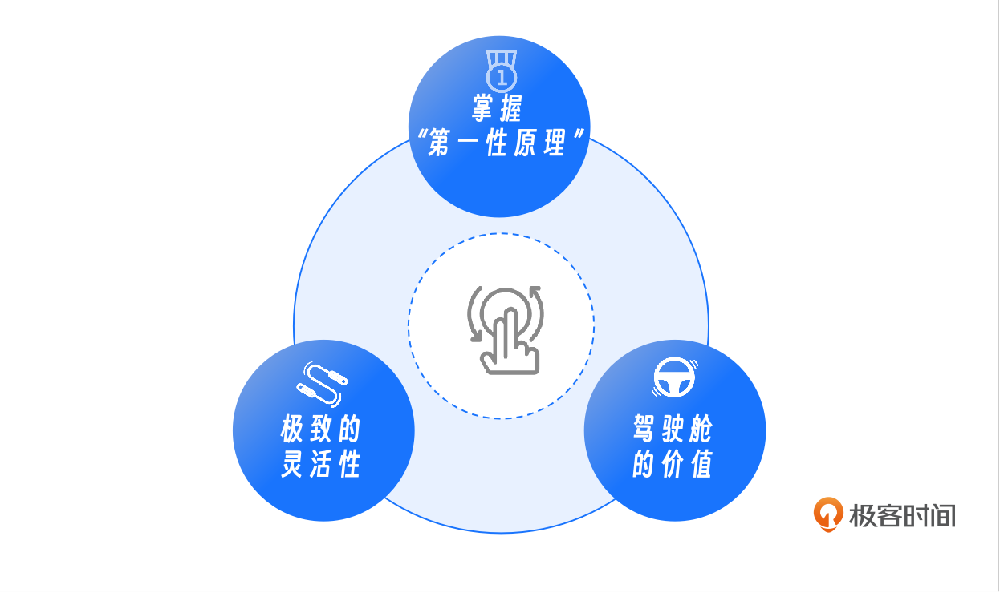
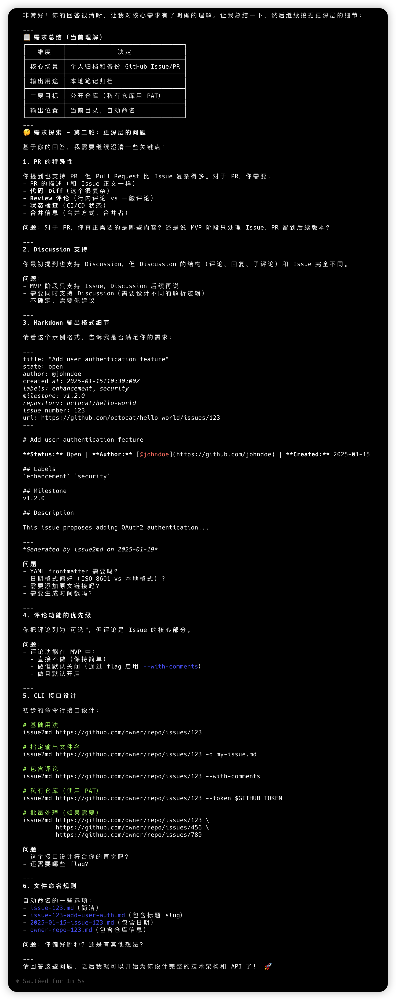
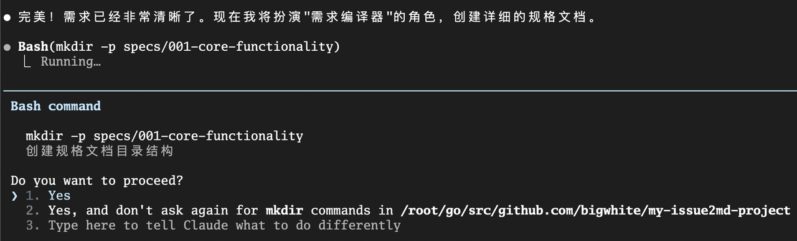
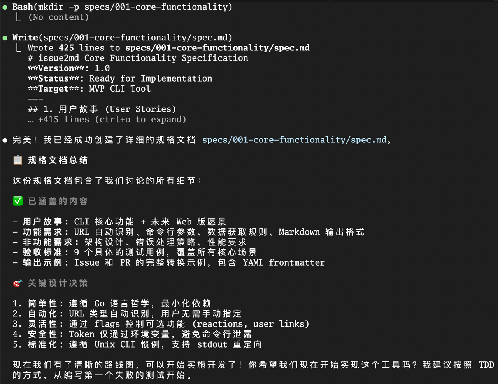
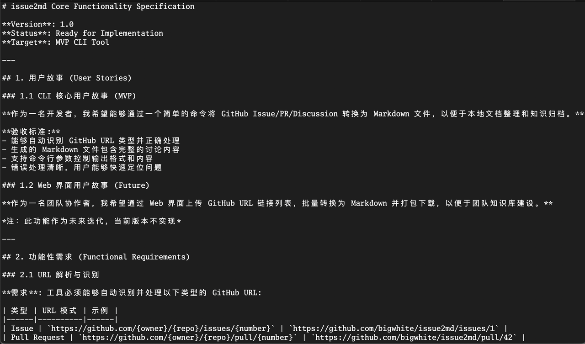
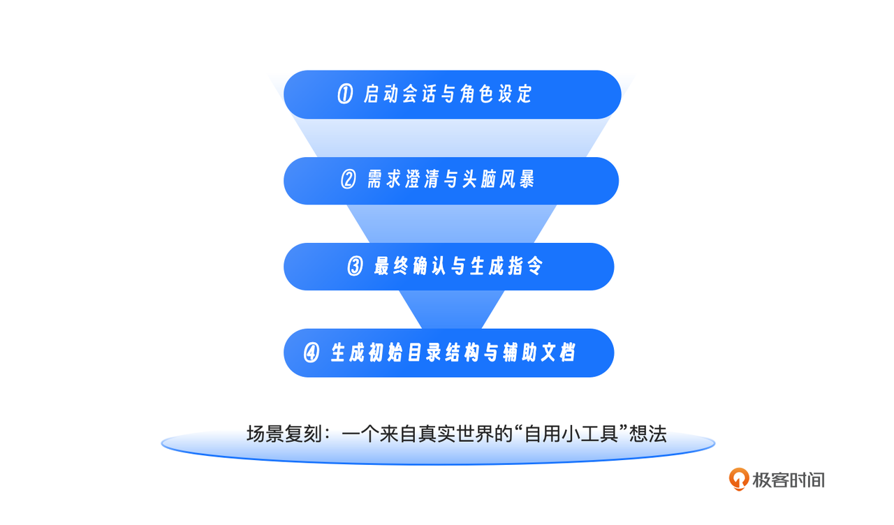

你好, 我是 Tony Bai. 

在上一讲, 我们完成了整个实战篇最关键的奠基工作 —— 设计并搭建了一套完整的 AI 原生开发 "驾驶舱". 我们的 my-issue2md-project 目录已经拥有了标准的骨架、注入了灵魂的 constitution.md 和 CLAUDE.md, 以及坚固的 settings.json 安全防线. 


现在, 驾驶舱已就位, 引擎已预热. 从这一讲开始, 我们将正式启动这台机器, 踏上 AI 原生开发工作流的征程. 

我们的第一站, 是软件工程的起点 —— 需求与设计. 在传统的开发模式中, 这个阶段往往充满了不确定性. 产品经理的想法常常是模糊的, 开发者的理解常常是有偏差的, 最终导致 "做出来的东西不是想要的". 

而在 AI 原生开发范式中, 我们将扮演一个新的角色 —— "需求编译器". 我们将学习如何通过一系列结构化的 Prompt, 指挥我们的 AI 伙伴, 将那个模糊的想法, 一步步地 "编译" 和 "精炼" 成一份清晰、结构化、可被机器精确执行的需求规范 ( spec.md ) . 

如果你只把它视为一次文档生成, 那就显得狭隘了. 实际上, 它更像是一次将人类创造力转化为工程蓝图的质的飞跃. 


## 为什么我们不直接用 spec-kit ?

在开始之前, 我想先回答一个你可能有的疑问: 既然已经有了 GitHub spec-kit 以及 openspec 这样优秀的工具, 为什么我们不直接拿来用, 而是要自己用 Prompt 来生成 spec.md 呢?

这背后有三个深层次的考量: 



1. 掌握 "第一性原理": 我们的目标不是学会使用某个具体的 SDD 工具 (工具总在变) , 而是要掌握 "如何与 AI 协作生成高质量规范" 的通用方法论. 学会了手写 Prompt, 你就能驾驭任何 Agent, 而不仅仅是被绑定在 spec-kit 等专用工具上. 

2. 极致的灵活性:  spec-kit 的模板是固定的, 而我们的项目 (尤其是 Go 项目) 可能有独特的需求. 通过自定义 Prompt, 我们可以完全根据 constitution.md 中的 "Go 语言哲学" 来定制我们的规范格式. 

3. 驾驶舱的价值: 我们在第 16 讲搭建的框架, 本身就是一个轻量级的、高度可定制的 "spec-kit". 我们要通过实战来验证, 这套我们亲手打造的框架, 是否足够强大. 

所以, 抛开拐杖, 让我们用最纯粹的方式, 来体验一次 AI 原生开发的力量. 


## 场景复刻: 一个来自真实世界的 "自用小工具" 想法

这次实战, 我们将复刻我的一个真实开源项目 —— issue2md. 这个项目的初衷非常简单, 源于我日常工作中的一个痛点: 

> 我经常需要在本地归档或引用 GitHub 上的 Issue 和 Pull Request. 手动复制粘贴太麻烦了, 我想做一个命令行工具, 给它一个 URL, 它就能自动帮我把那个 Issue 或 PR 的所有内容 (标题、正文、评论等) , 转换成一个格式漂亮的 Markdown 文件保存下来. 


这个想法很棒, 但它还停留在 " 模糊意图 " 的阶段. 

* "所有内容" 具体指什么?Reactions 要不要?用户链接要不要?

* 命令行参数应该怎么设计?需要支持哪些 Flag?

* 除了 CLI, 未来是否考虑支持 Web 界面?

如果按照传统模式, 你需要自己花半天时间去调研、设计. 但在今天, 我们可以把这个过程, 变成一场高效的 "人机结对设计". 


## 第一步: 启动会话与角色设定

首先, 确保你已经位于我们在第 16 讲创建的 my-issue2md-project 根目录下, 然后启动 Claude Code. 

```plain&#x20;text
claude
```

启动后, 你会发现 Claude Code 已经 自动加载 了我们上一讲精心准备的 CLAUDE.md 和 constitution.md  (你可以通过输入 /memory 来验证这一点) . 这意味着, 现在 AI 的 "脑子里" 已经装着我们的项目规范和架构铁律了, 我们无需再用 @ 指令重复灌输. 


在启动 Claude Code 之前, 或者在启动后, 请务必检查并 关闭 Plan Mode. 你可以通过按下 Shift + Tab 键来循环切换模式, 确保底部的状态栏显示的不是 Plan Mode. 


Plan Mode 倾向于 "自行规划并一次性执行完任务", 这非常适合之后的编码阶段. 但现在我们处于 "需求澄清" 阶段, 我们需要的是与 AI 进行 多轮的、探索式的对话, 而不是让它急于产出结果. 保持在标准模式下, 能让 AI 更耐心地听你把话说完. 


现在, 我们直接进入正题, 为 AI 设定角色 和 明确本次会话的目标. 这是一个非常重要的技巧, 它能将 AI 从一个 "通用问答机器人", 切换为一个专注的 "领域专家". 

输入我们的第一条 Prompt. 


### Prompt1: 角色设定与目标对齐

```plain&#x20;text
你好! 现在的任务是: 我们要从零开始设计并实现 `issue2md` 工具. 

你现在不仅是资深的 Go 工程师, 更是一位经验丰富的产品经理. 我有一个初步的想法, 需要你通过向我提问, 帮助我澄清需求、挖掘边缘场景, 最终目标是共创一份高质量的 `spec.md`. 

我的初步想法是: **做一个命令行工具, 输入一个 GitHub Issue/PR/Discussion 的 URL, 它就能自动将其转换为 Markdown 文件. **

请开始你的提问. 
```


这个 Prompt 的精妙之处在于: 

1. 利用框架红利: 我们省去了繁琐的上下文注入步骤, 直接基于已加载的 "宪法" 和 "手册" 开始工作, 这正是 AI 原生开发的高效之处. 

2. 双重角色: 赋予它 "产品经理" 的视角, 引导它关注需求而非实现. 

3. 任务导向: 明确了 "提问 - 澄清" 的协作模式. 


## 第二步: 需求澄清与头脑风暴

AI 在接收到指令后, 会基于它对 GitHub 生态的理解, 结合我们 constitution.md 中 "简单性原则" 的要求, 向你提出一系列高质量的问题. 

AI 可能的响应 (示例) : 

```plain&#x20;text
● 你好! 我很高兴能以Go工程师和产品经理的双重身份, 与你一起设计 issue2md 工具. 这是一个很实用的想法! 

  在开始深入讨论之前, 让我先快速了解一下当前项目的状态, 然后我会向你提出一些关键问题来帮助我们澄清需求. 

● Read(~/go/src/github.com/bigwhite/my-issue2md-project)
  ⎿  Error: EISDIR: illegal operation on a directory, read

● Search(pattern: "*")
  ⎿  Found 35 files (ctrl+o to expand)

● Read(go.mod)
  ⎿  Read 4 lines

● 很好! 我看到这是一个全新的Go项目, 已经初始化了基础的模块结构. 现在让我以产品经理的身份, 通过一些关键问题来帮助你澄清需求: 

  🎯 核心功能范围问题

  1. 支持的GitHub资源类型
  你提到了Issue、PR、Discussion, 这三者的转换需求有什么不同吗?
  - Issue: 是否需要包含comments、labels、milestone等信息?
  - PR: 是否需要包含代码diff、commits历史、review comments?
  - Discussion: 是否需要包含answers、reactions等?

  2. 转换内容的粒度
  对于单个Issue, 你希望转换哪些具体内容?
  - 只转换原始描述?
  - 包含所有评论讨论?
  - 包含关联的其他Issue/PR链接?
  - 包含代码块、图片等附件?

  🔧 技术实现问题

  3. 认证与权限
  - 是否需要支持私有仓库?
  - 如果需要, 你倾向于哪种认证方式? (GitHub Token、OAuth、还是其他?) 

  4. 输出格式定制
  - 是否需要支持不同的Markdown风格? (如GitHub风格、GitLab风格等) 
  - 是否需要支持自定义模板?

  5. 使用场景
  - 你主要在什么场景下使用这个工具? (个人文档整理、团队知识库、自动化流程等) 
  - 更倾向于一次性批量转换, 还是单个URL转换?

  📋 优先级问题

  6. MVP范围
  如果我们先做最小可用产品(MVP), 你觉得哪些功能是必须的?哪些可以后续迭代?

  请从这些问题开始, 让我们一步步把需求弄清楚! 
```


这些问题精准地切中了需求的要害. 现在, 基于我对 issue2md 项目的实际规划 (参考 bigwhite/issue2md 的实现) , 我们来回答它, 给它一个清晰的边界. 


### Prompt 2: 回复与澄清

```markdown
你的问题非常专业! 这正是我需要的. 下面是我对这些问题的思考和决定: 

**1. 关于核心功能范围 (MVP): **
*   **支持类型: ** MVP 阶段, 必须同时支持 **Issue**、**Pull Request (PR)** 和 **Discussion**. 
*   **差异处理: **
    *   **Issue/Discussion: ** 核心是"主楼描述" + "所有评论". 
    *   **PR: ** 我们**不需要** diff 信息或 commits 历史, 我们只关注 PR 的"描述"和" Review 评论". 因为我们的目标是归档 "讨论过程", 而不是代码变更. 
*   **Reactions: ** 这是一个很棒的点! 请作为一个**可选项** (通过 Flag 控制) 支持. 如果开启, 在主楼和评论下方显示 Reactions 统计. 

**2. 关于转换粒度: **
*   必须包含: 标题、作者、创建时间、状态 (Open/Closed) 、主楼内容、所有评论内容. 
*   **用户链接: ** 作为一个可选项 (Flag) , 如果开启, 将用户名渲染为指向其GitHub主页的链接. 
*   **图片/附件: ** 既然是Markdown, 直接保留原始的图片链接即可, **不需要**下载到本地. 

**3. 关于认证: **
*   只需要支持公有仓库即可. 
*   **认证方式(可选): ** 仅支持通过环境变量 `GITHUB_TOKEN` 传入 Personal Access Token. 这是 CLI 工具最标准、最简单的做法. 

**4. 关于输出与格式: **
*   **格式: ** 仅支持标准的 GitHub Flavored Markdown. 暂不需要自定义模板. 
*   **输出目标: ** 默认输出到**标准输出 (stdout)**, 方便用户重定向. 同时也支持通过参数指定输出文件路径. 

**5. 关于 MVP 范围: **
*   这就是我们的 MVP. Web 界面支持 (我在上一轮提到的) 请作为**未来的用户故事**记录在 SPEC 中, 但本次不实现. 
```


这个 Prompt: 

* 做了减法: 明确了不要 PR diff, 不要下载图片, 不要自定义模板. 这对 MVP 至关重要. 

* 明确了 Flag: 确定了 Reactions 和 User Links 作为可选功能. 

* 技术决策: 确定了认证方式和输出方式. 

这轮对话, 就是将模糊想法 " 具象化 " 的过程. 


我的回复

```markdown
你的问题非常专业! 这正是我需要的. 下面是我对这些问题的思考和决定: 

**1. 关于核心使用场景 (MVP): **
*   **主要痛点: ** 我经常需要在本地归档或引用 GitHub 上的 Issue 和 Pull Request. 手动复制粘贴太麻烦了, 所以主要目的是归档和备份. 
*   **使用场景: ** 个人使用

**2. 关于输出 Markdown 的用途: ** 本地笔记归档

**3. 关于内容范围优先级: **
*   **必须: ** Issue 标题, Issue 正文, 标签/里程碑, 状态, 作者/时间信息
*   **可选: ** 评论列表, 评论恢复, 代码高亮片段, 图片/附件链接
*   **不需要: ** 无


**4. 关于认证与权限: **
*   **主要处理仓库类型: ** 公开仓库
*   **私有仓库认证方式: ** PAT

**5. 关于输出控制: **
*   **保存到哪里** 保存到当前目录指定文件名, 合理命名即可
```




在我的环境里, Claude Code 给了我如下响应: 

```markdown
● 非常好! 你的需求已经很清晰了. 基于你的回答, 我还有几个关键的细节问题需要确认: 

  🔍 最后一轮细节澄清

  1. URL格式与识别
  - 工具需要自动识别URL类型吗?比如: 
    - https://github.com/user/repo/issues/123 → Issue
    - https://github.com/user/repo/pull/456 → PR
    - https://github.com/user/repo/discussions/789 → Discussion
  - 还是用户需要明确指定类型? (如 issue2md issue <url>, issue2md pr <url> 等) 

  2. 评论排序与层级
  - 评论的排序方式: 按时间正序 (从最早到最新) ?
  - 对于PR的Review Comments: 是否需要保持原来的分组结构 (按review分组) ?
  - Discussion的answers是否需要特殊标记 (如显示"✅ Accepted Answer") ?

  3. Markdown结构模板
  你希望输出的Markdown采用什么样的结构?比如: 

  # [Issue Title] - Open/Closed

  **作者:** @username
  **创建时间:** 2024-01-01 10:00:00
  **最后更新:** 2024-01-02 15:30:00

  ## Description
  [原始内容...]

  ## Comments (15)
  ### @user1 - 2024-01-01 11:00:00
  [评论内容...]

  ### @user2 - 2024-01-01 12:00:00
  [评论内容...]

  4. 错误处理
  - 如果URL无效或资源不存在, 工具应该如何表现?
  - 如果网络请求失败, 是否需要重试机制?
  - GitHub API限流时如何处理?

  5. 命令行参数设计
  基于你的需求, 这样的参数设计如何?
  # 基本用法
  issue2md <github-url>

  # 可选参数
  issue2md <github-url> [flags]
    --output, -o        # 输出到文件, 默认stdout
    --include-reactions # 包含reactions统计
    --user-links        # 用户名渲染为链接
    --token             # GitHub Token (也可通过环境变量)

  请确认这些细节, 我们就可以开始编写详细的 spec.md 了! 
```


## 第三步: 最终确认与生成指令

这一轮的 Prompt 将是我们生成 `spec.md` 之前的最后一次输入. 我们不仅需要回答它的问题, 还要顺势给出 生成 SPEC 的指令. 


### Prompt 3: 最终确认与生成指令

```markdown
你的考虑非常周全! 这些细节决定了工具的好用程度. 这是我的最终决定: 

**1. URL识别: **
*   **必须自动识别. ** 用户不需要手动指定类型, 工具应解析URL结构来判断是Issue、PR还是Discussion. 这是核心体验. 

**2. 排序与结构: **
*   **评论排序: ** 统一按时间**正序**. 
*   **PR Review Comments: ** 这是一个好问题. 为了保持简单, **不需要**按Review分组, 直接把所有Review Comments和其他Comments一起按时间线平铺展示即可. 我们的目标是归档"发生了什么对话". 
*   **Discussion Answer: ** 是的, 如果某个评论被标记为Answer, 请在Markdown中给它加一个显著的标记 (如引用块或Emoji) . 

**3. Markdown模板: **
*   你给出的模板结构非常棒, 就按这个来! 
*   请确保在文件头部包含YAML Frontmatter (如title, url, author, created_at) , 方便其他工具 (如Hugo/Jekyll) 解析. 

**4. 错误处理: **
*   如果URL无效或资源不存在, 直接报错退出, 并在stderr输出清晰的错误信息. 
*   **不需要**复杂的重试机制, 保持CLI轻量. 
*   API限流时, 直接透传GitHub API的错误信息给用户即可. 

**5. 命令行参数设计: **
*   你的设计大体不错, 但有一点调整: 为了符合Unix习惯, 输出文件我想支持**位置参数**, 同时也保留你的Flags建议. 
*   **最终设计: **

    issue2md [flags] <url> [output_file]

    *   如果不提供 output_file, 默认打印到 stdout. 
    *   Flags:
        *   -enable-reactions (对应你的 --include-reactions)
        *   -enable-user-links (对应你的 --user-links)
        *   注意: Token**只**通过环境变量 `GITHUB_TOKEN` 获取, **不要**提供 --token 参数, 以防在Shell历史中泄露密钥. 
---

**现在, 所有的需求都已清晰. **

请扮演"需求编译器", 执行以下操作: 

1.  在项目根目录下创建一个名为 specs/001-core-functionality/ 的目录. 
2.  在该目录下创建 spec.md 文件. 内容必须包含: 
    *   **用户故事** (含CLI和未来的Web版) 
    *   **功能性需求** (涵盖我们讨论的所有细节: URL识别、Flags、Token、Markdown结构) 
    *   **非功能性需求** (架构解耦、错误处理) 
    *   **验收标准** (列出具体的测试Case) 
    *   **输出格式示例** (包含你刚才设计的Markdown结构和Frontmatter) 

请直接执行工具生成文件. 
```


Prompt 设计意图: 

1. 明确拒绝复杂性: 对于 PR Review 分组、重试机制等增加了复杂度但对 MVP 价值不大的功能, 果断说 "不". 

2. 安全修正: 纠正了它关于 --token 参数的建议, 这是一个非常重要的安全最佳实践 (避免 Token 留在 bash history 中) . 

3. 闭环: 在回答完问题的同时, 直接下达了生成 spec.md 的指令, 避免了再多一轮对话. 

这样, AI 就会拿着这套最详尽的蓝图, 去生成我们想要的文件了. 


AI 在接收到这个指令后, 会执行以下操作: 

1. 调用 Bash 工具执行 `mkdir -p specs/001-core-functionality/`. 

2. 调用 Write 工具创建 `specs/001-core-functionality/spec.md`. 


以下是我的环境下的 Claude Code 执行过程截图: 






AI 生成的 `spec.md` 预览: 



注: 完整的 spec.md 内容很长, 在我的环境下有 400 多行, 如果要阅读器全部内容, 请参见我的 bigwhite/my-issue2md-project 项目源码. 


## 第四步: 生成初始目录结构与辅助文档

spec.md 生成后, 我们还需要为这个 Feature 准备好它的 "物理载体"—— 即代码目录结构. 虽然我们在第 16 讲创建了顶层目录, 但针对这个具体 Feature 的包结构, 最好也由 AI 根据 spec.md 来生成. 

此外, 为了更好地指导后续开发, 我们还可以让 AI 生成一份 API 契约草稿  (虽然我们不一定要严格遵守, 但它可以作为思考辅助) . 


### Prompt 4: 生成目录结构

```markdown
非常好. 基于这份 `spec.md` 和我们的 `constitution.md` (特别是关于包内聚的原则) , 请为这个功能设计详细的包结构. 

请调用 `Bash` 工具, 创建以下目录 (如果尚未存在) : 

- `cmd/issue2md/` (CLI入口)
- `cmd/issue2mdweb/` (Web入口)
- `internal/`
   ├── github/      # GitHub API 交互
   ├── parser/      # URL 解析与类型识别
   ├── converter/   # 数据转换为 Markdown
   ├── cli/         # 命令行接口
   └── config/      # 配置管理
- `web/templates/` (Web模板)
- `web/static/` (静态资源)

同时, 请在 `specs/001-core-functionality/` 下创建一个 `api-sketch.md`, 简要描述一下 `internal/converter` 和 `internal/github` 包对外暴露的主要接口 (Interface/Function签名) , 作为后续开发的参考. 
```

AI 会迅速执行这些操作. 此时, 你的项目结构已经初具规模, 且完全符合你的设计意图. 

```bash
● Bash(mkdir -p cmd/issue2md cmd/issue2mdweb internal/{github,parser,converter,cli,config} web/{templates,static})
  ⎿  (No content)

● Write(specs/001-core-functionality/api-sketch.md)
  ⎿  Wrote 320 lines to specs/001-core-functionality/api-sketch.md                                
     # API 设计草稿
     本文档定义了 `internal/converter` 和 `internal/github` 包的主要接口设计, 作为后续实现的参考. 
     ---
     ## internal/github 包
     ### 1. 核心接口定义
     … +310 lines (ctrl+o to expand)

● Bash(tree -d -L 3 .)
  ⎿  .                             
     ├── cmd
     │   ├── issue2md
     … +14 lines (ctrl+o to expand)

● 完美! 我已经成功创建了完整的项目包结构和 API 设计草稿. 

  📁 项目结构总览

  ✅ 已创建的目录结构

  .
  ├── cmd/                           # 应用入口点
  │   ├── issue2md/                 # CLI 工具入口
  │   └── issue2mdweb/              # Web 服务入口 (未来)
  ├── internal/                      # 内部包, 不对外暴露
  │   ├── cli/                      # 命令行接口
  │   ├── config/                   # 配置管理
  │   ├── converter/                # Markdown 转换器
  │   ├── github/                   # GitHub API 客户端
  │   └── parser/                   # URL 解析器
  ├── web/                          # Web 相关资源
  │   ├── static/                   # 静态文件 (CSS, JS)
  │   └── templates/                # HTML 模板 (未来)
  └── specs/
      └── 001-core-functionality/   # 核心功能规格文档
          ├── spec.md              # 详细规格说明
          └── api-sketch.md        # API 设计草稿

  🔧 API 设计要点

  internal/github 包

  - 核心接口: GitHubClient 接口, 定义了获取 Issue/PR/Discussion 的方法
  - 数据结构: 定义了完整的 GitHub 资源数据模型
  - 设计原则: 接口导向, 便于测试和替换实现

  internal/converter 包

  - 核心接口: Converter 接口, 负责将 GitHub 资源转换为 Markdown
  - 选项模式: 使用 ConvertOptions 结构体控制转换行为
  - 模板化: 支持可配置的 Markdown 模板

  internal/parser 包

  - 功能: 专门负责 URL 解析和验证
  - 简单性: 单一职责, 只处理 URL 相关逻辑

  🎯 实现优先级

  根据 API 设计草稿中的建议, 实现顺序为: 

  1. internal/parser - URL 解析 (最简单, 容易测试)
  2. internal/github - GitHub API 客户端 (核心依赖)
  3. internal/converter - Markdown 转换 (核心业务逻辑)
  4. internal/config - 配置管理
  5. internal/cli - 命令行接口
  6. cmd/issue2md - 主程序入口

  这个顺序遵循了自底向上、先易后难的原则, 符合项目宪法的"简单性原则". 

  现在我们有了清晰的架构设计和 API 规范, 可以开始按照 TDD 的方式进行开发了! 你希望从哪个包开始实现?我建议从 internal/parser
  开始, 因为它的依赖最少, 最容易编写测试. 
```

恭喜! 我们已经完成了实战篇的第一步, 成功地将一个模糊的想法, 变成了一份无可挑剔的规范和一套标准的项目骨架. 


让我们回顾一下, 在这个过程中, 我们是如何运用 "驾驶舱" 中的能力的: 

* 上下文注入 ( @ ) : 我们在 Prompt 1 中显式注入了 constitution.md 和 CLAUDE.md, 这确保了 AI 在整个思考过程中, 始终没有偏离我们的 "简单性" 和 "解耦" 原则 (比如它主动在 NFR 中提到了将逻辑放入 internal/ ) . 

* Slash Commands (隐式应用) : 虽然我们没有直接调用 /specify  (因为我们选择了原生路线) , 但我们 Prompt 3 的结构, 实际上就是在手动执行一个高级版的 /specify 指令逻辑. 你完全可以将 Prompt 3 封装成一个 /.claude/commands/generate-spec.md 指令, 供以后复用. 

* 工具调用 ( Write , Bash ) : AI 通过调用这些工具, 实现了从 "思维" 到 "文件" 的落地. 

恭喜! 到这里, 我们已经完成了实战篇的第一步, 成功地将一个模糊的想法, 变成了一份无可挑剔的需求规范和一套标准的项目骨架. 


## 本讲小结

今天, 我们扮演了 "需求编译器" 的角色, 亲历了 AI 原生开发的第一阶段. 



1. 我们通过一张 "编译三部曲" 的作战地图, 明确了本讲在整个实战篇中的定位. 

2. 我们通过 设定角色 和 多轮头脑风暴, 将一个模糊的 "Issue 转 Markdown" 想法, 打磨成了清晰的需求. 

3. 我们编写了高质量的 Prompt, 指挥 AI 生成了一份包含用户故事、功能需求和验收标准的标准化 `spec.md`. 

4. 我们基于规范, 让 AI 自动生成了符合 Go 项目最佳实践的 目录结构 和 接口草图. 

这份 spec.md, 现在就是我们项目的 "真理之源". 在下一讲, 我们将进入 "编译" 的第二阶段 —— 计划与任务. 我们将扮演 "方案编译器", 指挥 AI 基于这份规范, 生成详尽的技术方案 plan.md, 并将其拆解为可供 AI 直接执行的原子任务列表 tasks.md. 


## 思考题

在今天的实战中, 我们在 spec.md 中明确定义了 "Web 界面支持" 作为一个用户故事, 尽管我们目前的重点是 CLI. 

请思考一下,  在规范阶段就将未来的 (甚至是不在本次迭代范围内的) 需求纳入考虑, 对于后续的 "架构设计" 和 "代码实现" 有什么深远的价值? 它如何帮助我们避免 "走一步看一步" 带来的架构重构成本?欢迎在评论区分享你的看法! 如果你觉得有所收获, 也欢迎你分享给其他朋友, 我们下节课再见! 

