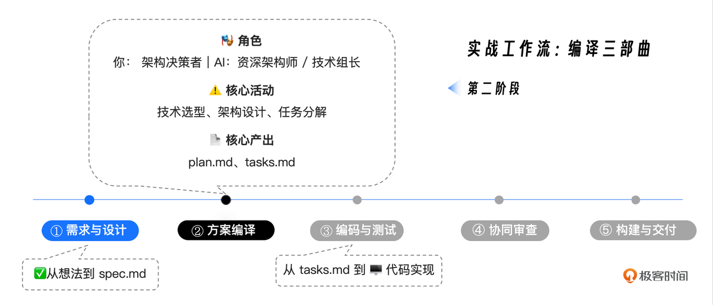
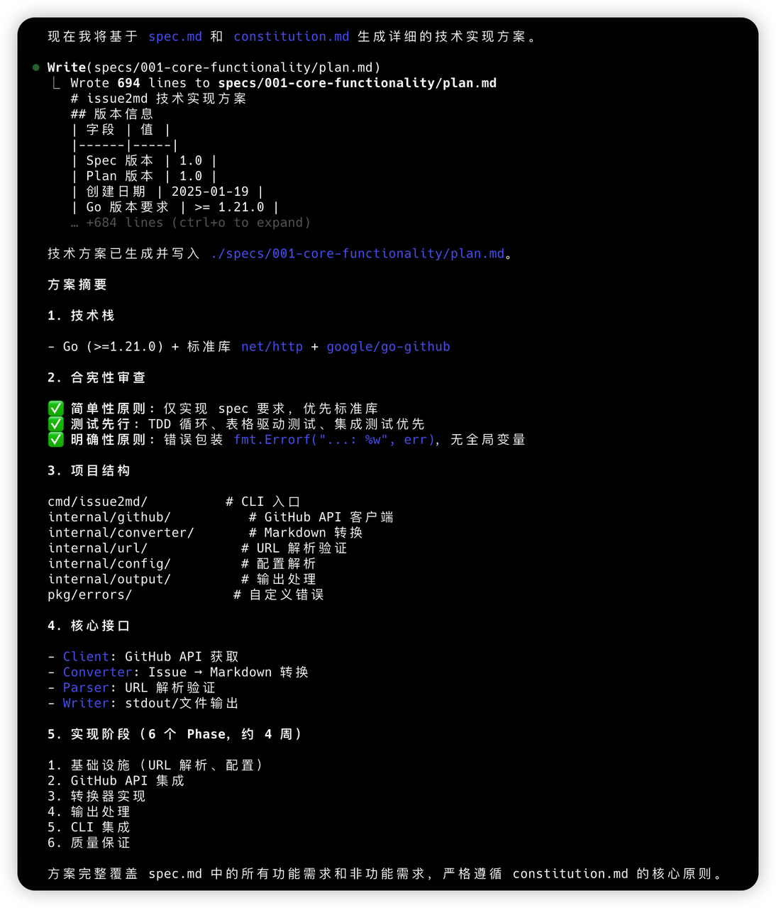

你好, 我是 Tony Bai. 

在上一讲, 我们成功地完成了 AI 原生工作流的第一阶段. 通过与 AI 的深度协作, 我们已经将一个模糊的产品想法, 转化成了一份清晰、结构化的需求规范 spec.md, 并搭建了项目的初始 "骨架" 和 "宪法". 

我们的 "建筑蓝图" 已经有了最顶层的设计稿. 但是, 这份设计稿对于施工队 (AI Agent) 来说, 还太过宏观. 它知道了我们要建一栋什么样的房子 ( spec.md ) , 但还不知道:&#x20;

* 应该用什么品牌的钢筋水泥? ( 技术选型 ) 

* 承重墙和非承重墙应该如何分布? ( 架构设计 ) 

* 具体的施工步骤应该是先打地基还是先砌墙? ( 任务序列 ) 


今天这一讲, 我们的目标, 就是完成 "编译三部曲" 的第二乐章 —— 计划与任务. 我们将继续扮演 "工作流指挥家" 的角色, <span style="color: inherit; background-color: rgba(254,212,164,0.8)">引导我们的 </span><span style="color: inherit; background-color: rgba(254,212,164,0.8)">AI</span><span style="color: inherit; background-color: rgba(254,212,164,0.8)"> 伙伴, 将高层级的 spec.md, "编译" 成两份至关重要的工程文档: 一份是详尽的技术方案 plan.md, 另一份则是 AI 可以直接执行的、原子化的任务列表 tasks.md</span>. 

这将是一次将 "业务需求" 精确翻译为 "工程语言" 的关键旅程. 


## 回顾: 我们在 "编译三部曲" 中的位置

在开始之前, 让我们再次明确我们在整个工作流中的位置. 



我们的任务, 就是承接上一讲生成的 specs/001-core-functionality/spec.md, 生成后续所有编码工作所依赖的精确 "施工图" 和 "任务清单". 


## 第一步: 技术规划 ( plan.md ) —— AI 扮演的 "架构师"

<span style="color: inherit; background-color: rgba(254,212,164,0.8)">plan.md 是连接 "做什么" (WHAT) 和 "怎么做" (HOW) 的关键桥梁</span>. 在这个阶段, 我们将扮演 架构决策者, 为 AI 提供关键的技术约束; 而 AI 则将扮演 资深架构师, 负责将这些约束与 spec.md 的需求相结合, 生成一份完整的技术实现蓝图. 


### 准备 "源码": 我们的 Prompt

首先, 确保你已经位于 my-issue2md-project 根目录下, 并启动了 Claude Code (关闭 Plan Mode ) . 

我们在第 16 讲已经建立了 CLAUDE.md 和 constitution.md, AI 在启动时会自动加载这些上下文. 因此, 我们无需重复灌输通用的原则, 只需专注于本次实战的特定约束. 


输入我们的第一条 Prompt:&#x20;

```markdown
**Prompt 1: 生成技术方案**

`@./specs/001-core-functionality/spec.md`

你现在是`issue2md`项目的首席架构师. 你的任务是基于我提供的`spec.md`以及我们已有的`constitution.md` (你已自动加载) , 为项目生成一份详细的技术实现方案 (`plan.md`) . 

**技术栈约束 (必须遵循):**

- **语言**: Go (>=1.21.0)
- **Web框架**: 仅使用标准库 `net/http`, 不引入Gin或Echo等外部框架 (遵循"简单性原则") . 
- **GitHub API客户端**: 使用 `google/go-github` 库, 结合GraphQL API v4. 
- **Markdown输出处理**: 尽量不使用任何第三方库. 
- **数据存储**: 本项目初期**不需要数据库**, 所有数据通过API实时获取. 

**方案内容要求 (必须包含):**

1.  **技术上下文总结:** 明确上述技术选型. 
2.  **"合宪性"审查:** 逐条对照`constitution.md`的原则, 检查并确认本技术方案符合所有条款 (特别是包内聚、错误处理、TDD) . 
3.  **项目结构细化:** 明确`cmd/`, `internal/github/`, `internal/converter/`等包的具体职责和依赖关系. 
4.  **核心数据结构:** 定义在模块间流转的核心Go `struct`, 例如`IssueData`, 必须包含Spec中要求的所有字段 (Title, Author, Reactions等) . 
5.  **接口设计:** 定义`internal`包对外暴露的关键Interface. 

请严格按照`@./.claude/templates/plan-template.md`的模板格式来组织你的输出 (如果模板不存在, 请自行设计一个结构清晰的Markdown格式) . 

完成后, 将生成的`plan.md`内容写入到`./specs/001-core-functionality/plan.md`文件中. 
```


这个 Prompt 的精妙之处在于:&#x20;

1. 引用新 Spec: 明确指向我们在第 17 讲生成的 spec.md. 

2. 架构决策: 我们作为决策者, 明确了 "无数据库"、"标准库优先" 等关键架构属性. 

3. 合宪性审查: 强制 AI 对照 "宪法" 自检, 这是保证架构不跑偏的关键. 

4. 数据结构要求: 特别强调了要包含 Spec 中新加入的 Reactions 等字段. 


### 审查与产出: 一份高质量的 plan.md

AI 在接收到指令后, 会开始它的 "方案编译" 工作. 它会分析 spec.md 中的需求 (比如对 Issue/PR/Discussion 的支持、Reactions 的展示) , 并结合我们的技术约束, 生成一份详尽的 plan.md. 下面是在我的环境下, AI Agent 的分析和执行过程:&#x20;

```bash
● 我需要先阅读相关的规格说明文档和模板, 然后生成技术实现方案. 让我开始: 

● Read(specs/001-core-functionality/spec.md)
  ⎿  Read 425 lines

● 现在让我检查是否有计划模板: 

● Search(pattern: ".claude/templates/plan-template.md")
  ⎿  Found 0 files 

● 模板不存在, 我需要查看当前项目的结构来了解现状: 

● Search(pattern: "**/*")
  ⎿  Found 47 files (ctrl+o to expand)

● 让我检查一下go.mod文件和Makefile是否存在: 

● Read(go.mod)
  ⎿  Read 4 lines

● Search(pattern: "Makefile")
  ⎿  Found 0 files 

● Search(pattern: "makefile")
  ⎿  Found 0 files 

● 让我检查是否有API设计草图: 

● Read(specs/001-core-functionality/api-sketch.md)
  ⎿  Read 320 lines

● 现在我已经有了足够的信息来生成技术实现方案. 让我使用TodoWrite来规划这个任务: 

● 现在我将生成详细的技术实现方案: 

● Write(specs/001-core-functionality/plan.md)
  ⎿  Wrote 562 lines to specs/001-core-functionality/plan.md
     # issue2md 技术实现方案
     **版本**: 1.0
     **状态**: 准备实施
     **基于**: specs/001-core-functionality/spec.md v1.0
     ---
     ## 1. 技术上下文总结
     … +552 lines (ctrl+o to expand)

● 现在让我更新todo状态: 

● 技术方案生成完成

  我已经基于 spec.md 和 constitution.md 为 issue2md 项目生成了详细的技术实现方案, 并将其保存到了
  ./specs/001-core-functionality/plan.md 文件中. 

  方案要点总结: 

  1. 严格合宪性 - 技术方案完全符合项目宪法的三个核心原则
  2. 简单性优先 - 仅使用Go标准库和必需的外部依赖
  3. TDD方法 - 采用表格驱动测试, 测试先行开发
  4. 清晰架构 - 模块化设计, 依赖关系明确
  5. 实用可行 - 8周实施计划, 风险可控

  核心技术决策: 

  - GitHub API: 使用GraphQL v4获取数据, 提高效率
  - Web框架: 严格使用net/http标准库
  - 数据处理: 直接字符串处理, 不引入Markdown库
  - 认证: 通过环境变量管理GitHub Token

  项目结构: 

  internal/
  ├── cli/         # 命令行接口
  ├── config/      # 配置管理
  ├── converter/   # Markdown转换
  ├── github/      # GitHub API交互
  └── parser/      # URL解析

  方案已准备就绪, 可以开始按照阶段1的实施计划进行开发. 
```


它最终会提议执行 Write 操作. 我的环境中的这份 plan.md  (560 多行) 包含以下核心内容 (节选) :&#x20;

```yaml
# issue2md 技术实现方案

**版本**: 1.0 | **状态**: 准备实施 | **基于**: specs/001-core-functionality/spec.md v1.0

---

## 1. 技术上下文总结

### 1.1 核心技术栈
- **语言**: Go (版本 >= 1.21.0)
- **Web框架**: 仅使用标准库 `net/http`
- **GitHub API客户端**: 使用 `google/go-github` 库
- ... (其他技术栈说明)

### 1.2 项目外部依赖

// go.mod 将添加以下依赖
require (
    github.com/google/go-github v45.1.0
    ...
)

### 1.3 架构设计原则
... (简单性、内聚性、可测试性等原则)

---

## 2. "合宪性"审查

### 2.1 符合性检查表
| 宪法条款 | 符合性 | 具体体现 |
|---------|--------|----------|
| **第一条: 简单性原则** | ✅ 完全符合 | ... |
| **第二条: 测试先行铁律** | ✅ 完全符合 | ... |
| **第三条: 明确性原则** | ✅ 完全符合 | ... |

### 2.2 具体合规措施
... (针对每一条原则的具体实施方案)

---

## 3. 项目结构细化

### 3.1 完整目录结构

issue2md/
├── cmd/issue2md/main.go
├── internal/
│   ├── cli/
│   ├── config/
│   ├── converter/
│   ├── github/
│   └── parser/
...

### 3.2 包职责与依赖关系
... (包职责矩阵与依赖关系图)

---

## 4. 核心数据结构

### 4.1 统一资源表示

// Resource 表示所有GitHub资源的通用字段
type Resource struct {
    Title       string
    URL         string
    // ... (Author, Status, Reactions 等字段)
}

### 4.2 特定资源类型
... (Issue, PullRequest, Discussion 等结构体定义)

---

## 5. 接口设计
... (GitHubClient, Parser, Converter 等核心接口定义)

---

## 6. 实施计划与优先级

### 6.1 开发阶段划分
#### 阶段1: 基础设施 (第1-2周)
#### 阶段2: 数据获取 (第3-4周)
...

### 6.2 TDD实施策略
...

---

## 7. 关键技术决策与理由
... (GraphQL使用、标准库优先等决策)

---

## 8. 风险评估与缓解策略
...

## 9. 成功标准
...
```


在你批准后, 这份凝聚了 AI 架构能力的 "设计图" 就完成了. 它不仅满足了需求, 还通过了我们的 "宪法" 审查. 



【重要提示: 不要跳过审查！】

请记住, AI 生成的这份 plan.md, 目前仅仅是一份 "待确认的草稿". 在你输入回车批准写入之前或者哪怕是已经写入磁盘之后, 也请务必花费一定时间仔细阅读它. 

* 它的技术选型是否真的符合你的预期?

* 它的目录结构是否合理?

* 它的合宪性审查是否只是在 "敷衍"?

<span style="color: inherit; background-color: rgba(254,212,164,0.8)">我们 不要吝啬这份审查时间. 在规范和设计阶段发现并修正一个错误, 成本几乎为零; 但如果等到代码写了一半才发现架构跑偏了, 那返工的成本将是巨大的. 人工审查, 是确保意图被精确执行的唯一保障. </span>


## 第二步: 任务分解 ( tasks.md ) —— AI 扮演的 "技术组长"

有了 plan.md, 我们距离可执行的代码, 还差最后一步: 将宏观的设计, 分解为微观的、原子化的、带依赖关系的施工步骤. 

这就是 tasks.md 的使命. 在这个阶段, AI 将扮演一个经验丰富的 "技术组长" 的角色. 


### 准备 "源码": 一个更简洁的 Prompt

这个阶段的 Prompt 不需要太多的技术细节, 因为细节都在 plan.md 里了. 我们需要重点强调的是 执行顺序 和 任务粒度. 

```markdown
**Prompt 2: 生成任务列表**

方案非常完美. 

现在, 请扮演技术组长. 请仔细阅读 `@./specs/001-core-functionality/spec.md` 和 `@./specs/001-core-functionality/plan.md`. 

你的目标是将 `plan.md`中描述的技术方案, 分解成一个**详尽的、原子化的、有依赖关系的、可被AI直接执行的任务列表**. 

**关键要求: **
1.  **任务粒度: ** 每个任务应该只涉及一个主要文件的修改或创建一个新文件. 不要出现"实现所有功能"这种大任务. 
2.  **TDD强制: ** 根据`constitution.md`的"测试先行铁律", **必须**先生成测试任务, 后生成实现任务. 
3.  **并行标记: ** 对于没有依赖关系的任务, 请标记 `[P]`. 
4.  **阶段划分: ** 即便`plan.md`中包含了粗略的阶段划分, 也要以下面的为准. 
    *   **Phase 1: Foundation** (数据结构定义)
    *   **Phase 2: GitHub Fetcher** (API交互逻辑, TDD)
    *   **Phase 3: Markdown Converter** (转换逻辑, TDD)
    *   **Phase 4: CLI Assembly** (命令行入口集成)

完成后, 将生成的任务列表写入到`./specs/001-core-functionality/tasks.md`文件中. 
```


### 审查与产出: 一份 AI 的 "可执行字节码"

AI 会全面地分析 plan.md, 并尝试生成一份极其详尽的 tasks.md:&#x20;

```markdown
● 我将作为技术组长, 仔细阅读规格文档和技术方案, 然后生成一个详尽的、原子化的任务列表. 

● Read(specs/001-core-functionality/plan.md)
  ⎿  Read 562 lines

● 现在我将生成详细的、原子化的任务列表, 严格遵循TDD原则: 

● Write(specs/001-core-functionality/tasks.md)
  ⎿  Wrote 443 lines to specs/001-core-functionality/tasks.md
     # issue2md 实现任务列表
     **版本**: 1.0
     **基于**: specs/001-core-functionality/plan.md
     **原则**: TDD (测试先行) , 原子化任务, 依赖关系明确
     ---
     ## Phase 1: Foundation (数据结构定义)
     … +433 lines (ctrl+o to expand)

● 任务列表生成完成

  我已经成功将技术方案分解为一个详尽的、原子化的、有依赖关系的任务列表, 并将其保存到了 ./specs/001-core-functionality/tasks.md
   文件中. 

  任务列表特点: 

  🎯 原子化设计
  - 184个具体任务, 每个任务只涉及一个文件的创建或修改
  - 从数据结构定义到集成测试的完整覆盖

  🔧 TDD严格执行
  - 测试先行: 每个功能都先有测试任务 (奇数编号) 
  - 实现后续: 对应的实现任务 (偶数编号) 
  - 遵循 Red-Green-Refactor 循环

  📋 8个开发阶段
  1. Phase 1: Foundation (数据结构定义) - 35个任务
  2. Phase 2: URL Parser (URL解析逻辑) - 16个任务
  3. Phase 3: GitHub Fetcher (API交互逻辑) - 31个任务
  4. Phase 4: Markdown Converter (转换逻辑) - 36个任务
  5. Phase 5: Configuration Management (配置管理) - 20个任务
  6. Phase 6: CLI Assembly (命令行入口) - 33个任务
  7. Phase 7: Main Program (主程序入口) - 8个任务
  8. Phase 8: Integration & Testing (集成与测试) - 8个任务

  ⚡ 并行优化
  - [P] 标记了22个可并行执行的任务
  - 同阶段内[P]任务可同时开发, 提高效率

  📊 严格依赖关系
  - 明确的任务执行顺序
  - 跨阶段任务必须按依赖关系执行
  - 包内任务遵循TDD的测试-实现循环

  这个任务列表为AI提供了清晰、可执行的路线图, 确保严格按照项目宪法和TDD原则进行开发, 每个任务都有明确的目标和验收标准. 
```


这份 tasks.md 文件, 就是 AI 在下一阶段进行编码时, 将要严格遵循的 "剧本".  让我们来看看 AI 生成的这份令人印象深刻的任务列表 (节选) :&#x20;

```markdown
**`./specs/001-core-functionality/tasks.md`**

# issue2md 实现任务列表

**版本**: 1.0 | **基于**: specs/001-core-functionality/plan.md
**原则**: TDD (测试先行) , 原子化任务, 依赖关系明确

## Phase 1: Foundation (数据结构定义)

### 1.1 项目基础设置
1. **[P]** 创建 `go.mod` 依赖声明
   - 添加 `github.com/google/go-github` 和 `golang.org/x/oauth2` 依赖

### 1.2 核心数据结构 (internal/github/types.go)
4. 创建 `internal/github/types_test.go` - Reactions结构体测试
10. 创建 `internal/github/types.go` - Reactions结构体
...
18. 创建 `internal/github/types.go` - Resource基础结构体
19. 创建 `internal/github/types.go` - Issue结构体

## Phase 2: URL Parser (URL解析逻辑, TDD)

### 2.1 URL解析核心功能
36. 创建 `internal/parser/parser_test.go` - Parse方法基础测试
37. 创建 `internal/parser/parser_test.go` - Parse方法Issue URL测试
...
43. 创建 `internal/parser/parser.go` - Parse方法实现

## Phase 3: GitHub Fetcher (API交互逻辑, TDD)

### 3.3 GitHub客户端实现
65. 创建 `internal/github/client_test.go` - GetIssue方法测试
69. 创建 `internal/github/client.go` - GetIssue方法实现

## Phase 4: Markdown Converter (转换逻辑, TDD)

### 4.2 内容格式化
92. 创建 `internal/converter/formatter_test.go` - FormatReactions方法测试
96. 创建 `internal/converter/formatter.go` - FormatReactions方法实现

## Phase 6: CLI Assembly (命令行入口集成)

### 6.1 命令行参数解析
140. 创建 `internal/cli/args_test.go` - Parse方法测试
146. 创建 `internal/cli/args.go` - Parse方法实现
...
```


让我们简单解读一下这份 tasks.md:&#x20;

1. 惊人的细粒度: AI 将整个项目拆解成了 180+ 个原子任务！每一个结构体的定义、每一个方法的实现, 都被拆分成了独立的任务. 

2. 严格的 TDD 执行: 请注意看任务编号. 奇数编号的任务 (如 T37, T65) 几乎全是创建测试, 偶数编号 (如 T43, T69) 才是实现代码. 这完美贯彻了我们 "宪法" 中的 "测试先行" 铁律. 

3. 并行性识别: 大量的 \[P] 标记出现在了基础结构定义和无依赖的工具函数中, 这意味着如果我们有多个 AI Agent, 它们可以同时开工. 

4. 阶段清晰: 从 Foundation 到 URL Parser, 再到 GitHub Fetcher 和 Converter, 最后是 CLI 集成, 层次分明, 逻辑严密. 

在你批准后, 我们就完成了从 "蓝图" 到 "施工清单" 的全部转化. 现在, AI 已经拥有了一份精确到 "先写测试 T036, 再写代码 T043" 级别的详细指令. 


<span style="color: inherit; background-color: rgba(254,212,164,0.8)">【再次强调: 审查你的 "任务指令集"】</span>

<span style="color: inherit; background-color: rgba(254,212,164,0.8)">同样地, 这份 tasks.md 也需要你的严格审查. 虽然 180+ 个任务看起来很多, 但你只需要检查 关键路径 和 依赖关系. </span>

* TDD 顺序对吗? 确实是先 Test 后 Code 吗?

* 核心逻辑遗漏了吗? 比如 Reactions 的处理是否被列入了计划? (是的, T96 明确列出了) 

* 依赖是否合理? CLI Assembly 是否正确地排在了所有核心逻辑实现之后?

如果发现问题, 不要犹豫, 直接用自然语言反馈给 AI: "任务 Txxx 的依赖关系不对, 请调整. " 让它重新生成, 直到你满意为止. 记住,  你才是指挥官, AI 只是你的参谋长. 


## 进阶技巧: 定制你的模板库

在今天的实战中, 我们为了教学目的, 没有使用预设的模板文件, 而是通过 Prompt 直接描述了格式要求. 但在实际的团队开发中, 为了保证产出的一致性, 我强烈建议你构建一套标准化的模板库. 

你可以参考业界优秀的开源项目 (如 spec-kit 或 openspec ) , 提取它们 plan.md 和 tasks.md 的结构精华, 定制成适合你团队的模板文件 (如 plan-template.md ) , 并存放在项目的 `./.claude/templates/` 目录下. 

这样, 在未来的工作中, 你只需要在 Prompt 中简单地引用 `@./.claude/templates/plan-template.md`, AI 就能心领神会, 为你生成格式完美的文档了. 


## 本讲小结

在实战篇的第二讲, 我们深入了 "编译三部曲" 的中间环节, 完成了从 "WHAT" 到 "HOW" 和 "ACTIONS" 的关键翻译工作. 

* 首先, 我们明确了本讲在整个 SDD 工作流中的 "方案编译" 定位. 

* 接着, 我们扮演了 "架构决策者" 的角色, 通过一份包含技术约束的高质量 Prompt, 指挥 AI 将 spec.md "编译" 成了一份详尽的、合宪的 plan.md. 

* 然后, 我们又扮演了 "技术组长" 的角色, 通过一个更简洁的 Prompt, 指挥 AI 将 plan.md 进一步 "编译" 成了一份包含 180+ 个原子任务、严格遵循 TDD 原则的 tasks.md. 

* <span style="color: inherit; background-color: rgba(254,212,164,0.8)">最后, 也是至关重要的一点, 我们反复强调了 "审查" 在这一阶段的核心价值. 无论是技术方案的合宪性, 还是任务列表的依赖关系, 都需要经过你 —— 人类指挥官 —— 的最终确认.  不要吝啬这些审查时间, 它能为你节省未来数小时甚至数天的返工成本. </span>

"运筹帷幄之中, 决胜千里之外".  plan.md 和 tasks.md 的创建与审查, 就是我们这场 AI 原生开发战役的 "运筹帷幄" 阶段. 一份经过严格审查的高质量计划和任务列表, 是后续编码阶段能够高效、自动化进行的前提. 

现在, 施工图和任务清单都已经备齐并确认无误. 从下一讲开始, 我们将正式进入 "决胜千里" 的阶段 —— 编码与测试. 我们将扮演 "执行引擎" 和 "质量监督者", 指挥 AI 严格按照我们今天生成的 tasks.md, 开始激动人心的代码生成之旅. 


## 思考题

我们今天生成的 tasks.md 中, 包含了 \[P] 这个并行标记. 请你思考一下, 在真实的团队协作或 CI/CD 环境中, 这个 \[P] 标记, 除了指导单个 AI Agent 可以并行思考之外, 还有哪些更宏观的、更具颠覆性的 工程价值 ?它对于我们组织开发流程、分配人力, 乃至未来的 "多 Agent 协同" 范式, 可能带来哪些启发?

欢迎在评论区分享你的畅想, 我们一起交流讨论, 如果你觉得有所收获, 也欢迎你分享给需要的朋友, 我们下节课再见！

