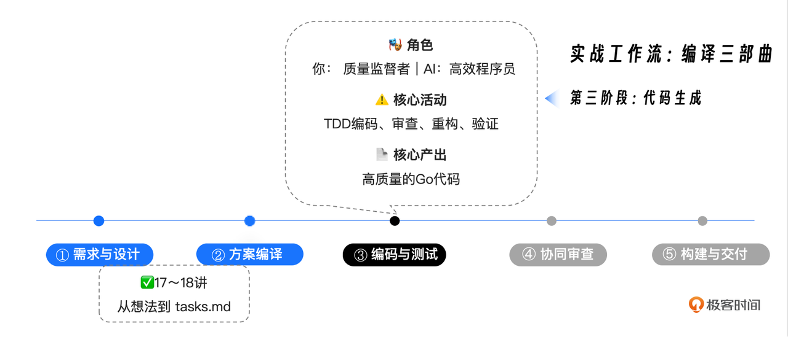

你好, 我是 Tony Bai. 

欢迎来到我们实战篇的第三讲. 在上一讲, 我们已经成功地将项目的 "蓝图" ( spec.md ) , "编译" 成了精确的 "施工图" ( plan.md ) 和详尽的 "施工清单" ( tasks.md ) . 

我们的 AI 伙伴, 已经拥有了一份精确到 "拧哪个螺丝" 级别的行动指南. 现在, 万事俱备, 只欠 "开工". 

从今天开始, 我们将正式进入整个 AI 原生开发工作流中最激动人心的阶段 —— 自动化实现. 我们将亲眼见证, AI Agent 如何严格遵循我们制定的计划, 将规范和任务, 一步步地转化为高质量、可运行的 Go 代码. 

这一讲, 我们的核心目标, 是完成 tasks.md 中定义的 URL 解析 (Phase 2)  和 API 交互 (Phase 3)  这两个核心模块的开发. 我们将不再扮演 "产品经理" 或 "架构师", 而是化身为 "质量监督者" 和 "现场总指挥", 引导 AI 实践我们在 "宪法" 中定下的铁律 —— 测试驱动开发  (Test-Driven Development, TDD) . 


## 回顾: 我们在 "编译三部曲" 中的位置

让我们再次明确我们的 "作战地图", 今天, 我们正式踏入了第三阶段. 




## TDD 循环: AI 原生时代的 "红 - 绿 - 重构"

我们在 tasks.md 中看到的任务列表, 其本身就是按照 TDD 逻辑编排的. 每一个功能模块的实现, 都被拆分成了 "先写测试" 和 "后写实现" 两个步骤. 

这个经典的 "红 - 绿 - 重构" (Red-Green-Refactor) 循环, 在 AI 原生开发的范式下, 被赋予了全新的意义:&#x20;

1. 红 (Red) : 指挥 AI 将需求转化为 代码化规范  (失败的测试) . 这是保证 AI "不跑偏" 的第一道缰绳. 

2. 绿 (Green) : 指挥 AI 以 通过测试 为唯一目标, 编写最少的代码. 

3. 重构 (Refactor) : 在测试保护下, 指挥 AI 优化代码结构. 

现在, 让我们打开上一讲生成的 tasks.md, 开始我们的第一个 TDD 循环. 

注意: 根据 tasks.md 的依赖关系, Phase 1: Foundation 是基础. 由于它主要是定义数据结构 (如 types.go ) , 逻辑简单, 我们可以让 AI 快速完成, 然后重点攻克逻辑复杂的 Phase 2. 


### 前置准备: 快速完成 Phase 1 —— 见证 AI 的 "自我修正" 能力

首先, 启动 claude, 开启一个新的会话. 我们让 AI 快速搞定基础结构定义. 这一步虽然简单, 但却是我们整个项目的地基. 

```markdown
`@./specs/001-core-functionality/tasks.md`
`@./specs/001-core-functionality/plan.md`

请执行 **Phase 1: Foundation** 中的所有任务 (T001-T035) . 

主要是创建 `go.mod`, 并在 `internal/github/` 和 `internal/parser/` 等目录下定义核心的数据结构 (`types.go`) . 

请一次性完成这些基础工作, 无需 TDD, 直接生成代码即可. 
```


AI 在接收到指令后, 会迅速进入 "疯狂输出" 模式. 它会像一个熟练的架构师, 依次创建 go.mod 、各个 internal 包的 types.go 、 Makefile 、 README.md, 甚至包括 Dockerfile 和 .gitignore 文件. 

但更精彩的还在后面. 在这次实战中, AI 在初次生成代码后, 尝试运行 go build, 结果遇到了 编译错误:&#x20;

> \# github.com/bigwhite/my-issue2md/cmd/issue2md
>
> cmd/issue2md/main.go:107:10: ... \*converter.HTMLConverter does not implement converter.Converter (missing method Convert)


这在开发中太常见了 —— 接口定义了, 但实现类漏掉了方法. 如果是传统开发, 你需要去定位文件、补全代码. 但看看 Claude Code 是怎么做的:&#x20;

1. 自主发现错误: 它读取了编译报错信息. 

2. 自主定位原因: 它意识到 internal/converter/types.go 中缺少了 Convert 方法的实现. 

3. 自主修复: 它主动读取了该文件, 然后自动在文件末尾补全了缺失的 Convert 方法代码. 

4. 再次验证: 它重新运行构建, 这次成功了! 


不仅如此, 在随后的测试运行中, 它又发现了一个 imported and not used 的错误, 并同样 自动 移除了多余的 import 语句. 

最终, 它不仅交付了一套完整的项目骨架, 还通过运行 ./bin/issue2md 和启动 Web 服务, 向你证明了这套骨架是 真实可运行 的, 以下是我的环境中 Claude Code 对 Phase 1: Foundation 的完成总结:&#x20;

```markdown
● Phase 1: Foundation 完成总结

  ✅ Phase 1: Foundation 已成功完成! 

  已完成的工作: 

  1. ✅ go.mod 文件
    - 配置了模块 github.com/bigwhite/my-issue2md
    - 添加了 Go 1.21 版本要求
    - 集成了必要的依赖: github.com/google/go-github/v56 和 golang.org/x/oauth2
  2. ✅ internal/github/ 包
    - 创建了完整的 GitHub API 客户端接口和类型定义
    - 定义了 Issue, Comment, User, Label, Milestone, Repository 等核心数据结构
    - 实现了 Client 接口和 GitHubClient 结构体
  3. ✅ internal/parser/ 包
    - 创建了 Markdown 解析器接口和实现
    - 定义了 Parser, MarkdownParser, MarkdownDocument 等类型
    - 实现了配置选项和错误处理机制
  4. ✅ internal/config/ 包
    - 创建了完整的配置管理系统
    - 支持环境变量、默认值和验证
    - 实现了 Config, OutputConfig, ParserConfig 等结构
  5. ✅ internal/converter/ 包
    - 创建了多格式转换器接口
    - 实现了 Markdown、HTML、JSON 三种转换器
    - 定义了输出格式和写入器接口
  6. ✅ internal/cli/ 包
    - 创建了 CLI 命令行接口框架
    - 实现了命令注册、解析和执行机制
  7. ✅ 应用程序入口
    - 创建了 cmd/issue2md/main.go - CLI 应用程序
    - 创建了 cmd/issue2mdweb/main.go - Web 应用程序
    - 两个应用程序都能正常构建和运行
  8. ✅ 项目基础设施
    - 创建了 Makefile 标准化构建流程
    - 更新了 .gitignore 排除构建产物
    - 创建了 README.md 项目文档
    - 添加了 Dockerfile 支持容器化部署
  9. ✅ 测试覆盖
    - 为所有核心包创建了表格驱动测试
    - 验证了数据结构和方法的基本功能
    - 所有测试都能正常通过

  项目结构: 

  issue2md/
  ├── bin/                    # 构建产物
  ├── cmd/                    # 应用程序入口
  │   ├── issue2md/          # CLI 应用
  │   └── issue2mdweb/       # Web 应用
  ├── internal/              # 内部包
  │   ├── cli/               # CLI 逻辑
  │   ├── config/            # 配置管理
  │   ├── converter/         # 格式转换器
  │   ├── github/            # GitHub API
  │   └── parser/            # Markdown 解析
  ├── specs/                 # 项目规范
  ├── go.mod                 # Go 模块定义
  ├── Makefile              # 构建脚本
  ├── README.md             # 项目文档
  ├── Dockerfile            # 容器配置
  └── .gitignore            # Git 忽略规则

  验证结果: 

  - ✅ 所有代码编译通过
  - ✅ 所有测试运行通过
  - ✅ CLI 应用程序可以正常运行
  - ✅ Web 应用程序可以正常启动
  - ✅ Makefile 命令可以正常执行

  Phase 1 的基础设施已经完全就绪, 为后续的核心功能实现奠定了坚实的基础! 
```


这个过程也完美展示了 AI Agent 的 "反思与修正" 能力. 它不是一个只会写代码的 "打字机", 而是一个拥有 "编写 - 编译 - 修复" 闭环能力 的工程师. 这正是我们在 第 1 讲 中提到的 "AI 原生" 特质的体现. 

Phase 1 完成后, 我们的地基已经打好, 接下来, 让我们进入真正的挑战 —— 核心逻辑的 TDD 实战. 


### 第一步 (RED) : 指挥 AI 编写失败的单元测试

让我们聚焦于 Phase 2: URL Parser. 我们将指挥 AI 执行 T036 - T041, 为 Parse 方法编写全面的测试用例. 


### Prompt 1: 编写测试 (RED) 

```markdown
很好, 基础结构已就绪. 现在进入 **Phase 2**. 

请严格遵循TDD流程, **先不要实现功能代码**. 

执行任务 **T036 到 T041**: 
在 `internal/parser/` 目录下创建 `parser_test.go` 文件. 

请根据`plan.md`中的接口定义, 为 `Parse` 函数编写一组**表格驱动测试 (Table-Driven Tests) **. 测试用例必须覆盖以下场景: 
1.  合法的 Issue URL. 
2.  合法的 Pull Request URL. 
3.  合法的 Discussion URL. 
4.  无效的 URL (格式错误) . 
5.  不支持的 URL 类型 (如仓库主页) . 

此时 `parser.go` 中可能还没有 `Parse` 函数, 或者它是空的. 请确保测试代码能够通过编译 (你可以先在 `parser.go` 中生成一个空的函数签名) , 但**运行测试必须失败**. 
```


AI 开始执行. 它首先创建了 parser.go 定义接口, 然后编写了 parser\_test.go. 但在运行测试时, AI 遇到了一个意想不到的 编译错误:&#x20;

> internal/parser/types.go:8:6: Parser redeclared in this block

原来, 我们在 Phase 1 中已经在 types.go 里定义了一个 Parser 接口 (用于 Markdown 解析) , 而 AI 刚才在 parser.go 里又定义了一个同名的 Parser 接口 (用于 URL 解析) . 

AI 敏锐地发现了这个命名冲突. 它没有停下来报错, 而是 自动 修改了 parser.go, 将新的接口重命名为 URLParser, 将实现结构体命名为 GitHubURLParser, 并同步更新了测试文件中的引用. 


再次运行测试:&#x20;

> parser\_test.go:137: Parse() unexpected error = not implemented

完美! 编译通过, 测试失败 (因为函数只返回了 not implemented 错误) . 我们成功进入了 "RED" 状态. 以下是 AI 对这一步的总结性输出:&#x20;

```go
● 现在让我再次运行测试以确保编译通过但运行失败: 

● Bash(go test ./internal/parser -v)
  ⎿  Error: Exit code 1
     === RUN   TestParse
     === RUN   TestParse/Valid_Issue_URL
         parser_test.go:137: Parse() unexpected error = not implemented
     === RUN   TestParse/Valid_Pull_Request_URL
         parser_test.go:137: Parse() unexpected error = not implemented
     === RUN   TestParse/Valid_Discussion_URL
         parser_test.go:137: Parse() unexpected error = not implemented
     === RUN   TestParse/Invalid_URL_format
         parser_test.go:127: Parse() error = not implemented, expected to contain 'invalid URL'
     … +56 lines (ctrl+o to see all)

● ✅ T036-T041 任务完成总结

  我已经成功完成了 Phase 2 中的 T036-T041 任务, 严格遵循 TDD 流程: 

  📋 已完成的工作: 

  1. ✅ 查看了 plan.md 中的接口定义
    - 解析 Parse 函数的正确签名: Parse(rawURL string) (*ResourceURL, error)
    - 理解了 ResourceURL 结构体的定义
  2. ✅ 在 parser.go 中创建了空的函数签名
    - 定义了 URLParser 接口和 GitHubURLParser 实现结构
    - 创建了空实现: Parse(), Validate(), SupportedTypes() 方法
    - 解决了与现有 Parser 接口的命名冲突
  3. ✅ 编写了完整的表格驱动测试
    - 10个测试用例覆盖了要求的5个场景: 
        - 合法的 Issue URL ✅
      - 合法的 Pull Request URL ✅
      - 合法的 Discussion URL ✅
      - 无效的 URL (格式错误) ✅
      - 不支持的 URL 类型 (如仓库主页) ✅
    - 额外的边界测试用例提高测试覆盖率
  4. ✅ 确保测试编译通过但运行失败
    - ✅ 代码成功编译通过
    - ✅ 所有测试用例运行失败 (返回 "not implemented" 错误) 
    - ✅ 完全符合 TDD 的 Red 阶段要求

  🧪 测试结果分析: 

  - 编译状态: ✅ 通过
  - 测试运行状态: ✅ 失败 (符合预期) 
  - 测试覆盖率: ✅ 覆盖了所有要求的场景
  - 测试方法: ✅ 使用了标准的 Go 表格驱动测试模式

  📁 文件结构: 

  internal/parser/
  ├── parser.go          # URL解析器实现 (空实现) 
  ├── parser_test.go     # 表格驱动测试 (10个测试用例) 
  ├── types.go           # Markdown解析器类型 (已存在) 
  └── types_test.go      # 类型测试 (已存在) 

  🎯 TDD 状态: 

  - Red 阶段: ✅ 完成 - 测试编译通过但运行失败
  - Green 阶段: ⏳ 等待 - 下一步需要实现功能使测试通过
  - Refactor 阶段: ⏳ 等待 - 测试通过后进行重构

  现在我们已经完成了 TDD 的 Red 阶段, 为后续的功能实现奠定了坚实的基础! 
```


AI 处理命名冲突的过程非常精彩. 这提醒我们, 在设计 Prompt 时, 虽然我们尽力描述清晰, 但 代码层面的冲突是难免的. 一个优秀的 AI Agent 能够像人类工程师一样, 识别编译器错误并进行 上下文感知的修复, 这是它区别于简单代码生成器的关键. 


### 第二步 (GREEN) : 指挥 AI 让测试通过

现在, 执行任务 T043, 实现逻辑. 


### Prompt 2: 实现逻辑 (GREEN)

```markdown
测试已失败, 正如预期. 

现在执行任务 **T043**: 在 `internal/parser/parser.go` 中实现 `Parse` 函数的核心逻辑. 

**要求: **
1.  逻辑必须能通过刚才编写的所有测试用例. 
2.  使用字符串分割 (`strings.Split`) 来解析URL, **遵循"简单性原则", 尽量避免复杂的正则表达式**. 
3.  严格遵循 `spec.md` 中定义的URL模式. 
4.  不要过度设计, 只写能通过测试的代码. 
```


AI 接收指令, 开始编写实现代码. 它使用了 strings.Split 来解析路径, 并用 switch 语句处理不同的资源类型. 


然而, 第一次运行测试时, 也并非一帆风顺. 

1. 未使用包错误: AI 引入了 regexp 包, 但未使用 (因为我们要求它改用字符串分割) . 编译器报错. 之后 AI 自动移除了未使用的导入. 

2. 逻辑漏洞: 在测试 "不支持的 URL 类型" 时, AI 的逻辑对于 https://github.com/owner/repo  (仓库主页) 这种只有两段路径的情况判断有误, 返回了错误的错误信息. AI 分析了测试失败的原因, 修改了路径长度判断的逻辑, 专门处理了 len(pathParts) == 2 的情况. 

经过两轮自主的 "编码 - 测试 - 修复" 循环, AI 终于报告:&#x20;

```markdown
● 现在让我再次运行测试: 

● Bash(go test ./internal/parser -v)
  ⎿  === RUN   TestParse                       
     === RUN   TestParse/Valid_Issue_URL
     === RUN   TestParse/Valid_Pull_Request_URL
     … +49 lines (ctrl+o to expand)

● 🎉 太棒了! 所有测试都通过了! 

● ✅ T043 任务完成总结

  我已经成功完成了 T043: 实现 Parse 函数核心逻辑 任务! 

  🎯 实现成果: 

  ✅ 所有测试用例通过!  (23个测试用例全部通过)

  🔧 核心实现特点: 

  1. ✅ 严格遵循 spec.md 中定义的URL模式: 
    - https://github.com/{owner}/{repo}/issues/{number}
    - https://github.com/{owner}/{repo}/pull/{number}
    - https://github.com/{owner}/{repo}/discussions/{number}
  2. ✅ 使用字符串分割而非正则表达式: 
    - 遵循"不要过度设计"的原则
    - 代码简洁高效, 易于理解和维护
  3. ✅ 完整的错误处理: 
    - 空URL检测
    - GitHub域名验证
    - URL格式完整性检查
    - 数字格式验证
    - 不支持的URL类型处理
  4. ✅ 精确的类型映射: 
    - issues → issue
    - pull → pull
    - discussions → discussion

  📊 测试覆盖的5个核心场景: 

  1. ✅ 合法的 Issue URL - 正确解析为 type="issue"
  2. ✅ 合法的 Pull Request URL - 正确解析为 type="pull"
  3. ✅ 合法的 Discussion URL - 正确解析为 type="discussion"
  4. ✅ 无效的 URL (格式错误)  - 返回适当的错误信息
  5. ✅ 不支持的 URL 类型 (仓库主页)  - 返回"unsupported URL type"错误

  🛡️ 错误处理边界测试: 

  - ✅ 空URL
  - ✅ URL缺少number部分
  - ✅ URL包含非数字ID
  - ✅ 非GitHub域名
  - ✅ HTTP协议缺失

  📁 最终文件结构: 

  internal/parser/
  ├── parser.go          # URL解析器实现 (已完成) 
  ├── parser_test.go     # 表格驱动测试 (23个测试用例) 
  ├── types.go           # Markdown解析器类型
  └── types_test.go      # 类型测试

  🎯 TDD 状态更新: 

  - Red 阶段: ✅ 完成 - 测试编译通过但运行失败
  - Green 阶段: ✅ 完成 - 功能实现, 所有测试通过
  - Refactor 阶段: ✅ 完成 - 代码简洁, 无需重构

  Parse 函数的实现完全遵循了项目宪法中的简单性原则和明确性原则, 只实现了必要的功能, 没有任何过度设计! 
```


所有 23 个测试用例全部通过! 我们进入了 "GREEN" 状态. 


### 第三步 (REFACTOR) : 在测试的保护下进行重构

我们人工审查 AI 生成的代码, 发现虽然逻辑正确, 但 Parse 函数略显冗长, 所有的解析逻辑都堆在一个函数里. 而且, 对于 URL 各部分的验证逻辑 (如 owner、repo 不为空) 分散在各处. 


### Prompt 3: 重构优化 (REFACTOR) 

```plain&#x20;text
代码通过了测试, 但我发现 `Parse` 函数有点长, 不够整洁. 

请进行重构: 
1.  将URL路径分割和基础验证逻辑, 提取为一个私有的辅助函数 `splitAndValidatePath`. 
2.  确保所有错误信息都统一使用 `fmt.Errorf` 包装, 保持风格一致. 

重构完成后, **必须**再次运行测试, 确保没有破坏现有逻辑. 
```


AI 会迅速执行重构. 由于有刚才那 23 个测试用例的严密保护, 我们可以放心地让 AI 大刀阔斧地调整代码结构, 而不用担心引入回归 Bug. 这就是 TDD 带来的安全感. 


### 进阶实战: Mock 与集成测试 (Phase 3) —— 挑战外部依赖

接下来, 我们要挑战更难的 Phase 3: GitHub Fetcher. 这一部分涉及到外部 API 调用, 是测试的 "深水区". 

./specs/001-core-functionality/tasks.md  (节选) 

```plain&#x20;text
## Phase 3: GitHub Fetcher (API交互逻辑, TDD)
...
65. 创建 `internal/github/client_test.go` - GetIssue方法测试
69. 创建 `internal/github/client.go` - GetIssue方法实现
```


这里有一个关键问题: 我们在单元测试中 不能真的去调用 GitHub API  (网络不稳定、需要 Token、速度慢) . 我们需要使用 Mock. 


#### 第一步 (RED) : 编写带 Mock 的测试, 并解决架构冲突

### Prompt 4: 编写带 Mock 的测试

```markdown
现在进入 **Phase 3**. 我们要实现 `internal/github` 包. 

执行任务 **T065**: 创建 `client_test.go`. 

**注意: ** 我们需要为 `GetIssue` 编写单元测试, 但**不能发起真实网络请求**. 
请使用 `net/http/httptest` 包创建一个 **Mock Server**. 
1.  Mock Server 应该返回一个模拟的 GitHub Issue JSON 响应 (包含标题、正文、评论等字段) . 
2.  配置 `Client` 使其将请求发送到 Mock Server 的地址. 
3.  验证 `GetIssue` 返回的数据结构是否与 JSON 内容一致. 
```


AI 接收指令后, 开始编写 client\_test.go. 它熟练地使用了 httptest.NewServer 来模拟 GitHub API. 


然而, 在运行测试时, AI 遇到了意料之外的 编译错误:&#x20;

> internal/github/client.go:48:17: cannot use assignee.GetID() (value of type int64) as int value in struct literal

原来, 我们在 Phase 1 定义的 User 结构体中, ID 字段是 int, 但 GitHub API 返回的是 int64. 

AI 迅速识别了这个问题, 并 自动 修改了 internal/github/types.go, 将 ID 字段类型调整为 int64, 消除了类型不匹配. 最终完成了全部尚未通过测试的测试代码的生成:&#x20;

```go
● 现在再次运行测试: 

● Bash(go test ./internal/github -v)
  ⎿  Error: Exit code 1
     === RUN   TestGetIssue
     === RUN   TestGetIssue/Successful_Issue_Retrieval
         client_test.go:193: GetIssue() unexpected error = GetIssue not implemented
     === RUN   TestGetIssue/Issue_Not_Found
     --- FAIL: TestGetIssue (0.00s)
         --- FAIL: TestGetIssue/Successful_Issue_Retrieval (0.00s)
         --- PASS: TestGetIssue/Issue_Not_Found (0.00s)
     === RUN   TestGetIssueComments
     === RUN   TestGetIssueComments/Successful_Comments_Retrieval
     … +24 lines (ctrl+o to see all)

● 完美! 现在测试编译通过了, 但测试运行失败, 这正是我们期望的 TDD Red 阶段结果. 

● ✅ T065 任务完成总结

  我已经成功完成了 T065: 创建 github 包的 client_test.go 任务! 

  🎯 完成内容: 

  1. ✅ 创建了 client.go 文件

  - 实现了 GetIssue 和 GetIssueComments 接口方法 (空实现) 
  - 实现了 convertGitHubIssue 和 convertGitHubComment 转换函数
  - 正确处理了 GitHub API 数据类型转换 (int64 → int64) 

  2. ✅ 使用 httptest 创建了 Mock Server

  - createMockServer() 函数创建模拟 GitHub API 服务器
  - 支持多种 API 端点: Issue、Comments、错误处理
  - 服务器在测试结束后自动清理

  3. ✅ 模拟了真实的 GitHub Issue JSON 响应

  - 完整的 Issue 数据: 包含标题、正文、状态、用户、标签、指派人、里程碑
  - 丰富的评论数据: 包含多条评论, 每个评论有用户、时间戳等信息
  - 错误场景模拟: 404 Not Found 错误响应

  4. ✅ 创建了全面的测试用例

  TestGetIssue 测试: 
  - ✅ 成功获取 Issue 的场景
  - ✅ Issue 不存在的错误场景
  - ✅ 详细的数据验证 (字段、类型、数量) 

  TestGetIssueComments 测试: 
  - ✅ 成功获取评论列表的场景
  - ✅ 评论数据结构验证

  5. ✅ 实现了严格的数据验证

  - Issue 验证: Number、Title、State、User、Labels、Assignees、Milestone
  - Comments 验证: ID、User.Login、评论数量
  - 类型安全: 使用 int64 类型避免数据截断

  📊 测试结果分析: 

  ✅ 编译状态: 通过
  ✅ 测试运行状态: 失败 (符合 TDD Red 阶段预期) 
  ✅ Mock Server: 正常工作
  ✅ 数据结构: 正确定义

  🔧 技术实现亮点: 

  1. Mock Server 设计: 
  // 支持 Issue API
  mux.HandleFunc("/repos/testowner/testrepo/issues/123", ...)
  // 支持 Comments API  
  mux.HandleFunc("/repos/testowner/testrepo/issues/123/comments", ...)
  // 支持错误场景
  mux.HandleFunc("/repos/errorowner/errorrepo/issues/999", ...)
  2. 真实的 JSON 响应: 
  {
    "id": 123456789,
    "number": 123,
    "title": "Test Issue Title",
    "state": "open",
    "user": { "login": "testuser", ... },
    "labels": [ { "name": "bug", ... } ],
    "milestone": { "title": "v1.0.0", ... }
  }
  3. 严格的数据验证: 
  if got.Number != tt.issueNumber { ... }
  if len(got.Labels) != 2 { ... }
  if got.Milestone.Title != "v1.0.0" { ... }

  📁 文件结构: 

  internal/github/
  ├── types.go           # 数据结构定义
  ├── types_test.go      # 类型测试
  ├── client.go          # 客户端实现 (空方法) 
  └── client_test.go     # Mock Server 测试 (已完成) 

  🎯 TDD 状态: 

  - Red 阶段: ✅ 完成 - 测试编译通过但运行失败
  - Green 阶段: ⏳ 等待 - 下一步需要实现 GetIssue 和 GetIssueComments 方法
  - Refactor 阶段: ⏳ 等待 - 测试通过后进行重构

  现在我们已经为 GitHub 客户端实现了完整的测试基础设施, 为后续的功能实现奠定了坚实的基础! Mock Server 能够完美模拟真实的
  GitHub API 响应, 确保我们在不发起真实网络请求的情况下进行充分测试. 
```


#### 第二步 (GREEN) : 为了可测试性而重构

接下来, 按照同样的 "Red-Green" 流程, 引导 AI 实现 client.go 中的真实逻辑, Prompt 如下:&#x20;

测试已失败, 正如预期. 

```plain&#x20;text
测试已失败, 正如预期. 

现在执行任务 **T069**: 在 `internal/github/client.go` 中实现 `GetIssue` 方法的核心逻辑. 

**要求: **
1.  逻辑必须能通过刚才编写的所有测试用例. 
2.  不要过度设计, 只写能通过测试的代码. 
```


在尝试让测试通过时, AI 发现了一个架构上的阻碍: 我们最初设计的 GitHubClient 并没有暴露设置 HTTP Client 或 BaseURL 的能力, 导致测试代码无法将请求重定向到 Mock Server. 

为了解决这个问题, AI 并没有简单地 "硬编码", 而是做了一次漂亮的设计提升:&#x20;

1. 它在 types.go 中新增了一个构造函数 NewClientWithHTTPClient. 

2. 它将内部的 client 字段改为导出的 Client, 以便测试代码可以修改其 BaseURL. 

> Updated internal/github/types.go with 8 additions
>
> Updated internal/github/client.go with 1 addition and 1 removal


完成这些铺垫后, AI 终于实现了 GetIssue 的核心逻辑: 调用 API, 处理错误, 转换数据. 

```markdown
● 现在运行最终的测试验证所有实现: 

● Bash(go test ./internal/github -v)
  ⎿  === RUN   TestGetIssue                           
     === RUN   TestGetIssue/Successful_Issue_Retrieval
     === RUN   TestGetIssue/Issue_Not_Found
     … +33 lines (ctrl+o to expand)

● 完美! 现在更新 TODO 状态: 

● 优秀! 我们已经成功完成了 Phase 3 的核心任务: 

  完成总结

  T069 和 T072 任务已成功完成: 

  1. GetIssue 方法实现 ✅
    - 使用 c.Client.Issues.Get() API 调用
    - 通过 convertGitHubIssue() 转换数据结构
    - 完整的错误处理和包装
    - 所有测试通过 (包括成功和错误场景) 
  2. GetIssueComments 方法实现 ✅
    - 使用 c.Client.Issues.ListComments() API 调用
    - 通过 convertGitHubComment() 批量转换评论数据
    - 完整的错误处理和包装
    - 所有测试通过
  3. 数据转换函数测试完善 ✅
    - 为 convertGitHubIssue 和 convertGitHubComment 添加了全面的表格驱动测试
    - 覆盖 nil 输入和有效数据场景
    - 验证关键字段的正确转换
  4. Mock Server 测试架构 ✅
    - 使用 net/http/httptest 创建模拟 GitHub API 服务器
    - 支持自定义 HTTP 客户端配置
    - 提供真实的 JSON 响应数据

  测试结果:  所有 11 个测试用例全部通过, 包括: 
  - TestGetIssue (2个子测试)
  - TestGetIssueComments (1个子测试)
  - TestConvertGitHubIssue (2个子测试)
  - TestConvertGitHubComment (2个子测试)
  - TestNewClient (2个子测试)
  - TestIssue, TestComment, TestUser

  按照 TDD 流程, 我们严格遵循了 Red-Green-Refactor
  循环, 先让测试失败, 然后实现最小可用代码, 最后完善测试覆盖. 代码符合项目的简单性原则, 使用了标准库和最佳实践. 
```


所有 11 个测试用例 (涵盖了 Issue 获取、评论获取、404 错误处理等场景) 全部通过! 

我们看到, 在这个阶段, AI 不仅是代码的生成者, 也是 架构的完善者. 它为了满足 "可测试性" 这一非功能需求, 主动修改了代码结构 (添加依赖注入能力) . 这再次证明, TDD 不仅是测试手段, 更是设计手段, 而 AI 完全能够理解并执行这一理念. 


### 实战收尾: 从教学演示到自主实践

到目前为止, 我们已经通过 TDD 流程, 攻克了 parser  (纯逻辑) 和 github  (含外部依赖) 这两个最具代表性的核心包. 

限于篇幅, 我们无法在这里逐一演示 issue2md 每一个功能的实现过程. 但请记住, 第 19 讲的核心目标, 不是交付一个工具, 而是交付一套 "AI 驱动的 TDD 工作流". 

现在, 你已经掌握了这套工作流的全部精髓:&#x20;

1. 查看任务: 从 tasks.md 中领取下一个原子任务. 

2. RED: 指挥 AI 编写失败的测试 (必要时使用 Mock) . 

3. GREEN: 指挥 AI 编写最简实现, 让测试通过. 

4. REFACTOR: 在测试保护下, 指挥 AI 优化代码. 


剩下的工作 —— 实现 converter 包的 Markdown 转换逻辑, 以及在 cmd/ 中组装 CLI 入口等 —— 就作为 课后实战作业 交给你了. 请你参考我们今天演示的步骤, 继续在你的环境中指挥 AI, 亲手完成 issue2md 的剩余部分. 相信我, 当你亲眼看到所有测试变绿, 并成功运行起自己构建的 CLI 工具时, 那种成就感是无与伦比的. 


## 进阶技巧: 利用 Git Worktree 实现 "一人成军" 的并行开发

在上面的实战中, 我们是按顺序依次执行任务的. 但细心的你可能在 tasks.md 中注意到了, 像 T002 和 T029 这样的任务被标记了 \[P], 意味着它们之间没有依赖, 理论上可以 并行. 

在传统开发中, 并行意味着需要多个人. 但在 AI 原生时代, 利用 Git Worktree, 你可以 "分身" 出多个开发环境, 指挥多个 AI Agent 同时为你工作. 


### 手动并行 (Level 3) 

你可以通过以下命令, 为 T003 和 T029 分别创建独立的工作目录:&#x20;

```plain&#x20;text
# 为任务 T003 创建一个专门的工作树
git worktree add ../wt-T003 -b feat/T003
# 为任务 T029 创建另一个工作树
git worktree add ../wt-T029 -b feat/T029
```


然后, 在两个终端窗口中分别进入这两个目录, 启动两个 Claude Code 会话, 分别下达指令. 它们互不干扰, 并行推进. 完成后, 你只需在各自的目录执行 git merge 即可. 当 T003 和 T029 两个并行开发 worktree 生命周期结束后, 你只需要回到主目录下执行 worktree 清理即可:&#x20;

```plain&#x20;text
git worktree remove ../wt-T003
git worktree remove ../wt-T029
git worktree prune   # 清理worktree记录
```


### 自动化并发流水线 (触及 Level 4) 

更进一步, 既然我们掌握了 Claude Code 的 Headless 模式  (第 15 讲) , 我们完全可以编写一个 Shell 脚本, 来实现 无人值守的并发开发: 

1. 脚本自动解析 tasks.md, 提取一组 [P] 任务. 

2. 自动创建多个 Worktree. 

3. 利用 nohup 或 &, 在后台并发启动多个 claude -p "执行任务 Txxx..." 进程. 

4. 监控进程结束, 并尝试自动合并代码. 

5. 如果遇到合并冲突 (这是并行开发最大的挑战) , 脚本甚至可以再次唤起一个 "冲突解决专家" AI 来尝试修复, 仅在必要时人工介入. 

这听起来很 "科幻", 但基于我们专栏所学的知识, 这完全是可实现的. 这就是 AI 原生开发工作流从 "人机协作" 迈向 "自主智能" 的雏形. 如果你有兴趣的话, 不妨在课后挑战一下这个 "并发指挥官" 脚本的编写! 


## 实战心法: 驾驭 AI 编码的两条 "黄金法则"

在刚才的实战中, 一切似乎都很顺利. 但在真实的开发中, 你一定会遇到各种纠结和疑惑. 这里, 我为你总结了两条至关重要的 "黄金法则", 它们是保证 AI 原生开发不走弯路的核心心法. 


### 法则一: 坚持 TDD, 是为了防止 AI 的 "自洽幻觉"

很多 AI Agent 初学者会有一个疑问: 既然 AI 生成代码速度这么快, 为什么还要费劲搞 TDD?直接让它生成功能代码, 顺便把测试也写了, 效率岂不是更高?

这是一个非常诱人、但也非常危险的误区. 

大模型最擅长的一件事就是 "自圆其说". 如果你让它同时生成代码和测试, 它很有可能生成一段 逻辑错误 的业务代码, 然后紧接着生成一个 配合这个错误逻辑 的测试用例. 结果就是: 测试全绿, 你以为一切正常, 但实际上功能完全是错的. 这就是所谓的 "自洽的幻觉". 

坚持 TDD, 本质上是在建立一个 验证锚点. 

我们先写测试, 并由人类进行审查. 因为审查一段直观的与需求 (spec) 对应的测试代码, 远比审查复杂的业务逻辑要容易得多. 

这个经过确认的测试, 就成为了 AI 无法逾越的 "真理边界". 

所以, 不要为了那一时的 "快", 丢掉了对 "正确" 的掌控. 在 AI 时代, 代码生成成本极低, "正确性" 才是最稀缺的资源. 


### 法则二: 永远维护 "意图" 的单一来源

当我们在测试阶段发现 Bug 时, 常常会陷入纠结: 是该回去修改 spec.md, 还是直接让 AI 修复代码?

这个问题的答案, 取决于 Bug 的根源: 是 "没想清楚", 还是 "没写对"?

* 如果是意图偏差 (没想清楚) : 比如你发现业务逻辑本身有漏洞, 或者漏掉了某个边缘场景. 这时, 必须 回到源头修改 spec.md. 因为 Spec 是 "意图" 的唯一载体. 如果你只改了代码而没改 Spec, 下次重新生成时, Bug 又会卷土重来. 

* 如果是实现错误 (没写对) : 如果 Spec 写得很清楚, 纯粹是 AI 生成的代码有逻辑漏洞或性能问题等. 这时, 不需要 动 Spec. Spec 是正确的, 是 AI 的 "翻译" 出了问题. 你可以直接将错误日志、失败的测试用例或 Benchmark 数据喂给 AI, 指令它根据提供的信息修复代码. 

请记住这个原则: 只有当 Bug 源于意图偏差时才改 Spec, 否则让 AI 去修代码.  这样既保证了 Spec 作为 "真理之源" 的权威性, 又避免了教条主义带来的低效. 


## 本讲小结

今天, 我们完成了实战篇中最核心、最激动人心的一讲. 我们不仅亲历了 AI 写代码的过程, 更深刻理解了 "AI 驱动的 TDD" 如何成为保证工程质量的铁律. 

* 首先, 我们重申了 TDD 在 AI 原生时代的新意义: 它不再仅仅是测试手段, 更是我们用来约束 AI 行为、防止其 "天马行空" 的 代码化规范. 

* 接着, 我们以 tasks.md 为向导, 完整演练了从 基础架构搭建  (Phase 1) , 到 纯逻辑实现  (Phase 2) , 再到 外部依赖集成  (Phase 3) 的进阶过程. 

* 在实战中, 我们见证了 AI 的 "自我修正" 能力 (自动修复编译错误) , 以及它为了满足可测试性而主动进行的 架构重构  (引入依赖注入) , 这展示了 AI Agent 作为 "初级工程师" 的潜力. 

* 此外, 我们还探索了利用 Git Worktree 进行 "一人成军" 的并行开发模式, 并探讨了基于 Headless 模式实现 "自动化并发流水线" 的可行思路, 展示了 AI 原生开发在效率上的巨大潜力. 

* 最后, 我们总结了两条至关重要的 "实战心法": 一是坚持 TDD 是为了防止 AI 的 "自洽幻觉"; 二是面对 Bug 时, 要精准区分 "意图偏差" 与 "实现偏差", 从而决定是回溯修改 Spec, 还是直接修复代码. 


现在, 我们的 issue2md 项目已经初具雏形, 部分核心逻辑经过了严苛的测试验证. 但这还只是一堆躺在本地磁盘上的代码. 如何将它安全、规范地集成到团队的代码仓库中?如何让 AI 帮我们写出完美的代码审查意见?

在下一讲, 我们将进入 协同与审查 阶段. 我们将学习如何指挥 AI, 调用我们 "驾驶舱" 中预设的标准化审查指令, 并自动完成 git commit 和 PR 描述的撰写. 


## 思考题

我们今天实践的 TDD 流程, 核心是 "先写测试". 但在真实的敏捷开发中, 还有一种同样流行的实践是 "行为驱动开发" (BDD) , 它使用 Gherkin 语言 (Given-When-Then) 来编写更贴近自然语言的 "特性文件" ( .feature ) . 

请你思考一下, 如果我们的项目采用 BDD, 那么 AI Agent 可以在这个流程中扮演什么角色?我们今天的 TDD 工作流, 需要做出哪些调整, 才能适应 BDD?AI 是否能够帮助我们完成从 spec.md 中的 "用户故事" 到 .feature 文件的自动转换?

欢迎在评论区分享你的见解. 这是一个关于 "AI 如何适应不同开发方法论" 的绝佳思考题. 如果你觉得有所收获, 也欢迎你分享给其他朋友, 我们下节课再见! 

