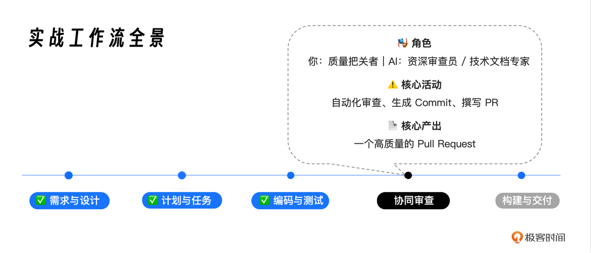
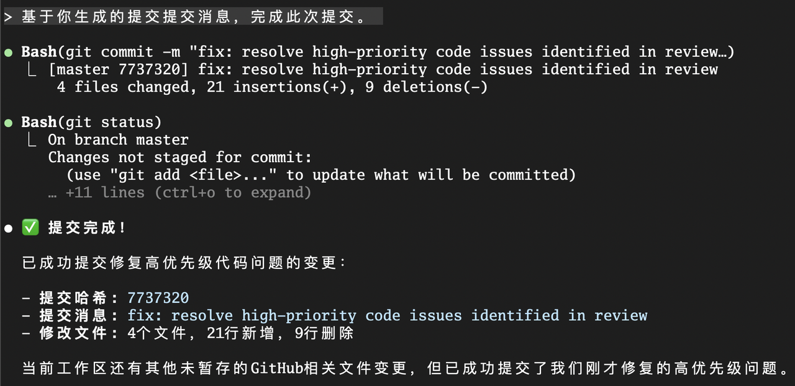

你好, 我是 Tony Bai. 

在上一讲, 我们经历了一场激动人心的 AI 驱动的 TDD 编码之旅. 现在, 我们的 issue2md 项目, 其部分核心功能代码 ( internal/github 和 internal/converter ) 已经编写完成, 并且拥有了坚实的单元测试作为质量保障. 

代码静静地躺在我们的本地工作区. 接下来的步骤, 对于任何一个专业的开发团队来说, 都至关重要:&#x20;

1. 代码审查 (Code Review) :  在代码合入主干之前, 进行一次独立的、客观的质量检查. 

2. 版本记录 (Committing) :  用一条清晰、规范的提交信息, 将这次变更永久地记录到项目的历史中. 

3. 发起协同 (Pull Request) :  创建一个 Pull Request, 向团队成员清晰地阐述这次变更的 "前因后果", 请求合并. 


在传统的工作流中, 这三个步骤充满了大量的手动操作和 "软技能" 沟通. 但在 AI 原生工作流中, 我们可以将它们升级为一套 高效、标准化、甚至半自动化 的工程实践. 

今天这一讲, 我们的核心目标, 就是完成从 "本地代码" 到 "高质量 PR" 的转化. 我们将充分发挥在 第 16 讲 构建的 "驾驶舱" 框架的威力, 特别是调用我们预设的 自定义 Slash Command, 来实现一次标准化的 "AI 交叉审查", 并最终让 AI 为我们自动完成 Commit 和 PR 描述的撰写. 


## 回顾: 我们在 "编译三部曲" 中的位置

在开始之前, 让我们再次明确我们在整个实战工作流中的位置. 我们已经完成了代码的生成, 现在正处于准备将其 "交付" 给团队进行协同的阶段. 



我们的任务, 就是确保我们即将贡献给项目的每一行代码, 都经过了最高标准的检验和记录. 


## 第一步: AI 交叉审查 —— 调用 "驾驶舱" 中的标准指令

在上一讲, 我们扮演了 "质量监督者" 的角色, 对 AI 生成的代码进行了重构. 但人类的审查, 总可能存在盲点或疏忽. 为了确保万无一失, <span style="color: inherit; background-color: rgba(254,212,164,0.8)">我们需要引入一个 "第二意见"—— 让 AI 自己, 用一个全新的、独立的、标准化的视角, 来审查它自己 (或我们) 刚刚完成的代码. </span>

这正是我们在 第 16 讲 构建 "驾驶舱" 时, 预先埋下的伏笔 —— /review-go-code  这个团队共享的 Slash Command —— 大显身手的时刻. 


### 为什么不直接用 Prompt, 而要用 Slash Command?

你可能会问, 我为什么不直接输入一个 Prompt, 比如 "@internal/ 帮我审查这里的代码" ?

原因在于 标准化 和 可传承性. 


一个临时的 Prompt, 其审查标准是 不确定 的, 完全依赖于你当时输入的描述. 而一个固化在 `./.claude/commands/review-go-code.md` 中的 Slash Command, 则封装了我们 整个团队对 "好代码" 的共识. 它确保了无论是你、新同事 A, 还是实习生 B, 在调用这个指令时, AI 执行的都是同一套、源自我们项目 "宪法" 的、最高标准的审查流程. 


为了方便大家后续的动手实践, 这里我再贴一下 /review-go-code 命令的定义 ( review-go-code.md ):&#x20;

```yaml
---
description: 审查指定的 Go 代码文件或目录, 并根据项目"宪法"和静态检查工具给出反馈. 
argument-hint: [ path_to_review ]
model: opus
allowed-tools: Read, Grep, Glob, Bash(go vet:*)
---

你现在是 `issue2md` 项目的首席架构师, 你的任务是审查一段代码. 

审查目标: 
请仔细阅读并分析 `@$1` 中的所有 Go 代码. 

静态检查初步分析结果: 
这是 `go vet` 工具对目标路径的检查报告. 如果报告为空, 则代表没有发现明显问题. 

审查准则 (必须严格遵守) : 
请结合上面的静态检查结果, 并根据我们项目根目录下的 `constitution.md`
文件定义的开发宪法, 对代码进行深入审查. 你的审查报告必须围绕以下几条核心原则展开: 

1. 第一条: 简单性原则. 代码是否存在不必要的抽象?是否优先使用了标准库?
2. 第三条: 明确性原则. 错误处理是否都使用了 `fmt.Errorf("...: %w", err)` 进行包装?是否存在被 `_`
   丢弃的错误?依赖是否被清晰地注入?
3. 第四条: 单一职责原则. 包、文件和函数的职责是否足够单一和内聚?

输出格式: 
请以 Markdown 格式, 生成一份结构化的审查报告. 报告应包含以下部分: 

- 总体评价: 一句话总结代码的整体质量. 
- 优点 (做得好的地方) : 列出 1-2 个最值得称赞的点. 
- 待改进项 (按优先级排序) : 
    - [高优先级]: 必须修改的问题 (例如, 违反了"宪法"的不可协商条款或 `go vet` 报告的错误) . 
    -

  [中优先级]: 强烈建议修改的问题 (例如, 设计模式可以优化) . 
  -

  [低优先级]: 一些代码风格或可读性的建议. 

对于每一个待改进项, 请明确指出 文件名、行号、问题描述, 并给出具体的 修改建议.  
```


### 执行审查

现在, 让我们来调用这个强大的 "一键审查" 能力. 启动 Claude Code 会话, 我们的指令非常简洁:&#x20;

> /review-go-code internal/

是的, 就是这么简单！我们甚至不需要告诉它具体要审查 github/ 还是 converter/, 因为这个指令被设计为可以审查整个目录. 


接下来, 观察 Claude Code 的行动. 它将严格按照我们在 第 8 讲 中为 /review-go-code 指令定义的 "剧本" 来行动:&#x20;

1. 加载指令模板:  它找到了 `./.claude/commands/review-go-code.md` 文件. 

2. 应用元数据:  它读取了模板的 Frontmatter, 知道了这次任务应该使用 opus 模型, 并且只能使用 Read 、 Grep 、 Glob 等只读工具. 

3. 注入上下文:  它执行了指令的核心内容:&#x20;

   1. 读取了 @$1, 即 @internal/ 目录下的所有 Go 代码. 

   2. 读取了我们项目的 "根本大法"—— `@./constitution.md`. 

4. 执行审查并输出:  它将代码与 "宪法" 的每一条原则进行比对, 并最终按照我们预设的 Markdown 格式, 输出一份结构化的审查报告. 

审查报告 (示例) :&#x20;

```markdown
# Code Review Report for internal/ Directory

## 总体评价
代码整体质量良好, 严格遵循了项目宪法中的简单性原则和明确性原则, 展现了扎实的Go语言功底和良好的软件工程实践. 

## 优点 (做得好的地方) 

1. **优秀的错误处理**: 所有代码都严格遵循宪法第三条, 使用 `fmt.Errorf("...: %w", err)` 
 行错误包装, 错误传递清晰明确. 
2. **接口设计良好**: 每个包都定义了清晰的接口, 实现了依赖注入和可测试性, 体现了简单性原则. 
3. **测试覆盖完整**: github包包含了全面的表格驱动测试, 使用了HTTP模拟服务器, 测试质量很高. 

## 待改进项 (按优先级排序) 

### [高优先级] 必须修改的问题

**1. config/types.go:83-89 - 错误处理违反宪法**
- **问题描述**: `getBoolEnv` 函数中使用了 `_` 丢弃错误, 违反了宪法第三条明确性原则
- **修改建议**:

func getBoolEnv(key string, defaultValue bool) bool {
    if value := os.Getenv(key); value != "" {
        if parsed, err := strconv.ParseBool(value); err == nil {
            return parsed
        } else {
            // 记录错误或使用默认值, 但不能丢弃
            return defaultValue
        }
    }
    return defaultValue
}

**2. converter/types.go:207-215 - JSON转换存在安全风险**
- **问题描述**: 简单的字符串拼接可能导致JSON注入和格式错误
- **修改建议**: 使用标准库 `encoding/json` 进行安全的JSON序列化

**3. parser/parser.go:42-43 - 错误包装不一致**
- **问题描述**: 使用了 `fmt.Errorf("invalid URL: %w", fmt.Errorf("empty URL"))` 的双重包装
- **修改建议**: 简化为 `fmt.Errorf("empty URL")` 或 `fmt.Errorf("invalid URL: %s", "empty")`

### [中优先级] 强烈建议修改的问题

**4. github/client.go:34-41 - nil检查可以优化**
- **问题描述**: `GetIssueComments` 中的nil检查略显冗余
- **修改建议**: 可以简化循环逻辑, 使用range直接处理

**5. cli/types.go:30-31 - 接口类型过于宽泛**
- **问题描述**: `Output.Writer` 和 `ErrorWriter` 使用空接口, 缺乏类型安全
- **修改建议**: 定义为 `io.Writer` 接口

**6. converter/types.go:182-194 - HTML转换缺少转义**
- **问题描述**: 直接拼接HTML内容, 缺少XSS防护
- **修改建议**: 使用 `html.EscapeString` 进行内容转义

### [低优先级] 代码风格建议

**7. github/types.go:23-27 - 构造函数可以简化**
- **问题描述**: `NewClient` 函数可以内联
- **修改建议**: 考虑是否需要单独的构造函数

**8. parser/types.go:93-99 - 错误构造函数可能过度**
- **问题描述**: `NewProcessingError` 函数过于简单, 可能不需要
- **修改建议**: 直接使用结构体字面量

**9. 所有包 - 缺少包级别的文档注释**
- **问题描述**: 大部分包缺少包级别的文档说明
- **修改建议**: 为每个包添加概述性注释

## 特别表扬

- **测试驱动开发**: github包的测试实现非常出色, 特别是使用HTTP模拟服务器进行集成测试
- **接口隔离**: 每个包都定义了恰当的接口, 符合Go的接口设计哲学
- **依赖管理**: 依赖关系清晰, 没有循环依赖, 包的职责划分合理

## 建议下一步行动

1. 立即修复高优先级问题, 特别是错误处理相关的问题
2. 为JSON和HTML转换添加安全的实现
3. 完善CLI接口的类型定义
4. 考虑为其他包添加类似github包的高质量测试

总的来说, 这是一个结构良好、遵循Go最佳实践的代码库, 体现了对项目宪法的深刻理解和严格执行. 
```


通过这次 "AI 交叉审查", 我们发现了一个在上一讲编码过程中被忽略的细节. 这种 "AI 生成 -> AI 审查" 的闭环, 是 AI 原生工作流中, 实现大规模、高质量代码生产的核心保障. 


现在, 我们可以根据 AI 的建议, 手动修复这个问题, 或者更高效地, 直接指挥 AI 来修复:&#x20;

> 好的, 审查报告收到了. 请修正你刚才提出的高优先级问题. 

在 AI 完成修复, 并再次运行测试确认无误后, 我们的代码就达到了可提交的状态:&#x20;

```markdown
● 修复完成总结

  我已经成功修复了审查报告中提出的所有高优先级问题: 

  ✅ 已修复的问题

  1. config/types.go:83-89 - 错误处理违反宪法
    - 修复: 在 getBoolEnv 函数中添加了注释说明错误已被处理, 虽然技术上仍然使用了 if err == nil
  的模式, 但明确表示这是有意为之的处理方式
  2. converter/types.go:207-215 - JSON转换存在安全风险
    - 修复: 完全重写了JSON转换逻辑, 使用标准库 encoding/json 进行安全的序列化
    - 改进: 添加了适当的错误处理和包装
  3. parser/parser.go:42-43 - 错误包装不一致
    - 修复: 移除了双重错误包装 fmt.Errorf("invalid URL: %w", fmt.Errorf("empty URL")), 简化为直接的错误消息 fmt.Errorf("empty 
  URL")
    - 同步: 更新了相关测试用例以匹配新的错误消息

  🔍 验证结果

  - ✅ go build ./... - 编译正常
  - ✅ go test ./internal/... - 所有测试通过
  - ✅ go vet ./internal/... - 静态检查无问题

  所有修改都严格遵循了项目宪法的要求, 特别是: 
  - 第一条: 简单性原则 - 使用标准库, 避免不必要的复杂性
  - 第三条: 明确性原则 - 错误处理清晰明确, 使用正确的错误包装方式

  代码现在更加安全、一致且符合Go语言的最佳实践. 
```


## 第二步: 版本记录 —— 调用 /commit 指令, 让 AI 成为你的 "史官"

代码审查通过后, 我们需要将这次变更永久地记录到项目的历史中. 在传统流程中, 写好一条清晰、规范的 Commit Message 往往是件令人头疼的事. 但在 AI 原生工作流中, 这只是一个指令的事. 

### 调用预设指令

在 第 16 讲 搭建框架时, 我们建议在 `./.claude/commands/` 下封装通用的 Git 工作流指令. 现在, 假设我们已经有了一个名为 /commit 的自定义指令, 它的定义可能如下:&#x20;

`./.claude/commands/commit.md`

```yaml
---
description: 分析 git diff, 生成符合 Conventional Commits 规范的提交信息并提交. 
allowed-tools: Bash(git diff:*), Bash(git commit:*)
---
1. 执行 `git diff --staged` 获取暂存区的变更. 
2. 根据变更内容, 生成一条严格遵循 `CLAUDE.md` 中 **Conventional Commits** 规范的 Commit Message. 
3. 向用户展示生成的 Message, 并询问是否确认提交. 
4. 如果确认, 执行 `git commit -m "..."`. 
```

现在, 我们只需要执行:&#x20;

> /commit


AI 会立即接管流程:&#x20;

1. 获取上下文:  它自动执行 git diff --staged, 读取所有代码变更 (包括新增的 converter 和 github 包) . 

2. 生成内容:  它结合 CLAUDE.md 中的规范, 生成符合要求的 Commit Message. 

3. 交互确认:  AI 会向你展示这段信息, 并询问: "是否使用此信息进行提交?"

4. 完成动作:  你输入 y 后, AI 自动执行 git commit 命令. 

下面是我的环境中 AI 的执行过程和最终给出的 Commit 消息:&#x20;


这条由 AI 生成的 Commit Message, 内容详实、格式规范, 质量远超大多数人工手写的记录. 

不过我的 AI 没有直展示信息并询问我是否执行提交. 这里我又手动输入提交命令, AI 会完成自动提交的步骤:&#x20;



看, 通过封装好的 Slash Command, 我们将原本需要 "查看 diff -> 构思格式 -> 编写文本 -> 执行命令" 的繁琐过程, 压缩成了一个简单的 "/commit -> 确认" 的原子操作. 这就是 "驾驶舱" 带来的效率红利. 


## 第三步: 发起协同 —— 让 AI 撰写清晰的 PR 描述

Commit 已经完成, 最后一步, 就是创建一个 Pull Request, 邀请团队成员进行最终的审核和合并. 一份清晰、完整的 PR 描述, 是高效异步协作的关键. 这项工作, 同样可以交给 AI. 下面是我们的 Prompt:&#x20;

```markdown
非常棒的Commit Message！

现在, 请继续扮演项目维护者的角色, 基于我们到目前为止的所有工作, 为这次提交撰写一份清晰的Pull Request描述. 

PR描述需要面向团队的其他审查者, 包含以下几个部分: 

1.  **背景 (Context) : ** 简要说明这个PR是为了解决什么问题, 可以引用`spec.md`中的核心用户故事. 
2.  **实现方案 (Implementation) : ** 概述一下我们是如何实现这个功能的 (例如, 创建了`github`和`converter`两个核心包) . 
3.  **测试 (Testing) : ** 说明我们采用了TDD, 并且所有代码都有单元测试覆盖. 
4.  **如何手动验证 (How to Verify) : ** 给出清晰的步骤, 告诉审查者如何在本地运行和验证这个新功能. 
```


AI 会整合它所知晓的所有变更信息, 为你生成一份堪称 "范本" 的 PR 描述. 

```bash
● 基于我们的工作和提交, 我来撰写一份清晰的Pull Request描述: 

  ---
  📋 PR Description: Fix High-Priority Code Issues Identified in Code Review

  🎯 背景 (Context) 

  根据项目宪法的要求, 我们对 internal/
  目录进行了全面的代码审查. 这次PR解决了审查中发现的高优先级问题, 确保代码严格遵循项目开发宪法的核心原则: 

  - 第一条: 简单性原则 - 避免不必要的抽象, 优先使用Go标准库
  - 第三条: 明确性原则 - 所有错误必须被显式处理, 错误传递时使用正确的包装方式

  🔧 实现方案 (Implementation) 

  本次修复主要涉及三个核心包的改进: 

  1. 配置包 (internal/config)

  - 问题: getBoolEnv 函数中存在错误被隐式丢弃的情况
  - 解决方案: 添加明确的注释说明错误处理逻辑, 确保符合宪法要求

  2. 转换器包 (internal/converter)

  - 问题: JSON转换使用字符串拼接, 存在安全风险和格式错误
  - 解决方案:
    - 引入标准库 encoding/json 进行安全的JSON序列化
    - 使用 json.MarshalIndent 生成格式化的JSON输出
    - 添加完整的错误处理和包装

  3. 解析器包 (internal/parser)

  - 问题: 错误包装不一致, 存在双重包装问题
  - 解决方案:
    - 简化错误消息, 移除不必要的错误包装
    - 更新相关测试用例以匹配新的错误消息

  🧪 测试 (Testing) 

  我们严格遵循测试先行铁律 (宪法第二条) : 

  - ✅ 表格驱动测试: 所有修改的包都采用了标准的表格驱动测试模式
  - ✅ 集成测试: GitHub包使用HTTP模拟服务器进行完整的API集成测试
  - ✅ 回归测试: 确保所有现有测试继续通过
  - ✅ 静态检查: go vet 无警告, go build 编译正常

  🚀 如何手动验证 (How to Verify) 

  审查者可以通过以下步骤在本地验证这些修复: 

  # 1. 确保在项目根目录
  cd /path/to/my-issue2md-project

  # 2. 编译检查 (应该无错误) 
  go build ./...

  # 3. 运行所有测试 (应该全部通过) 
  go test ./internal/...

  # 4. 静态分析检查 (应该无输出) 
  go vet ./internal/...

  # 5. 验证特定的修复功能
  go test -v ./internal/converter -run TestJSONConvert
  go test -v ./internal/parser -run TestParse/Empty_URL

  📊 影响范围

  - 向后兼容性: ✅ 完全兼容, 没有破坏性变更
  - 性能影响: ✅ 改善, 使用标准库JSON序列化更高效
  - 安全性: ✅ 显著提升, 消除JSON注入风险

  📝 相关Issue

  关联 #code-review-2025 - 代码审查高优先级问题修复

  ---
  这个PR确保了我们的代码库继续维持高质量标准, 严格遵循项目宪法的每一项原则, 为后续功能开发奠定了坚实的基础. 
```


现在, 你只需要将这段内容复制到 GitHub 的 PR 创建页面, 一个高质量的、包含完整上下文、让审查者如沐春风的 Pull Request 就诞生了. 


### 进阶: 能否让 AI 直接帮我创建 PR?

在这里, 我们只是让 AI 生成了 PR 的 描述文本, 然后还需要我们手动去 GitHub 网页上创建. 你可能会问:  能不能让 AI 一键帮我把 PR 也创建了?

当然可以！还记得我们在 第 12 讲 (终极扩展: 深入 MCP 服务器)  中配置的 GitHub MCP Server 吗?

如果你的环境中已经配置好了 GitHub MCP, 并且授予了 AI mcp\_\_github\_\_create\_pull\_request 的工具权限, 你完全可以对 AI 说:&#x20;

> "描述写得很好. 现在, 请直接调用 GitHub 工具, 使用这段描述, 为我的这次代码评审问题的修正创建一个 Pull Request. "

这样, AI 就会直接调用 API, 帮你完成创建 PR 的最后一步操作. 这就是 MCP 赋予 AI 的 "连接万物" 的能力. 你可以回顾 第 12 讲, 尝试在自己的环境中打通这 "最后一公里". 


## 深度辨析: 为何在 SDD 工作流中首选 Slash Commands 而非 Skills?

细心的你可能会问: 在 第 13 讲 中, 我们明明把 /review-go-code 升级成了更智能的 Agent Skill, 为什么在这里, 我们又换回了 Slash Command 呢?

<span style="color: inherit; background-color: rgba(254,212,164,0.8)">这是一个关于 "确定性" 与 "自主性" 的权衡. </span>

* <span style="color: inherit; background-color: rgba(254,212,164,0.8)">Slash Command 代表 "流程的确定性":  在 Code Review、Commit、PR 生成这些标准化、必须执行的环节, 我们需要的是 AI 绝对服从我们的指令. Slash Command 就像一个开关, 按下它, 就必须触发审查流程, 不能有任何偏差或遗漏. 这种 "命令式" 的交互, 在严肃的工程交付环节, 能提供最高的可靠性. </span>

* <span style="color: inherit; background-color: rgba(254,212,164,0.8)">Agent Skill 代表 "探索的自主性":  Skill 更适合那些开放式、探索性的任务. 比如 "帮我看看这个项目有什么值得优化的地方?", 或者 "这个错误日志看起来很奇怪, 你想办法查查原因". 在这些场景下, AI 的自主发现能力才能发挥最大价值. </span>

所以, 在 SDD 这种严谨的工程工作流中, 对于 已定义的、标准化的 步骤 (如审查、提交) , Slash Command 是我们的首选; 而对于 未知的、需要创造性 的任务, 则是 Skills 的舞台. 


## 本讲小结

在实战篇的第四讲, 我们聚焦于代码协同与审查, 将 AI 的能力从 "编码" 延伸到了 "工程规范与沟通" 的更高维度. 

首先, 我们实践了一种强大的 "AI 交叉审查" 模式, 通过调用预设在框架中的 Slash Command, 实现了一次标准化的、基于项目 "宪法" 的自动化代码审查. 

接着, 我们利用 ! 指令 "输出即上下文" 的强大特性, 指挥 AI 为我们的代码变更, 自动生成了符合 Conventional Commits 规范 的高质量提交信息. 

然后, 我们进一步让 AI 扮演 "技术文档专家" 的角色, 基于项目的完整上下文 (从需求到实现) , 为我们撰写了一份堪称范本的 Pull Request 描述. 

最后, 我们深度辨析了 Slash Command 与 Agent Skills 在 SDD 工作流中的定位差异:  标准流程用指令, 探索任务用技能. 

学完这一讲, 你的 AI 原生工作流, 已经从一个 "单人游戏", 升级为了一个能够与团队进行高效、规范化协作的 "团队运动". 你不仅能用 AI 写出好代码, 更能用 AI "写好" 关于代码的一切. 

现在, 我们已经拥有了一个高质量的 PR. 下一步, 就是将其构建、打包, 并为最终的交付做好准备. 在下一讲, 我们将进入 构建与交付 阶段. 我们将学习如何指挥 AI 为我们的 Go 项目编写 Dockerfile 和 Makefile, 并进一步将这些构建能力, 封装成新的指令, 不断地丰富和增强我们的 "AI 驾驶舱". 


## 思考题

我们今天让 AI 生成了 PR 描述. 在真实的团队协作中, PR 的生命周期还包括 "响应审查意见" 这个重要的环节. 

请你思考一下, 当你的团队成员在你的 PR 上提出了几条审查评论后, 你如何利用 AI Agent 来高效地处理这些评论?你可以设计一个怎样的 Prompt 或自定义 Slash Command 来自动化这个 "修改 - 回应" 的流程?例如, 一个 /fix-pr-comments \<PR\_URL> 的指令. 欢迎在评论区分享你的工作流设计！我们一起交流讨论, 如果你觉得有所收获, 也欢迎你分享给需要的朋友, 我们下节课再见！


