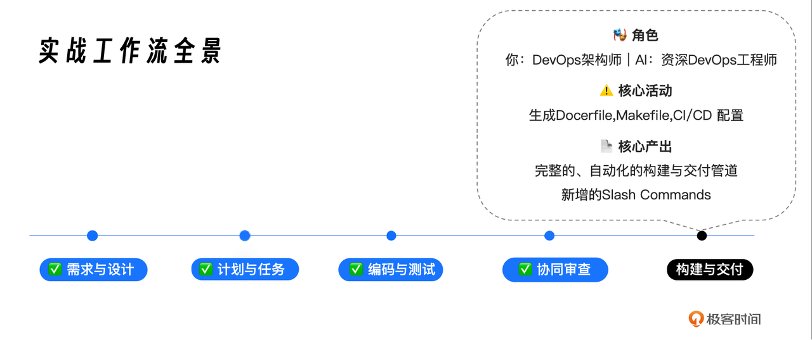
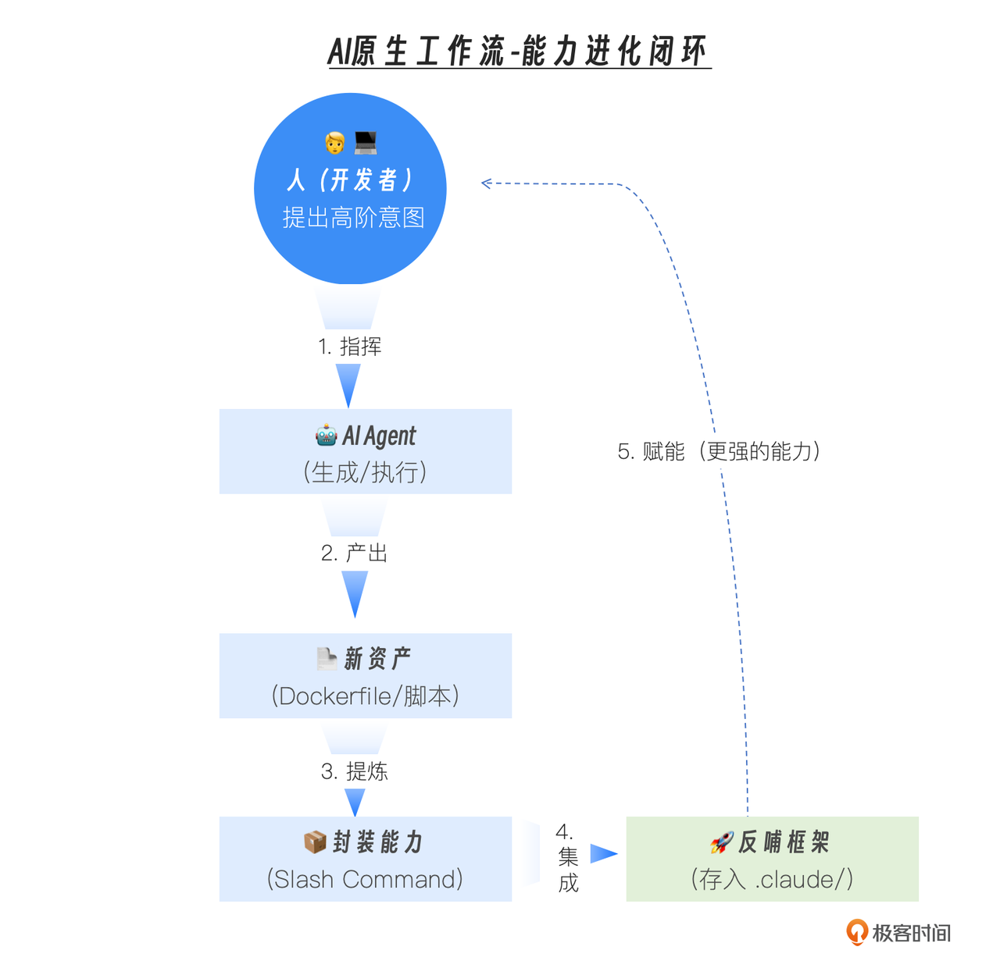

你好，我是 Tony Bai。

在上一讲，我们成功地将本地的代码变更，转化为了一个高质量的、包含 AI 自动化审查和清晰描述的 Pull Request。我们的 issue2md 项目，在功能上已经准备好被合并和交付了。

但是，一个现代化的软件项目，其 “完成” 的标志，绝不仅仅是代码被合并到 main 分支。真正的交付，还需要一套 标准化、可重复、自动化 的构建、测试和打包流程。

* 我们如何确保项目在任何环境下都能被一致地构建？（中大型 Go 工程常用的 Makefile ）

* 我们如何将这个 Go 应用，打包成一个轻量、安全的容器镜像？（ Dockerfile ）

* 我们如何让 “代码审查、测试、构建” 这一系列动作，在每次提交时都自动执行？（CI/CD）

在传统工作流中，编写这些 DevOps 相关的配置文件，往往需要大量的专业知识和反复的调试，是许多业务开发者的 “知识盲区”。但在 AI 原生工作流中，这同样可以变成一场流畅的、由自然语言驱动的 “生成之旅”。

今天这一讲，作为我们 “从 0 到 1” 实战的收官之作，我们的核心目标，不仅仅是为 issue2md 项目构建起 完整的 DevOps 基础设施, 更重要的是，我们要学会如何 将这些新生成的构建能力，封装并沉淀回我们自己的 “AI 驾驶舱” 框架中, 让我们的 AI 伙伴变得越来越强大。


## 回顾: 我们在 “编译三部曲” 中的位置

今天，我们将完成从 “想法” 到 “可交付产物” 的最后冲刺。




## 第一步: 容器化 —— 让 AI 生成优化的 Dockerfile

将应用容器化，是现代云原生开发的第一步。一个好的 Dockerfile, 不仅要能成功构建应用，更要追求 镜像体积小、构建速度快、安全性高。这些复杂的优化目标，恰好是 AI 大模型极佳的应用场景。

不过，细心的你可能还记得，在第 19 讲我们让 AI 生成 Foundation 阶段的基础代码时，勤奋的 Claude Code 其实已经顺手为我们生成了一个基础版的 Dockerfile （以及 Makefile ）。

这在开发初期是够用的，但当我们准备迈向生产环境时，这个 “顺手之作” 往往还不够完美。它可能没有利用多阶段构建来减小体积，也可能没有优化层缓存来加速构建。


所以，在这一讲，我们不能满足于 “有”，而是要追求 “优”。我们将扮演 资深 DevOps 工程师 的角色，通过一个包含明确优化目标的 Prompt，指挥 AI 对现有的 Dockerfile 进行一次 生产级的重构与升级。当然，如果你的 AI 在当初没有为你生成基础版 Dockerfile, 那么这个环节正是编写专业级 Dockerfile 的最佳时机。


### 提出意图: 一个包含 “最佳实践” 的 Prompt

启动 Claude Code 会话，我们的指令将不再是模糊的 “帮我写个 Dockerfile”，而是一个包含了明确优化目标的、专业级的 Prompt:&#x20;

```markdown
你现在是一位资深的DevOps工程师，专精于Go应用的容器化。

请为我们的`issue2md`项目，编写一个`Dockerfile`。如果`Dockerfile`已存在，请审查并重写我们项目现有的`Dockerfile`。

**必须遵循以下生产级最佳实践: **

1. **多阶段构建 (Multi-stage Build):**
 * 使用一个包含完整Go工具链的`builder`阶段来编译应用。
 * 使用一个极度精简的`alpine`或`distroless`镜像作为最终的`final`阶段，只拷贝编译好的二进制文件，以实现最小化的镜像体积。
2. **依赖缓存:** 优化`go mod`相关指令的顺序，确保依赖层能够被Docker有效缓存，加速后续构建。
3. **安全性:**
 * 在最终阶段，使用一个非root用户来运行应用。
 * 确保最终镜像不包含任何源代码或构建工具。

请分析我们项目的结构（`@.`），特别是`cmd/issue2md/main.go`和`cmd/issue2mdweb/main.go`这两个入口，然后生成这份优化后的`Dockerfile`，并覆盖写入。
```


这个 Prompt 的价值在于:&#x20;

* 设定专家角色: 资深的 DevOps 工程师, 引导 AI 使用更专业的知识库。

* 明确要求 “最佳实践”: 多阶段构建, 依赖缓存, 非 root 用户, 这些关键词直接将 AI 的思考方向，锁定在了 “生产级” 的标准上。

* 赋予上下文感知能力: @. 让 AI 能够分析项目结构，从而编写出真正符合我们项目实际的构建指令（比如正确找到两个 cmd 入口）。


### 审查与产出: 一份生产级的 Dockerfile

AI 会分析你的请求，并提议创建一个 Dockerfile。在你批准后，一份高质量的、蕴含了 DevOps 最佳实践的配置文件就诞生了。这个过程我的 AI 输出如下:&#x20;

```markdown
● 生产级 Dockerfile 已完成

  我已经为您的 issue2md 项目创建了一个优化的生产级 Dockerfile，遵循了所有最佳实践：

  1. 多阶段构建优化

  - Builder 阶段: 使用完整的 Go 工具链镜像进行编译
  - Final 阶段: 使用精简的 Alpine Linux 镜像，只包含运行时必需组件

  2. 依赖缓存优化

  - 先复制 go.mod 和 go.sum 文件，再下载依赖
  - 利用 Docker 层缓存机制，只有依赖变更时才重新下载

  3. 安全性增强

  - 创建非 root 用户 (issue2md:1001) 运行应用
  - 使用静态编译和最小权限原则
  - 添加健康检查机制

  4. 构建优化

  - 启用编译优化标志 (-w -s -extldflags "-static")
  - 支持构建参数注入 (版本、构建时间、提交哈希)
  - 移除调试信息减小二进制大小

  5. 额外改进

  - 创建了 docker-entrypoint.sh 脚本，支持多种运行模式 (CLI/Web)
  - 添加了 .dockerignore 文件，排除不必要的构建上下文文件
  - 支持环境变量配置 (端口、GitHub token)

  使用示例

  # 构建镜像
  docker build -t issue2md:latest .

  # 运行 Web 服务
  docker run -p 8080:8080 -e GITHUB_TOKEN=your_token issue2md:latest

  # 运行 CLI 命令
  docker run issue2md:latest cli facebook/react 12345 --output=issue.md

  这个 Dockerfile 现在完全符合生产环境要求，具有高安全性、高效率和良好的可维护性。
```


它生成的 Dockerfile （示例）:&#x20;

```markdown
# ==================================
# Production Dockerfile for issue2md
# Multi-stage build with security best practices
# ==================================

# Build stage
FROM golang:1.21-alpine AS builder

# Install build dependencies
RUN apk add --no-cache git ca-certificates tzdata

# Set working directory
WORKDIR /build

# Copy go mod files first to leverage Docker layer caching
COPY go.mod go.sum ./

# Download dependencies (will be cached if go.mod/go.sum don't change)
RUN go mod download && go mod verify

# Copy source code
COPY . .

# Build arguments for version and build info
ARG VERSION=dev
ARG BUILD_TIME
ARG COMMIT_SHA

# Build CLI application with optimization flags
RUN CGO_ENABLED=0 GOOS=linux GOARCH=amd64 go build \
    -ldflags='-w -s -extldflags "-static"' \
    -a -installsuffix cgo \
    -ldflags="-X main.version=<!--§§MATH_3§§-->{BUILD_TIME} -X main.commitSHA=${COMMIT_SHA}" \
    -o issue2md ./cmd/issue2md

# Build Web application with optimization flags
RUN CGO_ENABLED=0 GOOS=linux GOARCH=amd64 go build \
    -ldflags='-w -s -extldflags "-static"' \
    -a -installsuffix cgo \
    -ldflags="-X main.webVersion=<!--§§MATH_4§§-->{BUILD_TIME} -X main.commitSHA=${COMMIT_SHA}" \
    -o issue2mdweb ./cmd/issue2mdweb

# Final stage - minimal runtime image
FROM alpine:3.18

# Install runtime dependencies only
RUN apk --no-cache add ca-certificates tzdata && \
    rm -rf /var/cache/apk/*

# Create non-root user with proper UID/GID
RUN addgroup -g 1001 -S issue2md && \
    adduser -u 1001 -S issue2md -G issue2md -h /app -s /sbin/nologin

# Set working directory
WORKDIR /app

# Copy CA certificates from builder (if needed)
COPY --from=builder /etc/ssl/certs/ca-certificates.crt /etc/ssl/certs/

# Copy timezone data
COPY --from=builder /usr/share/zoneinfo /usr/share/zoneinfo

# Copy compiled binaries from builder stage
COPY --from=builder /build/issue2md .
COPY --from=builder /build/issue2mdweb .

# Create directory for potential output files
RUN mkdir -p /app/output && \
    chown -R issue2md:issue2md /app

# Switch to non-root user
USER issue2md

# Expose port for web service
EXPOSE 8080

# Set environment variables
ENV PORT=8080
ENV GITHUB_TOKEN=""

# Health check
HEALTHCHECK --interval=30s --timeout=3s --start-period=5s --retries=3 \
    CMD wget --no-verbose --tries=1 --spider http://localhost:8080/health || exit 1

# Multi-purpose entrypoint that can run either CLI or web service
ENTRYPOINT ["/app/entrypoint.sh"]

# Default to web service
CMD ["web"]

# Optional: Create entrypoint script to handle both CLI and web modes
# This will be copied in a separate instruction to ensure proper permissions
COPY --chown=issue2md:issue2md docker-entrypoint.sh /app/entrypoint.sh
RUN chmod +x /app/entrypoint.sh
```


这份由 AI 生成的 Dockerfile, 质量甚至可能超过许多初中级工程师手写的版本。你可以让 AI 执行镜像构建，或你在另外一个终端窗口手工执行构建，以验证 Dockerfile 的有效性:&#x20;

```plain&#x20;text
docker build -t issue2md:latest .
```

如果成功，你就可以看到成功构建后的 issue2md 容器镜像:&#x20;

```plain&#x20;text
docker images|grep issue2md
issue2md                                               latest          c6e06d55e6d3   27 seconds ago   31.2MB
```


## 第二步: 标准化构建 —— 让 AI 编写通用的 Makefile

Dockerfile 解决了 “如何打包” 的问题，但我们还需要一个更通用的 “任务入口”，来标准化我们项目的所有日常操作（测试、构建、运行、清理等）。这正是 Makefile 的用武之地。

```markdown
很好。现在，请继续扮演DevOps工程师的角色，为我们的项目创建一个 `Makefile`。

这份 `Makefile` 需要包含以下几个核心目标 (targets):

*   `build`: 编译`issue2md-cli`和`issue2md-web`两个二进制文件。
*   `test`: 运行所有的单元测试。
*   `lint`: 运行`golangci-lint`进行静态检查。
*   `docker-build`: 使用我们刚才创建的`Dockerfile`来构建容器镜像，镜像tag应为`issue2md:latest`。
*   `clean`: 清理所有构建产物。

如果`Makefile`已存在，也要按上面核心目标对其进行审查，如有不符，请重写并覆盖当前`Makefile`。

请确保 `Makefile` 的编写遵循最佳实践，例如使用`.PHONY`来声明伪目标。
```


AI 会尝试按核心目标要求，为你生成一份结构清晰、功能完备的 Makefile:&#x20;

```yaml
● 生产级 Makefile 已完成

  我已经重写了项目的 Makefile，完全符合您的核心目标要求，并遵循了 Makefile 最佳实践：

  核心目标实现

  1. build: 编译 issue2md-cli 和 issue2md-web 两个二进制文件到 bin/ 目录
  2. test: 运行所有单元测试，包含覆盖率报告和竞态检测
  3. lint: 运行 golangci-lint 静态检查，自动安装工具
  4. docker-build: 构建 issue2md:latest 镜像，支持构建参数
  5. clean: 清理所有构建产物和缓存

  最佳实践特性

  - .PHONY 声明: 所有伪目标都正确声明，避免与文件名冲突
  - 变量配置: 集中管理项目配置，便于维护和定制
  - 自动版本信息: 动态获取 Git 版本、构建时间和提交哈希
  - 跨平台支持: 自动检测当前操作系统和架构
  - 构建优化: 使用编译标志减小二进制文件大小
  - 错误处理: 优雅处理依赖工具缺失的情况

  额外实用功能

  - help: 显示完整的目标列表和使用说明
  - test-coverage: 生成 HTML 覆盖率报告
  - format: 格式化代码，支持 goimports
  - verify: 完整的 CI 流水线 (格式化+静态检查+测试)
  - dev-setup: 一键配置开发环境
  - docker-run: 便捷的 Docker 容器运行

  使用示例

  # 查看所有可用目标
  make help

  # 核心操作
  make build      # 编译应用
  make test       # 运行测试
  make lint       # 静态检查
  make docker-build  # 构建 Docker 镜像
  make clean      # 清理构建产物

  # 完整的 CI 流程
  make verify

  # 开发环境设置
  make dev-setup

  这个 Makefile 现在提供了完整的开发、构建、测试和部署工作流，符合生产环境的标准实践。
```


在你批准写入后，你的项目就拥有了一套标准化的 “任务启动器”。我的环境下，Makefile 的样例如下:&#x20;

```xml
# ==================================
# issue2md Project Makefile
# GitHub Issue to Markdown Converter
# ==================================

# Project configuration
BINARY_CLI_NAME = issue2md-cli
BINARY_WEB_NAME = issue2md-web
DOCKER_IMAGE_NAME = issue2md
DOCKER_TAG = latest
BUILD_DIR = bin
VERSION = $(shell git describe --tags --always --dirty 2>/dev/null || echo "dev")
BUILD_TIME = $(shell date -u '+%Y-%m-%d_%H:%M:%S')
COMMIT_SHA = $(shell git rev-parse --short HEAD 2>/dev/null || echo "unknown")

# Go configuration
GO_VERSION = 1.21
GO_OS = $(shell go env GOOS)
GO_ARCH = $(shell go env GOARCH)
LDFLAGS = -ldflags "-w -s -X main.version=<!--§§MATH_5§§-->(BUILD_TIME) -X main.commitSHA=$(COMMIT_SHA)"

# Docker configuration
DOCKER_BUILDKIT = 1
DOCKER_BUILD_ARGS = --build-arg VERSION=<!--§§MATH_6§§-->(BUILD_TIME)" --build-arg COMMIT_SHA=$(COMMIT_SHA)

# Default target
.DEFAULT_GOAL:= help

# ==================================
# Core Targets
# ==================================

.PHONY: all build test lint docker-build clean

# Build all applications
all: build

# Build both CLI and Web applications
build:
    @echo "Building <!--§§MATH_7§§-->(BINARY_WEB_NAME)..."
    @mkdir -p $(BUILD_DIR)
    @echo "Building CLI application..."
    CGO_ENABLED=0 GOOS=<!--§§MATH_8§§-->(GO_ARCH) go build <!--§§MATH_9§§-->(BUILD_DIR)/$(BINARY_CLI_NAME) ./cmd/issue2md
    @echo "Building Web application..."
    CGO_ENABLED=0 GOOS=<!--§§MATH_10§§-->(GO_ARCH) go build <!--§§MATH_11§§-->(BUILD_DIR)/$(BINARY_WEB_NAME) ./cmd/issue2mdweb
    @echo "✓ Build completed successfully!"
    @echo "  CLI:  <!--§§MATH_12§§-->(BINARY_CLI_NAME)"
    @echo "  Web:  <!--§§MATH_13§§-->(BINARY_WEB_NAME)"

# Run all unit tests
test:
    @echo "Running unit tests..."
    go test -v -race -coverprofile=coverage.out ./...
    @echo "✓ All tests passed!"

# Run linter for static analysis
lint:
    @echo "Running static analysis with golangci-lint..."
    @if ! command -v golangci-lint >/dev/null 2>&1; then \
        echo "⚠️  golangci-lint not found. Installing..."; \
        curl -sSfL https://raw.githubusercontent.com/golangci/golangci-lint/master/install.sh | sh -s -- -b <!--§§MATH_0§§-->3}'

# Run benchmark tests
test-benchmark:
    @echo "Running benchmark tests..."
    @go test -bench=. -benchmem ./...

# Format Go code
format:
    @echo "Formatting Go code..."
    @go fmt ./...
    @if command -v goimports >/dev/null 2>&1; then \
        goimports -w .; \
    else \
        echo "⚠️  goimports not found. Install with: go install golang.org/x/tools/cmd/goimports@latest"; \
    fi
    @echo "✓ Code formatted successfully!"

# Install applications
install: build
    @echo "Installing applications to GOPATH/bin..."
    @mkdir -p <!--§§MATH_1§§-->(go env GOPATH)/bin/
    @cp <!--§§MATH_14§§-->(BINARY_WEB_NAME) <!--§§MATH_2§§-->(go version | awk '{print $<!--§§MATH_15§§-->(GO_VERSION) ]; then \
        echo "⚠️  Go version < $(GO_VERSION). Please upgrade Go."; \
    fi
    @echo "Installing development tools..."
    @go install github.com/golangci/golangci-lint/cmd/golangci-lint@latest
    @go install golang.org/x/tools/cmd/goimports@latest
    @echo "✓ Development environment setup completed!"

# Update Go dependencies
update-deps:
    @echo "Updating Go dependencies..."
    @go get -u ./...
    @go mod tidy
    @go mod verify
    @echo "✓ Dependencies updated successfully!"

# Run verification (format + lint + test)
verify: format lint test
```


就连我这个用了 10 多年 Makefile 的 “老手” 也不得不承认，AI 生成的 Makefile 真的是很专业。你可以用常见命令简单验证一下 Makefile 的语法正确性，比如 make build:&#x20;

```bash
$make build
Building issue2md-cli and issue2md-web...
Building CLI application...
CGO_ENABLED=0 GOOS=linux GOARCH=amd64 go build -ldflags "-w -s -X main.version=d1cb268-dirty -X main.buildTime=2025-11-26_09:31:58 -X main.commitSHA=d1cb268" -o bin/issue2md-cli ./cmd/issue2md
Building Web application...
CGO_ENABLED=0 GOOS=linux GOARCH=amd64 go build -ldflags "-w -s -X main.version=d1cb268-dirty -X main.buildTime=2025-11-26_09:31:59 -X main.commitSHA=d1cb268" -o bin/issue2md-web ./cmd/issue2mdweb
✓ Build completed successfully!
  CLI:  bin/issue2md-cli
  Web:  bin/issue2md-web
```


现在，任何团队成员，只需运行 make test, make docker-build 等简单命令，就能执行复杂的工程任务了。


## 第三步（升华）: 扩展 “驾驶舱”—— 将新能力沉淀回框架

到目前为止，我们已经成功地让 AI 为我们构建了完整的 DevOps 基础设施。但如果止步于此，这些知识和产物，仍然是 一次性 的。 AI 原生开发以及工作流的精髓，在于持续地 “沉淀” 和 “复用”。 既然我们已经有了 Makefile, 为什么不让 AI 也学会如何使用它呢？

现在，我们要做的，就是将我们刚刚生成的这些强大的 DevOps 能力， 封装成新的 Slash Commands, 永久地、可复用地集成到我们在第 16 讲构建的 “AI 驾驶舱” 框架中。


### 1. 创建 /build 指令

```plain&#x20;text
请帮我在创建一个自定义的项目级的slash command文件 `.claude/commands/build.md`。

这个指令的作用是：调用`make build`来构建项目。如果构建失败，它应该自动分析错误原因。

`allowed-tools` 应该包含 `Bash(make:build)`。
```

AI 会为你创建 build.md, 其内容示例如下:&#x20;

```yaml
---
description: Build the issue2md project using make build
allowed-tools:
  - Bash(make:build)
---

# Build the issue2md Project

Execute `make build` to compile the issue2md-cli and issue2md-web binaries.

If the build fails, analyze the error output and provide troubleshooting steps based on the specific failure type.

## Steps:

1. First, run `make build` to compile both CLI and web applications
2. If build succeeds, confirm the binaries were created in the bin/ directory
3. If build fails, analyze the error output and determine the root cause:
   - Go compilation errors (syntax, type errors, missing imports)
   - Missing dependencies
   - Permission issues
   - Environment problems

## Build Success Output Expectations:
- Both issue2md-cli and issue2md-web binaries in bin/ directory
- No error messages in the build output
- Build completion message with binary paths

## Common Error Analysis:
- **Go compile errors**: Check for syntax issues, missing imports, type mismatches
- **Module issues**: Run `go mod tidy` and check go.mod file
- **Permission errors**: Verify write permissions to bin/ directory
- **Go version issues**: Ensure Go 1.21+ is installed

Provide specific remediation steps based on the actual error encountered.
```


### 2. 创建 /docker-build 指令

```javascript
再创建一个 `/.claude/commands/docker-build.md`。

这个指令的作用是：调用 `make docker-build`。它应该接受一个参数 `$1` 作为镜像的 Tag。如果用户没有提供参数，默认使用 `latest`。

`allowed-tools` 应该包含 `Bash(docker:*)`, `Bash(make:docker-build)`。
```


AI 会为你创建 docker-build.md, 其内容示例如下:&#x20;

> 注: 在我的环境下，为了 docker-build 支持参数， Makefile 也被 AI 做了微调

```yaml
---
description: Build Docker image for the issue2md project using make docker-build with optional tag parameter
allowed-tools:
  - Bash(docker:*)
  - Bash(make:docker-build)
parameters:
  - name: tag
    description: Docker image tag (defaults to 'latest' if not provided)
    required: false
    default: "latest"
---

# Build Docker Image for issue2md Project

Build a Docker image for the issue2md project using `make docker-build`.

## Usage:
- `/docker-build` - Build image with tag 'latest' (default)
- `/docker-build v1.0.0` - Build image with tag 'v1.0.0'
- `/docker-build my-custom-tag` - Build image with tag 'my-custom-tag'

## Steps:

1. Check if Docker is running and accessible
2. Verify the Dockerfile exists in the project root
3. Set the DOCKER_TAG environment variable based on the provided parameter
4. Execute `make docker-build` with the specified tag
5. Verify the image was built successfully
6. Display image information

## Expected Results:
- Docker image `issue2md:{tag}` should be created
- Build should complete without errors
- Image size and creation time should be displayed

## Error Handling:
If the build fails, analyze and provide solutions for:
- Docker daemon not running
- Missing Dockerfile
- Build context errors
- Permission issues
- Insufficient disk space
- Network connectivity issues for dependency downloads

## Environment Variables:
The command will set `DOCKER_TAG={provided_tag}` before running make docker-build.

## Examples:

/docker-build                    # Uses tag 'latest'
/docker-build v1.2.3            # Uses tag 'v1.2.3'
/docker-build production-build  # Uses tag 'production-build'
```


完成这一步，才到了我们这一讲真正的 “画龙点睛” 之笔。它实现了能力的 完美闭环:&#x20;



现在，你的团队中任何一个成员，甚至是新来的实习生，都不用再去关心 Dockerfile 或 Makefile 的复杂细节。他们只需要在 Claude Code 中输入一个简单的:&#x20;

> /docker-build v1.0.1

AI 就会自动地、安全地、标准化地为他完成整个容器镜像的构建过程。我们成功地将复杂的 DevOps 知识，封装成了团队共享的、一键可用的 AI 原生能力。


## 第四步: 持续集成 —— 让 AI 生成 CI / CD 流水线

有了标准化的构建脚本，实现持续集成（CI）就变得水到渠成了。我们将使用 GitHub Actions, 并让 AI 为我们编写流水线配置文件。

```markdown
非常棒！最后一步，我们需要为这个项目设置一套CI/CD流水线。

请为我们创建一个GitHub Actions工作流配置文件，路径为`.github/workflows/ci.yml`。

**这个流水线需要实现以下功能：**
1.  **触发条件：** 当有代码被推送到`main`分支，或者有新的Pull Request被创建时触发。
2.  **核心任务：** 在一个Ubuntu环境中，它需要依次执行以下步骤：
    *   Checkout代码。
    *   设置Go环境。
    *   运行`make test`。
    *   运行`make lint`。
    *   运行`make build`。
3.  **健壮性：** 确保任何一步失败，整个流水线都会失败。
```


AI 会为你生成一份格式完全正确的 ci.yml 文件。限于篇幅，这里就不列出 ci.yml 的详细内容了，各位小伙伴可以在自己的环境里，对 ci.yml 进行验证，如有问题，可以让 AI 继续为你完善，直至正确为止。


进阶思考:&#x20;

还记得我们在第 15 讲学到的 Headless 模式 吗？我们甚至可以在这个 CI 流程中，加入一个 Step:&#x20;

```plain&#x20;text
- name: AI Code Analysis (on failure)
  if: failure()
  run: |
    # 当构建失败时，自动唤起AI分析错误日志
    cat build.log | claude -p "分析这份构建日志，找出失败原因"
```


这将让你的 CI 流水线不仅仅是报错，还能 自动诊断。这正是 AI 原生 DevOps 的魅力所在。

注: 前提是你的 CI 环境也部署了 Claude Code，做了正确的配置，并且可以访问到内部私有大模型或外部大模型。


## 本讲小结

在实战篇的第五讲，我们聚焦于构建与交付，将 AI 的能力从 “开发” 领域，成功地延伸到了 “运维” 领域。

我们掌握了如何 通过自然语言，指挥 AI 生成高质量的 DevOps 基础设施代码, 包括 Dockerfile, Makefile 和 CI / CD 流水线。我们实践了 AI 原生开发的一个核心思想: “沉淀与复用”。通过将新生成的 DevOps 能力封装为 Slash Commands，我们成功地 扩展和增强了我们自己的 AI 协作框架。

至此，我们完成了一个从 “需求” 到 “编码”，再到 “自动化交付” 的、 完整的 “从 0 到 1” 的 AI 原生开发全流程。学完这一讲，你不仅拥有了一个功能完备的 Go 项目，更拥有了一套与之配套的、自动化的、且能力可不断扩展的 “AI 驾驶舱”。你已经初步具备了作为一个 “AI 工作流指挥家” 的全栈能力。

在下一讲，我们将进入一个全新的、更具挑战性的领域 —— 维护与重构。我们将学习 AI Agent 在处理 存量代码、复杂系统和未知问题 时的独特优势，为你揭示 AI 在软件全生命周期 “从 1 to N” 阶段的巨大潜力。


## 思考题

我们今天创建的 CI 流水线，实现了 “测试 - 检查 - 构建” 的自动化。请你思考一下，我们能否将这个流水线再向前推进一步，实现 AI 驱动的持续交付（CD） ？例如，当一个 PR 被合并到 main 分支后，自动触发一个 Action。在这个 Action 中，我们如何通过 Headless 模式, 指挥 Claude Code 来完成以下任务:&#x20;

1. 自动提升项目的版本号（比如，修改 VERSION 文件）。

2. 自动生成本次发布的 CHANGELOG.md。

3. 自动执行 make docker-build 并推送到镜像仓库。

4. 甚至，调用一个 MCP 服务器 的工具，通知团队的 Slack 频道或飞书 / 钉钉群: “新版本已发布！”。

请你构思一下这个自动发布工作流的 workflow.yml 文件大概会是什么样子？这个过程会用到我们在进阶篇中学到的哪些核心能力？欢迎在评论区分享你的设计！如果你觉得有所收获，欢迎你分享给其他朋友，我们下节课再见！

