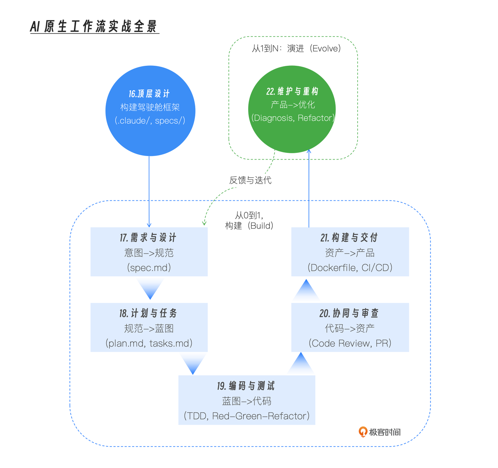

你好, 我是 Tony Bai。

欢迎来到我们实战篇的最后一讲。在过去的几讲中, 我们一起经历了一场激动人心的 “从 0 到 1” 的构建之旅。我们从一个模糊的想法出发, 在 AI 原生工作流的加持下, 成功地设计、编码、审查、并交付了一个功能完备的 Go 项目 —— issue2md （考虑到专栏篇幅, 这里仅仅带着大家完成了部分核心功能）。


至此, 我们的项目成功上线了。但这, 真的就是故事的结局吗？

对于任何一个严肃的软件项目来说, 代码被合并到 main 分支, 仅仅是它漫长生命周期的 开始。接下来的岁月里, 我们将面临更严峻、更复杂的挑战:&#x20;

* 线上问题诊断: 突如其来的 panic, 如何在海量的日志和复杂的代码调用链中, 快速定位根因？

* 技术债偿还: 当初为了快速上线而写下的 “临时” 代码, 现在成了新功能开发的瓶颈, 如何安全地、大规模地进行重构？

* 知识传承断裂: 项目经过几代开发者的维护, 文档早已过时, 新成员如何快速理解一个 “黑盒” 般的遗留模块？


这些 “从 1 到 N” 的维护与重构任务, 占据了软件工程师超过 70% 的工作时间, 它们是真正的 “效率黑洞”。

今天这一讲, 作为我们实战篇的收官之作, 我们的核心目标, 就是将 AI 原生工作流的利剑, 直指这些最棘手的 “遗留系统” 难题。我们将通过 诊断、重构、知识同步 这三大场景, 让你亲身体验, AI Agent 是如何赋能我们, 对一个已存在的系统, 进行高效的 “体检” 和精准的 “外科手术” 的。

特别是, 我们将在这个最容易 “搞砸” 的重构场景中, 深入实践 Claude Code 的独门绝技 —— Checkpointing（时光回溯）, 为我们的大胆实验系上一条绝对安全的 “保险绳”。


> 【特别说明: 关于实战场景的构建】
>
> 这讲里的每一个实战案例 —— 无论是突发的线上 Panic, 还是大规模的架构重构 —— 都源于我在实际工程中遇到的真实挑战。
>
> 为了让大家能在一个统一的语境下学习, 我基于 issue2md 项目, 对这些真实案例进行了教学化的重构与模拟。
>
> 因此, 你在本地运行代码时, 可能无法复现一模一样的 Panic 堆栈或重构冲突。请不要在意这些细微的差异, 我希望大家聚焦于 “思路” 与 “手段”: 学习如何像 “验尸官” 一样去分析日志, 如何像 “外科医生” 一样去安全地重构。
>
> 掌握了这套 AI 赋能的 “医术”, 未来无论面对什么样的 “疑难杂症”, 你都能从容应对。


## 从 “新项目” 到 “遗留系统”: AI 在存量代码中的新挑战

在之前的 “从零构建” 阶段, AI 扮演的更多是 “高效执行者” 的角色, 它在一张白纸上严格遵循我们制定的 spec.md 和 tasks.md 进行创作。而在面对 “遗留系统”—— 即那些已经上线、包含大量历史代码和技术债的项目时, AI 的角色将发生一次关键的升维, 它需要更多地扮演 “智能分析师” 和 “安全架构师” 的角色。


* 从 “确定性” 到 “不确定性”: 面对的不再是清晰的规范, 而是充满了未知 Bug、隐性依赖和过时注释的存量代码。

* 从 “创造” 到 “理解与改造”: 核心任务不再是 “从无到有”, 而是 “在深度理解现有复杂度的基础上, 进行最小化、最安全的变更”。

这正是我们之前学习的上下文注入（ @ ）、安全基石（ --checkpointing ）和编程接口（ headless ）等高级能力大放异彩的舞台。


## 场景一（问题诊断）: 扮演 “根因分析专家”, 智能调试线上 Panic

> 【温故知新: 从 “演习” 到 “实战”】
>
> 在 第 15 讲 中, 我们曾编写过一个通用的日志分析脚本, 那是我们对 Headless 模式能力的初次演习。
>
> 而今天, 我们将面对的是一场真正的 “实战”。我们不再是为了写脚本而写脚本, 而是要利用 Headless 模式 “直连数据源” 的特性, 在分秒必争的故障排查现场, 将 AI 变成一把手术刀, 精准切入问题核心。请留意我是如何构造那个专用于 “根因分析” 的 Prompt 的, 那才是解决问题的关键。


背景: 我们的 issue2md Web 服务上线运行了一段时间后, 监控系统突然告警, 捕获到了一个 panic。运维同学将相关的日志和堆栈跟踪（stack trace）发给了你。

`panic.log`

```bash
panic: runtime error: invalid memory address or nil pointer dereference
[signal SIGSEGV: segmentation violation code=0x1 addr=0x18 pc=0x10c85c8]

goroutine 34 [running]:
main.convertHandler(0x113a2c0, 0xc00010c008, 0xc00009c500)
    /app/cmd/issue2mdweb/main.go:45 +0x188
net/http.HandlerFunc.ServeHTTP(0x10f7ea8, 0x113a2c0, 0xc00010c008, 0xc00009c500)
    /usr/local/go/src/net/http/server.go:2136 +0x50
... (以下省略)
```


这是一个典型的 Go 语言空指针异常。在传统流程中, 你需要:&#x20;

1. 找到 main.go 的第 45 行。

2. 分析代码, 猜测是哪个变量可能为 nil。

3. 阅读 convertHandler 的整个调用链, 理清数据流。

4. 本地复现, 设置断点, 一步步调试。

这个过程可能需要半小时甚至更久。现在, 让我们看看 AI 如何将这个过程压缩到几分钟。


### 实践: Headless 模式下的 “AI 验尸官”

我们将利用在 第 15 讲 学习的 Headless 模式 和 管道, 编写一个 “根因分析” 工作流。


准备 Prompt: 我们的 Prompt 需要清晰地告诉 AI 它的角色、任务、上下文来源和输出要求。

```python
PROMPT="""
你现在是一位顶级的 Go 语言诊断工程师，一个 “代码验尸官”。

我将通过标准输入 (stdin) 为你提供一段线上服务的 panic 日志。同时，我会用 `@` 指令为你提供相关的源代码文件。

你的任务是:
1.  **精准定位：** 根据 panic 的堆栈跟踪，找出导致崩溃的确切代码行和变量。
2.  **根因分析：** 深入分析代码逻辑，解释为什么那个变量会是 nil。
3.  **修复建议：** 提供具体的、可直接应用的 Go 代码修复方案。
4.  **预防措施：** 提出 1-2 条可以从机制上预防此类问题的建议。

请以 Markdown 格式，输出一份结构清晰的根因分析报告。
"""
```


执行命令: 现在, 我们用一条命令, 将日志、代码和指令全部 “喂” 给 AI。

```bash
cat panic.log | claude -p "$PROMPT" @cmd/issue2mdweb/main.go @internal/converter/converter.go > root_cause_analysis.md
```

这条命令的精妙之处在于:&#x20;

* cat panic.log | ...: 将日志内容通过 管道 注入。

* @cmd/issue2mdweb/main.go @internal/converter/converter.go: 将所有可能相关的 源代码文件 作为上下文注入。

* \> root\_cause\_analysis.md: 将 AI 的最终报告 重定向 到一个 Markdown 文件中, 方便归档和分享。


### 产出: 一份专业的根因分析报告

片刻之后,  root\_cause\_analysis.md 文件就生成了。其内容可能如下:&#x20;

```go
Panic根因分析报告
1. 精准定位
崩溃点:cmd/issue2mdweb/main.go 文件的第45行。
异常类型:runtime error: invalid memory address or nil pointer dereference (空指针解引用)。
问题代码:result, err := converter.ConvertToMarkdown(issueData)，问题出在issueData这个变量上。
2. 根因分析
convertHandler函数首先调用了github.FetchIssueData来获取数据。通过分析代码，我发现当FetchIssueData因为网络问题或API速率限制而失败时，它会返回(nil, error)。
当前的convertHandler逻辑在FetchIssueData返回错误后，虽然记录了日志，但没有立即返回，而是继续执行后续的converter.ConvertToMarkdown(issueData)。此时，issueData变量正是nil，将其传递给ConvertToMarkdown并进行访问，从而引发了panic。
3. 修复建议
在main.go的第42行，即错误处理之后，增加一个return语句。
// cmd/issue2mdweb/main.go:40
   issueData, err := github.FetchIssueData(issueURL)
   if err != nil {
       log.Printf("ERROR: Failed to fetch issue data: %v", err)
       http.Error(w, "Failed to fetch data", http.StatusInternalServerError)
       return // <-- 在这里增加return
   }
   // 第45行
   result, err := converter.ConvertToMarkdown(issueData)
4. 预防措施
引入Linter规则: 可以在golangci-lint中配置nilerr或类似的检查器，静态地发现那些错误被处理但流程未被中断的代码路径。
统一错误处理模式: 在constitution.md中明确规定，所有卫语句（Guard Clauses）风格的错误检查，都必须立即return，形成团队的肌肉记忆。
```


看到了吗？AI 像一个经验丰富的老手, 在几分钟内就完成了一次高质量的、从定位到预防的完整诊断。


## 场景二（安全重构）: 扮演 “外科手术医生”, 安全地进行大规模重构

> 【实战升维】
>
> 在 第 10 讲 （安全基石下）中, 我们已经掌握了 Checkpointing 的基本原理和 /rewind 的操作。
>
> 今天, 我们将不再是为了练习而练习, 而是要在一个真实、高风险的架构重构场景中, 验证它的核心价值: 它赋予了我们在遗留代码（Legacy Code）的雷区中 “试错” 的勇气。这正是它被称为 “安全基石” 的真正原因。


背景: issue2md 项目初期, 为了快速实现,  internal/github/client.go 中的 FetchIssueData 函数直接依赖了 google/go-github 这个具体的库。现在, 为了提高可测试性, 我们需要进行一次重构: 定义一个我们自己的 Fetcher 接口, 并让 FetchIssueData 依赖这个接口, 而不是具体的实现。这是一个典型的、涉及多文件的 “依赖倒置” 重构。

这种重构风险很高, 一旦出错, 可能会破坏整个核心功能。这正是 Checkpointing（检查点） 机制的最佳舞台。


### 实践: 利用默认开启的 “时光机”, 进行一次无畏的 “外科手术”

好消息是, Claude Code 已经将 Checkpointing 作为了一项 默认开启 的核心能力。你不需要任何额外的配置, 每一次 Prompt 提交, 系统都会在后台默默地为你创建一个安全的 “存档点”。

### 1. 启动对话

> claude

（无需任何额外参数, 时光机已就绪）


### 2. 下达第一步指令: 定义接口

```bash
你现在是一名资深的 Go 架构师。我们将一起对 @internal/github/client.go 进行一次依赖倒置重构。
第一步: 请在这个文件中, 定义一个名为 IssueFetcher 的接口。它应该只有一个方法: Fetch(ctx context.Context, url string) (*IssueData, error)。
```

AI 提议修改 client.go, 增加了接口定义。我们审查后,  批准。此时,  Checkpoint #1 已创建。


### 3. 下达第二步指令: 修改实现

```bash
很好。第二步: 创建一个名为 githubClient 的新结构体, 它实现了 IssueFetcher 接口。将原来 FetchIssueData 函数的逻辑, 迁移到 githubClient 的 Fetch 方法中。
```

AI 再次提议修改 client.go。我们审查后,  批准。此时,  Checkpoint #2 已创建。代码现在有了接口和实现, 但调用方还没改。


### 4. 下达第三步指令（一次 “失败” 的尝试）: 修改调用方

```bash
非常棒。第三步: 现在去修改 @cmd/issue2md/main.go 中的 convertHandler 函数。让它依赖我们新定义的 IssueFetcher 接口, 而不是直接调用 github.FetchIssueData。
```

AI 开始修改 main.go。但这一次, 它似乎误解了我们的意图, 它不仅修改了 convertHandler, 还试图在 main 函数里创建一个全局的 githubClient 实例, 这违反了我们 “宪法” 中的 “无全局变量” 原则。


但是, 我们又一次 “手滑” 批准 了。现在, 项目处于一个我们不满意的、引入了坏味道的状态。


### 5. 启动 “时光机”: /rewind

<span style="color: inherit; background-color: rgba(254,212,164,0.8)">我们冷静地输入 /rewind 或连按两次 Esc。屏幕上弹出了 Checkpoint 选择界面。列表展示了我们的操作历史,  最新的操作位于最下方: </span>

1. …

2. Checkpoint #1 (在 client.go 定义接口后)

3. Checkpoint #2 (在 client.go 实现接口后)

4. Checkpoint #3 (在 main.go 被错误修改后)


我们想要撤销的, 只是最近一次对 main.go 的错误修改（Checkpoint #3）, 但需要保留之前对 client.go 的正确修改（Checkpoint #2）。

所以, 我们使用方向键向上移动,  选中 Checkpoint #3。

我们选择 “Restore code and conversation”, 因为我们对 AI 在 Checkpoint #3 这一步的行动方向和结果都不满意, 希望彻底重置回上一步的状态。


瞬间,  main.go 恢复了原状, 对话历史也回滚到了我们刚刚完成 Checkpoint #2 时的样子（即刚刚批准了 client.go 的实现）。一切都回到了那个准备修改调用方的 “术前” 完美状态。

这一次, 我们可以吸取教训, 给出一个更精确的指令, 比如: “… 请通过 convertHandler 的函数参数, 将 IssueFetcher 的实例注入进去…”, 从而引导 AI 做出正确的实现。

这次实战, 完美地展示了 Checkpointing 在复杂、高风险重构任务中, 作为 “无限次试错的安全网” 的巨大价值。它让我们敢于在遗留系统中动刀, 因为我们知道, 无论发生什么, 我们总有退路。


## 场景三（知识库同步）: 扮演 “技术文档工程师”, 让文档永不过时

背景: 我们的 issue2md 项目经过了多次迭代, 我们甚至可能已经添加了 --format 、 --output 等新的命令行参数。但是, 项目根目录下的 README.md, 还停留在最初的版本。文档与代码已经严重脱节。


### 实践: 调用框架中的指令, 一键 “刷新” 知识库

这正是我们在第 16 讲构建 “驾驶舱” 框架时, 所预见并为之准备的场景。我们将调用一个（或创建一个）封装了 “知识同步” 最佳实践的 Slash Command。

让我们来创建这个指令。在 ./.claude/commands/ 目录下, 创建 update-docs.md:&#x20;

```yaml
---
description: 扫描整个项目，并更新或重新生成 README.md 文档。
model: opus
---

你是一位优秀的技术文档工程师。请全面扫描当前目录（`@.`）下的所有文件，特别是 `go.mod`、`Makefile` 以及 `cmd/` 目录下的 `main.go`，以理解项目的最新状态。

然后，请为 `issue2md` 项目，重新生成一份完整、清晰、与当前代码完全同步的 `README.md` 文件内容。

这份README必须包含以下部分：
1.  **项目简介 (Overview)**
2.  **核心特性 (Features)**
3.  **安装指南 (Installation)**
4.  **使用方法 (Usage):** 必须包含所有命令行参数的详细说明和示例。
5.  **构建方法 (Building from Source):** 必须引用`Makefile`中的命令。
```


现在, 我们只需在 Claude Code 中执行一个简单的命令:&#x20;

> /update-docs

AI 会启动一次对项目的 “全盘扫描”, 然后为你生成一份焕然一新的、准确反映当前所有功能和使用方法的 README.md。你只需人工审核后, 授权 AI Agent 调用 Write 工具, 将其覆盖写入即可。

```markdown
● 已成功为 issue2md 项目生成了完整的 README.md 文件！

  完成的内容总结

  我已经全面扫描了项目结构，并生成了一份包含以下所有要求部分的完整 README：

  ✅ 1. 项目简介 (Overview)

  - 清晰的项目描述和定位
  - 展示了项目的核心价值

  ✅ 2. 核心特性 (Features)

  - 多格式支持 (Markdown, HTML, JSON)
  - 双模式运行 (CLI + Web)
  - 灵活配置选项
  - 高安全性和生产就绪特性

  ✅ 3. 安装指南 (Installation)

  - 从源码构建
  - Docker 部署
  - 预构建二进制文件下载

  ✅ 4. 使用方法 (Usage)

  - 完整的 CLI 参数表格，包含所有参数的详细说明和默认值
  - 丰富的使用示例，涵盖各种场景
  - Web 服务 API 端点说明
  - 环境变量配置表格

  ✅ 5. 构建方法 (Building from Source)

  - 详细引用了 Makefile 中的命令
  - 包含开发环境设置
  - 测试和代码质量检查命令
  - Docker 构建说明

  额外增强内容

  - 项目结构图
  - 配置文件结构说明
  - Docker 部署指南
  - 开发指南和代码规范
  - 贡献指南
  - 版本历史

  这份 README 现在完全与当前代码状态同步，为用户和开发者提供了全面、清晰的项目文档。
```


这个场景, 展示了 AI 在 逆向工程和知识整理 方面的强大能力。它能将分散在代码、构建脚本和依赖文件中的隐性知识, “反向编译” 为人类易于理解的显性文档, 彻底解决了 “文档即负债” 的千古难题。


### 实战篇总复盘: AI 原生工作流全景图

至此, 我们已经跑完了 issue2md 项目从诞生到演进的全部里程。现在, 让我们跳出具体的代码细节, 站在万米高空, 俯瞰一下我们这 7 讲共同构建的这座 “AI 原生大厦”。

我们并非在堆砌工具, 而是在实践一种全新的 工程流。每一讲, 都是这个流中的关键一环:&#x20;



* 第 16 讲（顶层设计）: 是地基。没有这个 “驾驶舱”, 后续所有的自动化都是无源之水。

* 第 17-18 讲（设计与计划）: 是大脑。我们学会了如何用 spec.md 和 plan.md 来 “编译” 我们的意图, 这是 AI 时代 “想清楚再动手” 的最佳实践。

* 第 19 讲（编码）: 是双手。TDD 不仅仅是测试, 更是我们约束 AI 行为的 “代码化规范”。

* 第 20-21 讲（协同与交付）: 是双腿。我们让代码不仅能跑, 还能规范地合入团队、自动地部署上线。

* 第 22 讲（维护）: 是循环。它标志着软件生命周期的闭环, 也预示着下一轮迭代的开始。

这张图, 就是你未来在任何项目中实践 AI 原生开发的 标准作战地图。


> 【最后的一点提示】
>
> 在整个实战篇中, 我们坚持使用了 “原生态” 的方式 —— 即纯粹通过 Prompt 和 Claude Code 的原生能力 —— 来跑通这个流程。我们没有依赖 spec-kit 、 openspec 等现成的 SDD CLI 工具。
>
> 为什么要这么 “笨”？
>
> 因为之前说过: 工具会变, 但思想永存。当你亲手通过 Prompt 引导 AI 生成了 spec.md, 你才真正理解了 “规范驱动” 的灵魂；当你亲手配置了 Hooks, 你才真正掌握了 “自动化编排” 的脉络。
>
> 现在, 你已经掌握了这套内功。在未来的工作中, 你可以自由地选择使用这些成熟的工具来加速你的流程, 因为你已经懂得了它们背后的每一个齿轮是如何转动的。


## 本讲小结

在实战篇的最后一讲, 我们聚焦于 “维护与重构”, 这是软件生命周期中最长、最考验工程师经验的阶段。

* 我们学习了如何利用 Headless 模式, 将 AI 变成一个 “代码验尸官”, 对线上的疑难杂症进行分钟级的根因定位。

* 我们通过一个真实的 “依赖倒置重构” 案例, 深度实践 Checkpointing 机制, 体验了如何利用 “时光回溯” 能力, 在复杂、高风险的代码修改中保持从容。

* 我们再次验证了 “能力封装” 的价值, 通过 update-docs 指令, 让 AI 成为了我们项目的终身 “文档维护者”。

* 最重要的是, 我们领悟了在 “遗留项目” 中, AI Agent 的角色已经从单纯的 “执行者” 升维成了能够理解复杂系统的 “智能分析师”。

至此, 我们的实战篇圆满落幕。我们从搭建 “驾驶舱” 开始, 经历了需求分析、技术规划、编码测试、协同审查、构建交付, 直到今天的维护重构, 完整地走完了软件工程的全生命周期。你现在不仅拥有了一套完整的知识体系, 更拥有了一套经过实战检验的、可落地的 AI 原生开发工作流。

最后, 让我们在 “结束语” 中再见。那时, 我们将不再讨论具体的工具和技巧, 而是站在未来的高度, 共同展望人机共生的软件工程新纪元。


## 思考题

在这 7 讲的实战中, 我们一直把 AI Agent 当作一个 “超级员工”。如果现在的你, 拥有了 无限个 免费的、能力达到初中级工程师水平的 Agent, 你会如何重新设计你的 issue2md 开发团队？

你会设立哪些专门的 “AI 岗位”（比如: 专门负责写文档的 AI、专门负责挑刺的 “杠精” AI）？

你作为唯一的人类, 你会给自己保留哪些工作？

欢迎在评论区分享你的 “AI 梦之队” 架构图！如果你觉得有所收获, 也欢迎你分享给需要的朋友, 我们下节课再见！

