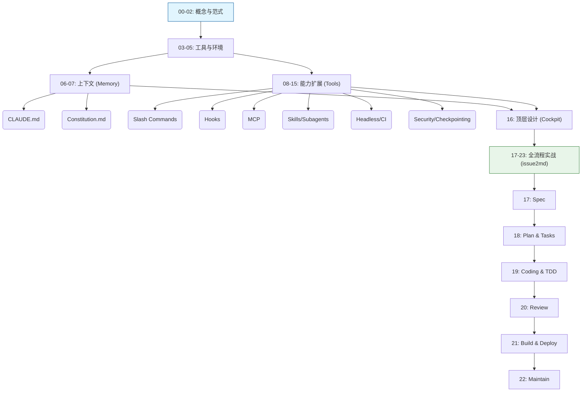

# 🚀 AI 原生开发工作流实战 - 课程大纲与学习指南

欢迎来到《AI 原生开发工作流实战》课程资料库。本课程旨在帮助软件工程师从传统的 “人机协作” 模式，进化为驾驭 AI Agent 的 “AI 原生” 开发者。通过 24 讲的系统学习，你将掌握以 **Claude Code** 为核心的下一代软件工程范式。

---

## 📚 1. 文档概览

### 📊 统计与分类
*   **文档总数**: 24 篇 (00 - 23)
*   **核心主题**: AI Native Paradigm, Spec-Driven Development (SDD), Agentic Workflow, DevOps Automation.

本课程体系由浅入深，分为四个核心模块：

| 模块 | 章节范围 | 核心目标 | 难度 | 建议时长 |
| :--- | :--- | :--- | :--- | :--- |
| **Concept (概念篇)** | 00 - 02 | 建立 AI 原生世界观，掌握 SDD 核心方法论 | ⭐ | 1.5 小时 |
| **Basic (基础篇)** | 03 - 05 | 搭建环境，掌握 `@` (上下文) 与 `!` (行动) 核心交互 | ⭐⭐ | 2 小时 |
| **Advanced (进阶篇)** | 06 - 15 | 深度定制 AI，掌握 Context 管理、安全、Hook 与扩展 | ⭐⭐⭐ | 6 小时 |
| **Practical (实战篇)** | 16 - 23 | 真实项目 `issue2md` 全生命周期演练 (设计->开发->交付->维护) | ⭐⭐⭐⭐ | 10 小时 |

### 🧠 知识体系逻辑关系
整个课程遵循 **"道 (Dao) -> 术 (Shu) -> 器 (Qi) -> 用 (Yong)"** 的逻辑演进：
*   **道**: 00-02 (范式转移，规范驱动)
*   **术**: 06-11 (上下文管理，安全机制，自动化编排)
*   **器**: 03-05, 12-15 (Claude Code, MCP, Headless)
*   **用**: 16-23 (全流程实战)

---

## 📝 2. 重点内容提炼

### 🌟 模块一：概念与认知 (00-02)

#### [00 开篇词](00%20开篇词｜AI%20工作流革命：重新定义软件工程师的每一天%20-%20AI%20原生开发工作流实战%20-%20极客时间.md)
*   **三大摩擦力**: 上下文摩擦、工作流摩擦、认知摩擦。
*   **核心理念**: 从 “AI 助理” (Assistant) 进化为 “AI 同事” (Colleague)。
*   **新角色**: 规范设计者、工作流指挥家、质量治理者。

#### [01 范式演进](01｜范式演进：从%20!人机协作!%20到%20!AI%20原生!，你的角色变了吗？-AI%20原生开发工作流实战%20-%20极客时间.md)
*   **集成成熟度模型**: Level 1 (Chatbot) -> Level 2 (Copilot) -> Level 3 (Agent) -> Level 4 (Autonomous)。
*   **核心转变**: 从 Human-in-the-loop 到 Human-on-the-loop (监督者)。

#### [02 核心引擎：规范驱动开发 (SDD)](02｜核心引擎：AI%20原生开发第一性原理%20——%20规范驱动开发%20-%20AI%20原生开发工作流实战%20-%20极客时间.md)
*   **权力反转**: Spec (规范) 取代 Code 成为 Source of Truth。
*   **编译隐喻**: AI 是将 Intent (意图) 编译为 Code 的编译器。
*   **核心产物**: `spec.md` (需求) -> `plan.md` (方案) -> `tasks.md` (任务) -> Code。

### 🛠️ 模块二：基础与环境 (03-05)

#### [03 Agent 生态](03｜群雄并起：扫描命令行%20AI%20Agent%20生态，我们为何聚焦%20Claude%20Code？-AI%20原生开发工作流实战%20-%20极客时间.md)
*   **为何选择 CLI Agent**: 执行深度更深，集成自由度更高。
*   **工具对比**: Aider (先驱), Cline/Roo (IDE集成), Claude Code (原生/Agentic)。

#### [04 环境搭建](04｜环境搭建：为%20Claude%20Code%20接入国产大模型%20-%20AI%20原生开发工作流实战%20-%20极客时间.md)
*   **车身与引擎分离**: Client (Claude Code) + Model (Zhipu/Claude)。
*   **分层配置**: Managed > CLI > Local > Project > User (`settings.json`)。
*   **实战**: 配置 `ANTHROPIC_BASE_URL` 接入智谱 AI。

#### [05 核心交互模型](05｜核心交互模型：所有%20Agent%20的通用语言%20——%20上下文注入与%20Shell%20执行%20-%20AI%20原生开发工作流实战%20-%20极客时间.md)
*   **`@` (Context)**: 注入文件、文件夹、Git 提交、Web 链接。
*   **`!` (Action)**: 执行 Shell 命令，获取执行结果。
*   **REPL 循环**: Read-Eval-Print Loop 的 AI 增强版。

### 🧩 模块三：进阶能力 (06-16)

#### 上下文与规范 (06-07)
*   **[06 CLAUDE.md](06｜上下文的艺术（上）：详解%20CLAUDE.md%20与%20AGENTS.md-AI%20原生开发工作流实战%20-%20极客时间.md)**: 项目的 “长期记忆” (Long-term Memory)。
*   **[07 Constitution](07｜上下文的艺术（下）：用%20constitution.md%20为%20AI%20注入项目%20“宪法”-AI%20原生开发工作流实战%20-%20极客时间.md)**: 项目的 “宪法” (不可协商的原则，如 TDD、No ORM)。

#### 能力扩展 (08, 11-14)
*   **[08 Slash Commands](08｜自定义指令：精通%20Slash%20Commands，打造你的私人命令集%20-%20AI%20原生开发工作流实战%20-%20极客时间.md)**: 封装高频工作流 (e.g., `/review`, `/commit`)。
*   **[11 Hooks](11｜事件驱动!%20详解%20Hooks%20机制，让%20AI%20在关键节点自动触发%20-%20AI%20原生开发工作流实战%20-%20极客时间.md)**: 事件驱动自动化 (e.g., `PostToolUse` 自动格式化代码)。
*   **[12 MCP](12｜终极扩展!%20深入%20MCP%20服务器，将%20AI%20连接到任何内外部系统%20-%20AI%20原生开发工作流实战%20-%20极客时间.md)**: 连接外部世界 (GitHub, Jira, Database)。
*   **[13 Skills](13｜智能涌现的基石!%20精通%20Agent%20Skills，为%20AI%20植入专家能力%20-%20AI%20原生开发工作流实战%20-%20极客时间.md)**: 声明式能力，AI 自主发现与调用。
*   **[14 Subagents](14｜智能分身!%20精通%20Subagent，为复杂任务创建专家%20AI%20-%20AI%20原生开发工作流实战%20-%20极客时间.md)**: 独立上下文的专家分身，解决复杂任务。

#### 安全与自动化 (09-10, 15)
*   **[09 权限与沙箱](09｜安全基石（上）：用权限控制与沙箱为%20AI%20戴上%20“安全镣铐”-AI%20原生开发工作流实战%20-%20极客时间.md)**: Permissions (Ask/Allow/Deny) + Sandbox (Docker/Bwrap)。
*   **[10 Checkpointing](10｜安全基石（下）!%20Checkpointing，获得让%20AI%20“时光倒流”%20的超能力%20-%20AI%20原生开发工作流实战%20-%20极客时间.md)**: `/rewind` 时光倒流，安全的试错机制。
*   **[15 Headless](15｜编程接口!%20驾驭%20Headless%20模式，将%20AI%20能力集成到脚本与%20CI%20-%20AI%20原生开发工作流实战%20-%20极客时间.md)**: 非交互模式，集成 CI/CD 流水线。

### 🏗️ 模块四：实战演练 (16-23)

*   **[16 顶层设计](16｜顶层设计!%20构建你的%20AI%20原生开发%20“驾驶舱”-AI%20原生开发工作流实战%20-%20极客时间.md)**: 构建标准化的项目脚手架 (`.claude/` 目录结构)。
*   **[17 需求与设计](17｜需求与设计：在框架中演练，从模糊想法到清晰的%20spec.md-AI%20原生开发工作流实战%20-%20极客时间.md)**: 从模糊意图 -> `spec.md`。
*   **[18 计划与任务](18｜计划与任务!%20将规范%20“编译”%20为%20plan.md%20与%20tasks.md-AI%20原生开发工作流实战%20-%20极客时间.md)**: Spec -> `plan.md` (技术方案) -> `tasks.md` (原子任务)。
*   **[19 编码与测试](19｜编码与测试!%20AI%20驱动的%20TDD%20与框架能力的协同作战%20-%20AI%20原生开发工作流实战%20-%20极客时间.md)**: TDD 循环 (Red -> Green -> Refactor)。
*   **[20 协同与审查](20｜协同与审查!%20调用框架中的%20!%20review%20指令,%20实现标准化审查%20-%20AI%20原生开发工作流实战%20-%20极客时间.md)**: AI 交叉审查，自动生成 PR 描述。
*   **[21 构建与交付](21｜构建与交付!%20扩展框架能力，实现自动化构建与%20CI%20!%20CD%20-%20AI%20原生开发工作流实战%20-%20极客时间.md)**: AI 生成 Dockerfile, Makefile, GitHub Actions。
*   **[22 维护与重构](22｜维护与重构!%20AI%20赋能的系统%20“体检”%20与%20“外科手术”-AI%20原生开发工作流实战%20-%20极客时间.md)**: 遗留系统分析，安全重构。

---

## 📅 3. 学习方案设计

### 📈 渐进式学习路径

1.  **Day 1-2: 环境准备与 Hello World**
    *   安装 Node.js, Claude Code。
    *   配置 Zhipu AI 或其他兼容 API。
    *   练习 `@` 读取文件和 `!` 执行简单命令。
    *   **练习**: 让 AI 解释一段你看不懂的代码。

2.  **Day 3-5: 定制你的 AI 伙伴**
    *   创建 `CLAUDE.md`，定义项目基础信息。
    *   创建 `constitution.md`，定义一条“铁律” (如：必须写注释)。
    *   编写第一个 Slash Command `/hello`。
    *   **练习**: 为你的个人项目配置一套 Context 文件。

3.  **Day 6-7: 解锁高级能力**
    *   尝试使用 Checkpointing (`/rewind`) 进行一次大胆的代码修改并回滚。
    *   配置一个简单的 MCP (如 Filesystem 或 Git)。
    *   **练习**: 编写一个 Headless 脚本，自动总结 Git Diff。

4.  **Day 8-14: 全流程实战 (Project: issue2md)**
    *   跟随 17-22 讲，从零开发 `issue2md` 工具。
    *   **关键点**: 必须亲手体验从 `spec.md` 到 `tasks.md` 的生成过程，不要跳过 TDD 环节。

### ✅ 验证学习效果的方法
*   **能够脱离 Web UI**: 90% 的开发工作在终端内通过 Claude Code 完成。
*   **拥有自己的 "驾驶舱"**: 拥有一套属于自己的 `.claude/` 配置模板库。
*   **思维转变**: 遇到问题第一反应不是 "怎么写代码"，而是 "如何清晰地描述需求"。

---

## 📖 4. 使用指南

### 🎯 典型应用场景

#### 场景一：新功能开发 (SDD 流程)
1.  **Intent**: 告诉 AI "我想做一个..."。
2.  **Spec**: AI 生成 `spec.md`，你进行确认。
3.  **Plan**: AI 生成 `plan.md` (技术方案)。
4.  **Tasks**: AI 生成 `tasks.md` (任务列表)。
5.  **Code**: AI 逐个执行 Task，遵循 TDD。

#### 场景二：遗留代码维护 (Headless 模式)
1.  **诊断**: `cat error.log | claude -p "分析根因" @src/`
2.  **理解**: `claude -p "解释这个函数的作用" @legacy_file.go`
3.  **重构**: 使用 Checkpointing 机制，让 AI 尝试重构，不满意直接 `/rewind`。

### 🔍 快速索引
*   **想知道如何配置 API Key?** -> [04 环境搭建](04｜环境搭建：为%20Claude%20Code%20接入国产大模型%20-%20AI%20原生开发工作流实战%20-%20极客时间.md)
*   **想知道如何写 `CLAUDE.md`?** -> [06 上下文艺术](06｜上下文的艺术（上）：详解%20CLAUDE.md%20与%20AGENTS.md-AI%20原生开发工作流实战%20-%20极客时间.md)
*   **想知道如何回滚错误操作?** -> [10 Checkpointing](10｜安全基石（下）!%20Checkpointing，获得让%20AI%20“时光倒流”%20的超能力%20-%20AI%20原生开发工作流实战%20-%20极客时间.md)
*   **想知道如何集成 CI/CD?** -> [15 Headless](15｜编程接口!%20驾驭%20Headless%20模式，将%20AI%20能力集成到脚本与%20CI%20-%20AI%20原生开发工作流实战%20-%20极客时间.md)

---

## 🗺️ 附录：文档关联关系图

