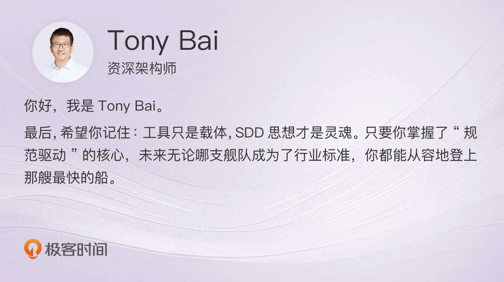
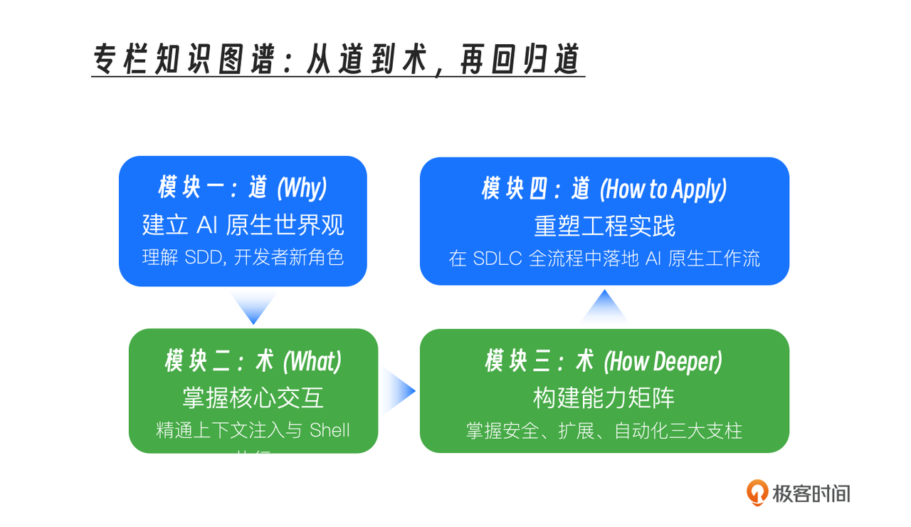
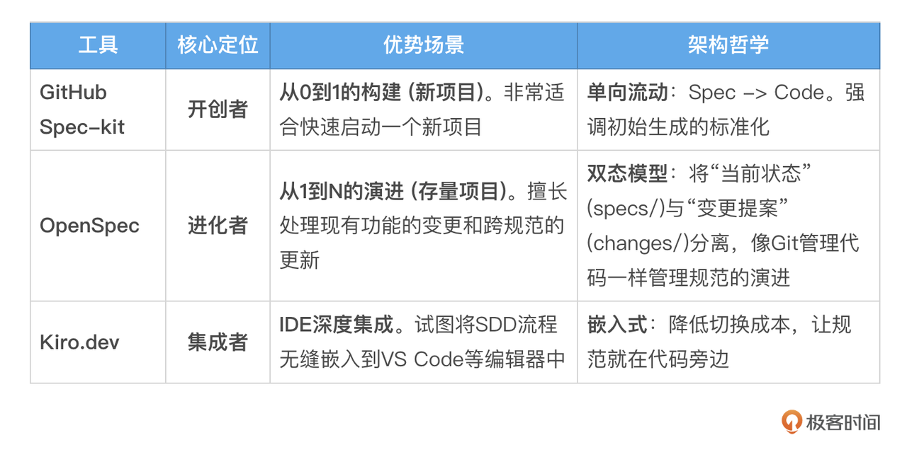

你好, 我是 Tony Bai。

经过 22 讲的共同探索, 我们的专栏《AI 原生开发工作流实战》终于来到了终点。

如果说, 开篇词是我们对 AI 大航海时代发出的一声嘹亮号角, 那么此刻, 我们已经驾驶着自己亲手打造的 “AI 原生战舰”, 成功地穿越了从理论到实践的广阔海域。

现在, 请你和我一起, 站在 “船头”, 回顾我们这趟波澜壮阔的旅程。

## 我们的航海图: 一次完整的思维与技能升维

回望这趟旅程, 我们并非只是学习了一个新工具的使用手册。我们共同构建并实践了一套完整的、面向未来的 软件工程方法论。

这张航海图, 可以被浓缩为一条清晰的 “道” 到 “术” 再回归 “道” 的升维路径:&#x20;

* 我们从 “道” 出发, 在 概念篇, 建立了 “AI 原生开发” 与 “规范驱动开发（SDD）” 的宏大世界观, 明确了我们在这场变革中的新角色 —— 规范的设计者、工作流的指挥家、质量的治理者。

* 我们深入 “术” 的层面, 在 基础篇 和 进阶篇, 系统性地掌握了驾驭 Claude Code 这一强大智能体的全部 “武功”。从 @ 和 ! 叹号的基础交互, 到 CLAUDE.md 和 constitution.md 的上下文艺术；从 Slash Commands、Hooks、Skills、Sub-agents 和 MCP 的能力扩展矩阵, 到 Checkpointing 和 Headless 模式的安全与自动化保障。

* 最终, 我们再次回归 “道” 的升华, 在 实战篇, 将所有理论和技巧, 全部应用到了一个 Go 项目的 全生命周期 之中。我们亲历了 AI 如何深度参与需求设计、TDD 编码、CI / CD, 乃至最终的线上维护与重构。我们不再是纸上谈兵, 而是真正拥有了一套可落地、可传承的 “AI 原生开发驾驶舱”。

这趟旅程的终点, 你收获的, 绝不仅仅是如何使用 Claude Code。你收获的, 是一套可以迁移到任何一个强大的 Coding Agent 之上的、底层的 工程思想和协作范式。

## 地平线上的舰队: 加速实现 AI 原生工作流的生态工具

在本专栏中, 我们聚焦于 Claude Code, 并通过 “手工” 编写 Prompt 的方式, 一步步地引导 AI 完成了 SDD 的 “编译三部曲”。这样做, 是为了让你深刻理解每一个环节的 “第一性原理”。

但在真实的世界里, 这并不意味着我们要拒绝现代化的工具。相反, 正是因为理解了底层原理, 我们才能更好地鉴别和选择未来的工具。

目前, 在这个领域, 有几支 “舰队” 已经出现在地平线上。它们的目标, 就是将我们手动实践的这套流程, 变得更加自动化、标准化。

我的建议是:&#x20;

* 如果你正在启动一个全新的项目, spec-kit 的思路最清晰、最直接。

* 如果你是在一个大型、复杂的存量系统中推行 SDD, OpenSpec 那种将 “变更” 显式管理起来的思路, 可能会让你少踩很多坑。

但我们不需要现在就绑定在某一个工具上。记住, 工具只是载体, SDD 思想才是灵魂。 只要你掌握了 “规范驱动” 的核心, 未来无论哪支舰队成为了行业标准, 你都能从容地登上那艘最快的船。

这些工具的涌现, 清晰地印证了我们专栏的核心判断: 以规范为中心的、自动化的 AI 原生开发工作流, 正是整个行业所共同奔赴的方向。

学习我们专栏所传授的底层方法论, 将使你具备驾驭这些先进工具、甚至创造你自己的类似工具的核心能力。

## 终极愿景: 走向 “长程自主” 的 AI 开发闭环

那么, 这条路的终点, 会是什么样子？

随着大模型长上下文、长程推理能力的飞速提升, 以及 Coding Agent 工具链的日益成熟, 一个真正激动人心的可能性正在浮现 —— “长程自主”（Long-term Autonomy）的开发闭环。

想象一下未来的某一天, 你的工作流可能会是这样:&#x20;

1. 意图设定: 你与产品经理、设计师和 AI 一起, 花一个上午的时间, 精心打磨并最终确认了一份高质量的 spec.md。

2. 启动长程任务: 你在终端里, 对 Claude Code 下达一个简单的指令: > “/implement-spec specs/010-new-feature/spec.md --yolo”。

3. AI 自主工作: 接下来, 你起身去喝杯咖啡, 投入到另一个更具创造性的架构设计会议中。而 AI Agent, 则开始了它长达数小时、甚至十几小时的 “无人值守” 工作:&#x20;

   1. 规划: 它自动生成了 plan.md 和 tasks.md。

   2. 编码: 它严格按照 tasks.md, 逐一完成编码, 并遵循 constitution.md, 为每一个函数都编写了单元测试。

   3. 自愈: 当某个测试失败时, 它不会停下来等你, 而是会自己阅读错误、分析代码、进行修复, 然后再次运行测试, 直到通过为止。

   4. 协同: 它完成了编码, 自动运行了 git commit, 并为你创建了一个包含详尽描述的 Pull Request。

   5. CI/CD: PR 的创建, 自动触发了 CI 流水线。另一个 AI Agent（或同一个 Agent 的新实例）被唤醒, 对 PR 进行自动化审查、构建、打包。

   6. 反馈: 如果 CI 失败, AI Agent 会收到通知, 它会自己去阅读失败的日志, 尝试修复问题, 并提交一个新的 commit。

   7. 部署与观察: 在你（或另一位人类工程师）最终审查并合并 PR 后, CD 流水线被触发。AI Agent 甚至可以继续监控部署后的服务日志, 观察是否有异常。

   8. 循环: 如果发现异常, 它会自动创建一个新的 GitHub Issue, 并将问题反馈给你, 甚至开始新一轮的 “诊断 - 修复” 循环。

这, 就是 AI 原生开发的终极愿景 —— 一个 从需求确认开始, 到编码、测试、审查、部署、运行反馈, 再回到重构的、高度自动化的、能够自我修复的闭环。

而实现这一切的基石, 正是我们在这个专栏里, 反复学习和实践的每一个要素: 一份无歧义的规范、一套清晰的 “宪法”、一个可扩展的工具框架, 以及我们作为 “指挥家” 的顶层设计能力。

## 最后的叮嘱: 成为 AI 浪潮中的 “冲浪者”, 而非 “被动漂流者”

能够坚持到这里, 首先要恭喜你。你已经完成了对 AI 原生开发从认知到实践的完整学习闭环, 你的知识体系已经领先于业界 90% 的开发者。但知识的学习, 只是一个开始。真正的挑战, 在于如何将这些思想和技能, 应用到你真实的工作中去。

在这场由 AI 掀起的滔天巨浪中, 技术的世界正在快速地分化为两类人:&#x20;

* 一类是 “被动漂流者”, 他们满足于使用现成的 AI 工具解决眼前的问题, 在一次次的 “复制粘贴” 中, 逐渐将自己的核心工程能力 “外包” 给了 AI。

* 另一类是 “主动冲浪者”, 他们不满足于 “使用” AI, 而是致力于 “驾驭” AI。他们学习 AI 的底层逻辑, 设计人机协作的流程, 构建自动化系统, 将 AI 的能力, 百倍、千倍地放大, 最终成为定义下一个十年软件工程范式的引领者。

我由衷地希望, 通过这个专栏的学习, 你已经拥有了成为一名 “主动冲浪者” 的知识、技能和信心。

请记住, AI 不是要取代我们, 而是要将我们从重复的、机械的劳动中解放出来, 去从事那些真正需要人类智慧、创造力和同理心的、更高价值的工作。

未来已来, 它并非一个遥远的概念, 而是已经体现在我们每一次与 AI 的交互, 我们为团队设计的每一个工作流, 我们为项目编写的每一份规范之中。

感谢你的陪伴、思考和实践。现在, 是时候合上这份地图, 去你自己的世界里, 开启那场激动人心的、人机共生的软件工程新纪元了。

我是 Tony Bai, 期待在未来的技术浪潮之巅, 与你重逢！

