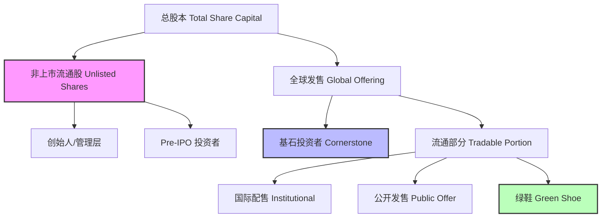
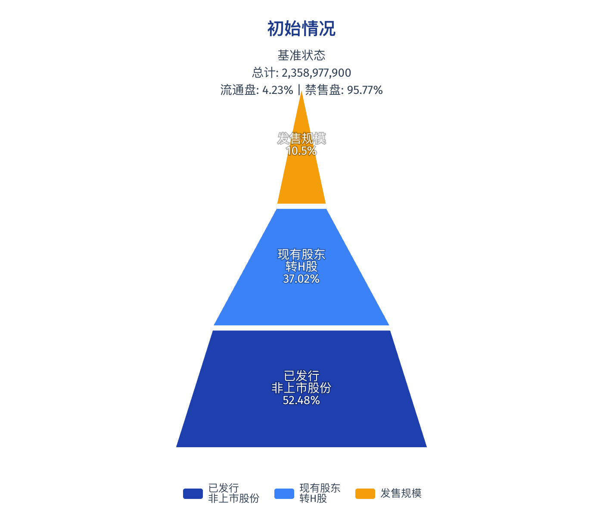
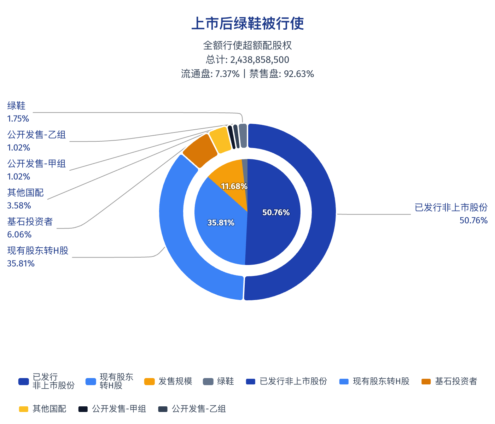
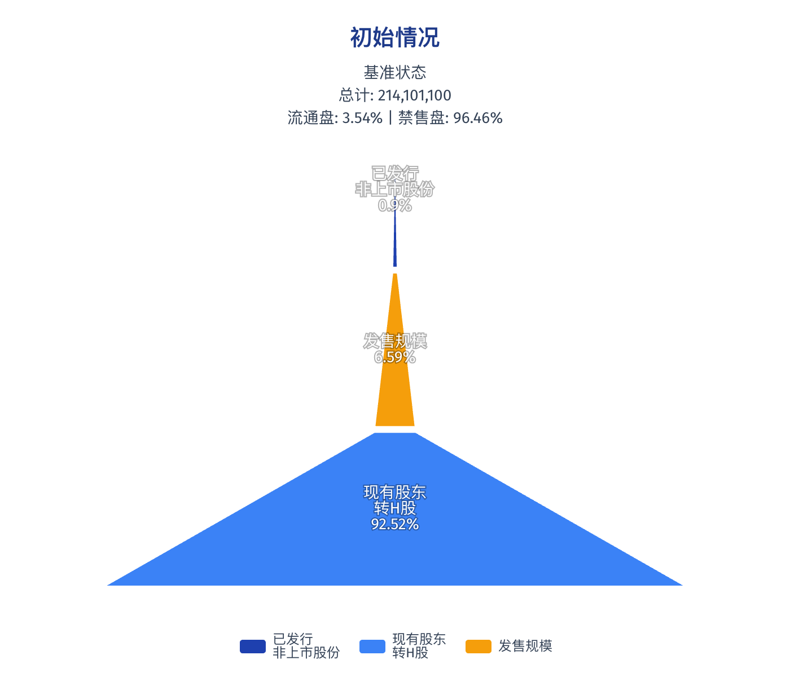

# IPO真相：为什么有的新股“跌不动”？揭秘绿鞋与股权金字塔的博弈游戏

> ⚠️ **免责声明**：本文仅供学术研究与案例分析使用，文中涉及的所有数据均源自港交所/SEC公开披露文件或模拟回测模型。本文不构成任何投资建议，股市有风险，入市需谨慎。

---

在资本市场的盛宴中，IPO（首次公开募股）往往被视为企业的高光时刻。

很多投资者可能有过这样的困惑：**为什么有些新股上市首日即便大盘不好也能“硬扛”不跌，而有些新股一开盘就如自由落体般破发？**

除了公司基本面，真正的秘密往往隐藏在招股书角落里那张不起眼的**股权分配表（Shareholding Structure）**，以及被称为“护盘神器”的**绿鞋机制（Greenshoe Option）**中。

今天，我们就用投行的“手术刀”，拆解IPO背后的精密算计，教你如何用**两个核心指标**看穿新股的“安全垫”。

---

## 01 🧊 冰山之下的秘密：股权金字塔

一个典型的港股或美股IPO，其股权结构并非扁平的饼图，而是一座层级森严的“金字塔”。

理解这座金字塔的每一层，是你预判上市后抛压的基础。

### 1. 沉睡的巨兽：未公开股权 (Unlisted Shares)
位于金字塔最底层的，是**上市前投资者（Pre-IPO Investors）**与创始团队。
*   **是谁**：创始人、早期VC/PE、员工期权池。
*   **特点**：成本极低，但被**禁售期（Lock-up Period）**牢牢锁住（通常6-12个月）。
*   **影响**：在IPO初期（半年内），这部分筹码是“冷冻”的，不会砸盘。**它们构成了金字塔巨大的底座。**

### 2. 塔尖的博弈：全球发售 (Global Offering)
这才是IPO真正的“战场”，通常仅占总股本的 **10%-25%**。这部分又被精细切割为三块：

*   **🧱 基石投资者 (Cornerstone) —— “定海神针”**
    *   在热门IPO中，基石大佬们（主权基金、行业巨头）往往包揽发行量的30%-50%。
    *   **关键点**：他们虽然买了，但承诺**锁仓6个月**。基石占比越高，市面上流动的筹码就越少，股价越容易被控制。

*   **🌍 国际配售 (Institutional) —— “定价权”**
    *   卖给长线基金和对冲基金的货。他们决定了最终发行价。

*   **📢 公开发售 (Public Offer) —— “情绪指标”**
    *   这就是散户打新的池子。
    *   **新规划重点 (2025.08)**：港交所新规已将回拨机制简化为**A/B双轨制**。特别是**机制B**，将散户配售比例严格锁定在 **10%**，不再因超购倍数无脑回拨。这对机构护盘是利好，避免了散户持仓过高导致的踩踏。

> 💡 **可视化图解**
> *(注：微信公众号暂不支持动态图表，以下为结构示意)*

---

## 02 🛡️ 护盘神器：绿鞋机制深度建模

“绿鞋”听起来很文艺，其实它的学名是**超额配售选择权（Over-allotment Option）**。它是保荐人手中的核武器。

### 简单来说，绿鞋是怎么“护盘”的？
保荐人在IPO时，会多向市场配售 **15%** 的股票（这部分股票通常是找大股东“借”的）。于是，保荐人手里多了一笔钱（卖这15%股票得来的）。

*   **📉 如果破发了**：保荐人就用这笔钱在二级市场**低价买入**股票（还给大股东）。**这就形成了巨大的买盘支撑，托住了股价。**
*   **📈 如果大涨了**：保荐人就不买了，直接要求公司**增发**15%新股（还给大股东）。

### ❌ 很多人的误区
很多投资者看到“有绿鞋”，就觉得稳了。或者简单用 `绿鞋股数 / 发行总数 = 15%` 来计算保护力度。**这是大错特错的！**

### ✅ 真实的“安全垫”公式
绿鞋的钱是固定的，但它要对抗的“敌人”不是所有发行股，而是**扣除基石锁定后的“实际流通盘”**。

$$
\text{绿鞋覆盖率} = \frac{\text{绿鞋股数}}{\text{全球发售总量} - \text{基石投资者股数}}
$$

**结论**：基石锁定的越多，外面的流通盘越小，绿鞋这笔钱的“含金量”就越高！

---

## 03 ⚔️ 实战推演：从壁仞到鸣鸣

光说不练假把式。我们用两个真实案例，带你看看不同股权结构下的“护盘能力”差异。

### 案例一：币认科技 (Biren) —— 坚不可摧的堡垒

这是典型的“高基石、高绿鞋”结构。

*(图注：金字塔底座巨大，顶部才是流通盘)*

#### 📊 核心数据拆解
| 项目 | 占比 (of Total) | 备注 |
| :--- | :---: | :--- |
| **非上市股份** | **86.57%** | 存量不动 |
| **发售规模** | **11.68%** | 看着不少，但... |
| **(-) 基石投资者** | **6.07%** | **一半以上被锁住了！** |
| **(=) 实际流通盘** | **5.61%** | 真正的抛压来源 |
| **(+) 绿鞋** | **1.75%** | 护盘子弹 |

#### 🧮 它的护盘能力有多强？

看这张饼图：**红色的绿鞋** vs **绿色的流通盘**。

$$
\text{绿鞋覆盖率} = \frac{42,726,800}{284,846,600 - 147,926,400} \approx \mathbf{31.21\%}
$$

**解读**：保荐人手里的钱，足够把市场上 **31%** 的流通货买回来！这就好比你只有100个敌军，但我有31发子弹，这威慑力足以让空头瑟瑟发抖。

---

### 案例二：鸣鸣很忙 (Mingming) —— 另一种博弈

我们再来看看“鸣鸣很忙”。由于它行使了发售量调整权，结构略有不同。

#### 📊 核心数据拆解
| 项目 | 占比 | 备注 |
| :--- | :---: | :--- |
| **基石投资者** | **2.98%** | 占比约40%，低于币认 |
| **实际流通盘** | **4.44%** | 抛压相对较大 |

#### 🧮 它的护盘能力如何？

$$
\text{绿鞋覆盖率} \approx \mathbf{23.99\%}
$$

**对比**：
虽然 **24%** 的覆盖率低于币认的 **31%**，但依然处于 **20%的安全线**之上。这意味着保荐人仍有能力吸收接近四分之一的市场抛压，安全垫依然够厚。

---

## 04 📝 结语：像机构一样思考

IPO不仅是企业的融资行为，更是一场精密的数学博弈。

下次看到新股招股书，别只看热闹，记得算两个数：
1.  **实际流通盘** = 全球发售 - 基石锁定
2.  **绿鞋覆盖率** = 绿鞋股数 / 实际流通盘

**当绿鞋覆盖率超过 30% 时，除非市场发生系统性崩盘，否则这只新股的破发概率极低。** 这就是机构眼中的“确定性”。

---
*本文图表及数据支持：Python Seaborn / Matplotlib*
