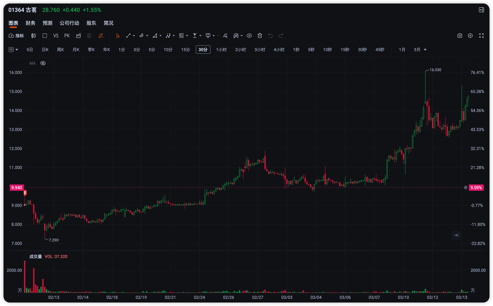
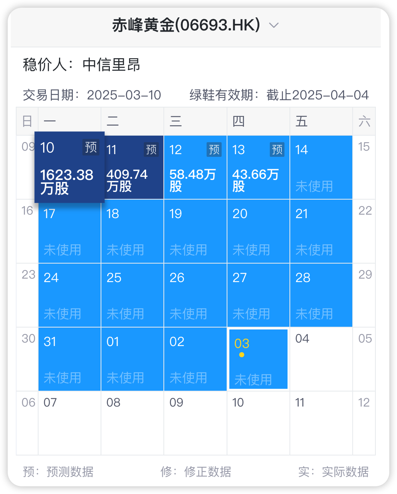
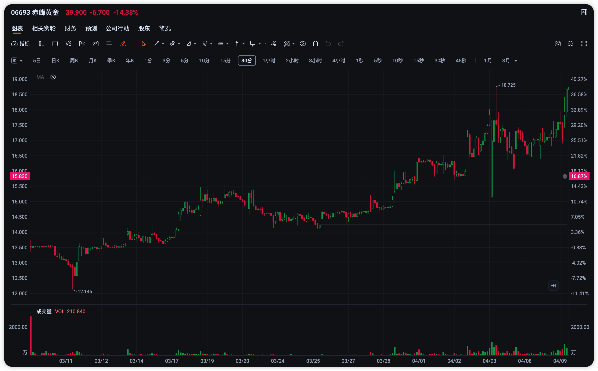
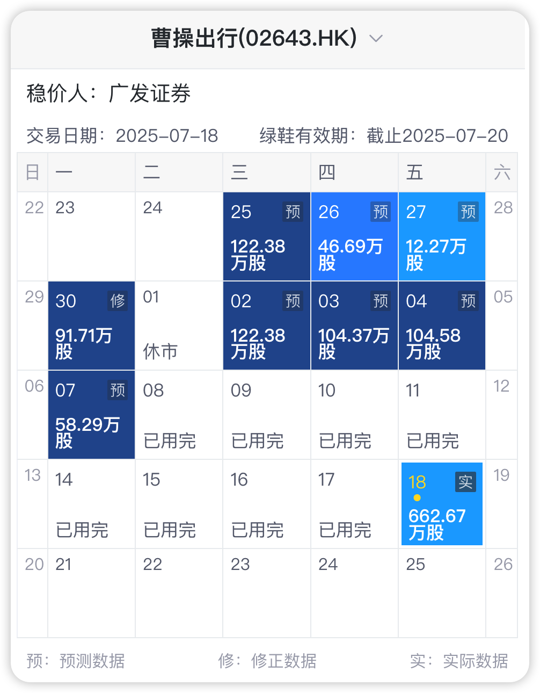

这篇文章是

https://mp.weixin.qq.com/s/INjoLCZhVkC4GviJMT3E0g

的后续

多图预警

part1

# 古茗 发行价 9.94HKD

绿鞋真的尽力了, 第一天使用 81.3%, 四天烧完, 我们来看看股价走势

没有抢救回来, 不过后续的走势大超预期, 大涨 3 倍, 那都是后话了

# 赤峰黄金 发行价 15.83HKD

绿鞋也是四天用完, 和古茗的节奏差不多. 

后续股价跟随金价走出了一波行情, 不过那都与绿鞋无关了

# 绿茶集团 发行价 7.19HKD

一天烧完所有绿鞋, 怎么都拉不住

几天之内跌去了 1/4, 不过有趣的是, 后期同样有一波上涨, 好景不长

# 手回集团 发行价 8.08HKD

又一个一天烧完绿鞋的案例, 八百匹马都拉不住. 8.08 的发行价图上都无法展示.

成交量低迷, 何时能回到家乡?

# 海天味业 发行价 36.3HKD

这个绿鞋的使用比较克制, 但股价也稳定在发行价之下, 没有浮出水面

看到 6/23 的那一根长针了吗? 再看看绿鞋当天使用情况就没有什么疑问了.

# 三花智控 发行价 22.53HKD

一天使用绿鞋接近 30%

后续股价很稳

# 曹操出行 发行价 41.94HKD

绿鞋确实起了作用, 也走出了一段像样的行情, 上涨 160%+, 后续还是回到水下了.

# 圣贝拉 发行价 6.58HKD

7/7 价格浮出水面以后, 确实稳定了一段时间. 

不过后续到水下, 就没有绿鞋来护盘了, 只能自生自灭了.
