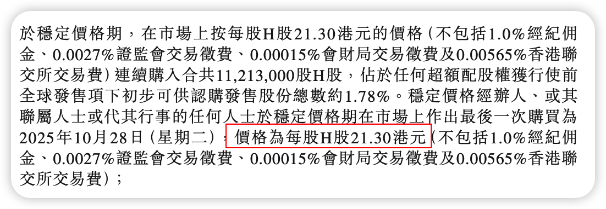

# 广和通 发行价 21.5HKD

中信哥一天烧了 45% 的绿鞋, 也无力回天, 保不住这么个垃圾

在水上的时间有没有一分钟?

# 三一重工 发行价 21.3HKD

这个真不能破发, 中信哥轻轻出手, 11.8% (预测值不准确) 的绿鞋就够用了

首日破发了吗? 如破!

实际还真的没有破发, 中信哥稳稳的. 后面的事情就不归中信哥管了

# 赛力斯 发行价 131.5HKD

第一天使用了 40%, 即使是被人诟病的中金, 也得看看发行人的后台是谁, 要脸的. 但是市场不买账

绿鞋全部用完也无济于事

第一天这个大锤子就是绿鞋的功劳, 你猜第一天收盘价多少?

# 文远知行 发行价 27.1HKD

同样第一天用掉 40% 的绿鞋额度, 来割韭菜就让你看看韭菜的力量, 买靓号 (00800) 也不好使

我当时还想在美股做空这货, 忘记下单了, 错失一笔巨款

骗骗老美得了, 还想在港股再骗一次?

# 小马智行 发行价 139HKD

和文远知行组成"卧龙凤雏"组合 (02026 看起来也是买的靓号), 当时也想做空来着, 怎么就忘记了呢? 拍断大腿

股价走势与文远知行也如出一辙

想要冲出水面, 又被压下去了

# 遇见小面 发行价 7.04HKD

又来一个一天烧完所有绿鞋额度的, 真是关灯吃大面了

看到第一天的倒锤子了吗? 可见抛压有多大

发行价是 7.04, 在天上. RNM, 退钱

# 京东工业 发行价 14.1HKD

第一天用掉 1/3 的绿鞋, 东哥还要脸吗?

也是挺惨, 刚稳到发行价, 第二天就被卖下来. 你猜有几天收盘价正好是 14.1 的?

# 希迪智驾 发行价 263HKD

知行, 智行, 智驾, 桃园三兄弟了

别看错了, 发行价是上面的 263, 救不了的
