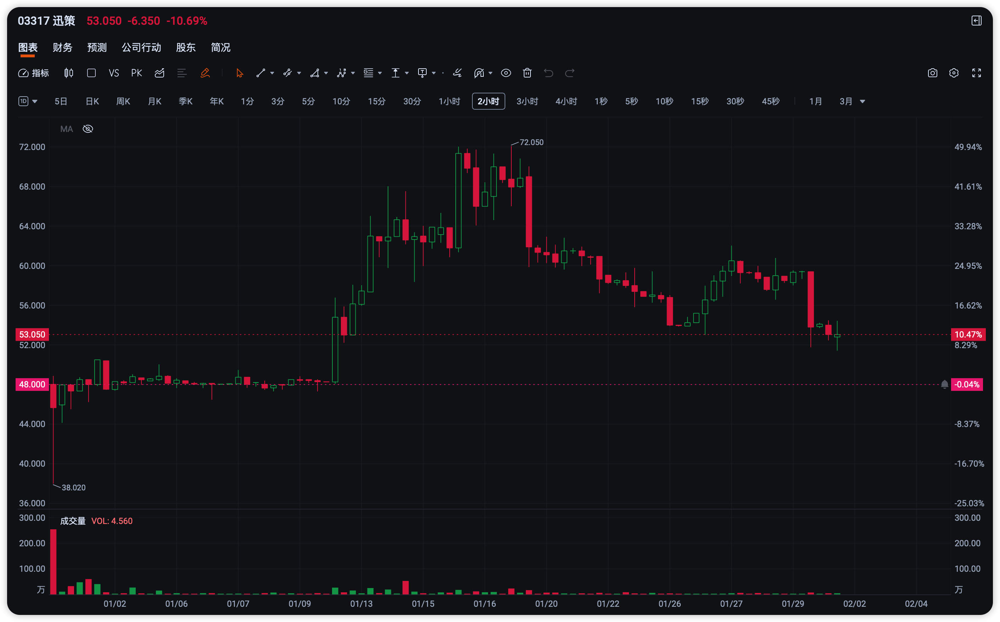
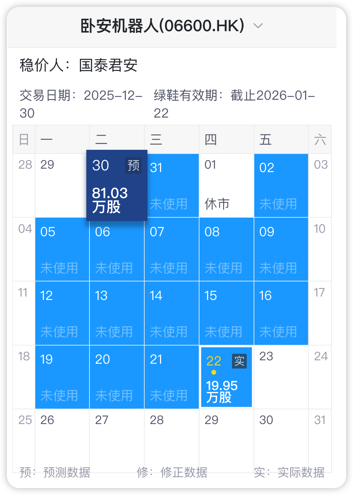
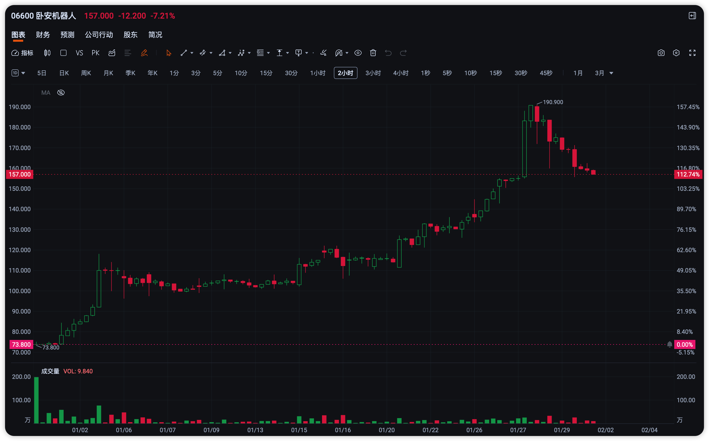
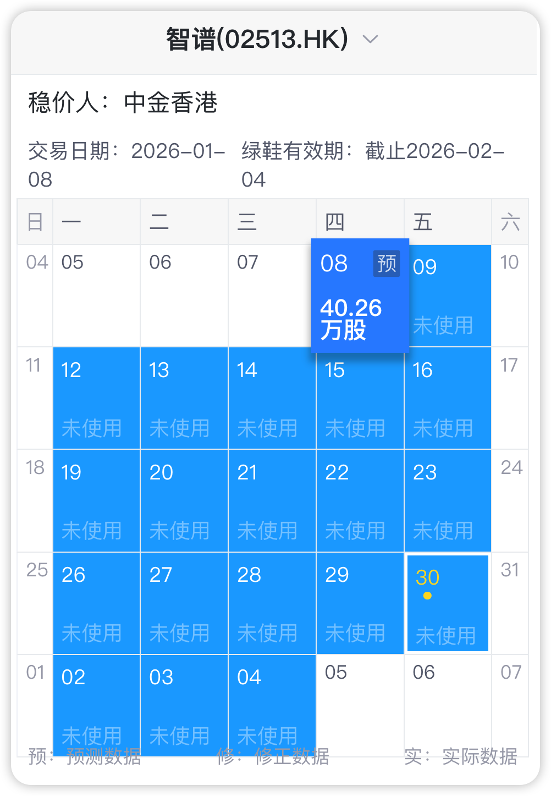
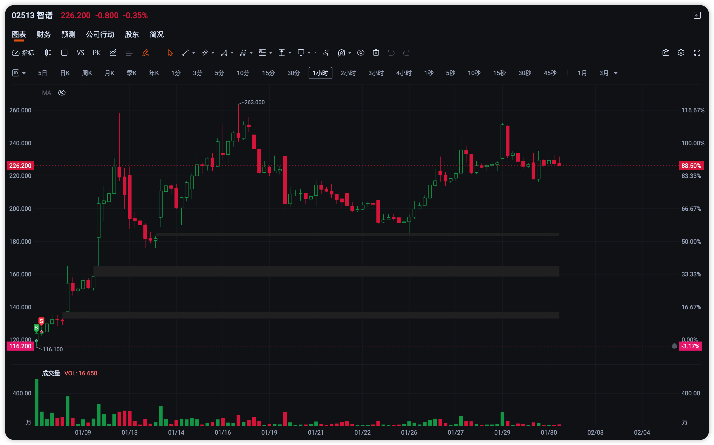
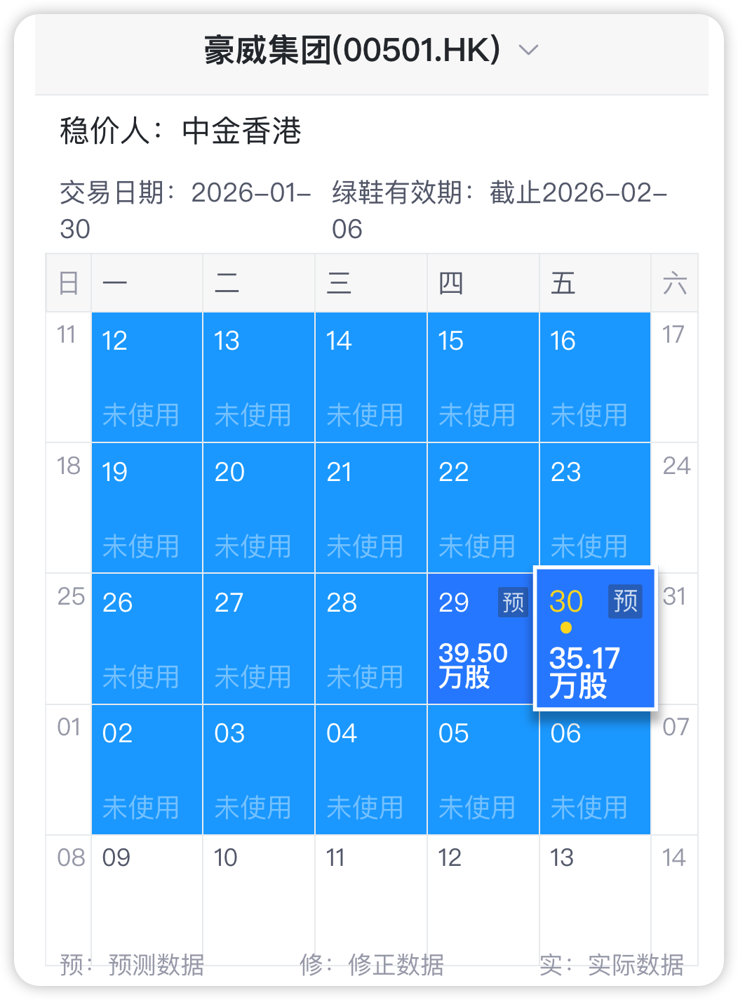
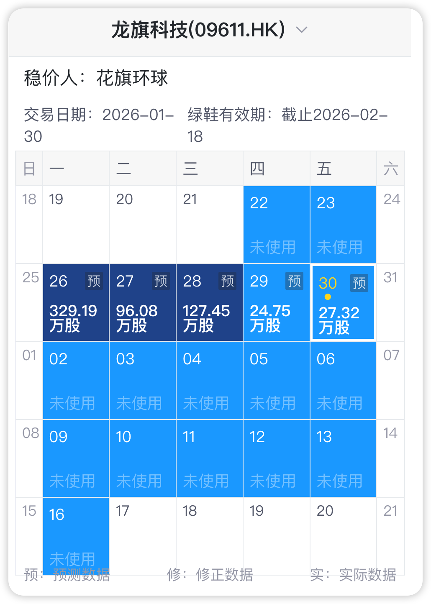
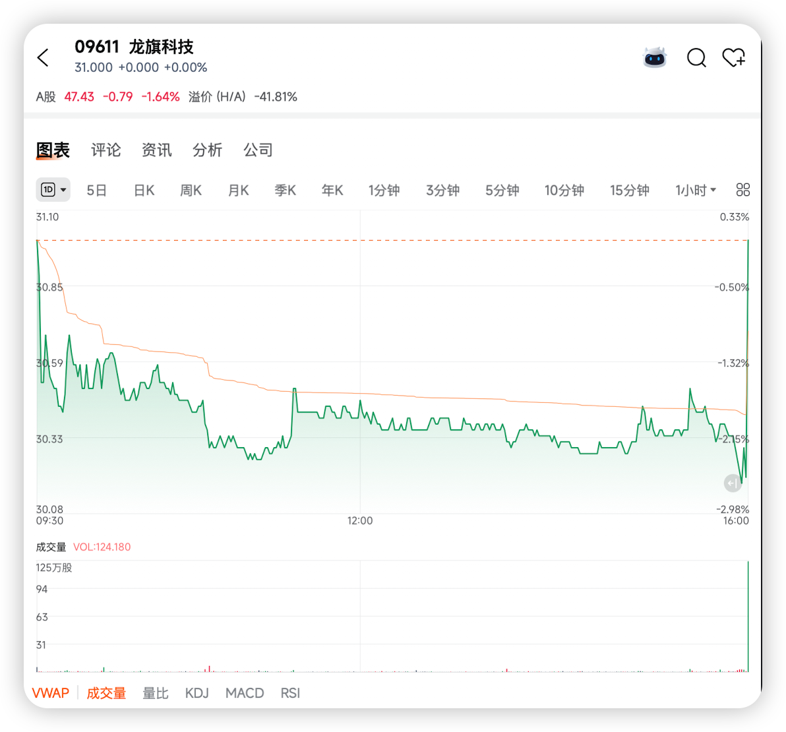

# 迅策 发行价 48HKD

两天用掉 90% 的绿鞋额度, 神奇的是, 后续股价自己稳住了, 这就是艺术啊

这是什么神秘力量在起作用? 很好奇

# 卧安机器人 发行价 73.8HKD

第一天 24% 的绿鞋轻轻推力一把,像是没有摩擦力一样, 永动机行为还是坐了火箭?

这个也像是买了靓号 (06600), 咋不买 06666, 哦, 被恒大占用了, 可能很快就空出来了吧...

# 智谱 发行价 116.2HKD

国内大模型第一股, 要脸的, 一定得护住了

也是买的号, 官网都说了, (02513, 谐音是 “AI 我一生”)

第一天短暂破发, 7% 的绿鞋就够用了

只破了一毛钱, 我也捞了一点, 结果卖飞了, 飞得离谱

# 豪威集团 发行价 104.8HKD

一天 5-6% 的样子, 仍在绿鞋保护期内, 可以关注

两次破发, 两次买回, 不是稳价人不想买, 是没给更多机会.

# 龙旗科技 发行价 31HKD

绿鞋每天的用量分别为: 42%, 12%, 17%, 3%, 3%. 花旗有点慌, 像前三天这种用法, 本周其实就用完所有额度了, 所以最近两天明显收着了, 结果收盘价都低于发行价 (周一到周三, 三天的收盘价精准落到 31.00HKD)

这是周三的 K 线, 看尾盘这一根

在盘中, 如果股价跌破发行价, 可以趁机买入, 存在套利空间, 一天有 2% 的确定性也知足了. 但需要持续关注绿鞋剩余情况.

1/29 挂单 30.2, 未成交; 从 K 线形态和活报告数据来看, 开盘破发后稳价人早早就介入了, 导致股价维持在 30.46 之上.

1/30 稳价人担心快速消耗完绿鞋, 越来越保守了.

套利失败, 出了
