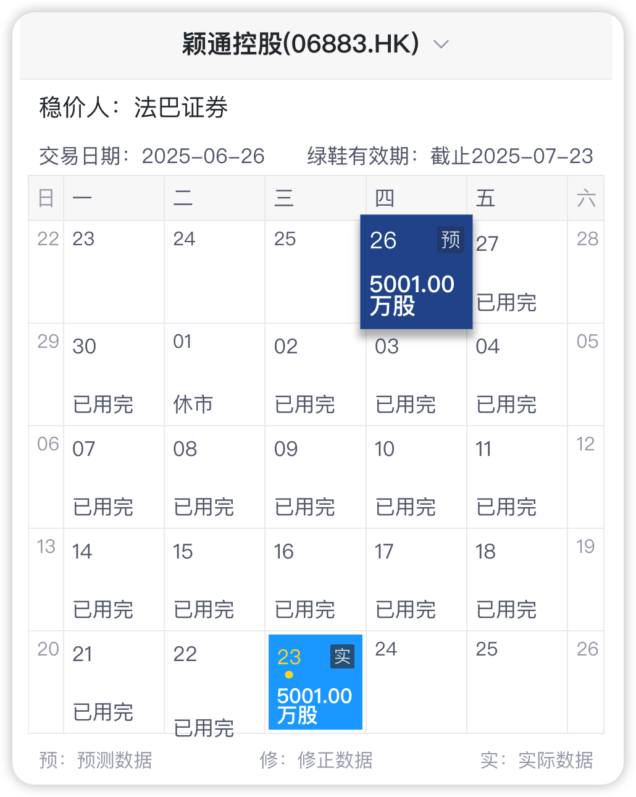
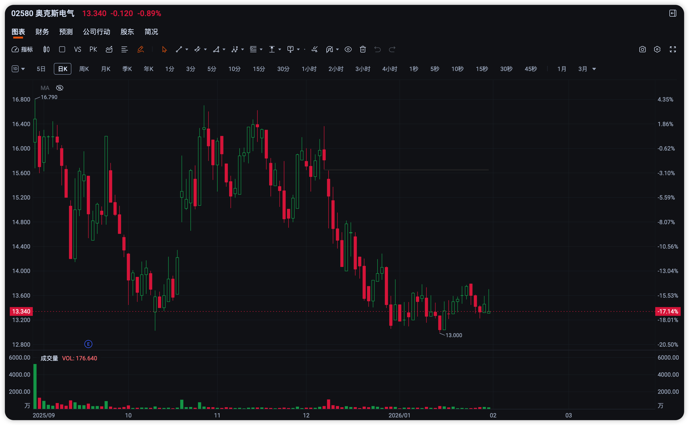

# 颖通控股 发行价 2.88HKD

又一个一天烧完所有绿鞋的案例, 和 绿茶集团 & 手回集团 一模一样

真心扶不起

# 云知声 发行价 205HKD

第一天使用 14% 的绿鞋, 轻轻一推, 后续自己走得很稳

最近即将跌破发行价又有神秘力量入场托底, 可以关注一波

# 安井食品 发行价 60HKD

第一天用掉 57% 的绿鞋. 稳价期间都在水下, 有点惨. 不过三个月后守得云开见月明

# 天岳先进 发行价 42.8HKD

前期未跌破发行价, 9/1 之后四天共计仅使用了不到 3% 的绿鞋就稳住了股价, 打铁还需自身硬

知道 9/3 为什么没使用绿鞋了吧? 为什么只有四天使用绿鞋了吧?

# 奥克斯电器 发行价 17.42HKD

第一天 32%, 中金燃尽了.

图上看不到发行价, 没救了

# 大行科工 发行价 49.5HKD

5% 意思一下, 我救了哈. 这个绿鞋不出力, 为什么呢? 我们来看看股价走势

一切都明白了, 不是中信哥拿钱不办事, 是没给机会啊. 等后续机会真正来临时, 已经过了稳价期, 你说气不气人

# 禾赛 发行价 212.8HKD

最后三天意思一下, 共使用 6% 的绿鞋. 不是不想救, 是真的救不动, 不信来看看股价走势

十个绿鞋来了都没用吧

# 奇瑞汽车 发行价 30.75HKD

中金绿鞋口碑差是有原因的, 这个也不救一下? 每天一点点, 一共用 8%.

稳价结束后还短暂涨了几天, 有点意思
